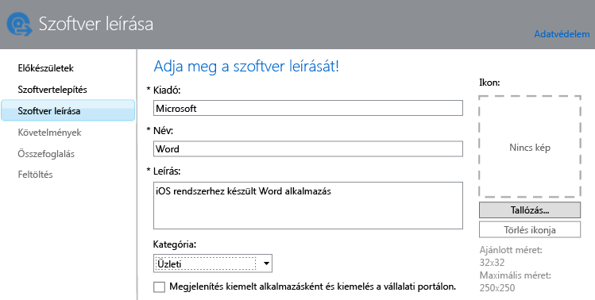

# Alkalmazások hozzáadása mobileszközökhöz a Microsoft Intune-ban

Ebből a témakörből megtudhatja, hogyan adhatja hozzá a kívánt alkalmazásokat az Intune-hoz a központi telepítésük előtt.

> [!IMPORTANT]
> Az ebben a témakörben található információk megkönnyítik a regisztrált eszközökre és regisztrált Windows rendszerű számítógépekre telepíteni kívánt alkalmazások hozzáadását. Ha az Intune ügyfélszoftverével felügyelt Windows-számítógépekhez kíván alkalmazásokat adni, olvassa el az [Alkalmazások hozzáadása Windows rendszerű számítógépekhez a Microsoft Intune-ban](add-apps-for-windows-pcs-in-microsoft-intune.md) című témakört.

## Az alkalmazás hozzáadása
Az Intune Software Publisherrel konfigurálhatók az alkalmazás tulajdonságai, és (ha lehetséges) az alkalmazás feltölthető a felhőbeli tárhelyre, a következő eljárással:

1.  A [Microsoft Intune felügyeleti konzoljában](https://manage.microsoft.com) kattintson az **Alkalmazások** &gt; **Alkalmazások felvétele** elemre az Intune Software Publisher elindításához.

    > [!TIP] Előfordulhat, hogy a Software Publisher elindulása előtt meg kell adnia Intune-felhasználónevét és -jelszavát.

2.  A Software Publisher **Szoftvertelepítés** lapján, a **Válassza ki, hogyan legyen elérhető a szoftver az eszközök számára** beállításnál válasszon a következő lehetőségek közül:
    - **Szoftvertelepítő**, az **.msi** vagy **.exe** kiterjesztésű alkalmazásokhoz, adja meg a következőt:
        - **Válassza ki a szoftver telepítőjének fájltípusát** – Ez adja meg a telepítendő szoftver típusát. Ha például iOS-alkalmazást szeretne telepíteni, válassza a **Csomag hozzáadása iOS-hez (&#42;.ipa-fájl)** lehetőséget.
        - **Adja meg a szoftver telepítőfájljainak helyét** – Adja meg a telepítőfájlok helyét, vagy kattintson a **Tallózás** gombra a kívánt hely listából való kiválasztásához.
        - **A mappában található további fájlokkal és almappákkal együtt** – Csak **Windows Installer** fájltípus esetén. A Windows Installert használó szoftverek némelyike kiegészítő fájlokat igényel, amelyek általában a telepítőfájlokkal azonos mappában találhatók. Akkor válassza ezt a lehetőséget, ha ezeket a fájlokat is telepíteni kívánja. Ez a telepítési típus némi helykapacitást igényel a felhőbeli tárhelyen.

  -   **Külső hivatkozás**, olyan alkalmazások esetén, amelyeket alkalmazás-áruházra mutató hivatkozás megadásával kíván létrehozni, adja meg a következőt:

        - **Adja meg az URL-címet** – Adja meg az alábbiak egyikének URL-címét:
            - Itt adhatja meg a telepíteni kívánt alkalmazás App Store-beli URL-címét. Ha például telepíteni szeretné a Microsoft Távoli asztal alkalmazást Android rendszerre, adja meg a **https://play.google.com/store/apps/details?id=com.microsoft.rdc.android** URL-címet. Az alkalmazás URL-címét úgy érheti el, ha egy keresőmotorban megkeresi az alkalmazást tartalmazó áruházi lapot. A Távoli asztal alkalmazás megkereséséhez például keressen rá a **Microsoft Távoli asztal Android** kifejezésre.
            - Egy webhelyét. Az Intune telepíti az eszközre a webhely parancsikonját (avagy webklipjét).
            - Egy alkalmazásét az interneten. Az Intune telepíti az eszközre az alkalmazás parancsikonját.
        - **Felügyelt böngésző szükséges a hivatkozás megnyitásához (csak Android és iOS rendszerek esetén)** – Ha egy webhelyre vagy webalkalmazásra mutató hivatkozást telepít a felhasználók számára, az csak az Intune által felügyelt böngészőben lesz megnyitható, amelyet a felhasználóknak telepíteniük kell az eszközükre. A felügyelt böngészővel kapcsolatos további részletekért olvassa el [Az internet-hozzáférés felügyelt böngészőszabályzatokkal való kezelése a Microsoft Intune-ban](manage-internet-access-using-managed-browser-policies.md) című témakört. Ez a telepítési típus nem igényel szabad területet a felhőbeli tárhelyen.

  -   **Felügyelt iOS-alkalmazás az alkalmazás-áruházból**, az iTunes áruházból származó ingyenes alkalmazások esetén, amelyeket MAM-szabályzatokkal kíván felügyelni, adja meg a következőt:

        - **Adja meg az URL-címet** – Itt adhatja meg a telepíteni kívánt alkalmazás áruházbeli URL-címét. Ha például telepíteni szeretné a Microsoft Munkamappák alkalmazást iOS rendszerre, adja meg a **https://itunes.apple.com/us/app/work-folders/id950878067?mt=8** URL-címet. Ez a telepítési típus nem igényel szabad területet a felhőbeli tárhelyen.

        Ha például Microsoft Word alkalmazást kívánja az iTunes áruházból eszközökre telepíteni, az oldal így jelenne meg:
        
        

3.  A **Szoftver leírása** lapon konfigurálja a következő beállításokat:

    > [!TIP] A telepítő típusától függően előfordulhat, hogy az alábbi értékek némelyikét a rendszer automatikusan megadja.

    - **Kiadó** – Adja meg az alkalmazás kiadójának nevét.
    - **Név** – Itt adhatja meg az alkalmazásnak a vállalati portálon megjelenő nevét. Ellenőrizze, hogy a megadott alkalmazásnevek egyediek-e. Ha ugyanazt az alkalmazásnevet kétszer adja meg, csak az egyik alkalmazás fog megjelenni a felhasználók számára a vállalati portálon.
    - **Leírás** – Itt adhatja meg az alkalmazás leírását. amelyet meg szeretne jeleníteni a felhasználók számára a vállalati portálon.
    - **Szoftveradatok URL-címe** – Csak akkor érhető el, ha a **Szoftver telepítője** lehetőséget választotta. Nem kötelező: megadhatja az alkalmazással kapcsolatos információkat tartalmazó webhely URL-címét. Ez az URL-cím fog megjelenni a felhasználók számára a vállalati portálon.
    - **Adatvédelmi nyilatkozat URL-címe** – Csak akkor érhető el, ha a **Szoftver telepítője** lehetőséget választotta. Nem kötelező: megadhatja az alkalmazás adatvédelmi nyilatkozatát tartalmazó webhely URL-címét. Ez az URL-cím fog megjelenni a felhasználók számára a vállalati portálon.
    - **Kategória** – (nem kötelező) Itt választhat a beépített alkalmazáskategóriák közül. Ezzel megkönnyítheti a felhasználók számára az alkalmazás megkeresését a vállalati portálon való böngészés során.
    - **Megjelenítés kiemelt alkalmazásként és kiemelés a vállalati portálon:** – Az alkalmazás hangsúlyos megjelenítése a vállalati portál főoldalán, alkalmazásokat kereső felhasználók számára.
    - **Ikon** – (nem kötelező) Itt töltheti fel az alkalmazáshoz hozzárendelni kívánt ikont. Ez az alkalmazásikon jelenik meg a vállalati portálon böngésző felhasználók számára.

        Ebben a példában az iOS rendszerhez készült Microsoft Word alkalmazás leírását adta meg:

        

4.  A **Követelmények** lapon adja meg az alkalmazás telepítéséhez szükséges követelményeket, amelyeknek az eszköznek meg kell felelnie. Egy iOS alkalmazáscsomag esetében például kiválaszthatja az iOS minimálisan szükséges verzióját, valamint azt, hogy az eszköznek milyen típusúnak (például iPhone vagy iPad) kell lennie.

    > [!TIP] A **Követelmények** lap nem minden alkalmazástípus esetében jelenik meg.

5.  További varázslólapok jelennek meg, ha a **Windows Installer** fájltípust választja. Ez a fájltípus akkor használatos, ha az Intune-ban regisztrált, Windows 10 vagy újabb rendszert futtató számítógépekre telepít szoftvert.

6.  Az **Összefoglalás** lapon ellenőrizze a megadott adatokat. Ha ezzel elkészült, kattintson a **Feltöltés** gombra.

7.  A befejezéshez kattintson a **Bezárás** gombra.

Az alkalmazás megjelenik az **Alkalmazások** munkaterület **Alkalmazások** csomópontjában.

## Példák

### MSI-alkalmazások telepítése Windows 10-eszközökre
Ebből a négy perces videóból megtanulhatja, hogyan telepítsen Microsoft Installer (msi) típusú alkalmazásokat a Windows 10 rendszerű regisztrált eszközökre.  

<iframe src="https://channel9.msdn.com/Series/How-to-Control-the-Uncontrolled/6--How-to-Deploy-MSI-Applications-to-Windows-10-Using-Intune-and-Mobile-Device-Management-MDM/player" width="640" height="360" allowFullScreen frameBorder="0"></iframe>

## További lépések

Ha létrehozta az alkalmazást, a következő lépés a telepítése. További információért lásd: [Alkalmazások központi telepítése a Microsoft Intune-ban](deploy-apps.md)

<!--HONumber=Jun16_HO1-->

