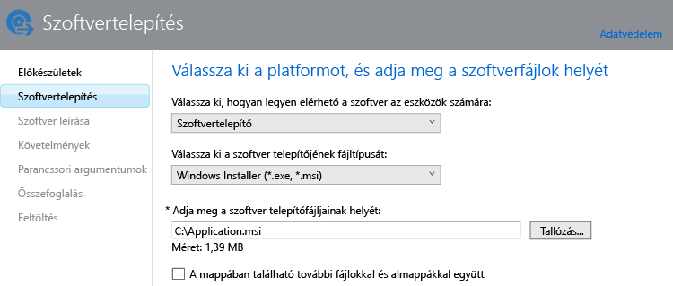

# Alkalmazások hozzáadása Windows-számítógépekhez a Microsoft Intune-ban

Ebből a témakörből megtudhatja, hogyan adhatja hozzá a kívánt alkalmazásokat az Intune-hoz a központi telepítésük előtt.

> [!IMPORTANT]
> Az ebben a témakörben található információk segítik az alkalmazások hozzáadását azon Windows-számítógépeken, amelyeket az Intune számítógépes ügyfélszoftver használatával felügyel. Ha regisztrált Windows-számítógépekhez vagy más mobileszközökhöz szeretne alkalmazásokat adni, olvassa el az [Alkalmazások hozzáadása mobileszközökhöz a Microsoft Intune-ban](add-apps-for-mobile-devices-in-microsoft-intune.md) című cikket.

## Az alkalmazás hozzáadása
Az alábbiakban ismertetett eljárással konfigurálhatja az alkalmazás tulajdonságait az Intune Software Publisherrel, és feltöltheti az alkalmazást a felhőtárhelyre.

1.  A [Microsoft Intune felügyeleti konzoljában](https://manage.microsoft.com) válassza az **Alkalmazások** &gt; **Alkalmazások felvétele** elemet az Intune Software Publisher elindításához.

    > [!TIP]
    > [!TIP] Előfordulhat, hogy a Software Publisher elindulása előtt meg kell adnia Intune-felhasználónevét és -jelszavát.

2.  A Software Publisher **Szoftver telepítése** lapján konfigurálja a következőket:

    **Válassza ki, hogyan szeretné elérhetővé tenni ezt a szoftvert az eszközök számára** – Válassza a **Szoftver telepítője** lehetőséget, majd adja meg az alábbi beállításokat:

    - **Válassza ki a szoftver telepítőjének fájltípusát** – Ez adja meg a telepítendő szoftver típusát. Windows-számítógép esetén válassza a **Windows Installer** lehetőséget.
    - **Adja meg a szoftver telepítőfájljainak helyét** – Adja meg a telepítőfájlok helyét, vagy válassza a **Tallózás** elemet a kívánt hely listából való kiválasztásához.
    - **A mappában található további fájlokkal és almappákkal együtt** – A Windows Installert használó szoftverek némelyike kiegészítő fájlokat igényel, amelyek általában a telepítőfájlokkal azonos mappában találhatók. Akkor válassza ezt a lehetőséget, ha ezeket a fájlokat is telepíteni kívánja.

    Ha például egy Application.msi nevű alkalmazást szeretne közzétenni az Intune-ban, ilyen lesz a lap: 

   Ez a telepítési típus némi helykapacitást igényel a felhőbeli tárhelyen.

3.  A **Szoftver leírása** lapon konfigurálja a következő beállításokat:

    A telepítőfájl típusától függően előfordulhat, hogy az alábbi értékek némelyike nem jelenik meg, vagy ezeket a rendszer automatikusan megadja.

    - **Kiadó** – Adja meg az alkalmazás kiadójának nevét.
    - **Név** – Itt adhatja meg az alkalmazásnak a vállalati portálon megjelenő nevét.  Ellenőrizze, hogy a megadott alkalmazásnevek egyediek-e. Ha ugyanazt az alkalmazásnevet kétszer adja meg, csak az egyik alkalmazás fog megjelenni a felhasználók számára a vállalati portálon.
    - **Leírás** – Itt adhatja meg az alkalmazás leírását. amelyet meg szeretne jeleníteni a felhasználók számára a vállalati portálon.
    - **Szoftveradatok URL-címe** – (nem kötelező) Itt adhatja meg egy, az alkalmazással kapcsolatos információkat tartalmazó webhely URL-címét. Ez az URL-cím fog megjelenni a felhasználók számára a vállalati portálon.
    - **Adatvédelmi nyilatkozat URL-címe** – (nem kötelező) Itt adhatja meg az alkalmazás adatvédelmi nyilatkozatát tartalmazó webhely URL-címét. Ez az URL-cím fog megjelenni a felhasználók számára a vállalati portálon.
    - **Kategória** – (nem kötelező) Itt választhat a beépített alkalmazáskategóriák közül. Ezzel megkönnyítheti a felhasználók számára az alkalmazás megkeresését a vállalati portálon való böngészés során.
    - **Ikon** – (nem kötelező) Itt töltheti fel az alkalmazáshoz hozzárendelni kívánt ikont. Ez az alkalmazásikon jelenik meg a vállalati portálon böngésző felhasználók számára.

4.  A **Követelmények** lapon adja meg azokat az alkalmazás telepítéséhez szükséges követelményeket, amelyeknek az eszköznek meg kell felelnie. Válasszon az **Architektúra** menüből – Adja meg, hogy az alkalmazást 32 bites, 64 bites vagy mindkét típusú operációs rendszerekre lehessen telepíteni, **Operációs rendszer** – Itt adhatja meg azt a legrégebbi operációsrendszer-verziót, amelyre még telepíthető az alkalmazás.

5.  Az **Észlelési szabályok** lapon szabályokat adhat meg annak észlelésére, hogy a konfigurált alkalmazás már telepítve van-e a számítógépen, illetve az alapértelmezett észlelési szabályok használatával beállíthatja az alkalmazás korábban telepített verzióinak automatikus felülírását. Ez a beállítás a Windows Installer szolgáltatáshoz tartozik (csak .exe fájlok).
6.  
    A következő szabályokat állíthatja be:
    - **A fájl létezik** – Adja meg az észlelni kívánt fájl elérési útját. A számítógépen való kereséshez a következő helyeket adhatja meg: **%ProgramFiles%** (azaz **Program Files**\*&lt;elérési_út&gt;* és **Program Files (x86)**\*&lt;elérési_út&gt;* vagy **%SystemDrive%** (azaz a számítógép gyökérmeghajtója, amely általában a C:)
    - **Az MSI-termékkód létezik** – Válassza a **Tallózás** elemet az észlelni kívánt Windows Installer-fájl (.msi) kiválasztásához. 
    - **A beállításkulcs létezik** – Adjon meg egy beállításkulcsot, amely a következővel kezdődik: **HKEY_LOCAL_MACHINE\**. A keresés a beállításjegyzék 32 bites és 64 bites elérési útjaira egyaránt kiterjed. Ha a megadott kulcs megtalálható az egyik helyen, az észlelési szabály teljesül.

    Ha az alkalmazás megfelel a konfigurált szabályok bármelyikének, nem lesz telepítve.

7.  Csak a **Windows Installer** fájltípus (.msi és .exe) esetében: a **Parancssori argumentumok** lapon adja meg, hogy szeretne-e parancssori argumentumokat használni a telepítőhöz. Előfordulhat például, hogy egyes telepítők támogatják a felhasználói beavatkozás nélküli, csendes telepítésre szolgáló **/q** argumentumot.

8.  Csak a **Windows Installer** fájltípus (.exe) esetében: a **Visszatérési kódok** lapon olyan új hibakódokat vehet fel, amelyeket az Intune az alkalmazás felügyelt Windows-számítógépre való telepítésekor értelmez.
    Alapértelmezés szerint az Intune az iparági szabványnak megfelelő visszatérési kódok segítségével jelenti az alkalmazáscsomagok telepítésének sikerességét vagy sikertelenségét: **0** – Sikeres vagy **3010** – Sikeres, újraindítással. Ehhez a listához saját visszatérési kódjait is hozzáadhatja. Ha megad egy visszatérésikód-listát, és az alkalmazás telepítőprogramja olyan kódot ad vissza, amely nem szerepel a listán, a rendszer a kódot hibaként értelmezi.

9.  Az **Összefoglalás** lapon ellenőrizze a megadott adatokat. Ha ezzel elkészült, válassza a **Feltöltés** elemet.

10. A befejezéshez válassza a **Bezárás** elemet.

Az alkalmazás megjelenik az **Alkalmazások** munkaterület **Alkalmazások** csomópontjában.

## További lépések

Ha létrehozta az alkalmazást, a következő lépés a telepítése. További információért lásd: [Alkalmazások központi telepítése a Microsoft Intune-ban](deploy-apps.md)

<!--HONumber=Jun16_HO4-->

