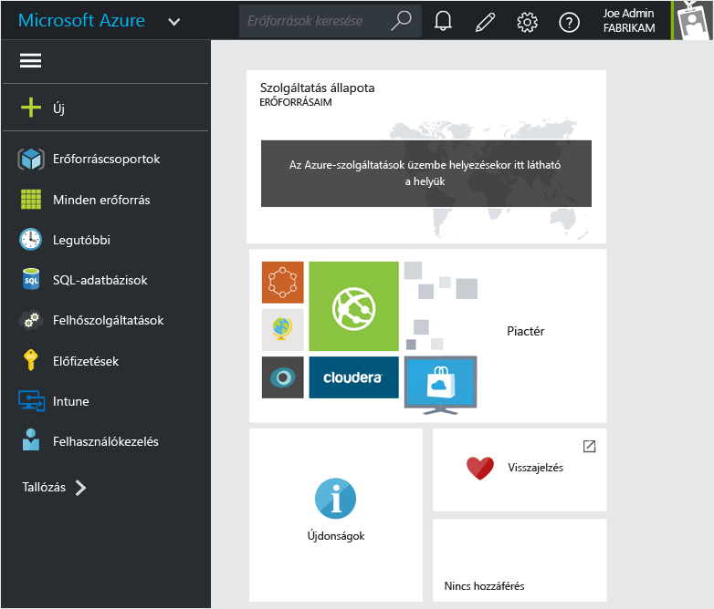
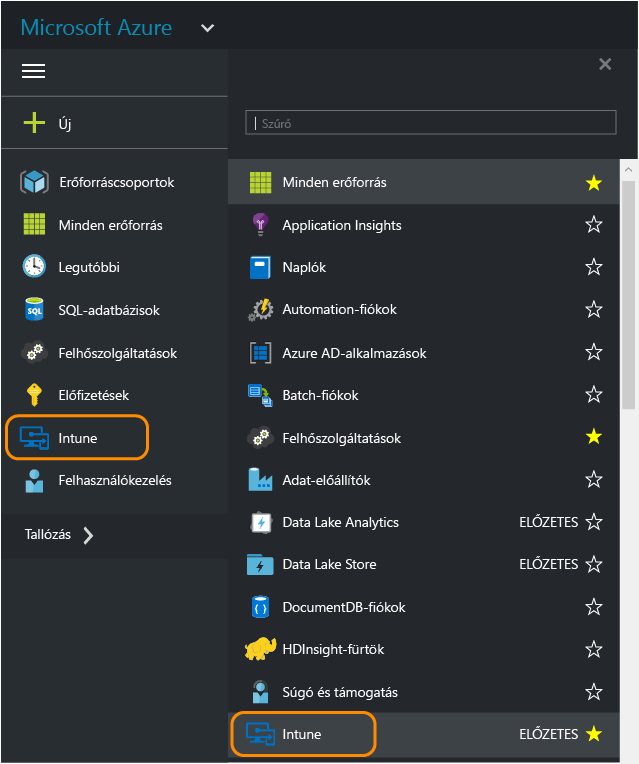
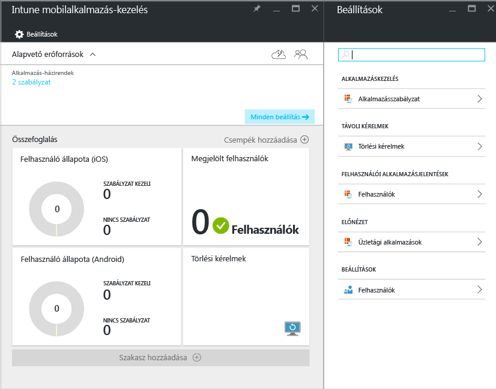
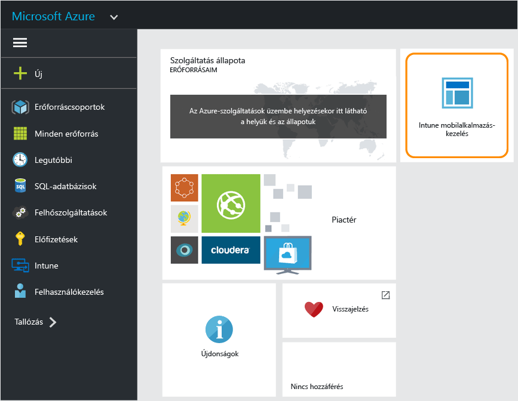

---
# required metadata

title: Azure-portál a mobilalkalmazás-felügyeleti szabályzatok kezeléséhez | Microsoft Intune
description:
keywords:
author: karthikaraman
manager: jeffgilb
ms.date: 04/28/2016
ms.topic: article
ms.prod:
ms.service: microsoft-intune
ms.technology:
ms.assetid: 7d6dae94-a833-40b7-9016-14ea234bb33c

# optional metadata

#ROBOTS:
#audience:
#ms.devlang:
ms.reviewer: jeffgilb
ms.suite: ems
#ms.tgt_pltfrm:
#ms.custom:

---

# Azure-portál a Microsoft Intune mobilalkalmazás-felügyeleti szabályzatainak kezeléséhez
## Az Azure-portál elérése
Az **Azure-portálon** lehetősége van mobilalkalmazás-felügyeleti szabályzatok létrehozására és kezelésére.

Az Azure-portálon az alábbiakhoz támogatott a MAM-szabályzatok létrehozása:
- Az **Intune-ban regisztrált és általa kezelt** eszközökön futó alkalmazások.
- Semmilyen MDM-megoldásban **nem regisztrált** eszközökön futó alkalmazások.
- **Harmadik féltől származó MDM-megoldásban regisztrált** eszközökön futó alkalmazások.

Ha jelenleg az **Intune felügyeleti konzolját** használja eszközei kezelésére, az [Intune felügyeleti konzol](configure-and-deploy-mobile-application-management-policies-in-the-microsoft-intune-console.md) segítségével létrehozhat egy olyan MAM-szabályzatot, amely az Intune-ban regisztrált eszközökön futó alkalmazásokat támogatja.
>[!IMPORTANT]
> Előfordulhat, hogy az Intune felügyeleti konzolon nem lát minden MAM-szabályzatbeállítást. A mobilalkalmazás-felügyeleti szabályzatok létrehozására szolgáló új felügyeleti konzol az Azure-portál. Ha mind az Intune felügyeleti konzoljában, mind az Azure-portálon létrehoz MAM-szabályzatokat, a rendszer az Azure-portálon érvényes szabályzatot alkalmazza az alkalmazásokra, illetve telepíti a felhasználók számára.

## Bejelentkezés az Azure-portálra és a kezdőlap testreszabása

1.  Az [Azure-portálon](https://portal.azure.com) jelentkezzen be [!INCLUDE[wit_nextref](../includes/wit_nextref_md.md)]-os hitelesítő adataival.

    

2.  Miután sikeresen bejelentkezett, megjelenik az **Irányítópult**. Az **Irányítópulton** az alapértelmezett csempék láthatók. Ezeket eltávolíthatja, és újak hozzáadásával testre szabhatja a lapot.

    

3.  A **Tallózás** menüben keresse meg az **Intune** elemet.

4.  Kattintson az **Intune > Intune mobilalkalmazás-kezelés > Beállítások** elemre.

    

    > [!TIP]
    > Ha rögzíteni szeretne egy panelt a **kezdőlapon** , válassza a **Rögzítés** lehetőséget a panelen.  Az **Intune-alapú mobilalkalmazás-felügyelet**panelt a rögzítés ikonjára kattintva rögzítheti a **kezdőlapon** .

    

    
## További lépések
[Felkészülés a mobilalkalmazás-felügyeleti szabályzatok konfigurálására](get-ready-to-configure-mobile-app-management-policies-with-microsoft-intune.md)

<!--HONumber=Jun16_HO1-->

