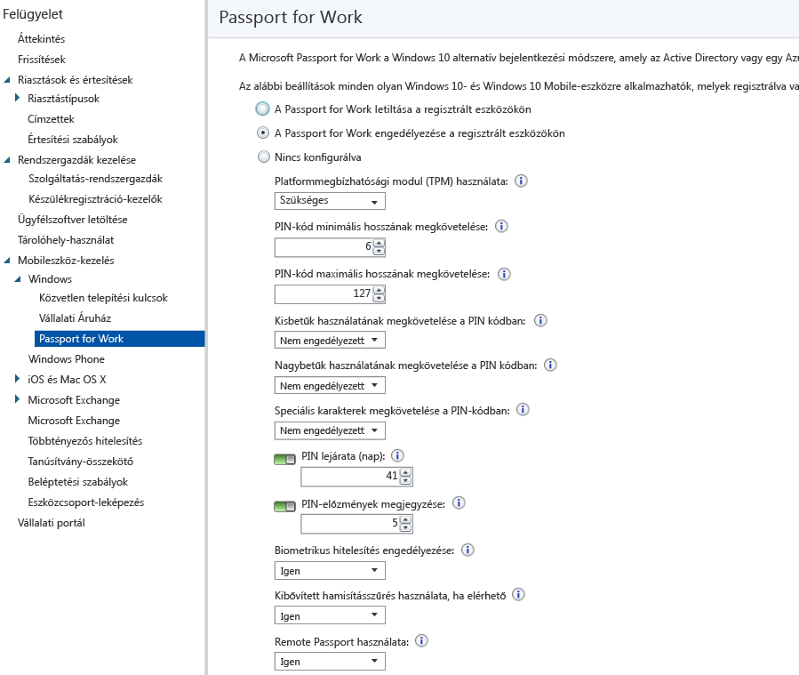

# A Vállalati Windows Hello beállításainak szabályozása az eszközökön a Microsoft Intune-nal
A Microsoft Intune integrálható a Vállalati Windows Hello (korábban Microsoft Passport for Work) nevű alternatív bejelentkezési módszerrel, amely Active Directoryt vagy egy Azure Active Directory-fiókot használ jelszó, intelligens kártya vagy virtuális intelligens kártya helyett.

A Vállalati Hello lehetővé teszi jelszó helyett *felhasználói kézmozdulatok* használatát a bejelentkezéshez. A felhasználói hitelesítési mód lehet egy egyszerű PIN-kód, biometrikus hitelesítés, mint például a Windows Hello, vagy egy külső eszköz, például egy ujjlenyomat-olvasó.

Az Intune kétféleképpen integrálható a Vállalati Hello szolgáltatással:

-   Intune-szabályzatokkal szabályozható, hogy a felhasználók mely hitelesítési módokkal jelentkezhetnek be, és melyekkel nem.

-   A hitelesítési tanúsítványokat tárolhatja a Vállalati Windows Hello kulcstároló-szolgáltatójában. További információkért lásd: [Az erőforrások biztonságos elérése a Microsoft Intune tanúsítványprofiljai segítségével](secure-resource-access-with-certificate-profiles.md).

> [!IMPORTANT]
> Az évfordulós frissítés előtti Windows 10 asztali és mobil verziók esetében két különböző, az erőforrás hitelesítéséhez használható PIN-kódot is beállíthatott:
- Az **eszköz PIN-kód** segítségével feloldhatta az eszköz zárolását és felhőalapú erőforrásokhoz kapcsolódhatott.
- A **munkahelyi PIN-kód** segítségével a felhasználó személyes eszközén (BYOD) férhetett hozzá az Azure AD-erőforrásokhoz.

>Az évfordulós frissítés ezt a két különböző PIN-kódot egyetlen eszköz PIN-kódban egyesítette.
A korábban beállított, az eszköz PIN-kódját felügyelő, bármely Intune-konfigurációs szabályzat, valamint emellett bármely Vállalati Windows Hello-házirend immár kiváltható egyetlen PIN-kóddal.
Ha mindkét fajta házirendet beállította a PIN-kód szabályozására, a Vállalati Windows Hello-házirend a Windows 10 rendszerű asztali és mobileszközökön egyaránt alkalmazásra kerül.
A házirendek között felmerülő esetleges ütközések feloldásához és a PIN-házirend megfelelő alkalmazásához frissítse a Vállalati Windows Hellót, hogy megfeleljen a konfigurációs szabályzat beállításainak, és kérje meg felhasználóit, szinkronizálják eszközeiket a Vállalati portál alkalmazásban.

## Vállalati Windows Hello-házirend létrehozása

1.  A Vállalati Windows Hello oldalának megnyitásához a [Microsoft Intune felügyeleti konzoljában](https://manage.microsoft.com) válassza a **Felügyelet** &gt; **Mobileszköz-kezelés** &gt; **Windows** &gt; **Vállalati Windows Hello** lehetőséget.

    

2.  Válasszon egyet az alábbi beállítások közül:
    - **A Vállalati Windows Hello letiltása a regisztrált eszközökön**. Ha nem szeretné használni a Vállalati Windows Hello szolgáltatást, válassza ezt a beállítást. Ezt követően a képernyőn a többi beállítás nem lesz elérhető.
    - **A Vállalati Windows Hello engedélyezése a regisztrált eszközökön**. Vállalati Windows Hello beállításainak konfigurálásához válassza ezt a beállítást.
    - **Nincs konfigurálva**. Ha nem szeretné, hogy az Intune vezérelje a Vállalati Windows Hello beállításait, válassza ezt a beállítást. A Windows 10-eszközökön meglévő Vállalati Windows Hello-beállítások nem módosulnak. A képernyőn a többi beállítás nem elérhető.
3.  Ha **A Vállalati Windows Hello engedélyezése a regisztrált eszközökön** lehetőséget választotta, akkor konfigurálja a szükséges beállításokat. A rendszer az összes regisztrált Windows 10 és Windows 10 Mobile eszközre alkalmazni fogja őket.
4.  Ha elkészült, válassza a **Mentés** elemet.

## A Vállalati Windows Hello-házirend beállításai

- **Platformmegbízhatósági modul (TPM) használata**. A TPM lapka használata további adatbiztonsági réteget biztosít. Válasszon egyet az alábbi lehetőségek közül:
    - **Kötelező** (alapértelmezett). A Vállalati Windows Hello csak az elérhető TPM modullal rendelkező eszközökön építhető ki.
    - **Elsődleges**. Az eszközök először a TPM használatára tesznek kísérletet. Ha az nem érhető el, használhatnak szoftveralapú titkosítást.
- **PIN-kód minimális hosszának megkövetelése**/** PIN-kód maximális hosszának megkövetelése**. Beállítja az eszközöket a megadott minimális és maximális hosszúságú PIN-kód használatára, a biztonságos bejelentkezés érdekében. A PIN-kód alapértelmezett hossza 6 karakter, de előírható, hogy legalább 4 karakterből kell állnia. A PIN-kód legfeljebb 127 karakter hosszú lehet.
- **Kisbetűk használatának megkövetelése a PIN-kódban**/**Nagybetűk használatának megkövetelése a PIN-kódban**/**Speciális karakterek megkövetelése a PIN-kódban**. Erősebb PIN-kód használata is előírható kis- és nagybetűk, illetve speciális karakterek PIN-kódon belüli használatának együttes megkövetelésével. A következő lehetőségek közül választhat:
    - **Engedélyezett**. A felhasználók használhatják a karaktertípust a PIN-kódban, de ez nem kötelező.
    - **Kötelező**. A felhasználóknak a karaktertípusból legalább egyet használniuk kell a PIN-kódjukban. Például általános gyakorlat legalább egy nagybetű és egy speciális karakter megkövetelése.
    - **Nem engedélyezett** (alapértelmezés). A felhasználók nem használhatják ezeket a karaktertípusokat a PIN-kódjukban. (Ugyanez a viselkedés jellemző, ha a beállítás nincs konfigurálva.) A speciális karakterek a következők: **! " # $ % &amp; ' ( ) &#42; + , - . / : ; &lt; = &gt; ? @ [ \ ] ^ _ &#96; { &#124; } ~**.
- **PIN lejárata (nap)**. A PIN-kódhoz célszerű lejárati időt megadni, amelynek eltelte után a felhasználóknak módosítaniuk kell a PIN-kódot. Az alapértelmezett érték 41 nap.
- **PIN-előzmények megjegyzése**. Korlátozza a korábban használt PIN-kódok ismételt használatát. Alapértelmezés szerint az 5 legutóbb használt PIN-kód nem használható újra.
- **Biometrikus hitelesítés engedélyezése**. Lehetővé teszi a biometrikus hitelesítést, például az arcfelismerést vagy az ujjlenyomat használatát a PIN-kód alternatívájaként a Vállalati Windows Hello szolgáltatásban. A felhasználóknak ekkor is be kell állítaniuk egy PIN-kódot arra az esetre, ha a biometrikus hitelesítés nem sikerül. A következő lehetőségek közül választhat:
    - **Igen**. A Vállalati Windows Hello lehetővé teszi a biometrikus hitelesítést.
    - **Nem**. A Vállalati Windows Hello meggátolja a biometrikus hitelesítést (minden fióktípus esetében).
- **Kibővített hamisításszűrés használata, ha elérhető**. Konfigurálható, hogy a Windows Hello hamisításszűrési funkcióit használják-e az azt támogató eszközök (például egy valós arc helyett egy arcról készült fénykép észlelése). Ha **Igen** értékre van állítva, a Windows minden felhasználótól megköveteli a kibővített hamisításszűrés alkalmazását arcfelismerés esetén, ha az támogatott.
- **Telefonos bejelentkezés használata**. Ha a beállítás az **Igen** értékre van beállítva, a felhasználók egy Remote Passport eszközt használhatnak hordozható társeszközként az asztali hitelesítéshez. Az asztali gépnek csatlakoztatva kell lennie az Azure Active Directoryhoz, és a társeszköznek rendelkeznie kell a Vállalati Windows Hello PIN-kódjával.

## További információ
A Microsoft Passporttal kapcsolatos további információkért olvassa el a Windows 10 dokumentációjában található [útmutatót](https://technet.microsoft.com/library/mt589441.aspx).

<!--HONumber=Sep16_HO3-->

