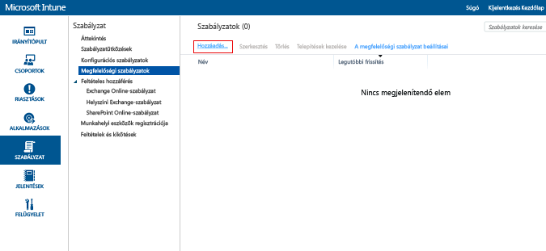

# Eszközmegfelelőségi szabályzat létrehozása a Microsoft Intune-ban
Ez a témakör egy olyan eszközmegfelelőségi szabályzat létrehozásának lépéseit írja le, amelyet az eszközöknek be kell tartaniuk ahhoz, hogy megfelelőnek lehessen tekinteni őket.

##  1. lépés: Az új szabályzat hozzáadása
  A [Microsoft Intune felügyeleti konzolján](https://manage.microsoft.com) válassza a **Házirend** &gt; **Megfelelőségi házirendek** &gt; **Hozzáadás** lehetőséget.

  

##  2 lépés: Beállítások konfigurálása
A **Házirend létrehozása** lapon engedélyezze a kívánt beállításokat:
  -   Rendszerbiztonsági beállítások, például jelszó és titkosítás
  -   Eszközállapot-beállítások, például az, hogy az eszköz függetlenítve van-e vagy fel van-e törve, illetve hogy az eszközt megfelelő állapotúként jelentette-e a Windows eszközállapot-igazolási szolgáltatása.
  -   Eszköztulajdonság-beállítások, mint például az operációs rendszer szükséges minimális, illetve engedélyezett maximális verziója.

##  3. lépés: A szabályzat mentése
Ha elkészült, válassza a **Házirend mentése** elemet.

Lehetősége van közvetlenül a mentés után telepíteni a szabályzatot, vagy telepítheti később is. Az új szabályzat a **Házirend** munkaterület **Megfelelőségi házirendek** csomópontjában jelenik meg.

##  4. lépés: A szabályzat érvényességi idejének beállítása
Azon időpont megadásához, amely előtt az eszköznek be kell jelentkeznie, hogy ne váljon nem megfelelővé, lépjen a megfelelőségi házirend beállításaiba, és frissítse a beállítását.  Az alapértelmezett érték 30 nap.

## Támogatott szabályzatbeállítások
Az alábbi táblázat felsorolja a megfelelőségi szabályzatok egyes beállításait, illetve azt, hogy ezek a beállítások mely platformokon támogatottak.

-------------
|Beállítás|iOS|Android|Windows|
|-----|----|-----|-----|
|Jelszó szükséges a mobileszközök feloldásához|iOS 6 és újabb verziók|Android 4.0 és újabb verziók  Samsung KNOX szabvány 4.0 és újabb|Windows Phone 8 és újabb verziók|
|Egyszerű jelszavak engedélyezése|iOS 6 és újabb verziók|Nem támogatott|Windows Phone 8 és újabb verziók|
|Jelszó minimális hossza|iOS 6 és újabb verziók| Android 4.0 és újabb verziók Samsung KNOX szabvány 4.0 és újabb| Windows Phone 8 és újabb verziók Windows 8.1|
|Kötelező jelszótípus|iOS 6 és újabb verziók|Nem érhető el|Windows Phone 8 és újabb verziók  Windows RT  Windows RT 8.1  Windows 8.1|
|Karakterkészletek minimális száma:|iOS 6 és újabb verziók|Nem érhető el|Windows Phone 8 és újabb verziók  Windows RT  Windows RT 8.1  Windows 8.1|
|Jelszó minősége|Nem érhető el|Android 4.0 és újabb verziók  Samsung KNOX szabvány 4.0 és újabb|Nem érhető el|
|Tétlen percek száma, mielőtt az eszköz újból kéri a jelszót|iOS 6 és újabb verziók|Android 4.0 és újabb verziók Samsung KNOX szabvány 4.0 és újabb|Windows Phone 8 és újabb verziók Windows RT és Windows RT 8.1 Windows 8.1|
|Jelszó lejárata (nap)|iOS 6 és újabb verziók|Android 4.0 és újabb verziók Samsung KNOX szabvány 4.0 és újabb|Windows Phone 8 és újabb verziók Windows RT és Windows RT 8.1 Windows 8.1|
|Jelszóelőzmények megjegyzése|iOS 6 és újabb verziók|Android 4.0 és újabb verziók Samsung KNOX szabvány 4.0 és újabb|Windows Phone 8 és újabb verziók Windows RT és Windows RT 8.1 Windows 8.1|
|Korábbi jelszavak újbóli használatának tiltása|iOS 6 és újabb verziók|Android 4.0 és újabb verziók Samsung KNOX szabvány 4.0 és újabb|Windows Phone 8 és újabb verziók Windows RT és Windows RT 8.1 Windows 8.1|
|Jelszó kérése, amikor az eszköz visszatér inaktív állapotból| Nem érhető el| Nem érhető el|Windows 10 mobil verzió|
|Mobileszköz titkosításának kötelezővé tétele|Nem alkalmazható|Android 4.0 és újabb verziók Samsung KNOX szabvány 4.0 és újabb|Windows Phone 8 és újabb verziók  Windows 8.1|
|Annak megkövetelése, hogy a jelentett eszközök kifogástalan állapotúak legyenek| Nem érhető el| Nem érhető el|Windows  Windows 10 mobil verzió|
|Az eszköz nem lehet függetlenített vagy feltört eszköz|iOS 6 és újabb verziók|Android 4.0 és újabb verziók Samsung KNOX szabvány 4.0 és újabb|Nem érhető el|
|Csak az Intune által felügyelt e-mail fiók használható|iOS 6 és újabb verziók|Nem érhető el| Nem érhető el|
|Az Intune-ban felügyelni kívánt levelezési profil kiválasztása|iOS 6 és újabb verziók|Nem érhető el| Nem érhető el|
|Az operációs rendszer szükséges minimális verziója|iOS 6 és újabb verziók|Android 4.0 és újabb verziók Samsung KNOX szabvány 4.0 és újabb| Windows Phone 8 és újabb verziók Windows 8.1|
|Az operációs rendszer szükséges maximális verziója|iOS 6 és újabb verziók|Android 4.0 és újabb verziók Samsung KNOX szabvány 4.0 és újabb|Windows Phone 8 és újabb verziók Windows 8.1|

Az egyes platformokon támogatott megfelelőségi beállításokkal kapcsolatos bővebb információkért válasszon az alábbi lehetőségek közül:
> [!div class="op_single_selector"]
- [Megfelelőségi szabályzat beállításai iOS-eszközökhöz](ios-compliance-policy-settings-in-microsoft-intune.md)
- [Megfelelőségi szabályzat beállításai Android-eszközökhöz](android-compliance-policy-settings-in-microsoft-intune.md)
- [Megfelelőségi szabályzat beállításai Windows- és Windows Phone-eszközökhöz ](windows-compliance-policy-settings-in-microsoft-intune.md)

## További lépések
[Megfelelőségi házirend üzembe helyezése és figyelése](deploy-and-monitor-a-device-compliance-policy-in-microsoft-intune.md)

### További információ
[Bevezetés az eszközmegfelelőségi szabályzatokba](introduction-to-device-compliance-policies-in-microsoft-intune.md)

<!--HONumber=Jul16_HO4-->

