# Mobilalkalmazás-felügyeleti szabályzatok létrehozása és telepítése Microsoft Intune-ban
A mobilalkalmazás-felügyeleti (MAM) szabályzatok alkalmazhatók az Intune által felügyelt vagy nem felügyelt eszközökön futó alkalmazásokra. A MAM-szabályzatok működésének részletes leírását és az Intune MAM-szabályzatai által támogatott forgatókönyveket az [Alkalmazásadatok védelme mobilalkalmazás-felügyeleti szabályzatokkal](protect-app-data-using-mobile-app-management-policies-with-microsoft-intune.md) témakör tartalmazza.

Ez a témakör a MAM-szabályzat **Azure-portálon** történő létrehozásának folyamatát mutatja be. A mobilalkalmazás-felügyeleti szabályzatok létrehozására szolgáló új felügyeleti konzol az Azure-portál. Javasoljuk, hogy a továbbiakban ezen a portálon hozza létre a MAM-szabályzatokat. Az Azure-portál a következő MAM-forgatókönyveket teszi lehetővé:
- Az Intune-ban regisztrált eszközök
- Külső MDM-megoldás által kezelt eszközök
- MDM-megoldással (BYOD) nem kezelt eszközök

>[!IMPORTANT]

> Ha jelenleg az **Intune felügyeleti konzolját** használja eszközei kezelésére, az [Intune felügyeleti konzol](configure-and-deploy-mobile-application-management-policies-in-the-microsoft-intune-console.md) segítségével létrehozhat egy olyan MAM-szabályzatot, amely az Intune-ban regisztrált eszközökön futó alkalmazásokat támogatja.
Az Intune felügyeleti konzolon létrehozott MAM-szabályzatokat nem lehet az Azure-portálon importálni.  A MAM-szabályzatokat az Azure-portálon kell létrehozni.

> Előfordulhat, hogy az Intune felügyeleti konzolon nem lát minden MAM-szabályzatbeállítást. A mobilalkalmazás-felügyeleti szabályzatok létrehozására szolgáló új felügyeleti konzol az Azure-portál. Ha mind az Intune felügyeleti konzoljában, mind az Azure-portálon létrehoz MAM-szabályzatokat, a rendszer az Azure-portálon érvényes szabályzatot alkalmazza az alkalmazásokra, illetve telepíti a felhasználók számára.

Az Android és az iOS platformokon támogatott szabályzatbeállítások listájának megtekintéséhez válasszon a következő lehetőségek közül:

> [!div class="op_single_selector"]
- [iOS-szabályzatok](ios-mam-policy-settings.md)
- [Android-szabályzatok](android-mam-policy-settings.md)

##  A MAM-szabályzat létrehozása
MAM-szabályzat létrehozása előtt tekintse át [az előfeltételekre és a támogatásra](get-ready-to-configure-mobile-app-management-policies-with-microsoft-intune.md) vonatkozó információkat.
1.  Válassza az **Intune mobilalkalmazás-felügyelet &gt; Beállítások** elemet a **Beállítás** panel megnyitásához.

    

    > [!TIP]
    > Ha első alkalommal használja az Azure-portált, az [Azure-portál a Microsoft Intune mobilalkalmazás-felügyeleti szabályzatainak kezeléséhez](azure-portal-for-microsoft-intune-mam-policies.md) című témakörben ismerkedhet meg a portállal.

2.  A **Beállítások** panelen válassza az **Alkalmazásszabályzat** elemet.  Ekkor megnyílik a **Alkalmazás-szabályzat** panel, amelyen új szabályzatokat hozhat létre, és szerkesztheti a meglévő szabályzatokat.

    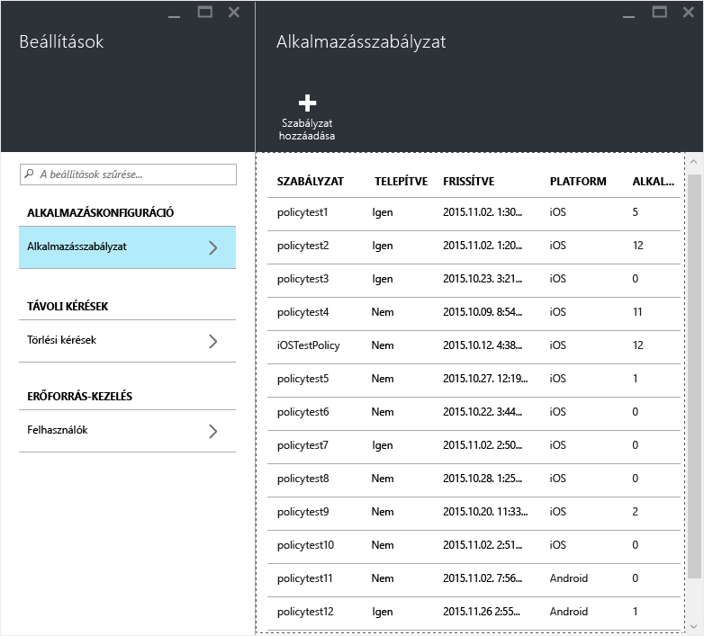

3.  Válassza a **Szabályzat hozzáadása** elemet.

    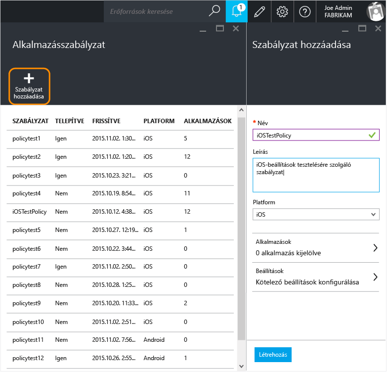

4.  Írja be a szabályzat nevét, adjon meg egy rövid leírást, és válassza ki platform típusát az iOS- vagy Android-alapú szabályzat létrehozásához.  Az egyes platformokon egynél több szabályzatot is beállíthat.

    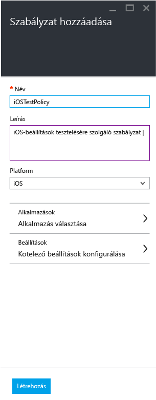

5.  Válassza az **Alkalmazások** elemet az **Alkalmazások panel** megnyitásához, ahol megjelenik a rendelkezésre álló alkalmazások listája. Egy vagy több alkalmazást is kijelölhet a listában a létrehozott szabályzat társításához. Ha kiválasztotta az alkalmazásokat, válassza az **Alkalmazások** panel alján található **Kiválasztás** gombot a mentéshez.

    > [!IMPORTANT]
    > Legalább egy alkalmazást ki kell jelölnie a szabályzat létrehozásához.

6.  A **Szabályzat hozzáadása** panelen kattintson a **Kötelező beállítások konfigurálása** elemre a szabályzatbeállítási panel megnyitásához.

    A szabályzatbeállításoknak két kategóriájuk van, az **Adatáthelyezés** és a **Hozzáférés**.  Az adatáthelyezési szabályzatok az alkalmazások mindkét irányú adatátvitelére vonatkoznak. A hozzáférési szabályzatok meghatározzák, hogyan érheti el a végfelhasználó az alkalmazásokat munkahelyi környezetben.
    Használatuk megkönnyítése érdekében a szabályzatok alapértelmezett értékek szerint vannak beállítva.  Nem szükséges változtatnia, ha az alapértelmezett értékek megfelelnek az elvárásainak.

    > [!TIP]
    > A szabályzat beállításai csak akkor lépnek érvénybe, ha munkahelyi környezetben használják az alkalmazásokat.  Amikor a végfelhasználó az alkalmazást személyes feladatra használja, nem vonatkoznak rá a szabályzatok.

    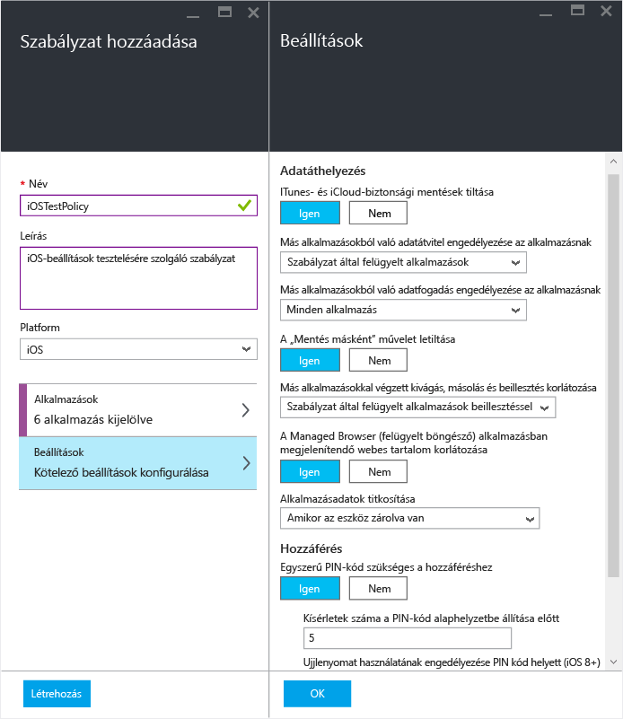

7.  A konfiguráció mentéséhez válassza az **OK** gombot.  Ekkor visszakerül a **Szabályzat hozzáadása** panelbe. Válassza a **Létrehozás** lehetőséget a szabályzat létrehozásához és a beállítások mentéséhez.

    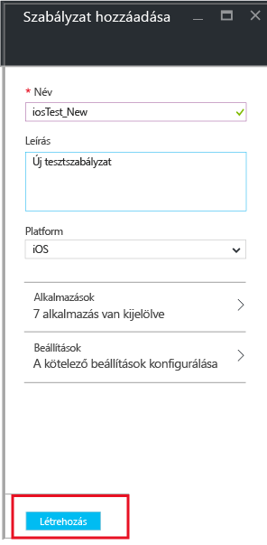

    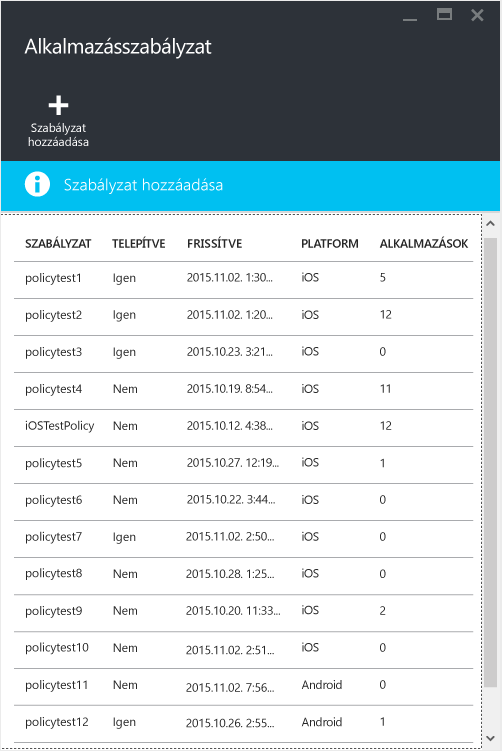

Ha az előző eljárásban leírtak szerint hozta létre a szabályzatot, a felhasználók számára ekkor még nincs telepítve.  A szabályzat telepítéshez kövesse az alábbi lépéseket.

> [!IMPORTANT]
> Ha egy alkalmazáshoz létrehoz egy MAM-szabályzatot az Intune felügyeleti konzoljával, és az Azure-portál használatával is létrehoz egy MAM-szabályzatot hozzá, akkor az Azure-portálon létrehozott szabályzat lesz az elsődleges. Az Intune vagy a Configuration Manager-konzol jelentéseiben azonban szerepelni fognak az Azure-portálon létrehozott szabályzatbeállítások. Példa:
>
> -   Az Intune felügyeleti konzolján létrehozott egy mobilalkalmazás-felügyeleti szabályzatot, amely tiltja az alkalmazások másolását.
> -   Az Azure-konzolon létrehozott egy mobilalkalmazás-felügyeleti szabályzatot, amely engedélyezi az alkalmazások másolását.
> -   Mindkét szabályzatot ugyanahhoz az alkalmazáshoz rendeli.
> -   Ennek eredményeképp az Azure-konzolon létrehozott szabályzat elsőbbséget kap, így a másolás engedélyezett.
> -   Azonban az Intune-konzolon megjelenő állapot és jelentések szerint a másolás tiltott, ami nem felel meg a valóságnak.

## Szabályzat telepítése a felhasználók számára

1.  A **Szabályzat** panelen válassza a **Felhasználói csoportok** elemet a **Felhasználói csoportok** panel megnyitásához. Válassza a **Felhasználói csoport hozzáadása** elemet a **Felhasználói csoportok** panelen a **Felhasználói csoport hozzáadása** panel megnyitásához.

    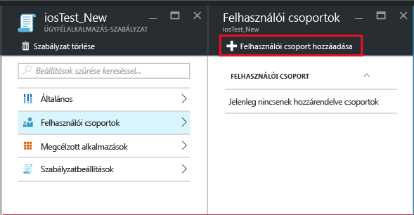

2.  A **Felhasználói csoport hozzáadása** panelen megjelenik a felhasználói csoportok listája. Ezen a listán az **Azure Active Directory**összes biztonsági csoportja szerepel.  Válassza ki azokat a felhasználói csoportokat, amelyekhez hozzá szeretné rendelni a szabályzatot, és válassza a **Kiválasztás** elemet. A **Kiválasztás** elem választásával telepítheti a szabályzatot a felhasználók számára.

    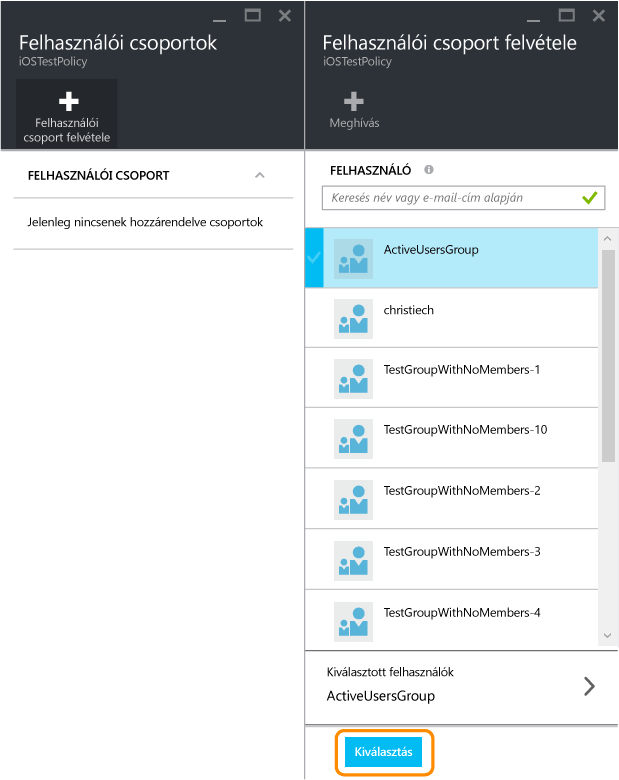

    A szabályzat ezzel létrejött, és telepítve lett a felhasználók számára.

A szabályzat csak az [!INCLUDE[wit_nextref](../includes/wit_nextref_md.md)]-licenccel rendelkező felhasználókra érvényes.  A kijelölt biztonsági csoport [!INCLUDE[wit_nextref](../includes/wit_nextref_md.md)]-licenc nélküli felhasználóira nem vonatkozik a szabályzat.

>[!IMPORTANT]
> Ha az Intune-ban és a Configuration Managerben kezeli az iOS- és Android-eszközöket, a szabályzatok csak a közvetlenül kijelölt csoport felhasználói esetében lépnek érvénybe.  A csoportba ágyazott alárendelt csoportok tagjaira nem vonatkozik a szabályzat.

A végfelhasználók az App Store-ból vagy a Google Play-ből tölthetik le az alkalmazásokat. Ha részletes tájékoztatást szeretne kapni arról, hogyan védi a MAM a vállalati adatok az eszközön, olvassa el a következő témakört: [Végfelhasználói élmény a MAM használatát támogató alkalmazások esetében](end-user-experience-for-mam-enabled-apps-with-microsoft-intune.md).

##  A meglévő szabályzatok módosítása
A meglévő szabályzatokat szerkesztheti, és alkalmazhatja azokat a megcélzott felhasználókra. Ha azonban a meglévő szabályzatok módosításakor a felhasználók már be voltak jelentkezve az alkalmazásokba, csak egy 8 órás időszak elteltével láthatják a változtatásokat.

A változtatások hatásának megfigyeléséhez a felhasználónak ki kell jelentkeznie az alkalmazásból, majd újból be kell jelentkeznie.

### A szabályzathoz társított alkalmazások listájának módosítása

1.  Az **Alkalmazásszabályzat** panelen válassza ki a módosítani kívánt szabályzatot. Ekkor megnyílik a kiválasztott szabályzat tulajdonságait tartalmazó panel.

    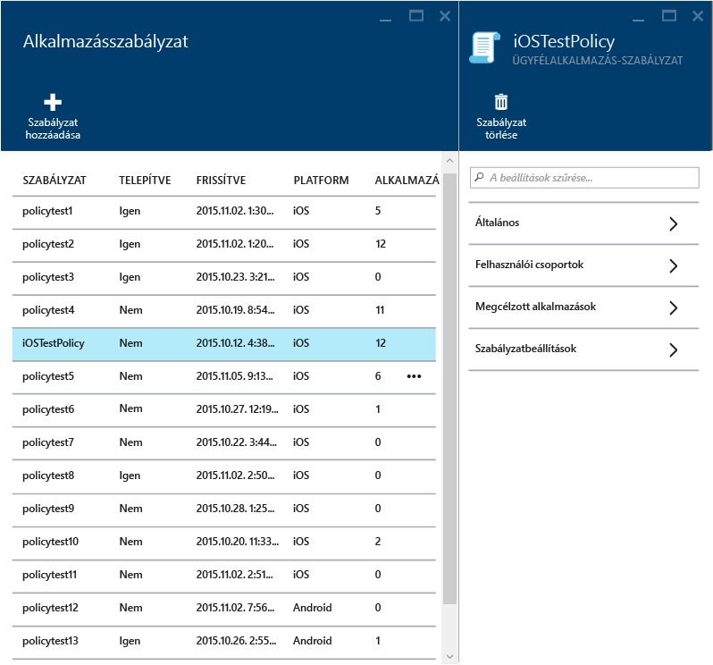

2.  A szabályzat paneljén válassza a **Megcélzott alkalmazások** elemet az alkalmazások listájának megnyitásához.

3.  Az listában eltávolíthat vagy hozzáadhat alkalmazásokat, és a **Mentés ikon** elem választásával mentheti a módosításokat.

### A felhasználói csoportok listájának módosítása

1.  Az **Alkalmazásszabályzat** panelen válassza ki a módosítani kívánt szabályzatot. Ekkor megnyílik a kiválasztott szabályzat tulajdonságait tartalmazó panel.

2.  A szabályzat paneljén válassza a **Felhasználói csoportok** elemet a **Felhasználói csoport** panel megnyitásához. Itt láthatja azokat a felhasználói csoportokat, amelyekre érvényes a szabályzat.

3.  Ha a szabályzathoz **új felhasználói csoportot szeretne felvenni**, válassza a **Felhasználói csoport hozzáadása** elemet, és válasszon felhasználói csoportot. Válassza a **Kiválasztás** elemet, ha telepíteni szeretné a szabályzatot a kiválasztott csoport számára.

    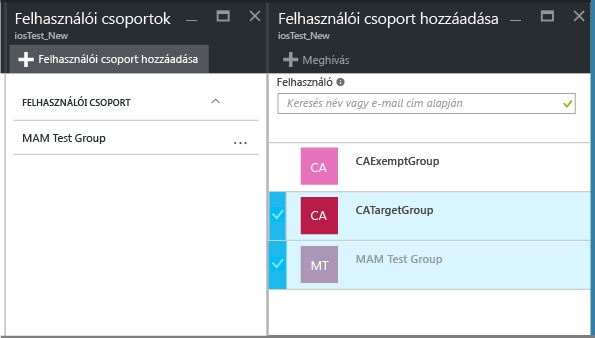

4.  **Felhasználói csoport törléséhez** jelölje ki az eltávolítani kívánt felhasználói csoportot, majd válassza a folytatást jelző pontokat (...), végül a **Törlés** elemet.

    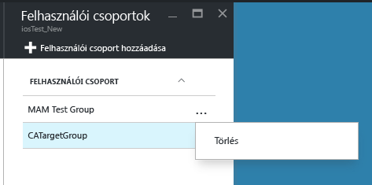

### A szabályzatbeállítások módosítása

1.  Az **Alkalmazásszabályzat** panelen válassza ki a módosítani kívánt szabályzatot. Ekkor megnyílik a kiválasztott szabályzat tulajdonságait tartalmazó panel.

    

2.  Válassza a **Szabályzatbeállítások** elemet a **Szabályzatbeállítások** panel megnyitásához.

3.  Módosítsa a beállításokat, majd válassza a **Mentés ikon** elemet a változtatások mentéséhez.

    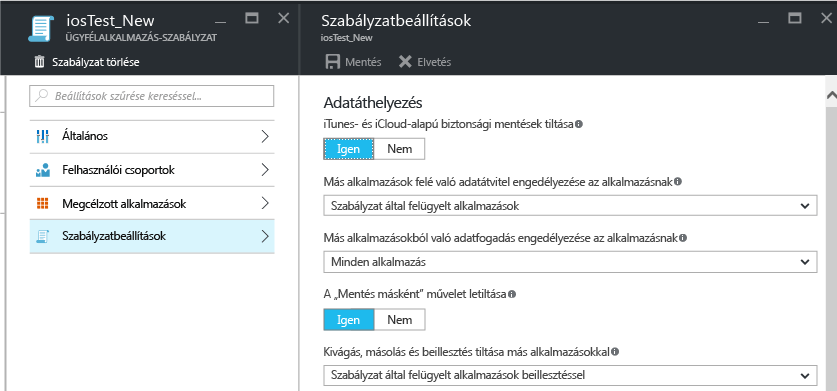

## Szabályzatbeállítások
Az iOS és az Android szabályzatbeállításait tartalmazó lista megtekintéséhez válasszon a következő lehetőségek közül:

> [!div class="op_single_selector"]
- [iOS-szabályzatok](ios-mam-policy-settings.md)
- [Android-szabályzatok](android-mam-policy-settings.md)

## További lépések
[A megfelelőség és a felhasználói állapot figyelése](monitor-mobile-app-management-policies-with-microsoft-intune.md)

### További információ
[Végfelhasználói élmény a MAM használatát támogató alkalmazások esetében](end-user-experience-for-mam-enabled-apps-with-microsoft-intune.md)

<!--HONumber=Jul16_HO3-->

