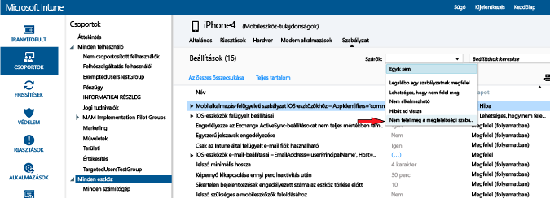

# Eszközmegfelelőségi szabályzat üzembe helyezése és figyelése a Microsoft Intune-ban
## Megfelelőségi házirend telepítése
A [létrehozott](create-a-device-compliance-policy-in-microsoft-intune.md) megfelelőségi szabályzatot a szervezetében megtalálható felhasználók vagy eszközök egy vagy több csoportja számára is telepítheti.

1.  A **Házirend** munkaterületen válassza ki a telepíteni kívánt házirendet, majd kattintson a **Központi telepítés kezelése** elemre.

2.  A **Központi telepítés kezelése** párbeszédpanelen válasszon ki egy vagy több csoportot, amelyhez a szabályzatot telepíteni szeretné, majd válassza a **Hozzáadás > OK** elemet.
 A felhasználók vagy eszközök részére beállíthat megfelelőségi szabályzatot. Használja a már létrehozott és az Intune-nal szinkronizált Active Directory-csoportokat, vagy hozza létre ezeket a csoportokat manuálisan az Intune-konzolon. A szabályzatok beállításával kapcsolatos további tudnivalókért lásd a [konfigurációs szabályzat beállításáról](manage-settings-and-features-on-your-devices-with-microsoft-intune-policies.md) szóló részt.

A **Házirend** munkaterület **Áttekintés** lapján található állapotösszegzés és riasztások használatával azonosíthatók a szabályzattal kapcsolatos, figyelmet igénylő problémák. Ezen felül egy állapotösszegzés megjelenik az **Irányítópult** munkaterületen is.

> [!IMPORTANT]
> Ha nem telepített megfelelőségi házirendet, és engedélyez egy Exchange feltételes hozzáférési házirendet, az összes megcélzott eszköz hozzáférése engedélyezett lesz.

## Házirendütközések feloldása az Intune-ban
Szabályzatütközések akkor következhetnek be, ha egy eszközhöz több Intune-szabályzatot telepítettek. Ha a szabályzatbeállítások közt átfedés van, az Intune a következő szabályok alkalmazásával oldja fel az ütközéseket:

-   Ha az ütköző beállítások egy Intune konfiguráció házirendből és egy megfelelőségi szabályzatból kerülnek ki, akkor a megfelelőségi szabályzat beállításai érvényesülnek a konfigurációs házirenddel szemben még akkor is, ha a konfigurációs házirend beállításai biztonságosabbak.

-   Ha több megfelelőségi házirendet telepített, akkor a házirendek közül a legbiztonságosabb kerül felhasználásra.

## A megfelelőségi házirend megfigyelése

#### Megfelelőségi házirendet be nem tartó eszközök megtekintése

1.  A [Microsoft Intune felügyeleti konzolján](https://manage.microsoft.com) válassza a **Csoportok > Minden eszköz** elemet.

2.  Kattintson duplán az eszköz nevére az eszközök listájában.

3.  Válassza a **Házirend** fület az eszköz házirendjei listájának megtekintéséhez.

4.  A **Szűrők** legördülő listából válassza a **Nem felel meg a megfelelőségi szabályzatnak** elemet.

#### Az állapotigazolási jelentések megtekintése

1.  A [Microsoft Intune felügyeleti konzolján](https://manage.microsoft.com) válassza a **Jelentések** elemet.

2.  Az **Állapotigazolási jelentés – Új jelentés létrehozása** lapon megtekintheti az Intune által gyűjtött összes Windows 10-állapotigazolási adatot. Az adatok egy részével is létrehozhat jelentést szűrők segítségével. A szűrők az eszköz típusán, az operációs rendszeren vagy az adatpontok egy részén alapulhatnak.

## További lépések
Most a megfelelőségi házirendet feltételes hozzáférési házirendekkel használhatja a szervezetben lévő szolgáltatásokhoz való hozzáférés vezérlése érdekében.

[Az e-mailek és az O365-szolgáltatások hozzáférésének korlátozása](restrict-access-to-email-and-o365-services-with-microsoft-intune.md)

### További információ
[Az Intune eszközmegfelelőségi szabályzatainak bemutatása](introduction-to-device-compliance-policies-in-microsoft-intune.md)

<!--HONumber=Jul16_HO4-->

