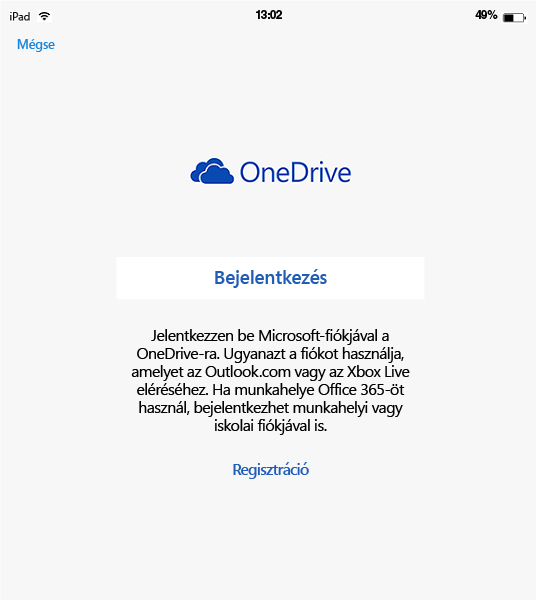
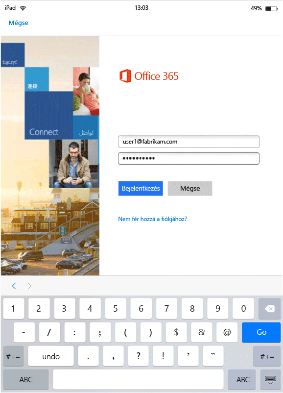

---
# required metadata

title: Végfelhasználói élmény a MAM használatát támogató alkalmazások esetében | Microsoft Intune
description:
keywords:
author: karthikaraman
manager: jeffgilb
ms.date: 04/28/2016
ms.topic: article
ms.prod:
ms.service: microsoft-intune
ms.technology:
ms.assetid: b57e6525-b57c-4cb4-a84c-9f70ba1e8e19

# optional metadata

#ROBOTS:
#audience:
#ms.devlang:
ms.reviewer: jeffgilb
ms.suite: ems
#ms.tgt_pltfrm:
#ms.custom:

---

# Végfelhasználói élmény a MAM használatát támogató alkalmazások esetében a Microsoft Intune-nal
A mobilalkalmazás-kezelési (MAM-) szabályzatok csak akkor lépnek érvénybe, ha az adott alkalmazásokat munkahelyi környezetben használják.  A következő forgatókönyvek áttekintésével képet kaphat a felügyelt alkalmazások működéséről.
##  A OneDrive elérése iOS-eszközön

1.  A  **OneDrive** alkalmazást elindítva nyissa meg a bejelentkezési lapot.

    

    > [!NOTE]
    > Személyes eszköz esetén általában a végfelhasználó tölti le az alkalmazást.  Ha az eszköz MDM-alapú felügyelet alá tartozik, az alkalmazást Ön telepítheti az eszközön.

2.  Írja be a munkahelyi fiókja felhasználónevét. Ekkor megnyílik az **O365 hitelesítési lapja** , ahol megadhatja a munkahelyi hitelesítő adatait.

    

3.  Miután az Azure AD-ban sikeresen megtörtént a hitelesítő adatok hitelesítése, érvénybe lépnek az MAM-szabályzatok, és a rendszer arra kéri, hogy indítsa újra a **OneDrive** alkalmazást.

    

4.  A **OneDrive** újraindításakor az alkalmazás már bekapcsolt MAM-szabályzatokkal indul el. A rendszer ekkor arra kéri, hogy állítson be **PIN-kódot** az alkalmazáshoz (ha a szabályzatot annak használatára állította be).

    

5.  Miután beállította és megerősítette a PIN-kódot, hozzáférhet a **OneDrive vállalati verzióban** tárolt fájljaihoz..

    

    > [!NOTE]
    > A telepített szabályzatok módosításai az alkalmazás következő indításakor lépnek érvénybe.

##  A OneDrive elérése Android-eszközön

1.  A OneDrive alkalmazást elindítva nyissa meg a bejelentkezési lapot.

    > [!NOTE]
    > Személyes eszköz esetén általában a végfelhasználó tölti le az alkalmazást.  Ha az eszköz MDM-alapú felügyelet alá tartozik, az alkalmazást Ön telepítheti az eszközön.

2.  Írja be a munkahelyi fiókja felhasználónevét. Ekkor megnyílik az **O365 hitelesítési lapja** , ahol megadhatja a munkahelyi hitelesítő adatait.

    

3.  Miután az **Azure AD**-ban sikeresen megtörtént a hitelesítő adatok hitelesítése, megjelenik egy üzenet, amely tartalmazza a Vállalati portál alkalmazás telepítésére vonatkozó utasításokat, ha az még nincs telepítve az eszközön.  A folytatáshoz koppintson **Az alkalmazás letöltése** hivatkozásra.

>[!NOTE]
>A Vállalati portál alkalmazásra szükség van a MAM-szabályzatokhoz hozzárendelt összes alkalmazáshoz az Android-eszközökön. Az Intune-ban nem regisztrált eszközök esetében az alkalmazást telepíteni kell az eszközre, de nem kell elindítani vagy bejelentkezni az alkalmazásba.  

  

4.  Ekkor megnyílik a **Google Play** áruház, ahonnan letöltheti és telepítheti a **Vállalati portál** alkalmazást.

    A Vállalati portál alkalmazás segít az adatok védelmében és biztonságuk megőrzésében.

    

5.  A telepítés befejezése után az **Elfogadás** gombra kattintva fogadja el a használati feltételeket.

6.  A **OneDrive** alkalmazás automatikusan elindul.

7.  A OneDrive következő megnyitásakor az alkalmazás **PIN-kód**beállítását kéri, amennyiben a szabályzat beállításai PIN-kód megadását írják elő a **OneDrive** alkalmazás eléréséhez.

    

8.  Miután beállította és megerősítette a PIN-kódot, folytathatja a **OneDrive**használatát, amely immár az alkalmazásszabályzatok felügyelete alá tartozik.

##  A többszörös identitást támogató alkalmazások használata
Ebben a forgatókönyvben a Microsoft Word szerepel példaként.

1.  Nyissa meg a **Word** alkalmazást az eszközön. Ez a példa iOS-eszközön szemlélteti a lépéseket.

2.  Az **Új** ikonra koppintva hozzon létre új Word-dokumentumot.

    

3.  Írjon be egy tetszőleges mondatot.  Amikor megpróbálja menteni a dokumentumot, a személyes és a munkahelyi helyek egyaránt megjelennek az imént létrehozott dokumentum lehetséges mentési helyeként.  Ebben a lépésben még nincsenek érvényben alkalmazásszabályzatok, ugyanis a munkahelyi, illetve személyes környezet még nincs kialakítva.

4.  Mentse a dokumentumot a OneDrive vállalati verzióbeli tárhelyére. A helyet a rendszer ettől kezdődően vállalati adatok tárolására használt helyként jelöli meg, és arra a szabályzatok korlátozásai vonatkoznak.

    

5.  Nyissa meg a munkahelyi helyre mentett dokumentumot.  Másolja a dokumentum szövegét, nyissa meg a személyes **Facebook**-fiókját, és próbálja meg beilleszteni a másolt szöveget.  Ekkor a tartalmat nem tudja új Facebook-hozzászólásba beilleszteni. A beillesztési parancs ugyan nem szürke, de semmi nem történik, amikor a **Beillesztés** elemet használja..

    

    

6.  A 2. és a 3. lépést megismételve hozzon létre még egy új dokumentumot, írjon be néhány mondatot, és ezúttal a munkahelyi helyett személyes helyre, például a **személyes OneDrive-tárhelyére** mentse a dokumentumot..

    

7.  Nyissa meg a személyes helyre mentett dokumentumot.  Másolja a dokumentum szövegét, nyissa meg a **Facebook** alkalmazást, és próbálja meg beilleszteni a másolt szöveget. Láthatja, hogy be tudja illeszteni a tartalmat Facebook-hozzászólásokba.

    

##  Felhasználói fiókok kezelése

Az Intune a MAM-szabályzatok telepítését eszközönként csak egy felhasználói fiók esetében támogatja. Ha egy eszközhöz több munkahelyi fiók tartozik, a MAM-szabályzatok csak az egyik munkahelyi fiókot kezelik.

A használt alkalmazástól függően a második felhasználó blokkolva lesz vagy nem lesz blokkolva az eszközön. Minden esetben azonban csak a MAM-szabályzatokat megkapó első felhasználóra lesznek érvényesek a szabályzatok.

Ha egy eszközhöz több meglévő felhasználói fiók tartozik a MAM-szabályzatok telepítése előtt, az Intune MAM-szabályzatai azt a fiókot kezelik, amelyikre elsőként lettek telepítve a MAM-szabályzatok.

A **Microsoft Word**, az **Excel** és a **PowerPoint** nem blokkolja a második felhasználói fiókot, de a MAM-szabályzatok nem érvényesek a második felhasználói fiókra.  

A **OneDrive és az Outlook alkalmazáshoz** csak egy munkahelyi fiókot használhat.  A további munkahelyi fiókok hozzáadását ezek az alkalmazások blokkolják.  Ugyanakkor eltávolíthat egy adott felhasználót, és másik felhasználót vehet fel helyette az eszközön.

A következő példák részletesen bemutatják, hogyan történik a több felhasználói fiók kezelése.

Az A felhasználó két vállalatnak dolgozik: az **X vállalatnak** és az **Y vállalatnak**. Az A felhasználó munkahelyi fiókkal rendelkezik mindként vállalatnál, és mindkettő az Intune-t használja a MAM-szabályzatok telepítéséhez. Az **X vállalat** telepíti elsőként a MAM-szabályzatokat, **megelőzve** **az Y vállalatot**. Az **X vállalathoz** tartozó fiók megkapja a MAM-szabályzatot, de az Y vállalat fiókja nem. Ha azt szeretné, hogy a MAM-szabályzatok az Y vállalathoz tartozó fiókot kezeljék, akkor el kell távolítania az X vállalathoz tartozó fiókot.
### Második fiók hozzáadása
#### iOS
Ha iOS-eszközt használ, és egy második munkahelyi fiókot próbál felvenni ugyanazon az eszközön, blokkoló üzenet jelenhet meg.  Ezenkívül megjelenik egy lehetőség, hogy a meglévő fiókot eltávolítsa, és új fiókot vegyen fel. Ezt az **Igen** gombra kattintva teheti meg..

####  Android
Android-eszközön blokkoló üzenet jelenhet meg, amely ismerteti a meglévő fiók eltávolításának és új fiók felvételének lépéseit.  Android-eszközön a meglévő fiók eltávolításához válassza a **Settings (Beállítások) &gt; General (Általános) &gt; Application Manager (Alkalmazáskezelő) &gt; Company Portal (Vállalati portál), végül a Clear Data (Adatok törlése)** lehetőséget..

##  Médiafájlok megtekintése a Rights Management megosztóalkalmazással
A vállalati AV-, PDF- és képfájlok Android-eszközökön való megtekintéséhez használja a [Microsoft Rights Management (RMS) megosztóalkalmazást](https://play.google.com/store/apps/details?id=com.microsoft.ipviewer)..

Ezt az alkalmazást a Google Play áruházból töltheti le.  Miután telepítette az eszközre az alkalmazást, indítsa el az alkalmazást, és jelentkezzen be a vállalati hitelesítő adataival. Ekkor meg tudja tekinteni a szabályzattal felügyelt más alkalmazásokból származó nem védett és védett fájlokat is.

### További információ
[Mobilalkalmazás-felügyeleti szabályzatok létrehozása és telepítése Microsoft Intune-ban](create-and-deploy-mobile-app-management-policies-with-microsoft-intune.md)

<!--HONumber=May16_HO1-->

