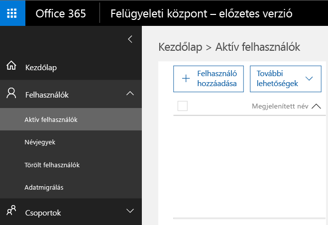
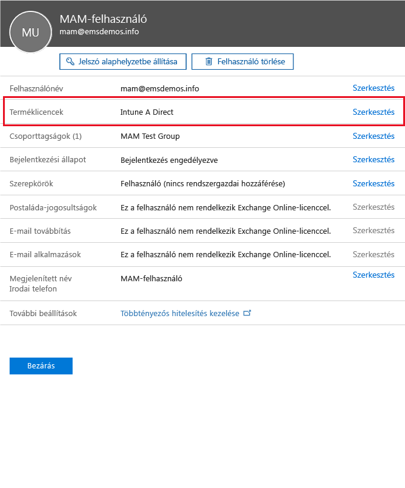
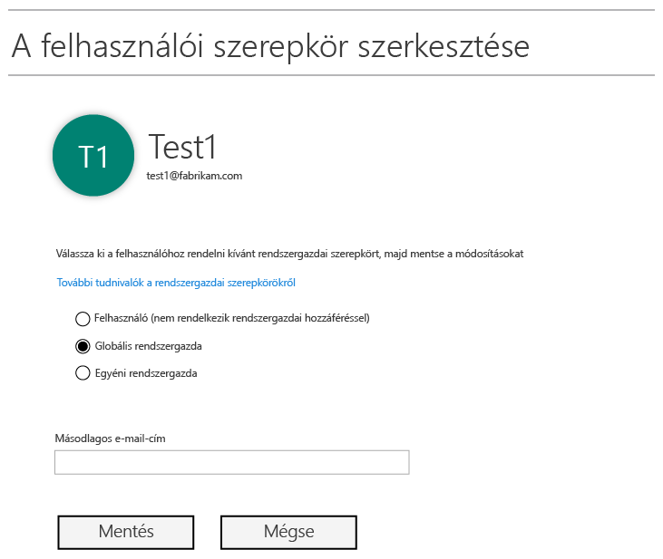
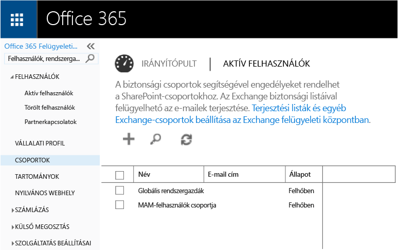
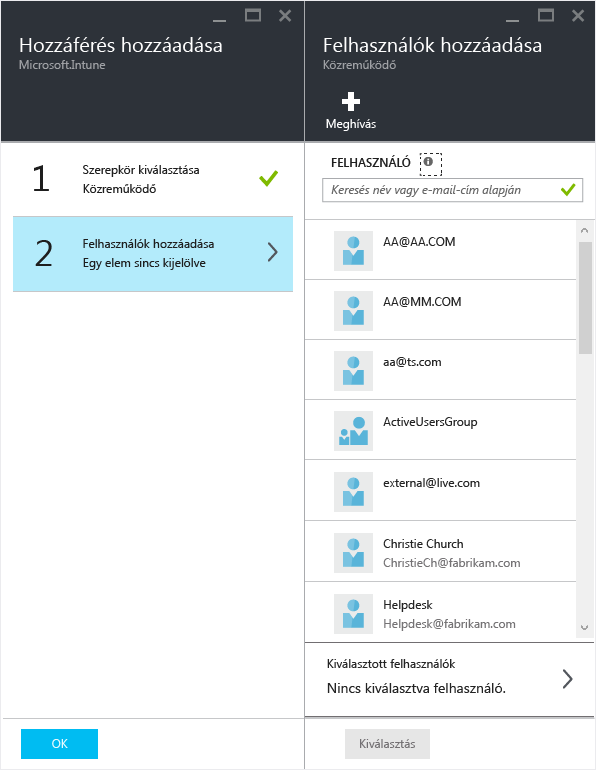

# Felkészülés a mobilalkalmazás-felügyeleti szabályzatok konfigurálására a Microsoft Intune-ban
Ez a témakör ismerteti, mit kell tennie, mielőtt mobilalkalmazás-felügyeleti (MAM) szabályzatokat hoz létre az Azure portálon.

A mobilalkalmazás-felügyeleti szabályzatok létrehozására szolgáló új felügyeleti konzol az Azure-portál. Javasoljuk, hogy a továbbiakban ezen a portálon hozza létre a MAM-szabályzatokat. Az Azure-portál a következő MAM-forgatókönyveket teszi lehetővé:
- Az Intune-ban regisztrált eszközök
- Külső MDM-megoldás által felügyelt eszközök
- MDM-megoldással (BYOD) nem kezelt eszközök

Ha most ismerkedik az Azure-portál használatával, az [Azure-portál a Microsoft Intune mobilalkalmazás-felügyeleti szabályzatainak kezeléséhez](azure-portal-for-microsoft-intune-mam-policies.md) című témakör elolvasásával gyorsan áttekintheti a tudnivalókat.

>[!IMPORTANT]

> Ha jelenleg az Intune felügyeleti konzolját használja az eszközei kezelésére, az Intune felügyeleti konzol segítségével létrehozhat MAM-szabályzatokat, amelyek az Intune-ban regisztrált eszközökön futó alkalmazásokat támogatják. Javasoljuk azonban, hogy még az Intune-ban regisztrált eszközök esetében is az Azure portált használja. További útmutatás a MAM-szabályzat az Intune segítségével történő létrehozásáról: [Mobilalkalmazás-kezelési házirendek konfigurálása és telepítése a Microsoft Intune-konzolon](configure-and-deploy-mobile-application-management-policies-in-the-microsoft-intune-console.md).

> Előfordulhat, hogy az Intune felügyeleti konzolon nem lát minden MAM-szabályzatbeállítást. Ha mind az Intune felügyeleti konzoljában, mind az Azure portálon létrehoz MAM-szabályzatokat, a rendszer az Azure portálon érvényes szabályzatot alkalmazza az alkalmazásokra, illetve telepíti a felhasználók számára.
> Az Intune felügyeleti konzolon létrehozott MAM-szabályzatokat nem lehet az Azure portálon importálni.  A MAM-szabályzatokat az Azure portálon kell újból létrehozni.

##  Támogatott platformok
- iOS 8.1-es vagy újabb verzió

- Android 4 vagy újabb verzió

A Windows-eszközök jelenleg nem támogatottak.
##  Támogatott alkalmazások
* **Microsoft-alkalmazások:** Ezeknek az alkalmazásoknak a beépített része az Intune App SDK, és nincs szükség további intézkedésre a MAM-szabályzatok használata előtt.
A támogatott Microsoft-alkalmazások teljes listájának megtekintéséhez keresse fel a [Microsoft Intune mobilalkalmazás-galériát](https://www.microsoft.com/en-us/server-cloud/products/microsoft-intune/partners.aspx) a Microsoft Intune alkalmazáspartnerek oldalán. Ha szeretné megtekinteni a támogatott forgatókönyveket és platformokat, illetve, hogy az alkalmazás támogatja-e a többszörös identitásokat, válassza ki az adott alkalmazást.
* **A szervezete üzletági alkalmazásai:** Ezekhez először elő kell készíteni az alkalmazásokat az Intune App SDK használatára a MAM-szabályzatok alkalmazása előtt.

  * Az Intune által felügyelt eszközök esetében lásd: [Annak eldöntése, hogyan készíti elő az alkalmazásokat a mobilalkalmazás-kezeléshez](decide-how-to-prepare-apps-for-mobile-application-management-with-microsoft-intune.md).
  * A nem felügyelt eszközök (például az alkalmazottak saját tulajdonú eszközei) vagy egy külső mobileszköz-felügyeleti megoldás által kezelt eszközök esetén lásd: [Üzletági alkalmazások és adatok védelme az Intune-ban nem regisztrált eszközökön](protect-line-of-business-apps-and-data-on-devices-not-enrolled-in-microsoft-intune.md).

*Mielőtt* konfigurálná a MAM-szabályzatokat, az alábbiakra lesz szükség:

-   Microsoft Intune-előfizetés.    A felhasználóknak [!INCLUDE[wit_nextref](../includes/wit_nextref_md.md)]-licencekre van szükségek a MAM-szabályzatokkal rendelkező alkalmazások lekéréséhez.

-   Office 365-előfizetés, amely a következőkhöz szükséges:
  - MAM-szabályzatok alkalmazása többszörös identitások támogatását használó alkalmazásokhoz.
  - SharePoint Online- és Exchange Online munkahelyi fiókok létrehozása. A helyi Exchange-et és a helyi SharePointot nem támogatjuk.
-   A Skype Vállalati online verzió beállítása modern hitelesítéshez. További információkért lásd [Enable modern authentication](http://social.technet.microsoft.com/wiki/contents/articles/34339.skype-for-business-online-enable-your-tenant-for-modern-authentication.aspx) (A modern hitelesítés engedélyezése) című cikket.

- Microsoft Azure Active Directory (Azure AD) a felhasználók létrehozásához. Az Azure AD akkor hitelesíti a felhasználókat, amikor azok végfelhasználóként elindítják az alkalmazást, és megadják a munkahelyi hitelesítő adataikat.

    > [!NOTE]
    > Ha az [!INCLUDE[wit_nextref](../includes/wit_nextref_md.md)]-konzolon végzi a felhasználók beállítását, vegye figyelembe, hogy az Azure portálra kerül át a MAM-szabályzat konfigurációja. A portál használatához pedig Azure AD felhasználói csoportokat kell létrehoznia az Office 365 portál használatával.

## Felhasználók létrehozása és Microsoft Intune-licencek kiosztása

1. Győződjön meg arról, hogy rendelkezik Intune-előfizetéssel. Már van [!INCLUDE[wit_nextref](../includes/wit_nextref_md.md)]-előfizetése, ha jelenleg is az [!INCLUDE[wit_nextref](../includes/wit_nextref_md.md)]-t használja az eszközök kezeléséhez.  Akkor is rendelkezik [!INCLUDE[wit_nextref](../includes/wit_nextref_md.md)]-előfizetéssel, ha Nagyvállalati mobilitási csomag (EMS) licencet vásárolt. Ha a mobilalkalmazás-felügyeleti képességei miatt próbálná ki az [!INCLUDE[wit_nextref](../includes/wit_nextref_md.md)]-t, a [Microsoft Intune webhelyen](http://www.microsoft.com/en-us/server-cloud/products/microsoft-intune/) hozhat létre egy próbafiókot.

    Az Office portál **Számlázás** oldalán ellenőrizheti, hagy rendelkezik-e [!INCLUDE[wit_nextref](../includes/wit_nextref_md.md)]-előfizetéssel.  Az [!INCLUDE[wit_nextref](../includes/wit_nextref_md.md)] állapota az előfizetések alatt **Aktív**.

2.  Jelentkezzen be az   [Office portálra](http://portal.office.com) a rendszergazdai hitelesítő adataival.

3.  Lépjen az **Aktív felhasználók** lapra a felhasználók hozzáadásához és az [!INCLUDE[wit_nextref](../includes/wit_nextref_md.md)]-licencek hozzárendeléséhez.

    

    

4.  A felhasználók számára a **Globális rendszergazdai szerepkör** hozzárendelésével biztosíthat hozzáférést az Office-, az Azure AD- és az Azure-portálhoz.

    

5.  A MAM-szabályzatok az Azure Active Directorybeli felhasználói csoportokra vonatkoznak. MAM-szabályzatokat használó felhasználói csoportok létrehozásához lépjen a **Csoportok** oldalra az Office portálon, majd a felső menüben válassza a **Csoport hozzáadása** lehetőséget új biztonsági csoport létrehozásához.  Írjon be egy nevet és leírást, majd kattintson a **Létrehozás** parancsra. A csoport létrejöttekor a **Tagok szerkesztése** elemre kattintva hozzáadhat felhasználókat a csoporthoz. A biztonsági csoport az Azure Active Directoryban jön létre.

    

Az alábbi táblázat a rendszergazdai jogosultságú felhasználókhoz hozzárendelhető szerepköröket és engedélyeket sorolja fel.

|||
|--|----|
|**Szerepkör**|**Engedélyek**|
|Globális rendszergazda (Office 365 portál)|Hozzáférés az Office 365 portálhoz és az Azure AD portálhoz.  Hozzáférés az Azure-portálhoz (mobilalkalmazás- és szerepkör-felügyeleti feladatokat is végrehajthat).|
|Tulajdonosi (Azure portál)|Hozzáférés az Azure-portálhoz (mobilalkalmazás- és szerepkör-felügyeleti feladatokat is végrehajthat).|
|Közreműködő (Azure portál)|Hozzáférés az Azure portálhoz (csak mobilalkalmazás-felügyeleti feladatokat hajthat végre).|

## A közreműködői szerepkör hozzárendelése felhasználóhoz

A globális rendszergazdák hozzáférhetnek az [Azure-portálhoz](https://portal.azure.com).  Ha más rendszergazdai felhasználók számára is engedélyezni szeretné a szabályzatok konfigurálását és egyéb mobilalkalmazás-felügyeleti feladatokat, rendelje hozzá a felhasználóhoz a közreműködői szerepkört:

1.  A **Beállítások** panel **Erőforrás-felügyelet** szakaszában kattintson a **Felhasználók** elemre.

    

2.  Kattintson a **Hozzáadás** elemre a **Hozzáférés hozzáadása** panel megnyitásához.

3.  Kattintson a **Szerepkör kiválasztása** elemre, majd kattintson a **Közreműködő** lehetőségre.

    

4.  Kattintson a **Felhasználók hozzáadása** parancsra, és keresse meg a kívánt felhasználót a felhasználónév vagy az e-mail-cím alapján. A listán az első 1000 olyan felhasználó látható, akiket korábban az Office portál használatával hozott létre az Azure AD-ben. Kattintson az **OK** gombra a **Hozzáférés hozzáadása** panelen a mentéshez és a szerepkör hozzárendeléséhez a felhasználóhoz.

    

    > [!IMPORTANT]
    > Ha [!INCLUDE[wit_nextref](../includes/wit_nextref_md.md)]-licenccel nem rendelkező felhasználót választ ki, a felhasználó nem fogja tudni elérni a portált.

## További lépések
[Mobilalkalmazás-felügyeleti szabályzatok létrehozása és telepítése Microsoft Intune-ban](create-and-deploy-mobile-app-management-policies-with-microsoft-intune.md)

<!--HONumber=Aug16_HO1-->

