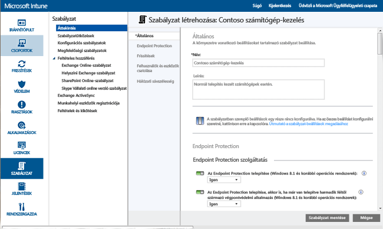
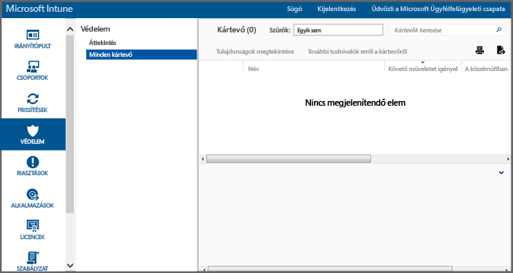

---
# required metadata

title: Az Endpoint Protection szolgáltatás használata Windows rendszerű számítógépeken
description:
keywords:
author: NathBarn
manager: jeffgilb
ms.date: 04/28/2016
ms.topic: article
ms.prod:
ms.service: microsoft-intune
ms.technology:
ms.assetid: 002241bf-6cd0-4c75-a4f0-891ac7e6721a

# optional metadata

#ROBOTS:
#audience:
#ms.devlang:
ms.reviewer: jeffgilb
ms.suite: ems
#ms.tgt_pltfrm:
#ms.custom:

---

# Windows rendszerű számítógépek biztonságossá tétele a Microsoft Intune-hoz készült Endpoint Protection szolgáltatással
A Microsoft Intune-nal számos módon biztonságossá teheti a kezelt számítógépeket, beleértve az Endpoint Protectiont, amely valós idejű védelmet biztosít a veszélyes kártevők ellen, naprakészen tartja a kártevő-definíciókat, valamint automatikus vizsgálatokat végez a számítógépeken. Az Endpoint Protection olyan eszközöket is biztosít, amelyek segítenek kezelni és megfigyelni a kártékony programok támadásait.

Ha még nem telepítette az Intune-ügyfelet a számítógépeken, [A Windows rendszerű számítógépügyfél telepítése a Microsoft Intune-nal](install-the-windows-pc-client-with-microsoft-intune.md) című témakörben olvashat erről.

Az alábbi szakaszokban található információk segítségével konfigurálhatja, telepítheti és figyelheti az Endpoint Protection szolgáltatást.

## Mikor ajánlott az Endpoint Protection használata?
Rendszergazdaként egyik legfontosabb feladata a kezelt számítógépek vírusoktól és kártevő szoftverektől mentesen tartása. Mielőtt telepíti az Intune-t a szervezet Windows rendszerű számítógépeire, az alábbi lehetőségek egyikének kiválasztásával és az ahhoz tartozó házirend-beállítások konfigurálásával meg kell határoznia, hogyan védi meg a számítógépeket:

|Cél:|Endpoint Protection házirend-beállításai|További információ|
|--------------|---------------------------------------|--------------------|
|A Microsoft Intune Endpoint Protection használata csak akkor, ha nincs telepítve külső gyártó végpontvédelmi alkalmazása.  A Microsoft Intune Endpoint Protectiont az összes olyan számítógépen használhatja, amelyen nincs telepítve külső gyártó végpontvédelmi alkalmazása.|Endpoint Protection telepítése = **Igen**  Endpoint Protection engedélyezése = **Igen**  Az Endpoint Protection telepítése akkor is, ha egy külső gyártó végpontvédelmi alkalmazása telepítve van = **Nem**|Ha a rendszer egy külső gyártótól származó végpontvédelmi alkalmazást észlel, nem telepíti a Microsoft Intune Endpoint Protectiont, vagy eltávolítja, ha már telepítve van.|
|A Microsoft Intune Endpoint Protection használata akkor is, ha telepítve van külső gyártó végpontvédelmi alkalmazása.  Ha ezt a módszert használja, a Microsoft Intune Endpoint Protection és a külső gyártótól származó végpontvédelmi alkalmazás egyidejűleg fog futni. A lehetséges teljesítményproblémák miatt ez a konfiguráció nem ajánlott.|Endpoint Protection telepítése = **Igen**  Endpoint Protection engedélyezése = **Igen**  Az Endpoint Protection telepítése akkor is, ha egy külső gyártó végpontvédelmi alkalmazása telepítve van = **Igen**|A következő esetekben használja:  – Át szeretne térni a Microsoft Intune Endpoint Protection használatára. – Új ügyfelet telepít, amely a Microsoft Intune Endpoint Protectiont fogja használni. – Olyan ügyfelet frissít, amely a Microsoft Intune Endpoint Protectiont fogja használni.|
|Az Intune használata a Microsoft Intune Endpoint Protection nélkül Ehelyett egy külső gyártó végpontvédelmi alkalmazását fogja alkalmazni.|Endpoint Protection telepítése = **Nem**|Ha nem használ egy külső gyártótól származó végpontvédelmi alkalmazást, ez a konfiguráció nem ajánlott, mivel kártevő szoftvereknek vagy más támadásoknak teheti ki a szervezet számítógépeit.  A Microsoft Intune Endpoint Protection nincs telepítve, és a rendszer eltávolítja, ha korábban már telepítve lett.|
Az aktuálisan használt végpontvédelmi alkalmazásról a Microsoft Intune Endpoint Protection szolgáltatásra való áttéréshez tegye a következőket:

1.  Az Intune-ügyfélszoftvernek az ügyfélszámítógépekre való telepítése közben ne állítsa le az aktuálisan használt végpontvédelmi alkalmazást.

2.  Győződjön meg arról, hogy a Microsoft Intune Endpoint Protection telepítve lett, és már védi az ügyfélszámítógépeket.

3.  Távolítsa el a külső gyártó végpontvédelmi szoftverét a következőképpen:

    -   Az Intune szoftverterjesztés használatával telepítse a külső végpontvédelmi alkalmazás gyártója által biztosított szoftvereltávolító eszközt. További információk: [Alkalmazások központi telepítése a Microsoft Intune-nal](deploy-apps.md).

    -   A külső gyártótól származó végpontvédelmi alkalmazás manuális eltávolításával.

> [!NOTE] Az Intune nem végzi el automatikusan a külső gyártótól származó végpontvédelmi alkalmazások eltávolítását.

## A Microsoft Intune Endpoint Protection konfigurálása
A Microsoft Intune Endpoint Protection konfigurálásához hajtsa végre a következő lépéseket.

1.  A [Microsoft Intune felügyeleti konzolban](https://manage.microsoft.com/) kattintson a **Házirend ** > **Házirend hozzáadása** elemre.

2.  Bontsa ki a **Számítógép-kezelés** elemet, és válassza ki **A Microsoft Intune-ügynök beállításai** elemet. Válassza az **Egyéni házirend létrehozása és központi telepítése** lehetőséget az Endpoint Protection-beállítások házirendjének megadásához, majd kattintson a **Házirend létrehozása** gombra. Használhatja az ajánlott beállításokat, vagy testre is szabhatja a beállításokat. Ha a házirendek létrehozásával és alkalmazásával kapcsolatban további tudnivalókra van szüksége, [A Windows rendszerű számítógépek a Microsoft Intune számítógépügyféllel való felügyeletének általános feladatai](common-windows-pc-management-tasks-with-the-microsoft-intune-computer-client.md) című témakörben olvashat erről bővebben.

  

Az alkalmazott Endpoint Protection-házirendet a **Házirend** munkaterület **Minden házirend** lapján tekintheti meg.

## Az Endpoint Protection szolgáltatás beállításai

|Házirend-beállítás|Részletek|
|------------------|--------------------|
|**Endpoint Protection telepítése**|Állítsa az **Igen** értékre, ha telepíteni szeretné az Endpoint Protectiont a kezelt számítógépekre. Ha a telepítés során a rendszer egy külső gyártótól származó végpontvédelmi alkalmazást észlel, nem telepíti az Endpoint Protection alkalmazást, kivéve, ha **Az Endpoint Protection telepítése, akkor is, ha már van telepítve harmadik féltől származó végpontvédelmi alkalmazás** beállításnál az **Igen** értéket adták meg. **Megjegyzés:** A rendszer alapértelmezés szerint telepíti az Intune Endpoint Protection szolgáltatást a felügyelt számítógépekre. Ha nem szeretné, hogy a kezelt számítógépeken telepítve legyen az Endpoint Protection szolgáltatás, explicit módon a **Nem** értékre kell állítania ezt a házirend-beállítást. Ha az Endpoint Protection korábban telepítve lett, és a házirendet a **Nem** értékre módosítja, akkor a rendszer eltávolítja az Endpoint Protection szolgáltatást. Javasolt érték: **Igen**|
|**Az Endpoint Protection telepítése akkor is, ha egy külső gyártó végpontvédelmi alkalmazása telepítve van**|Válassza az **Igen** értéket, ha a Microsoft Intune Endpoint Protection szolgáltatást akkor is telepíteni szeretné, ha a rendszer külső gyártó végpontvédelmi alkalmazását észleli.  Javasolt érték: **Igen**|
|**Endpoint Protection engedélyezése**|Állítsa **Igen** értékűre a Microsoft Intune Endpoint Protection engedélyezéséhez az Endpoint Protection-ügyféllel rendelkező számítógépeken.  Ha a **Nem** értékre van állítva, és a Microsoft Intune Endpoint Protection telepítve van, az Endpoint Protection-ügyfél felhasználói felülete nem jelenik meg a felhasználók számára, és minden védelmi szolgáltatás inaktív.  Javasolt érték: **Igen**|
|**Ügyfél felhasználói felületének letiltása**|Állítsa az **Igen** értékre a Microsoft Intune Endpoint Protection-ügyfél felhasználói felületének a felhasználók elől való elrejtéséhez (az érvénybe lépéséhez az ügyfélszámítógép újraindítása szükséges).  Javasolt érték: **Nem**|
|**Az Endpoint Protection telepítése akkor is, ha egy külső gyártó végpontvédelmi alkalmazása telepítve van**|Válassza az **Igen** értéket, ha kényszeríteni szeretné a Microsoft Intune Endpoint Protection szolgáltatás telepítését akkor is, ha a rendszer külső gyártó végpontvédelmi alkalmazását észleli.  Javasolt érték: **Nem**|
|**Rendszer-visszaállítási pont létrehozása a kártevők eltávolítása előtt**|Állítsa az **Igen** értékre, ha bármely kártevő szoftver eltávolításának megkezdése előtt létre szeretne hozni egy Windows rendszer-visszaállítási pontot.  Javasolt érték: **Igen**|
|**Ártalmatlanított kártevők nyomon követése (nap)**|A beállítás lehetővé teszi, hogy az Endpoint Protection meghatározott ideig nyomon kövesse az ártalmatlanított kártevő szoftvereket, és így manuálisan lehessen ellenőrizni a korábban fertőzött számítógépeket.  0 érték 30 nap közötti értéket adhat meg.  Javasolt érték: **7 nap**|
Ha az **Endpoint Protection telepítése** és az **Endpoint Protection engedélyezése** házirendértékeket az **Igen**értékre állította, és **Az Endpoint Protection telepítése akkor is, ha egy külső gyártó végpontvédelmi alkalmazása telepítve van** házirendértékeket a **Nem** értékre állította, a Microsoft Intune Endpoint Protection észlelni fogja, hogy telepítve van egy másik végpontvédelmi alkalmazás, és a rendszer nem telepíti, vagy eltávolítja, ha már telepítve van (ugyanakkor a Microsoft Intune Endpoint Protection jelentést ad a másik végpontvédelmi alkalmazás állapotáról az Intune-ban).

  A valós idejű védelem lehetővé teszi, hogy a Microsoft Security Essentials riasztást küldjön, amikor potenciális fenyegetések, például vírusok és kémprogramok kísérlik meg telepíteni vagy futtatni magukat. Amikor ilyen esemény történik, megjelenik egy üzenet a tálca jobb szélén, az értesítési területen.

### Valós idejű védelem beállításai

|Házirend-beállítás|Részletek|
|------------------|--------------------|
|**Valós idejű védelem engedélyezése**|Engedélyezi az összes olyan fájl és alkalmazás figyelését és vizsgálatát, melyekhez hozzáférnek. Emellett minden rosszindulatú fájlt és alkalmazást is blokkol, mielőtt azok lefutnának a számítógépeken.  Javasolt érték: **Igen**|
|**Minden letöltött fájl vizsgálata**|Engedélyezi az összes az internetről a számítógépekre letöltött fájl és melléklet vizsgálatát.  Javasolt érték: **Igen**|
|**Fájl- és programtevékenység figyelése a számítógépen**|Engedélyezi a bejövő és a kimenő fájlok, valamint a programok tevékenységének figyelését a számítógépeken. Ezzel a beállítással az Endpoint Protection szolgáltatás figyeli az egyes fájlok és programok futásának elindulását, és értesítést küld az általuk vagy rajtuk elvégzett műveletekről.  Javasolt érték: **Igen**|
|**Figyelt fájlok**|Ha a **Fájl- és programtevékenység figyelése a számítógépen** beállítás engedélyezve van, ez a beállítás lehetővé teszi annak meghatározását, ha csak a bejövő, csak a kimenő, vagy minden fájl legyen-e figyelve.  Javasolt érték: **Minden fájl figyelése**|
|**Viselkedésfigyelés engedélyezése**|Engedélyezi, hogy a Microsoft Intune Endpoint Protection gyanús tevékenységekre utaló mintákat keressen az ügyfélszámítógépeken.  Javasolt érték: **Igen**|
|**Hálózatfelügyeleti rendszer engedélyezése**|A Hálózatfelügyeleti rendszer (NIS) engedélyezése az ügyfélszámítógépeken. A NIS a [Microsoft kártevőkezelési központban](http://go.microsoft.com/fwlink/?LinkId=234249) található ismert sebezhető pontok mintázatai alapján észleli és blokkolja a rosszindulatú hálózati forgalmat.  Javasolt érték: **Igen**|

  

### Vizsgálatütemezési beállítások

|Házirend-beállítás|További információ|
|------------------|--------------------|
|**Napi gyors vizsgálat ütemezése**|Egy, a számítógépeken lévő gyakran használt fájlokra, illetve fontos rendszerfájlokra vonatkozó napi gyors vizsgálat ütemezése. Ez a gyors vizsgálat minimális hatással van a teljesítményre.  Javasolt érték: **Igen**|
|**Gyors vizsgálat futtatása két egymást követő vizsgálat elmulasztása esetén**|Az Endpoint Protection szolgáltatás konfigurálása arra, hogy automatikusan futtasson egy gyors vizsgálatot azokon a számítógépeken, amelyeken elmaradt két egymást követő, ütemezett gyors vizsgálat.  Javasolt érték: **Igen**|
|**Teljes vizsgálat ütemezése**|A számítógépek helyi merevlemezein található összes fájlra és erőforrásra vonatkozó teljes vizsgálat beállítása. Ez a vizsgálat hosszabb ideig is eltarthat, és hatással lehet a számítógépek teljesítményére (a vizsgált fájlok és erőforrások számától függően).  Javasolt érték: **Nem**|
|**Teljes vizsgálat futtatása két egymást követő teljes vizsgálat elmulasztása esetén**|Az Endpoint Protection szolgáltatás konfigurálása arra, hogy automatikusan futtasson egy teljes vizsgálatot azokon a számítógépeken, amelyeken elmaradt két egymást követő, ütemezett teljes vizsgálat.  Javasolt érték: Nincs konfigurálva|

### Vizsgálati beállítások beállításai

|Házirend-beállítás|Részletek|
|------------------|--------------------|
|**Teljes vizsgálat futtatása az Endpoint Protection telepítése után**|Az Endpoint Protection szolgáltatás konfigurálása arra, hogy automatikusan futtasson egy teljes rendszervizsgálatot a számítógépekre való telepítése után. A felhasználók termelékenységére gyakorolt hatás minimalizálása érdekében ez a vizsgálat csak akkor fut, amikor a számítógépek üresjáratban vannak.  Javasolt érték: **Igen**|
|**Teljes vizsgálat automatikus futtatása, ha a kártevők eltávolításának nyomon követéséhez szükséges**|Ha az **Igen** értékre állítja, az Endpoint Protection automatikusan teljes rendszervizsgálatot fog futtatni a számítógépeken a kártevő szoftverek eltávolítása után annak megerősítésére, hogy más fájlok nem érintettek.  Javasolt érték: **Igen**|
|**Ütemezett vizsgálat indítása csak akkor, ha a számítógép üresjáratban van**|A beállítást **Igen** értékre állítva akadályozhatja meg, hogy az ütemezett vizsgálatok elinduljanak, amikor a számítógépek használatban vannak, így megelőzve a felhasználói termelékenység csökkenését.  Javasolt érték: **Igen**|
|**A legújabb kártevő-definíciók keresése vizsgálatok elindítása előtt**|Ha a beállítást az **Igen** értékre állítja, az Endpoint Protection automatikusan megkeresi a legújabb kártevő-definíciókat a számítógépek vizsgálatának megkezdése előtt.  Javasolt érték: **Igen**|
|**Archív fájlok vizsgálata**|Az **Igen** értékre állítva konfigurálhatja az Endpoint Protection szolgáltatást arra, hogy archív fájlokban (például .zip- vagy .cab-fájlokban) is keressen kártevő szoftvereket a számítógépeken.  Javasolt érték: **Nem**|
|**E-mail üzenetek vizsgálata**|Az **Igen** értékre állítva konfigurálhatja az Endpoint Protection szolgáltatást a bejövő e-mailek vizsgálatára a számítógépekre való érkezésükkor.  Javasolt érték: **Igen**|
|**Hálózati megosztott mappákból megnyitott fájlok vizsgálata**|Az **Igen** értékre állítva konfigurálhatja az Endpoint Protection szolgáltatást a hálózaton található megosztott mappákból megnyitott fájlok vizsgálatára. Ezek általában olyan fájlok, melyek UNC elérési úttal érhetők el. A funkció engedélyezése a csak olvasási hozzáféréssel rendelkező felhasználók számára problémákat okozhat, mert ők nem tudják eltávolítani a kártevő szoftvereket.  Javasolt érték: **Nem**|
|**Csatlakoztatott hálózati meghajtók vizsgálata**|Az **Igen** értékre állítva konfigurálhatja az Endpoint Protection szolgáltatást a csatlakoztatott hálózati meghajtókon lévő fájlok vizsgálatára. A funkció engedélyezése a csak olvasási hozzáféréssel rendelkező felhasználók számára problémákat okozhat, mert ők nem tudják eltávolítani a kártevő szoftvereket.  Javasolt érték: **Nem**|
|**Cserélhető adathordozók vizsgálata**|Az **Igen** értékre állítva konfigurálhatja az Endpoint Protection szolgáltatást a kártevő szoftverek és nemkívánatos szoftverek keresésére a cserélhető adathordozókon, például az USB flash meghajtókon a számítógépek teljes vizsgálatának futtatásakor.  Javasolt érték: **Igen**|
|**CPU-használatát korlátozása a vizsgálatok alatt**|A beállítással a számítógépek ütemezett vizsgálatai során igénybe vehető maximális CPU-használatot lehet konfigurálni százalékban. Ez az érték 1 és 100 százalék között állítható be.  Javasolt érték: **50%**|

### Alapértelmezett műveletek beállításai

Az **Adja meg, hogy az Endpoint Protection hogyan kezelje az alábbi riasztási szintekhez tartozó kártevő szoftvereket** beállítás határozza meg az alapértelmezett műveletet, amelyet az Endpoint Protection végrehajt a különböző riasztási szintű kártevő szoftverek észlelése esetén. Minden riasztási szinten eltávolíthatja a kártevő szoftvereket, karanténba zárhatja azokat, vagy végrehajthatja a Microsoft által javasolt műveletet. Javasolt érték: **Javasolt művelet**, amely lehetővé teszi, hogy az Endpoint Protection határozza meg a műveletet.   

### A kizárt fájlok és mappák beállításai

**A valós idejű védelem által és a teljes ellenőrzések végrehajtásakor figyelmen kívül hagyott fájlok és mappák** beállítással kizárhat meghatározott fájlokat és mappákat, amikor vizsgálatot futtat vagy valós idejű védelmet használ a számítógépeken.

### A kizárt folyamatok beállításai

**A valós idejű védelem által és a teljes ellenőrzések végrehajtásakor figyelmen kívül hagyott folyamatok** beállítással kizárhat meghatározott folyamatokat, amikor vizsgálatot futtat vagy valós idejű védelmet használ. Csak a következő kiterjesztésű fájlokat lehet kizárni: **.exe**, **.com** vagy **.scr**.

### A kizárt fájltípusok beállításai

**A valós idejű védelem által és a teljes ellenőrzések végrehajtásakor figyelmen kívül hagyott fájltípusok** beállítással kizárhat meghatározott fájlnév-kiterjesztéseket, amikor vizsgálatot futtat vagy valós idejű védelmet használ a számítógépeken.

### A Microsoft Active Protection Service beállításai
A Microsoft Active Protection Service egy online közösség, amely segít eldönteni, hogyan reagáljon a lehetséges veszélyforrásokra. A Közösség emellett az új kártevőszoftver-fertőzések terjedésének megállítását is segíti. A **Kapcsolódás a Microsoft Active Protection Service szolgáltatáshoz** beállítást **Igen** értékűre állíthatja, majd megadhatja a **Tagsági szint** értékét:
  - **Alapszintű** – alapvető adatok küldése a Microsoftnak az észlelt kártevőkkel kapcsolatban. Ez magában foglalja a szoftver származási helyét, az alkalmazott, illetve az Endpoint Protection által automatikusan alkalmazott műveleteket, valamint azt, hogy sikeresek voltak-e a műveletek.
  - **Speciális** – több adat küldése a Microsoftnak a kártevőkkel, kémprogramokkal és vélhetően nemkívánatos szoftverekkel kapcsolatban. Ez magába foglalja a szoftverek helyét, a fájlneveket, valamint hogy a szoftverek hogyan működnek és milyen hatással vannak a számítógépre.

Ezenkívül bekapcsolhatja a **Microsoft Active Protection Service-jelentéseken alapuló dinamikus definíciók fogadása** beállítást is.

## Az Endpoint Protection szolgáltatás kezelési feladatai
A következő műveletekkel különböző kezelési feladatokat hajthat végre az Endpoint Protection szolgáltatást futtató kezelt számítógépeken.
 - Kártevő-definíciók frissítése
  - Intune konzol – A **Csoportok** munkaterületen jelölje ki a frissíteni kívánt számítógépeket. Kattintson a **Távoli feladatok** &gt; **Kártevőszoftver-leírások frissítése** elemre.
  - Felügyelt számítógép – Indítsa el a végpontvédelmi ügyfélszoftvert a Windows értesítési területéről. Kattintson a **Frissítés** lapra, majd a **Frissítés**parancsra.
 - Kártevő-ellenőrzés futtatása
  - Intune konzol – A **Csoportok** munkaterületen jelölje ki az ellenőrizni kívánt számítógépeket. Kattintson a **Teljes kártevőellenőrzés futtatása** vagy a **Gyors kártevőellenőrzés futtatása**lehetőségre.
  - Felügyelt számítógép – Indítsa el a végpontvédelmi ügyfélszoftvert a Windows értesítési területéről. Válassza a **Gyors**, a **Teljes**, vagy az **Egyéni**lehetőséget, majd kattintson a **Vizsgálat**gombra.

Az Intune-konzol jobb alsó sarkában található **Távoli feladatok** hivatkozásra kattintva megtekintheti a távoli feladatok állapotát. A **Távoli feladatok állapota** párbeszédpanelen az aktuális távoli feladatok, a feladatok állapota, az eszközök nevei és az esetlegesen jelzett hibák láthatók, illetve ahol lehetséges, egy hibaelhárítási információkra mutató hivatkozás is megjelenik.

## Az Endpoint Protection figyelése
A **Microsoft Intune felügyeleti konzol** [Védelem](https://manage.microsoft.com/)munkaterületén figyelheti a számítógépeken lévő kártevő szoftverek állapotát. A munkaterület két lapból áll:
 - **Védelem áttekintése** – A fontos problémákat jeleníti meg hivatkozások formájában, amelyekre rákattintva további információkat érhet el. Többek között az alábbi problémák jelenhetnek meg:
  - **Követő műveletet igénylő kártevőszoftver-példányok** – a hivatkozásra kattintva megtekintheti a kártevőkkel kapcsolatos problémák listáját, beleértve a problémák elhárítása érdekében végrehajtandó utólagos műveleteket. A lista tovább részletezhető annak megtekintéséhez, hogy mely számítógépek érintettek.
  - **Számítógépek követő műveletet igénylő kártevő szoftverrel** – a hivatkozásra kattintva megtekintheti az összes feloldatlan kártevőproblémával rendelkező számítógépet, beleértve a problémák elhárításához szükséges utólagos műveleteket.
  - **Védtelen eszközök** – a hivatkozásra kattintva megtekintheti azokat a számítógépeket, amelyek semmilyen végpontvédelmi szoftverrel nincsenek védve, mert nincs rajtuk telepítve szoftver, vagy mert hiba történt. Egy számítógépet kijelölve megtekintheti annak további részleteit.
  - **Más végpontvédelmi alkalmazást futtató eszközök** – a hivatkozásra kattintva megtekintheti a külső gyártótól származó végpontvédelmi alkalmazást futtató számítógépeket.
 - **Minden kártevő** – A számítógépeken talált összes aktív kártevő listáját jeleníti meg. A lista tovább részletezhető az adott kártevő szoftver által érintett összes számítógép listájának megtekintéséhez, vagy választhat az alábbi műveletek közül:
  - **Tulajdonságok megtekintése** – a kijelölt kártevő további adatait tartalmazó oldal megnyitása.
  - **További tudnivalók erről a kártevő szoftverről** – a Microsoft kártevőkezelési központ a kártevővel kapcsolatos további információkat tartalmazó témakörének megnyitása.

> [!IMPORTANT]A **Védelem** munkaterület addig nem jelenik meg a felügyeleti konzolon, amíg nem telepíti az ügyfelet legalább egy számítógépen, és nem kezdi meg annak kezelését.

  

### A kártevők legutóbbi észlelési útvonalainak megtekintése számítógépen
Az Intune meg tudja jeleníteni az eszközökön észlelt 10 legutóbbi kártevőpéldány útvonalát. A **Legutóbbi észlelési útvonal** alapértelmezés szerint le van tiltva. A nézet engedélyezése:

1.  A [Microsoft Intune felügyeleti konzolon](https://manage.microsoft.com/) kattintson a **Csoportok** > **Minden eszköz** elemre. **Kártevő**.

2.  Kattintson a jobb gombbal egy oszlopfejlécre. Megjelenik az elérhető oszlopok listája.

3.  Jelölje be a lista **Legutóbbi észlelési útvonalak** jelölőnégyzetét. Megjelenik a **Legutóbbi észlelési útvonalak** oszlop és megjeleníti az eszközön megfigyelt legfeljebb 10 legutóbbi kártevőpéldányt.

## Kártevő-ellenőrzés futtatása, vagy a számítógép kártevőszoftver-leírásainak frissítése
Az Intune az Endpoint Protection vagy a Windows Defender használatával teljes vagy gyors kártevő-ellenőrzést is képes futtatni azokon a távoli felügyelt számítógépeken, amelyeken az Intune-ügyfél telepítve van.

1. A [Microsoft Intune felügyeleti konzolján](https://manage.microsoft.com/) lépjen a **Csoportok** > **Áttekintés** > **Minden eszköz** > **Minden számítógép** elemre, és jelölje ki a célozni kívánt számítógépet.

2. Kattintson a **Távoli feladatok** legördülő listára, és válassza ki a feladatot. A távoli számítógépen futtatandó feladat:

## További segítségre van szüksége?
További segítség és támogatás: [Az Endpoint Protection hibáinak elhárítása a Microsoft Intune-ban](/intune/troubleshoot/troubleshoot-endpoint-protection-in-microsoft-intune).

### Lásd még:
[Szabályzatok a Windows rendszerű számítógépek védelméhez](policies-to-protect-windows-pcs-in-microsoft-intune.md)

<!--HONumber=Jun16_HO1-->

