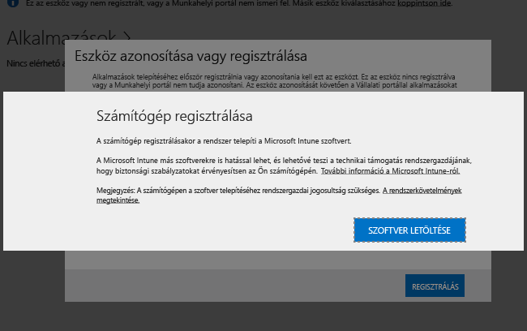

# Az Intune-szoftverügyfél telepítése Windows rendszerű számítógépekre
A Windows rendszerű számítógépek az Intune-ügyfélszoftver telepítésével regisztrálhatók. Az Intune-ügyfélszoftver a következő módokon telepíthető:

- Manuális telepítéssel
- Csoportházirendet használó telepítéssel
- Lemezkép részeként történő telepítéssel
- Felhasználók általi telepítéssel

## Az Intune-ügyfélszoftver letöltése

A maguk a felhasználók által végzett telepítés esetét kivéve valamennyi módszerhez le kell tölteni a szoftvert ahhoz, hogy központilag lehessen telepíteni.

1.  A [Microsoft Intune felügyeleti konzolon](https://manage.microsoft.com/) kattintson a **Felügyelet** &gt; **Ügyfélszoftver letöltése** lehetőségre.

  

2.  Az **Ügyfélszoftver letöltése** lapon kattintson az **Ügyfélszoftver letöltése** lehetőségre, majd mentse a szoftvert tartalmazó **Microsoft_Intune_Setup.zip** csomagot egy biztonságos helyre a hálózaton.

    > [!NOTE]
    > A Intune ügyfélszoftverének telepítőcsomagja tartalmazza a fiókja adatait. Ha jogosulatlan felhasználók férnek hozzá a telepítőcsomaghoz, a beágyazott tanúsítvány által jelölt fiókhoz regisztrálhatnak számítógépeket.

3.  Bontsa ki a telepítőcsomag tartalmát a biztonságos helyre a hálózaton.

    > [!IMPORTANT]
    > Ne nevezze át vagy távolítsa el a kibontott **ACCOUNTCERT** fájlt, különben az ügyfélszoftver telepítése sikertelen lesz.

## Központi telepítés manuálisan

1.  Az adott számítógépen keresse meg az ügyfélszoftver telepítési fájljait tartalmazó mappát, és futtassa a **Microsoft_Intune_Setup.exe** fájlt az ügyfélszoftver telepítéséhez.

    > [!NOTE]
    > A telepítés állapota akkor jelenik meg, ha az ügyfélszámítógép tálcáján megjelenő ikonra mutat.

## Telepítés csoportházirend használatával

1.  A **Microsoft_Intune_Setup.exe** és a **MicrosoftIntune.accountcert** fájlt tartalmazó mappában futtassa a következő parancsot a 32 bites és 64 bites számítógépekhez készült Windows Installer-alapú telepítőprogramok kibontásához:

    ```
    Microsoft_Intune_Setup.exe/Extract <destination folder>
    ```

2.  Másolja a **Microsoft_Intune_x86.msi** fájlt, a **Microsoft_Intune_x64.msi** fájlt és a **MicrosoftIntune.accountcert** fájlt egy olyan hálózati helyre, amely minden olyan számítógép számára elérhető, amelyre telepíteni kívánja az ügyfélszoftvert.

    > [!IMPORTANT]
    > A fájlokat ne válassza szét vagy nevezze át, különben az ügyfélszoftver telepítése sikertelen lesz.

3.  A Csoportházirenddel telepítse a szoftvert a hálózaton lévő számítógépekre.

    A Csoportházirend szoftverek automatikus telepítésére való használatával kapcsolatban a Windows Server dokumentációjában találhat további információkat.

## Lemezkép részeként való telepítés
Az Intune ügyfélszoftverét az alábbi példaeljárás alapján egy operációsrendszer-kép részeként is telepítheti a számítógépekre:

1.  Az ügyfél telepítési fájljait, a **Microsoft_Intune_Setup.exe** és a **MicrosoftIntune.accountcert** fájlt másolja a **%Systemdrive%\Temp\Microsoft_Intune_Setup** mappába a referencia-számítógépen.

2.  Hozzon létre egy **WindowsIntuneEnrollPending** nevű bejegyzést a beállításjegyzékben a következő parancs hozzáadásával a **SetupComplete.cmd** parancsfájlhoz:

    ```
    %windir%\system32\reg.exe add HKEY_LOCAL_MACHINE\Software\Microsoft\Onlinemanagement\Deployment /v
    WindowsIntuneEnrollPending /t REG_DWORD /d 1
    ```

3.  A következő parancs a **setupcomplete.cmd** parancsfájlhoz való hozzáadásával futtassa a regisztrációs csomagot a /PrepareEnroll parancssori argumentummal:

    ```
    %systemdrive%\temp\Microsoft_Intune_Setup\Microsoft_Intune_Setup.exe /PrepareEnroll
    ```
    > [!TIP]
    > A **SetupComplete.cmd** parancsfájl lehetővé teszi, hogy a Windows telepítő módosításokat végezzen a rendszeren egy felhasználó bejelentkezése előtt. A **/PrepareEnroll** parancssori argumentum előkészíti a célzott számítógépet a Windows telepítő befejeződése után az Intune-ban való automatikus regisztráláshoz.

4.  Helyezze a **SetupComplete.cmd** fájlt a **%Windir%\Setup\Scripts** mappába a referencia-számítógépen.

5.  Rögzítsen egy rendszerképet a referencia-számítógépről, majd telepítse azt a célként megadott számítógépekre.

Amikor a célszámítógép a Windows telepítő befejezése után újraindul, létrejön a **WindowsIntuneEnrollPending** beállításkulcs. A regisztrálási csomag ellenőrzi, hogy regisztrálva van-e a számítógép. Ha a számítógép regisztrálva van, nem szükséges további művelet. Ha a számítógép nincs regisztrálva, a regisztrálási csomag létrehoz egy automatikus Microsoft Intune-regisztrálási feladatot.

Amikor a következő ütemezett időpontban lefut az automatikus regisztrálási feladat, ellenőrzi, hogy létezik-e a **MicrosoftIntuneEnrollPending** beállításkulcs, és megkísérli regisztrálni a célszámítógépet az Intune szolgáltatásban. Ha a regisztráció bármilyen okból nem sikerül, a rendszer ismét megkísérli a regisztrációt a feladat következő futtatásakor. A próbálkozások egy hónapon keresztül ismétlődnek.

Ha a regisztráció sikeres, vagy ha letelik az egy hónap, törlődik a célszámítógépről az automatikus Intune-regisztrálási feladat, a **WindowsIntuneEnrollPending** beállításkulcs és a fióktanúsítvány.

## A felhasználó felkérése önálló regisztrálásra

A felhasználók az Intune ügyfélszoftvert úgy tudják telepíteni, hogy megnyitják a [http://portal.manage.microsoft.com](http://portal..manage.microsoft.com) oldalt. Ha a portál észleli, hogy az eszköz egy Windows rendszerű számítógép, a rendszer megkéri a felhasználót, hogy regisztrálja a számítógépet az Intune-szoftverügyfél letöltésével. A letöltést követően a felhasználók a szoftver telepítésével vonhatják be a felügyelet alá a számítógépet.



## A sikeres ügyféltelepítés figyelése és ellenőrzése
A következő eljárások egyikével figyelheti és ellenőrizheti az ügyfél sikeres telepítését.

### A kliensszoftver telepítésének ellenőrzése a Microsoft Intune felügyeleti konzolon

1.  A [Microsoft Intune felügyeleti konzolon](https://manage.microsoft.com/) kattintson a **Csoportok** &gt; **Minden eszköz** &gt; **Minden számítógép** lehetőségre.

2.  A számítógépek listáját görgetve keresheti meg az Intune szolgáltatással kommunikáló kezelt számítógépeket, vagy a **Keresés az eszközök között** mezőben megadva a számítógép nevét (vagy annak bármely részét) kereshet meg egy adott kezelt számítógépet.

3.  Vizsgálja meg a számítógép állapotát a konzol alsó ablaktábláján, és hárítsa el a hibákat, ha vannak.

### Az összes regisztrált számítógépet megjelenítő számítógépkészlet-jelentés létrehozása

1.  A [Microsoft Intune felügyeleti konzolon](https://manage.microsoft.com/) kattintson a **Jelentések** &gt; **Számítógépleltár-jelentések** elemre.

2.  Az **Új jelentés létrehozása** lapon az összes mezőben hagyja meg az alapértelmezett értéket (kivéve ha szűrőket kíván alkalmazni), majd kattintson a **Jelentés megtekintése**lehetőségre.

3.  Ekkor egy új ablakban megjelenik a **Számítógépleltár-jelentés** lap, melyen az összes, az Intune szolgáltatásban sikeresen regisztrált számítógép látható.

    > [!TIP]
    > A jelentés bármely oszlopának fejlécére kattintva a lista az adott oszlop tartalma szerint rendezhető.


### Lásd még:
[Windows rendszerű számítógépek felügyelete a Microsoft Intune-nal](manage-windows-pcs-with-microsoft-intune.md)
[Az ügyfél beállításának hibaelhárítása](../troubleshoot/troubleshoot-client-setup-in-microsoft-intune.md)


<!--HONumber=Sep16_HO4-->


