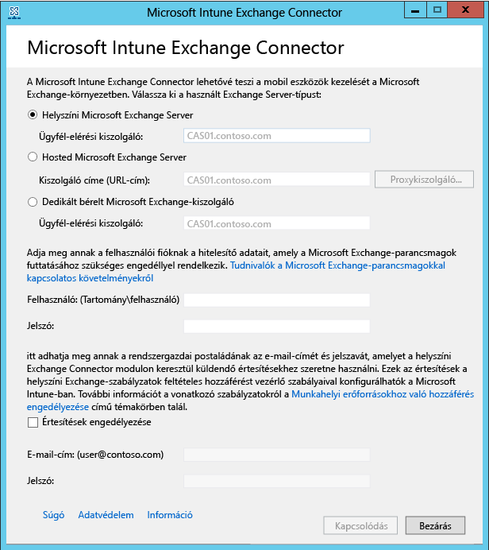

# A helyszíni Intune Exchange Connector telepítése

Ha olyan kapcsolatot kíván beállítani, amely lehetővé teszi, hogy a Microsoft Intune kommunikáljon a mobileszközök postaládáit működtető Exchange-kiszolgálóval, az Intune felügyeleti konzolról le kell töltenie, majd konfigurálnia kell az On-Premises Connector helyszíni összekötő eszközt. Típustól függetlenül az Intune előfizetésenként csak egy Exchange-összekötő kapcsolatot támogat.

## Az intézményi összekötőre vonatkozó követelmények
A következő táblázatban találja a helyszíni Exchange Connector telepítéséhez használt számítógépre vonatkozó követelményeket.

|Követelmény|További információ|
|---------------|--------------------|
|Operációs rendszerek|Az Intune a helyszíni Exchange Connectort olyan számítógépen támogatja, amelyen a Windows Server 2008 SP2 64 bites, Windows Server 2008 R2, Windows Server 2012 vagy Windows Server 2012 R2 rendszer valamelyik kiadása fut.  Az összekötő nem támogatott a Server Core telepítéseken.|
|Microsoft Exchange verzió|A helyszíni összekötőhöz a Microsoft Exchange 2010 SP1 vagy újabb verziójára, vagy örökölt dedikált Exchange Online-ra van szükség. Annak megállapításához, hogy a dedikált Exchange Online-környezet **új** vagy **örökölt** konfigurációval rendelkezik, lépjen kapcsolatba a fiókkezelővel.|
|Mobileszköz-kezelő szolgáltató| [Mobileszköz-kezelő szolgáltatóként a Microsoft Intune-t állítsa be](prerequisites-for-enrollment.md#set-mobile-device-management-authority).|
|Hardver|A számítógépen, ahol az összekötőt telepíti, 1,6 GHz-es CPU szükséges, valamint 2 GB RAM és legalább 10 GB szabad lemezterület.|
|Active Directory-szinkronizálás|Mielőtt az Intune-t bármely összekötővel csatlakoztatná az Exchange-kiszolgálóhoz, [állítsa be az Active Directory-szinkronizálást](/intune/get-started/start-with-a-paid-subscription-to-microsoft-intune-step-3), hogy a helyi felhasználók és biztonsági csoportok szinkronizálva legyenek az Azure Active Directory-példányával.|
|További szoftverek|A Microsoft .NET-keretrendszer 4-es és a Windows PowerShell 2.0-s verziójának teljes mértékben telepítve kell lennie az összekötőt futtató számítógépen.|
|Hálózat|Az összekötő telepítéséhez használt számítógépnek olyan tartományhoz kell tartoznia, amely megbízhatósági kapcsolatban áll az Exchange Servert üzemeltető tartománnyal.  A számítógépet úgy kell beállítani, hogy a 80-as és a 443-as porton, a tűzfalakon és a proxykiszolgálókon keresztül hozzáférjen az Intune szolgáltatáshoz. Az Intune által használt tartományok a következők: manage.microsoft.com, &#42;manage.microsoft.com és &#42;.manage.microsoft.com.|
|Legyen konfigurálva és fusson a szolgáltatott Exchange|További információk: [Exchange Server 2016](https://technet.microsoft.com/library/mt170645.aspx). |

### Exchange-parancsmagokkal kapcsolatos követelmények

Létre kell hoznia egy Active Directory-felhasználói fiókot, amelyet az Intune Exchange Connector fog használni. A fióknak engedéllyel kell rendelkeznie az alábbi szükséges Windows PowerShell Exchange-parancsmagok futtatásához:

 -   Get-ActiveSyncOrganizationSettings, Set-ActiveSyncOrganizationSettings
 -   Get-CasMailbox, Set-CasMailbox
 -   Get-ActiveSyncMailboxPolicy, Set-ActiveSyncMailboxPolicy, New-ActiveSyncMailboxPolicy, Remove-ActiveSyncMailboxPolicy
 -   Get-ActiveSyncDeviceAccessRule, Set-ActiveSyncDeviceAccessRule, New-ActiveSyncDeviceAccessRule, Remove-ActiveSyncDeviceAccessRule
 -   Get-ActiveSyncDeviceStatistics
 -   Get-ActiveSyncDevice
 -   Get-ExchangeServer
 -   Get-ActiveSyncDeviceClass
 -   Get-Recipient
 -   Clear-ActiveSyncDevice, Remove-ActiveSyncDevice
 -   Set-ADServerSettings
 -   Get-Command

## Töltse le a helyszíni Exchange Connector szoftver telepítőcsomagját

1. Egy a helyszíni Exchange Connector használatához egy támogatott Windows Server operációs rendszerben nyissa meg a [ Microsoft Intune felügyeleti konzolt](http://manage.microsoft.com) (http://manage.microsoft.com) egy olyan felhasználói fiókkal, amely az Exchange Server használatához licenccel rendelkező rendszergazda az Exchange-bérlőben.

2.  A munkaterület parancsikon-ablaktábláján válassza a **Felügyelet** lehetőséget, válassza a **Mobileszköz-kezelés** > **Microsoft Exchange**, majd az **Exchange-kapcsolat beállítása** pontot.

3.  Az **Exchange-kapcsolat** beállítása lapon kattintson a **On-Premises Connector letöltése** parancsra.

4.  A helyszíni Exchange Connectort egy tömörített (.zip) mappa tartalmazza. Ezt megnyithatja vagy mentheti. A **Fájl letöltése** párbeszédpanelen kattintson a **Mentés** parancsra a tömörített mappa biztonságos helyre való mentéséhez.

> [!IMPORTANT]
> Ne nevezze át és ne helyezze át a helyszíni Exchange Connector mappájában levő fájlokat. A mappa tartalmának áthelyezése vagy átnevezése megszakítja a telepítést.

## A helyszíni Intune Exchange Connector telepítése és konfigurálása
A helyszíni Intune Exchange Connector telepítéséhez hajtsa végre az alábbi lépéseket. A helyszíni Exchange Connector Intune-előfizetésenként csak egyszer és csak egy számítógépre telepíthető. Ha a helyszíni Exchange Connector szoftverből további példányt próbál meg konfigurálni, akkor az új kapcsolat felváltja az eredeti kapcsolatot.

1.  Egy a helyszíni Exchange Connector használatához támogatott operációs rendszerben bontsa ki az **Exchange_Connector_Setup.zip** fájl tartalmát egy biztonságos helyre.

2.  A fájlok kibontása után nyissa meg a kibontott mappát, majd kattintson duplán az **Exchange_Connector_Setup.exe** fájlra a helyszíni Exchange Connector telepítéséhez.

    > [!IMPORTANT]
    > Ha a célmappa nem biztonságos hely, akkor az On-Premises Connector telepítése után törölje a **WindowsIntune.accountcert** tanúsítványfájlt.

3.  Az **Exchange Server** mezőben válassza ki az Exchange Server-környezet típusát a **Helyszíni Exchange Server** vagy az **Üzemeltetett Exchange Server** lehetőség kijelölésével.

  

  Helyszíni Exchange-kiszolgáló esetén adja meg az **Ügyfél-hozzáférési kiszolgáló** szerepkört futtató Exchange-kiszolgáló nevét vagy teljes tartománynevét.

  Üzemeltetett Exchange-kiszolgáló esetén adja meg az Exchange-kiszolgáló címét. Az üzemeltetett Exchange-kiszolgáló URL-címének megkeresése:

      1.  Nyissa meg az Office 365 Outlook Web Appjét.

      2.  Kattintson a „?” ikonra a bal felső sarokban, majd válassza a **Névjegy**elemet.

      3.  Keresse meg a **POP külső kiszolgáló** értéket.

      4.  Kattintson a **Proxykiszolgáló** elemre az üzemeltetett Exchange proxykiszolgáló-beállításainak megadásához.
        1.  Válassza a **Proxykiszolgáló használata mobileszköz-információk szinkronizálásakor**lehetőséget.

        2.  Adja meg a **proxykiszolgáló nevét** és **portszámát** a kiszolgálóhoz való hozzáféréshez.

        3.  Ha a proxykiszolgálóhoz való csatlakozáshoz meg kell adni hitelesítő adatokat, válassza a Hitelesítő adatok használata a proxykiszolgálóhoz való csatlakozáshoz lehetőséget, majd adja meg a **tartományt\felhasználót** és a **jelszót**.

        4.  Válassza az **OK** gombot.

5.  Adja meg az Exchange-kiszolgálóhoz való csatlakozáskor szükséges hitelesítő adatokat, **Felhasználó (Tartomány\felhasználó)** és **Jelszó** adatokat.

6.  Adja meg a rendszergazdai hitelesítő adatokat, amelyek az értesítések egy felhasználó Exchange-postaládájába való küldéséhez szükségesek. Ezek az értesítések a feltételes hozzáférési házirendekkel állíthatók be az Intune-ban.

    Győződjön meg arról, hogy az Automatikus észlelés szolgáltatás és az Exchange-webszolgáltatások konfigurálva vannak az Exchange ügyfélelérési kiszolgálón. Az ezzel kapcsolatos további információkért lásd: [Ügyfél-hozzáférési kiszolgáló](https://technet.microsoft.com/library/dd298114.aspx).

7.  A **Jelszó** mezőben adja meg a fiók jelszavát, hogy az Intune hozzáférhessen az Exchange-kiszolgálóhoz.

8. Válassza a **Csatlakozás** elemet.

    A kapcsolat beállítása eltarthat pár percig.

A konfiguráció alatt az Exchange Connector tárolja a proxybeállításait, hogy lehetővé tegye a kapcsolódást az internethez. Ha a proxybeállításai megváltoznak, az Exchange Connector ismételt konfigurálásával frissítenie kell az Exchange Connector proxybeállításait.

Miután az Exchange Connector létrehozta a kapcsolatot, az Exchange Connectorban felügyelt felhasználókhoz társított mobileszközöket a rendszer automatikusan szinkronizálja és hozzáadja az Exchange Connectorhoz. Ez a szinkronizálás eltarthat egy ideig.

> [!NOTE]
> Ha telepítette a helyszíni Exchange Connectort, és bármikor törli az Exchange-kapcsolatot, akkor el kell távolítania a helyszíni Exchange Connectort arról a számítógépről, amelyre telepítette.

## Az Exchange-kapcsolat ellenőrzése

Az Exchange Connector sikeres konfigurálása után megtekintheti a kapcsolat és a legutóbbi sikeres szinkronizálási kísérlet állapotát. A [Microsoft Intune felügyeleti konzolon](http://manage.microsoft.com) válassza a **FELÜGYELET** munkaterületet, majd a **Mobileszköz-kezelés** területen válassza a **Microsoft Exchange** elemet, és ellenőrizze, hogy a megadott adatok megjelennek-e **Az Exchange-kapcsolat információi** területen.

Ellenőrizheti a legutóbbi sikeres szinkronizálási kísérlet dátumát és időpontját is.

<!--HONumber=Sep16_HO4-->

