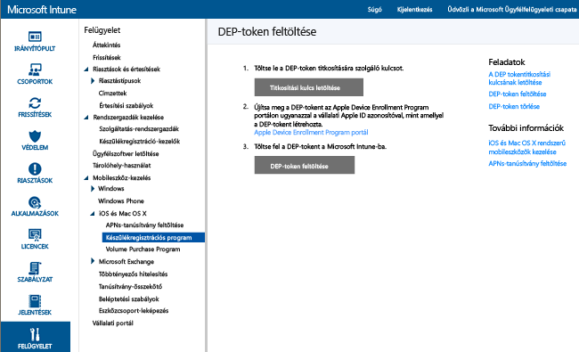

# A készülékregisztrációs programban részt vevő vállalati iOS-eszközök regisztrálása
A Microsoft Intune-nal egy olyan regisztrációs profil telepíthető, amely a készülékregisztrációs programon (DEP) keresztül megvásárolt iOS-készülékeket vezeték nélkül regisztrálja. A regisztrációs csomag telepítősegéd-beállításokat is tartalmazhat az eszközhöz. A DEP programon keresztül regisztrált eszközök regisztrációját a felhasználók nem törölhetik.

## Apple DEP-kezelés iOS-eszközökön a Microsoft Intune-nal
Ahhoz, hogy a vállalat által birtokolt eszközöket az Apple eszközregisztrációs programjával (DEP) lehessen kezelni, a szervezetnek csatlakoznia kell az Apple DEP-hez, és a programon keresztül kell beszereznie az eszközöket. A folyamat részletei a következő webhelyen érhetők el:  [https://deploy.apple.com](https://deploy.apple.com). A program előnyei közé tartozik a beavatkozás nélküli beállítás anélkül, hogy az eszközöket csatlakoztatnia kellene egy számítógép USB-portjához.

A vállalat által birtokolt iOS-eszközöket csak egy Apple-től származó DEP-token birtokában regisztrálhatja a DEP programba. Ez a token lehetővé teszi, hogy az Intune szinkronizálja a DEP-ben résztvevő, vállalat által birtokolt eszközöket. A token ezen felül lehetővé teszi, hogy az Intune Regisztrációs profilokat töltsön fel az Apple-nek, és a feltöltött profilokhoz eszközöket rendeljen hozzá.

1.  **iOS-eszközök kezelésének megkezdése a Microsoft Intune-nal** – Az iOS DEP-eszközök regisztrálásához először engedélyeznie kell az iOS-eszközök kezelését az Intune számára.

2.  **Titkosítási kulcs beszerzése** – Rendszergazda felhasználóként nyissa meg a [Microsoft Intune felügyeleti konzolját](http://manage.microsoft.com), és a **Felügyelet** &gt; **Mobileszköz-kezelés** &gt; **iOS** &gt; **Készülékregisztrációs program** területen kattintson a **Titkosítási kulcs letöltése** elemre. Mentse a titkosítási kulcs fájlját (.pem) helyileg. A .pem fájllal megbízhatósági kapcsolati tanúsítványt kérhet az Apple Device Enrollment Program portálról.

      

3.  **DEP-token beszerzése** – Nyissa meg a [Device Enrollment Program portált](https://deploy.apple.com) (https://deploy.apple.com), és jelentkezzen be a vállalati Apple ID azonosítóval. A későbbiekben ezt az Apple ID-t kell használnia a DEP-token megújításához.

    1.  A [Device Enrollment Program portálon](https://deploy.apple.com) válassza a **Device Enrollment Program** (Készülékregisztrációs program) &gt; **Manage Servers** (Kiszolgálók kezelése) elemet, és kattintson az **Add MDM Server** (MDM-kiszolgáló felvétele) elemre.

    2.  Az **MDM Server Name** mezőben adja meg az MDM-kiszolgáló nevét, majd kattintson a **Next**(Tovább) gombra. A kiszolgálónév az MDM-kiszolgáló azonosítására szolgál, tehát nem a Microsoft Intune-kiszolgáló URL-címe vagy neve.

    3.  Megnyílik az **Add &lt;Kiszolgálónév&gt;** (<Kiszolgálónév> hozzáadása) párbeszédpanel. Kattintson a **Choose File…** (Fájl kiválasztása…) elemre a .pem fájl feltöltéséhez, majd kattintson a **Next** (Tovább) gombra.

    4.  Az **Add &lt;Kiszolgálónév&gt;** (<Kiszolgálónév> hozzáadása) párbeszédpanelen megjelenik a **Your Server Token** (Az Ön kiszolgálói jogkivonata) hivatkozás. Töltse le a kiszolgálói jogkivonatfájlt (.p7m) a számítógépére, és kattintson a **Done**(Kész) elemre.

    A tanúsítványfájl (.p7m) segítségével megbízhatósági kapcsolatot hozhat létre az Intune és az Apple DEP-kiszolgálói között.

4.  **A DEP-token hozzáadása az Intune-hoz** – A [Microsoft Intune felügyeleti konzoljának](http://manage.microsoft.com) **Felügyelet** &gt; **Mobileszköz-kezelés** &gt; **iOS** &gt; **Készülékregisztrációs program** területén kattintson **A DEP-token feltöltése** elemre. **Keresse meg** a tanúsítványfájlt (.p7m), adja meg **Apple ID azonosítóját**, és kattintson a **Feltöltés**elemre.

5.  **A vállalati eszközregisztrációs szabályzat felvétele** – A [Microsoft Intune felügyeleti konzoljának](http://manage.microsoft.com) **Házirend** &gt; **Munkahelyi eszközök regisztrációja** területén kattintson a **Hozzáadás** elemre.

    A DEP támogatásához adja meg az **Általános** adatokat, például a **Nevet** és a **Leírást**, és adja meg, hogy a profilhoz rendelt eszközök felhasználóhoz vagy csoporthoz tartozzanak-e.
      - **Rákérdezés a felhasználói affinitásra** – Az eszközt össze kell kapcsolni egy felhasználóval a kezdeti beállítás során, majd az eszköz ezen a felhasználón keresztül hozzáférhet a vállalati adatokhoz és e-mailekhez.  **Felhasználói affinitást** a DEP programmal kezelt olyan eszközökhöz kell beállítani, amelyek a felhasználókhoz tartoznak. Az ilyen eszközöknek a Vállalati portált kell használniuk (például alkalmazások telepítéséhez).
      - **Nincs megadva a felhasználói affinitás** – Az eszköz egyetlen felhasználóhoz sincs társítva. Ezt a kapcsolatot olyan eszközök esetén alkalmazza, amelyek a helyi felhasználói adatok nélkül hajtanak végre feladatokat. A felhasználói kapcsolatot igénylő alkalmazások, az üzletági alkalmazások telepítéséhez használt Vállalati portál alkalmazást is beleértve, nem fognak működni.

    Ezen kívül **Eszközöket rendelhet hozzá a következő csoporthoz** is. A csoport kijelöléséhez kattintson a **Kijelölés...** elemre.

    >[!Important]
    >A csoport-hozzárendelések az Intune-ból az Azure Active Directory-ba lesznek áthelyezve. [További információ](#changes-to-intune-group-assignments)

    Következő lépésként engedélyezze **A szabályzat DEP-beállításainak konfigurálása** beállítást a DEP támogatásához.

      

     A DEP által felügyelt eszközök számára a következő beállítások érhetőek el:

     - **Részleg** – Akkor jelenik meg, amikor a felhasználó az aktiválás közben az „About Configuration” (Konfiguráció névjegye) elemre koppint.
     - **Ügyfélszolgálat telefonszáma** – Akkor jelenik meg, amikor a felhasználó az aktiválás közben a **Segítségre van szüksége?** gombra kattint.
     - **Előkészítés módja** – Ezt az állapotot az aktiválás közben állítja be a rendszer, és az eszköz gyári beállításainak visszaállítása nélkül nem lehet módosítani:
        - **Felügyeletlen** – Korlátozott felügyeleti funkciók
        - **Felügyelt** – Több felügyeleti funkciót engedélyez, és alapértelmezés szerint letiltja az Aktiválási zár funkciót
     - **A regisztrálási profil rögzítése a következő eszközhöz** – Ezt az állapotot aktiválás közben lehet beállítani, és a gyári beállítások visszaállítása nélkül nem módosítható.
        - **Letiltás** – Lehetővé teszi a felügyeleti profil eltávolítását a **Beállítások** menüből.
        - **Engedélyezés** – (Az **Előkészítés módja** = **Felügyelt** beállítás szükséges hozzá.) Letiltja az iOS azon beállításait, amelyek lehetővé tennék a felügyeleti profil eltávolítását.
     - **Beállítási asszisztens – Beállítások** – Ezeknek a beállításoknak a megadása nem kötelező, és az iOS **Beállítások** menüjében később is konfigurálhatók.
        - **PIN-kód** – PIN-kód kérése aktiváláskor. PIN-kód megadására mindig szükség van, kivéve, ha az eszköz biztonsága, illetve elérésének ellenőrzése valamilyen más módon lesz biztosítva (pl. teljes képernyős móddal, amely egyetlen alkalmazás futtatására korlátozza az eszközt).
        - **Helyalapú szolgáltatások** – Ha bekapcsolja ezt a funkciót, a Beállítási asszisztens az aktiválás során kérni fogja a szolgáltatást.
        - **Visszaállítás** – Ha bekapcsolja ezt a funkciót, a Beállítási asszisztens az aktiválás során iCloud-alapú biztonsági mentést fog kérni.
        - **Apple ID** – Az App Store-beli iOS-alkalmazások letöltéséhez Apple ID azonosító szükséges, az Intune által telepített alkalmazásokat is beleértve. Ha engedélyezte, az iOS kérni fogja a felhasználótól az Apple ID azonosítót, ha az azonosító megadása nélkül próbál alkalmazást telepíteni az Intune-ban.
        - **Feltételek és kikötések** – Ha engedélyezte, a Beállítási asszisztens az aktiválás során arra fogja kérni a felhasználót, hogy fogadja el az Apple használati feltételeit.
        - **Touch ID** – Ha bekapcsolja ezt a funkciót, a Beállítási asszisztens az aktiválás során kérni fogja ezt a szolgáltatást.
        - **Apple Pay** – Ha bekapcsolja ezt a funkciót, a Beállítási asszisztens az aktiválás során kérni fogja ezt a szolgáltatást.
        - **Nagyítás** – Ha bekapcsolja ezt a funkciót, a Beállítási asszisztens az aktiválás során kérni fogja ezt a szolgáltatást.
        - **Siri** – Ha bekapcsolja ezt a funkciót, a Beállítási asszisztens az aktiválás során kérni fogja ezt a szolgáltatást.
        - **Diagnosztikai adatok küldése az Apple-nek** – Ha bekapcsolja ezt a funkciót, a Beállítási asszisztens az aktiválás során kérni fogja ezt a szolgáltatást.
     -  **Az Apple Configurator további felügyeleti funkcióinak engedélyezése** – Állítsa a **Letiltás** beállításra, hogy megakadályozza a fájloknak az iTunesszal való szinkronizálását, illetve az Apple Configuratoron keresztüli felügyeletet. A Microsoft javasolja, hogy állítsa a beállítást a **Letiltás** értékre, a további konfigurációkat exportálja az Apple Configuratorból, majd az Intune-on keresztül telepítse ezeket egyéni iOS-konfigurációs profilként ahelyett, hogy ezzel a beállítással engedélyezné a tanúsítvánnyal vagy anélkül történő manuális telepítést.
        - **Letiltás** – Megakadályozza, hogy az eszköz USB-kapcsolaton keresztül kommunikáljon (párosítás letiltása).
        - **Engedélyezés** – Engedélyezi az eszköz és bármely PC vagy Mac számítógép közötti, USB-kapcsolaton keresztüli kommunikációt.
        - **Tanúsítvány megkövetelése** – Engedélyezi a regisztrációs profilba importált tanúsítvánnyal rendelkező Mac számítógépekkel való párosítást.

6.  **DEP-eszközök hozzárendelése kezelés céljából** – Nyissa meg a [Device Enrollment Program portált](https://deploy.apple.com) (https://deploy.apple.com), és jelentkezzen be a vállalati Apple ID-vel. Válassza a **Deployment Program** (Telepítési program) &gt; **Device Enrollment Program** (Készülékregisztrációs program) &gt; **Manage Devices** (Eszközök kezelése) lehetőséget. Adja meg, hogy miként fogja kiválasztani az eszközöket ( **Choose Devices**), adja meg az eszközinformációkat, és adja meg a részleteket az eszköz sorozatszáma ( **Serial Number**) vagy rendelésszáma ( **Order Number**) alapján, illetve CSV-fájl feltöltésével ( **Upload CSV File**). Ezután válassza az **Assign to Server** (Hozzárendelés kiszolgálóhoz) lehetőséget, válassza ki a Microsoft Intune-hoz megadott &lt;Kiszolgálónevet&gt;, majd kattintson az **OK** gombra.

7.  **DEP által felügyelt eszközök szinkronizálása** – Rendszergazda felhasználóként nyissa meg a [Microsoft Intune felügyeleti konzolját](http://manage.microsoft.com), és a **Felügyelet** &gt; **Mobileszköz-kezelés** &gt; **iOS** &gt; **Készülékregisztrációs program** területen kattintson a **Szinkronizálás** elemre. A szolgáltatás elküld egy szinkronizálási kérelmet az Apple-nek. Ha meg szeretné tekinteni a DEP által felügyelt eszközöket a szinkronizálás után, nyissa meg a [Microsoft Intune felügyeleti konzoljának](http://manage.microsoft.com) **Csoportok** &gt; **Minden céges eszköz** területét. A **Céges eszközök** munkaterületen, a felügyelt eszközök **Állapot** területén mindaddig a „Nincs kapcsolat” szöveg látható, amíg be nem kapcsolták az adott eszközt, és nem futtatták a Beállítási asszisztenst az eszköz regisztrálásához.

    Az Apple elfogadható DEP-forgalomra vonatkozó feltételeinek teljesítése érdekében az Intune a következő korlátozásokat írja elő:
     -  Teljes DEP-szinkronizálás legfeljebb 7 naponként futtatható. Teljes szinkronizálás során az Intune minden Apple által hozzárendelt Intune-sorozatszámot frissít, függetlenül attól, hogy azt már korábban szinkronizálták-e, vagy sem. Ha az előző teljes szinkronizálástól számított 7 napon belül egy újabb teljes szinkronizálást kísérel meg, az Intune csak a szolgáltatásban még nem szereplő sorozatszámokat frissíti.
     -  A szinkronizálási kérelmek elbírálása 10 percet vesz igénybe. Ez idő alatt, vagy amíg a kérelem ellenőrzése nem fejeződött be, a Szinkronizálás gomb inaktív.

8.  **Eszközök terjesztése a felhasználóknak** – Megkezdheti a vállalat által birtokolt eszközök terjesztését a felhasználóknak. Az iOS-eszközök bekapcsolásakor a rendszer regisztrálja az eszközöket az Intune-nal való felügyelet számára.

## Változások az Intune csoport-hozzárendelésekben

Szeptembertől az eszközcsoport-kezelés az Azure Active Directoryba kerül át. Az Azure Active Directory-csoportokba költözés után a csoport-hozzárendelés nem jelenik meg a **Vállalati regisztrációs profil** beállításai között. Mivel ezek a módosítások több hónapig tartanak, lehet, hogy a változások nem lesznek azonnal láthatók. További részletek a közeljövőben lesznek közzétéve.

### További információ
[Felkészülés az eszközök regisztrálására](get-ready-to-enroll-devices-in-microsoft-intune.md)

<!--HONumber=Jul16_HO1-->

