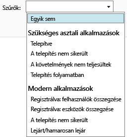

---
# required metadata

title: Az alkalmazások telepítésének figyelése| Microsoft Intune
description:
keywords:
author: robstackmsft
manager: jeffgilb
ms.date: 04/28/2016
ms.topic: article
ms.prod:
ms.service: microsoft-intune
ms.technology:
ms.assetid: 5daad56d-71c8-455b-8a55-f8b33e279a8a

# optional metadata

#ROBOTS:
#audience:
#ms.devlang:
ms.reviewer: jeffgilb
ms.suite: ems
#ms.tgt_pltfrm:
#ms.custom:

---

# Az alkalmazások telepítésének figyelése a Microsoft Intune-ban

## Alkalmazástelepítés figyelése
Az Intune felügyeleti konzolon láthatja a kezelt alkalmazásokat, illetve a telepítések állapotát.

### A kezelt alkalmazások és azok állapotának megtekintése
Az **Alkalmazások** munkaterületen kattintson az **Alkalmazások** csomópontra, majd az **Alkalmazások** elemre..

Megjelenik a kezelt alkalmazások listája. A kívánt alkalmazásra kattintva megtekintheti annak telepítési állapotát a konzol alsó ablaktáblájában. Kattintson az állapotadatokra, ha további részleteket kíván megjeleníteni. Ha például az **1 felhasználó rendelkezik ezzel a szoftverrel** állapotüzenet látható, kattintson az üzenetre a felhasználó nevének megtekintéséhez.

> [!TIP]
> A **Szűrők** legördülő lista lehetővé teszi, hogy csak azokat az alkalmazásokat jelenítse meg, amelyek megfelelnek az Ön által megadott feltételeknek, például csak a sikertelenül telepített alkalmazásokat vagy csak a sikeresen telepített alkalmazásokat.
> 
> 

Emellett az **Irányítópult** munkaterületen is áttekintheti az alkalmazások állapotát. Az áttekintésre kattintva megjelenítheti az alkalmazások listáját.

## Részletes információk megjelenítése az alkalmazásról
Az alkalmazások listájában jelölje ki a kívánt alkalmazást, majd kattintson a **Tulajdonságok megjelenítése** elemre..

Kattintson valamelyik lapfülre az alkalmazás **Szoftver tulajdonságai** oldalán: **Általános** – Általános információk az alkalmazásról és a telepítési állapotáról, **Eszközök** – Az alkalmazás célzott telepítését sikeresen telepítő eszközök, **Users** – Az alkalmazás célzott telepítését sikeresen telepítő felhasználók.

A korábbiakhoz hasonlóan, a **Szűrők** legördülő listával konfigurálhatja az egyes lapokon megjelenő értékeket.

<!--HONumber=May16_HO1-->

