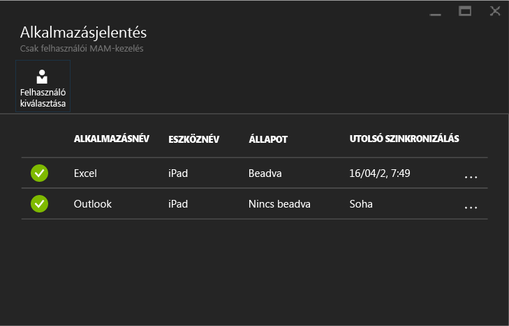

# Mobilalkalmazás-felügyeleti szabályzatok figyelése a Microsoft Intune-nal
Miután beállította a MAM-szabályzatot, és alkalmazta a felhasználókra, az [Azure-portálon](https://portal.azure.com) felügyelheti a megfelelési állapotokat. Az Azure portálon információkat talál a házirend által érintett felhasználókról, a megfelelési állapotokról, valamint a végfelhasználók által tapasztalt problémákról.
## Összesített nézet
Az **Intune mobilalkalmazás-kezelés** panelen megtekintheti a megfelelési állapot összefoglalását, amelynek leírását alább találja:

-   **FELHASZNÁLÓ:** a házirendhez társított alkalmazásokat használó felhasználók száma a vállalatnál.

-   **HÁZIREND ÁLTAL KEZELT:** azon felhasználók száma, akik az alkalmazások közül legalább egyet már használtak a munkahelyi környezetben.

-   **NEM TALÁLHATÓ HÁZIREND:** azon felhasználók száma, akik használják ugyan a szabályzathoz társított alkalmazásokat, de nem vonatkozik rájuk a beállított szabályzat.  Érdemes megfontolni ezen felhasználók bevonását a házirend hatálya alá.

- **Megjelölt felhasználók:** a problémákat tapasztaló felhasználók száma. A rendszer jelenleg a **Megjelölt felhasználók** részben kizárólag a feltört eszközt használó felhasználókat jelöli meg.

## Részletes nézet
Ha szeretné megtekinteni az összefoglalás részleteit, kattintson a **Felhasználó állapota** csempére vagy a **Megjelölt felhasználók** csempére.

### Felhasználó állapota
Itt megkeresheti az adott felhasználókat, és megtekintheti a rájuk vonatkozó megfelelési állapotot. Az **Alkalmazásjelentések** panelen a következő információk tekinthetők meg a kiválasztott felhasználóról:
- A felhasználói fiókhoz társított eszközök listája
- Az eszközön futó, MAM-házirenddel ellátott alkalmazások listája
- Állapot:

  **Beadva:** ez az állapot azt jelzi, hogy a házirend települt a felhasználónál, és az alkalmazást legalább egyszer már használták a munkahelyi környezetben.

  **Nincs beadva:** ez az állapot azt jelzi, hogy a házirend települt a felhasználónál, de az alkalmazást még egyszer sem használták a munkahelyi környezetben.

>[!NOTE]
> Ha a keresett felhasználó nem rendelkezik telepített MAM-szabályzattal, egy üzenetet fog látni, amely szerint a felhasználóra nem vonatkozik egyetlen alkalmazásszabályzat sem.

A felhasználóhoz tartozó jelentések megtekintéséhez kövesse az alábbi lépéseket:

**1. lépés:**  Felhasználó kiválasztásához kattintson az Összefoglalás csempére, vagy válassza a **FELHASZNÁLÓI ALKALMAZÁSJELENTÉSEK** elemet a **Beállítások** panelen az alább látható módon:

**2. lépés:** Megnyílik az **Alkalmazásjelentések** panel. Az Azure Active Directory kívánt felhasználójának megkereséséhez válassza a **Felhasználó kijelölése** lehetőséget.

**3. lépés:** A kívánt felhasználó listából való kiválasztását követően megjelennek a felhasználó megfelelési állapotára vonatkozó információk.

### Megjelölt felhasználók
A részletes nézetben megtekinthető a hibaüzenet, az alkalmazás neve, amelynek a használata közben fellépett a hiba, az eszközön futó platform, valamint egy időbélyegző.  

### További információ
[iOS-alkalmazások közti adatátvitel kezelése](manage-data-transfer-between-ios-apps-with-microsoft-intune.md)

[Végfelhasználói élmény a MAM használatát támogató alkalmazások esetében](end-user-experience-for-mam-enabled-apps-with-microsoft-intune.md)

<!--HONumber=Jul16_HO3-->

