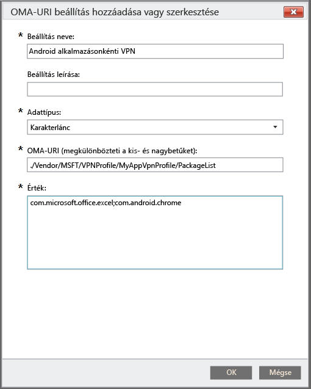

# Egyéni szabályzat használata az Android-eszközök alkalmazásonkénti VPN-profiljainak létrehozásához

Az Intune által felügyelt Android 5.0-s és újabb rendszerű eszközökhöz alkalmazásonkénti VPN-profilt hozhat létre. Először hozzon létre egy olyan VPN-profit, amely a Pulse Secure vagy a Citrix kapcsolattípust használja. Ezután hozzon létre egy olyan egyéni szabályzatot, amely a VPN-profilt meghatározott alkalmazásokkal társítja. 

Miután érvénybe lépteti a szabályzatot az Android rendszerű eszközre vagy felhasználócsoportokra vonatkozóan, a felhasználóknak el kell indítaniuk a PulseSecure vagy a Citrix VPN-t. A kapcsolat ezután csak a megadott alkalmazások adatforgalma számára engedélyezi a nyitott VPN-kapcsolat használatát.

> [!NOTE]
>
> Ez a profil csak a Pulse Secure kapcsolattípust támogatja.

### 1. lépés: VPN-profil létrehozása

1. A [Microsoft Intune felügyeleti konzoljában](https://manage.microsoft.com) válassza a **Házirend** > **Házirend hozzáadása** lehetőséget.
2. Az új szabályzathoz használandó sablon kiválasztásához bontsa ki az **Android** elemet, majd válassza a **VPN-profil (Android 4 és újabb verziók)** lehetőséget.
3. A sablonban a **Kapcsolat típusa** beállításnál válassza a **Pulse Secure** vagy a **Citrix** lehetőséget.
4. Fejezze be a beállítást, és mentse a VPN-profilt. A VPN-profilokról bővebben lásd a [VPN-kapcsolatok](../deploy-use/vpn-connections-in-microsoft-intune.md) témakört.

> [!NOTE]
>
> Jegyezze fel a VPN-profil nevét a következő lépéshez. Például: AlkVpnProfil.

### 2. lépés: Egyéni konfigurációs szabályzat létrehozása

   1. Az Intune felügyeleti konzolján válassza a **Házirend** > **Házirend hozzáadása** > **Android** > **Egyéni konfiguráció** > **Házirend létrehozása** lehetőséget.
   2. Adja meg a szabályzat nevét.
   3. Az **OMA-URI** beállítások területén válassza a **Hozzáadás** elemet.
   4. Adja meg a beállítás nevét.
   5. Az **Adattípus** mezőben válassza a **Karakterlánc** lehetőséget.
   6. Az **OMA-URI** mezőbe írja be a következő karakterláncot: **./Vendor/MSFT/VPN/Profile/*Név*/PackageList**, ahol a *Név* az 1. lépésben feljegyzett VPN-profil neve. A fenti példában a karakterlánc a következő lenne: **./Vendor/MSFT/VPN/Profile/AlkVpnProfil/PackageList**.
   7.   Az **Érték** területen adja meg azoknak a csomagoknak a pontosvesszővel tagolt listáját, amelyeket a profilhoz társít. Ha például azt szeretné, hogy az Excel és a Google Chrome böngésző VPN-kapcsolatot használjon, írja be a következőt: **com.microsoft.office.excel;com.android.chrome**.

#### Az alkalmazáslista Blacklist (Letiltott) vagy Whitelist (Engedélyezett) értékre állítása (nem kötelező)
  A **BLACKLIST** (LETILTOTT) érték kiválasztásával megadhatja azoknak az alkalmazásoknak a listáját, amelyek *nem* használhatják a VPN-kapcsolatot. Minden más alkalmazás VPN-kapcsolaton keresztül fog csatlakozni az internethez.
Másik megoldásként használhatja a **WHITELIST** (ENGEDÉLYEZETT) értéket, és megadhatja azon alkalmazások listáját, amelyek *használhatják* a VPN-kapcsolatot. A listán nem szereplő alkalmazások nem csatlakozhatnak az internethez a VPN-kapcsolaton keresztül.
  1.    Az **OMA-URI** beállítások területén válassza a **Hozzáadás** elemet.
  2.    Adja meg a beállítás nevét.
  3.    Az **Adattípus** mezőben válassza a **Karakterlánc** lehetőséget.
  4.    Az **OMA-URI** mezőbe írja be a következő karakterláncot: **./Vendor/MSFT/VPN/Profile/*Név*/Mode**, ahol a *Név* az 1. lépésben feljegyzett VPN-profil neve. A fenti példában a karakterlánc a következő lenne: **./Vendor/MSFT/VPN/Profile/AlkVpnProfil/Mode**.
  5.    Az **Érték** mezőbe írja be a **BLACKLIST** (LETILTOTT) vagy a **WHITELIST** (ENGEDÉLYEZETT) értéket.

### 3. lépés: Mindkét szabályzat telepítése

*Mindkét* szabályzatot *azonos* Intune-csoport számára kell telepítenie.

1.  A **Szabályzat** munkaterületen válassza ki a telepíteni kívánt szabályzatot, és kattintson a **Központi telepítés kezelése** elemre.
2.  A **Telepítések kezelése** párbeszédpanelen:
    -   **A szabályzat érvénybe léptetése** – Válasszon ki egy vagy több olyan csoportot, amelyhez érvénybe szeretné léptetni a szabályzatot, majd kattintson a **Hozzáadás** > **OK** gombra.
    -   **Ha a szabályzat érvénybe léptetése nélkül kívánja bezárni a párbeszédpanelt**, kattintson a **Mégse** gombra.

A **Házirend** munkaterület **Áttekintés** lapján található állapotösszegzés és riasztások segítségével azonosíthatók a szabályzattal kapcsolatos, figyelmet igénylő problémák. Emellett egy állapotösszegzés is megjelenik az **Irányítópult** munkaterületen.

<!--HONumber=Nov16_HO2-->

