# A felhasználói és eszközcsoportok megtervezése
Az Intune csoportjai az eszközök és felhasználók rendkívül rugalmas felügyeletét teszik lehetővé. Csoportokat állíthat be a szervezet igényeinek megfelelően a következő szempontok szerint:

- Földrajzi hely
- Részleg
- Hardverjellemzők
- Operációs rendszer
- Felhasználói tulajdonú eszköz vagy vállalati tulajdonú eszköz

## Az Intune-csoportok működése

Az Intune felügyeleti konzoljában a **Csoportok** csomópont alapértelmezett nézete a következő:

A szabályzatok érvénybe léptetése csoportok szerint történik, ezért a csoporthierarchia az egyik fő tervezési szempont. Fontos megjegyezni, hogy a csoport létrehozása után nem módosítható a létrehozott csoport szülőcsoportja. A csoportok tervezése az Intune szolgáltatás használatának kezdetétől fogva kritikus fontosságú. A következőben néhány ajánlott eljárást ismertetünk a csoporthierarchia szervezeti igények szerinti tervezéséhez.

## A csoportok tagsági szabályai

- Egy csoport vagy felhasználókból, vagy eszközökből állhat, de a kettő keverékéből nem.

    * **Eszközcsoportok**. Ide tartoznak a számítógépek és a mobileszközök. A számítógépek csoportokba való felvételéhez be kell léptetnie őket. Mielőtt hozzáadhatna egy mobileszközt egy csoporthoz, a környezetet úgy kell konfigurálni, hogy támogassa a mobileszközöket, és az eszközt regisztrálni kell, vagy az Exchange ActiveSync szolgáltatásnak észlelnie kell azt.

    * **Felhasználói csoportok**. Az egyes csoportokban biztonsági csoportok felhasználói szerepelhetnek. A biztonsági csoportok az Ön által használt Active Directory-példánnyal szinkronizálódnak. Ha nem használ Active Directory-szinkronizálást, manuálisan is létrehozhat ilyen csoportokat.

- Egy eszköz vagy felhasználó több csoporthoz is tartozhat.

- Egy csoport a következő tagsági szabályok alapján tartalmazhat vagy zárhat ki tagokat:

    * **Tagság feltételei**. Ezek olyan dinamikus szabályok, amelyeket az Intune a tagok felvételéhez vagy kizárásához futtat. Ezek a feltételek biztonsági csoportokat és az Active Directory helyi példányából szinkronizált egyéb információkat használnak. Ha a biztonsági csoport vagy a szinkronizált adatok változnak, akkor a csoport tagsága is megváltozik az Active Directoryval történő szinkronizáláskor.

    * **Közvetlen tagság**. Ezek olyan statikus szabályok, amelyek kifejezetten felveszik vagy kizárják a tagokat. A tagsági lista statikus.

-   Az Active Directory Domain Servicesre (AD DS) nincs szükség a felhasználókat vagy számítógépeket tartalmazó felhasználói vagy eszközcsoportok létrehozásakor. Ahhoz ugyanakkor, hogy az eszközcsoportok mobileszközöket tartalmazhassanak, a környezetet konfigurálni kell a mobileszközök támogatására.

    Az eszközöket ezenkívül észlelni kell, és hozzá kell adni az Intune-hoz.

## A csoportok kapcsolati szabályai

- Minden létrehozott csoportnak rendelkeznie kell szülőcsoporttal. A csoport létrehozása után nem módosítható a létrehozott csoport szülőcsoportja.

- Amikor felhasználókat vagy eszközöket ad hozzá egy gyermekcsoporthoz, vegye figyelembe a következőket:

    * A gyermekcsoport minden esetben a szülőcsoport részhalmaza.

    * A gyermekcsoporthoz hozzáadott új tagok automatikusan tagjává válnak az adott szülőcsoportnak is.

    * Nem adhat hozzá olyan tagot egy gyermekcsoporthoz, amely ki van zárva a szülőcsoportból.

- A szülőcsoport tagsága meghatározza a gyermekcsoport rendelkezésre álló tagságát is.

- Ha töröl egy szülőcsoportot, annak minden gyermekcsoportja is törlődik.

- Tartalmakat és szabályzatokat a gyermekcsoportok kihagyásával is telepíthet a szülőcsoportok számára.

- A gyermekcsoporthoz olyan felhasználót vagy eszközt is hozzáadhat, amely nem tagja a szülőcsoportnak. Ha ezt teszi, akkor a gyermekcsoport új tagja hozzáadódik a szülőcsoporthoz.

    Ugyanakkor nem adhat hozzá olyan tagot a gyermekcsoporthoz, amely ki van zárva a szülőcsoportból.

- A csoporttagság rekurzív. Példa:

    * **Pat** csak egyetlen csoport, a **Laptopfelhasználók** biztonsági csoport tagja.

    * A **Laptopfelhasználók** csoport a **Jóváhagyott felhasználók** biztonsági csoport tagja.

    * Létrehoz egy csoportot az Intune-ban, amely a **Jóváhagyott felhasználók** csoport tagjait magában foglaló dinamikus tagságlekérdezést használ. Ennek eredményeképpen **Pat** az Intune felhasználói csoport tagja lesz.

> [!TIP]
> A csoportok létrehozásakor gondolja át, hogyan szeretné alkalmazni a szabályzatokat. Lehetnek például az eszközök operációs rendszereire szabott, vagy az Active Directoryban már definiált, szervezeten belüli szerepköröknek vagy szervezeti egységeknek megfelelő szabályzatok. Egyes rendszergazdák hasznosnak tartják külön iOS-, Android- és Windows-eszközcsoportok létrehozását. Ez a különböző szervezeti szerepkörök szerinti felhasználói csoportok létrehozása mellett történik.

<!--- should we just link to a policies topic at this point and remove this? Ask Rob
 You'll probably want to create a default policy that applies to all groups and devices, to establish the basic compliance requirements of your organization. Then, you create more specific policies for the broadest categories of users and devices, for example, email policies for each of the device operating systems.

 Be careful when you name your policies, so that you can easily identify them later. For example, a good, descriptive policy name is **WP Email Policy for Entire Company**.

 Each time you create a restrictive policy, you'll want to communicate it to your users. After you create the more general groups and policies, pay attention to how you create smaller groups so that you can reduce unnecessary communication.--->

## Beépített csoportok
Az Intune kilenc olyan beépített csoporttal rendelkezik, amely nem módosítható és nem törölhető: <!--maybe a screen shot would be best?-->

-   **Minden felhasználó**
    -   Nem csoportosított felhasználók
-   **Minden eszköz**
    -   Minden számítógép
    -   Minden mobileszköz
        -   Minden közvetlenül felügyelt eszköz
        -   Minden, az Exchange ActiveSync által felügyelt eszköz
    -   Minden vállalati tulajdonú eszköz
    -   Nem csoportosított eszközök

> [!NOTE]
> Mottó: *legyen egyszerű*. Ha a szervezetnek nincsenek az alábbi szakaszokban leírtakhoz hasonló speciális igényei, célszerű az egyszerűségre törekedni és az alapértelmezés szerint csoportstruktúrát és szabályzatokat alkalmazni. A szolgáltatás így kezelhetőbb lesz hosszú távon. A karbantartás is egyszerűbb, ha egységesen kezelheti a felhasználókat. Minél kisebb mértékű a csoportok szerinti differenciálódás, annál kevesebb szabályzatot kell fenntartani.

### A szervezetben lévő összes felhasználó és eszköz
Definiáljon egy szülőcsoportot a szervezet összes felhasználója és eszköze számára. Nagy valószínűséggel lesznek olyan szabályzatai, amelyek valamennyire vonatkoznak. Erre a célra használhatja az Intune alapértelmezett **Minden felhasználó** és **Minden eszköz** csoportját. A **Minden felhasználó** és a **Minden eszköz** szülőcsoport gyermekcsoportjai lehetnek azok az alcsoportok, amelyek a jellemzők szerint rendezik az eszközöket, ilyen lehet például a saját tulajdonú eszközök (BYOD) és a vállalati tulajdonú eszközök (CO) alcsoportja.

## A csoportok testreszabása a szervezet sajátosságainak megfelelően

### BYOD- és vállalati tulajdonú eszközök
Ha a szervezet engedélyezi a dolgozóknak a saját eszközök használatát a munkahelyen, vállalati tulajdonú eszközöket biztosít a dolgozóknak, vagy a két módszer kombinációját használja, javasoljuk, hogy külön szabályzatokat alkalmazzon e két eszközkategóriára.

BYOD vagy vegyes használat esetében a házirendek tervezésekor ügyeljen arra, hogy ne sértse meg a helyi adatvédelmi előírásokat. Hozzon létre egy szülőcsoportot minden felhasználóhoz, aki a saját eszközét fogja használni. Ezzel a csoporttal azután a kategória összes felhasználójára érvényes szabályzatokat alkalmazhat.

Hasonlóképpen létrehozhat egy csoportot a szervezet vállalati tulajdonú eszközöket használó felhasználói számára:

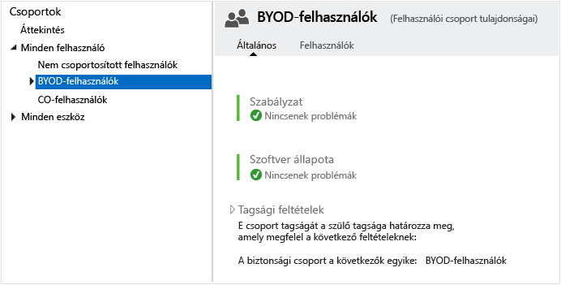

<!---START HERE--->

### Csoportok földrajzi régiókhoz
Ha a szervezetnél földrajzi egységenként külön szabályzatokra van szükség, létrehozhat csoportokat a különböző földrajzi régiók szerint. Ezeket alapozhatja az Active Directory-példányában már létrehozott regionális csoportokra, és szinkronizálhatja őket az Azure Active Directory szolgáltatással. Regionális csoportokat közvetlenül az Azure Active Directoryban is létrehozhat.

A következő képernyőfelvételek bemutatják, hogy hogyan hozhat létre Intune-csoportokat az Active Directory helyi példányával szinkronizált csoportok alapján. Ezekben a példákban feltételezzük, hogy rendelkezik egy **US Users Group** nevű Active Directory-beli biztonsági csoporttal.

Először adja meg az általános információkat.

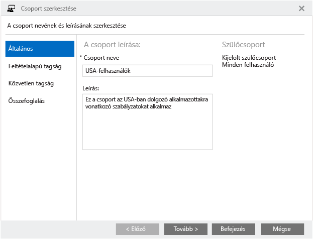

A **Tagsági feltételek** területen válassza az Active Directoryval szinkronizált **US Users Group** csoportot a tagsági szabályok szerint használni kívánt biztonsági csoportként.

Tekintse át a bejegyzéseket majd válassza a **Befejezés** lehetőséget a csoport létrehozásához.

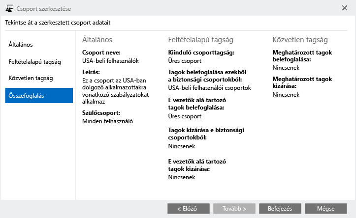

A példánkban egy Middle East and Asia (Közel-Kelet és Ázsia) **(MEA)** csoportot is létrehoztunk.

> [!NOTE]
> Ha a csoporttagság nem a biztonságicsoport-tagság alapján lett feltöltve, ellenőrizze, hogy rendelt-e Intune-licenceket ezekhez a tagokhoz.

### Csoportok adott hardverekhez
Ha a szervezetének olyan szabályzatokra van szüksége, amelyek adott hardvertípusokra vonatkoznak, ezen követelmény alapján hozhatja létre a csoportokat. A szabályzatokat alapozhatja a helyi Active Directory-példányában már létrehozott specifikus csoportokra, és szinkronizálhatja őket az Azure Active Directory szolgáltatással. Csoportokat közvetlenül az Azure Active Directoryban is létrehozhat. Ebben a példában a **US Users Group** (USA-felhasználók) csoportot használjuk a **Laptop Users** (Laptopfelhasználók) csoport szülőjeként.

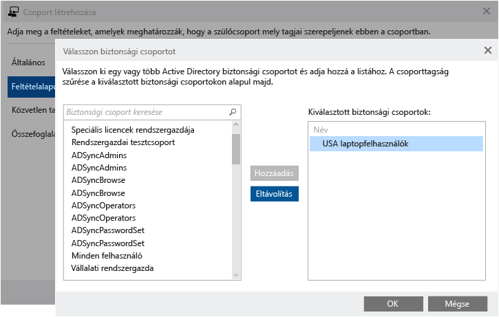

Ezen a ponton a csoport hierarchiájának a következő képernyőfelvételen láthatókhoz hasonlóan kell kinéznie. Látható, hogy most már vannak tagok a **Laptop Users** Intune-csoportban. Az erre a csoportra alkalmazott szabályzatok az USA régió BYOD-laptopfelhasználóira érvényesek.

### Csoportok adott operációs rendszerekhez
Ha a szervezetének olyan szabályzatokra van szüksége, amelyek meghatározott operációs rendszerre, például Androidra, iOS-re vagy Windowsra vonatkoznak, létrehozhat csoportokat e követelmény alapján. A szabályzatokat alapozhatja a helyi Active Directory-példányában már létrehozott operációsrendszer-specifikus csoportokra, és szinkronizálhatja őket az Azure Active Directory szolgáltatással. Közvetlenül is létrehozhatja őket saját Azure Active Directory-példányában.

A korábbi példákban látottakkal azonos módszerrel hozhat létre csoportokat a különböző operációs rendszereket használó felhasználók <!--devices?--> alapján.

> [!NOTE]
> Ha a felhasználók többféle mobilplatformot/operációs rendszert használnak, és nincs automatikus módszer Android-, iOS- vagy Windows-felhasználóként való besorolásukra, akkor érdemes fontolóra venni a szabályzatok eszközszinten történő alkalmazását. Ez rugalmasabb lehetőséget kínál az operációsrendszer-specifikus szabályzatok alkalmazására.
>
> Az eszköz operációs rendszere alapján nem létesíthetők dinamikusan csoportok. Ehelyett ezt Active Directory- vagy Azure Active Directory-alapú biztonsági csoportok segítségével hajthatja végre.

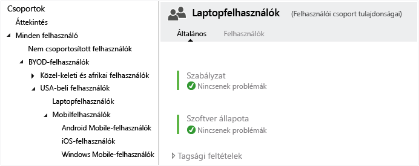

Ha az összes felhasználói csoport fel van töltve a szervezeti követelmények alapján, a csoporthierarchiának a következőképpen kell kinéznie:

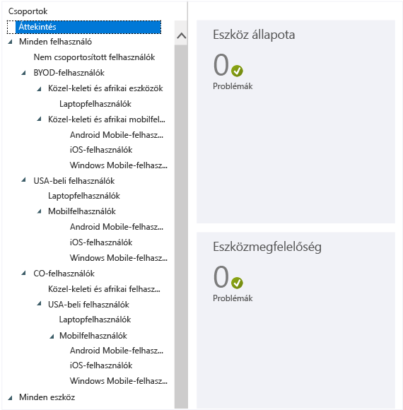

Ezt a hierarchiát használhatja a szervezet szabályzatainak alkalmazására.

### Eszközcsoportok
A BYOD-forgatókönyvhöz az itt láthatókhoz hasonló csoportokat hozhat létre az eszközök számára is, egy szélesebb körű csoporttal kezdve, amelybe beletartozik az összes alkalmazotti tulajdonú eszköz.

Válassza a **Minden eszköz (számítógépek és mobileszközök)** elemet, hogy a csoport tartalmazza az összes BYOD-eszközt:

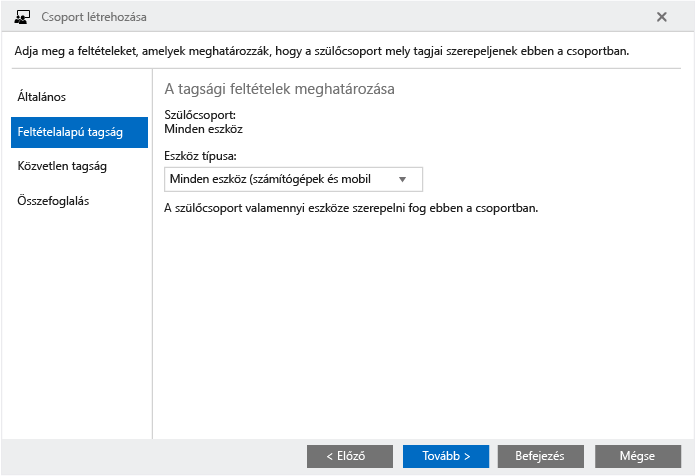

Tekintse át a bejegyzéseket majd válassza a **Befejezés** lehetőséget a BYOD-csoport létrehozásához.

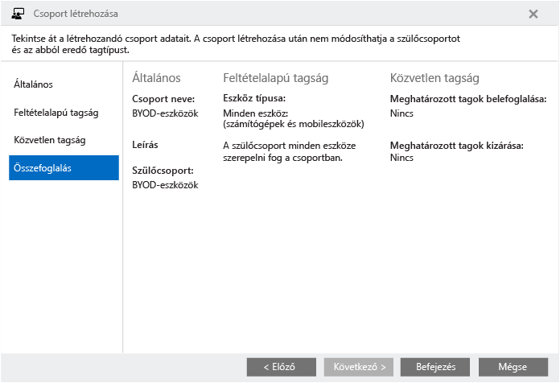

Folytassa az eszközcsoportok létrehozását, amíg a felhasználóicsoport-hierarchiához hasonló eszközcsoport-hierarchiával nem rendelkezik. Ezután az Intune-konzolon a csoportcsomópontnak ehhez hasonlóan kell kinéznie:

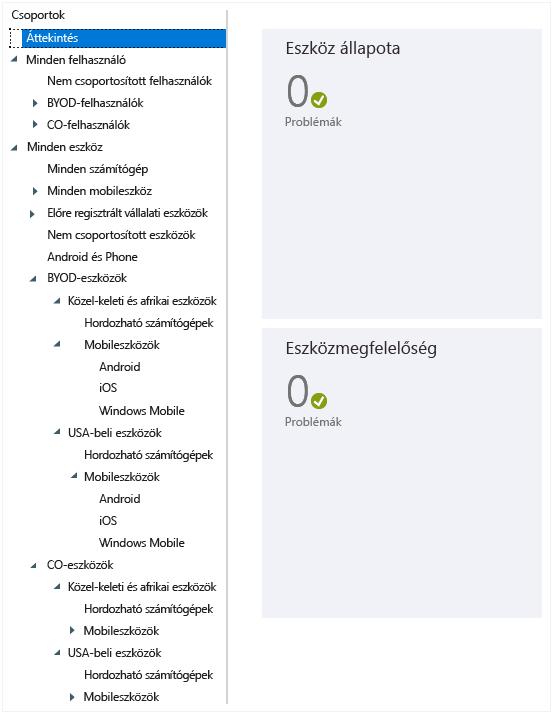

## Csoporthierarchiák és elnevezési konvenciók
A szabályzatok felügyeletének egyszerűsítése érdekében azt javasoljuk, hogy a cél, a platform és az alkalmazási hatókör alapján nevezze el az egyes szabályzatokat. Használjon olyan elnevezési konvenciót, amely követi a szabályzatok alkalmazásának előkészítése során létrehozott csoportstruktúrát.

Az USA regionális szinten az összes szervezeti, androidos mobileszközre alkalmazott Android-szabályzatok esetén a szabályzat neve például a következő lehet: **CO_US_Mob_Android_General**.

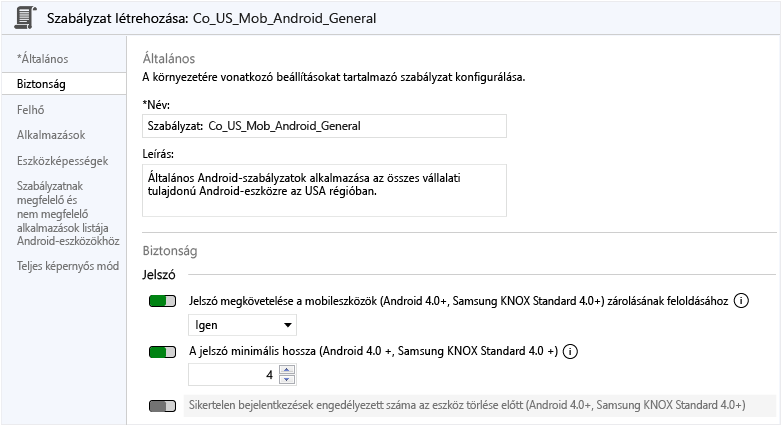

Az ilyen elnevezési gyakorlat segítségével gyorsan azonosíthatja a szabályzatokat és azok kívánt célját és hatókörét a **Policies** (Szabályzatok) csomópontban, ahogy ezt a következő ábra is szemlélteti:

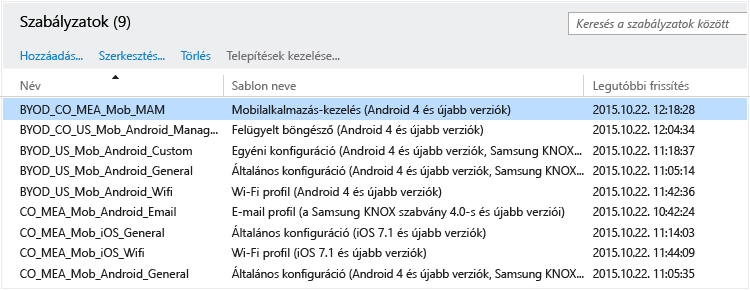

## További lépések
[Csoportok létrehozása](use-groups-to-manage-users-and-devices-with-microsoft-intune.md)

<!--HONumber=Aug16_HO3-->

