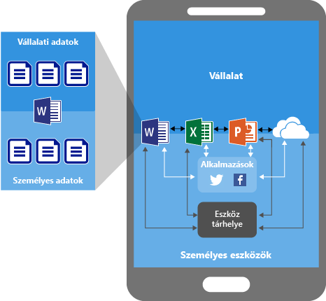
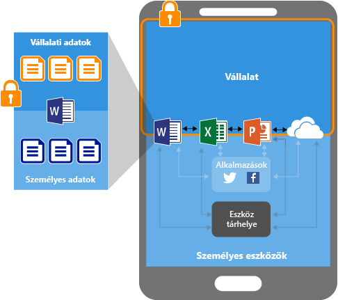
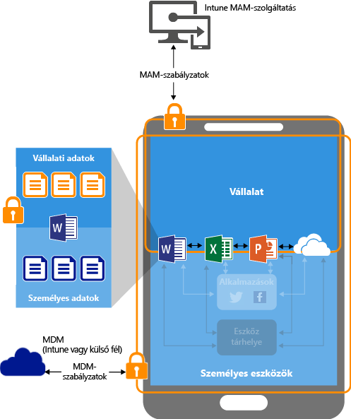
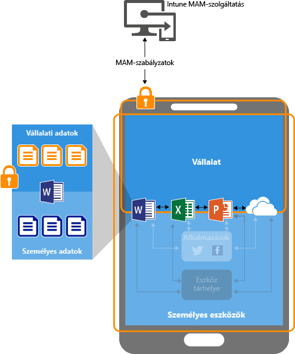

---
# required metadata

title: Alkalmazásadatok védelme mobilalkalmazás-kezelési szabályzatokkal | Microsoft Intune
description:
keywords:
author: karthikaraman
manager: jeffgilb
ms.date: 04/28/2016
ms.topic: article
ms.prod:
ms.service: microsoft-intune
ms.technology:
ms.assetid: ab6cd622-b738-4a63-9c91-56044aaafa6d

# optional metadata

#ROBOTS:
#audience:
#ms.devlang:
ms.reviewer: jeffgilb
ms.suite: ems
#ms.tgt_pltfrm:
#ms.custom:

---

# Alkalmazásadatok védelme mobilalkalmazás-kezelési szabályzatokkal a Microsoft Intune segítségével

## Az alkalmazásadatok védelme
Az alkalmazottak mobileszközöket használnak a személyes és munkahelyi feladatokhoz.  A produktív munkavégzést elősegítő környezet megteremtése mellett a véletlen vagy szándékos adatveszteség megelőzése is fontos szempont egy vállalatban.  Fontos továbbá, hogy az eszközhasználattal elért vállalati adatok védelme akkor is megvalósulhasson, ha az adott eszközöket nem felügyeli.

A vállalati adatok védelme érdekében használhat Intune mobilalkalmazás-felügyeleti (MAM) szabályzatokat. Mivel az Intune MAM-szabályzatok függetlenek a mobileszköz-kezelési (MDM) megoldásoktól, a vállalati adatok védelmét az eszközök regisztrációja nélkül is biztosíthatja, így eszközkezelő megoldásra sincs feltétlenül szüksége. Az **alkalmazásszintű házirendek** érvénybe léptetésével korlátozhatja a vállalati erőforrásokhoz való hozzáférést, és az informatikai részleg adatainak is nagyobb védelmet nyújthat.

A MAM-szabályzatok a következőkön futó alkalmazásokat támogatják:

-   **Az [!INCLUDE[wit_nextref](../includes/wit_nextref_md.md)]-ban felügyelt és regisztrált eszközök**. Ebbe a kategóriába jellemzően a vállalat által birtokolt eszközök tartoznak.

  > [!IMPORTANT]
  > Az iOS- és Android-eszközök Intune-ban való felügyelete esetén mobilalkalmazás-felügyeleti szabályzatok hozhatók létre az Office 365-szolgáltatásokhoz kapcsolódó Office-mobilalkalmazások számára. A MAM-szabályzatok a helyszíni Exchange-hez vagy a SharePoint-szolgáltatásokhoz kapcsolódó alkalmazások esetében nem támogatottak.

-   **Harmadik fél mobileszköz-kezelő megoldása által felügyelt és regisztrált eszközök**.   Ebbe a kategóriába jellemzően a vállalat által birtokolt eszközök tartoznak.

  > [!NOTE]
  > A mobilalkalmazás-felügyeleti szabályzatokat nem ajánlott harmadik fél mobileszköz-kezelőjével vagy biztonságos tároló-megoldásokkal együtt használni.

-   **Nem felügyelt eszközök**.  Ebbe a kategóriába jellemzően az alkalmazottak által birtokolt eszközök tartoznak, amelyeket nem az Intune vagy más MDM-megoldás segítségével felügyelnek és regisztrálnak.

**A MAM-szabályzatok fontos előnyei a következők:**

-   Alkalmazási szinten biztosítja a vállalati adatok védelmét.  Mivel a mobilalkalmazás-felügyelet nem igényel eszközkezelést, a felügyelt és a nem felügyelt eszközökön is biztosíthatja a vállalati adatok védelmét. A felügyelet a felhasználói azonosítón alapul, így nincs szükség az eszközkezelőre.

-   A végfelhasználói termelékenység nem változik, és a szabályzatok sem lépnek érvénybe, ha személyes környezetben használják az alkalmazásokat.  Ha a szabályzatokat kizárólag munkahelyi környezetben alkalmazza, a személyes adatok érintése nélkül biztosíthatja a vállalati adatok védelmét.

Az MDM-megoldásoknak a MAM-szabályzatokkal együttes használata további előnyökkel is jár, a vállalatoknál a MAM-szabályzatok MDM-megoldásokkal és azok nélkül is használhatók. Egy alkalmazott például egyaránt használhat munkahelyi telefont és saját tabletet.  Ebben az esetben a munkahelyi telefon MDM-ben regisztrált és MAM-szabályzatok által védett, míg a személyes eszközt csak a MAM-szabályzatok védik.

- **Az MDM biztosítja az eszköz védettségét**.  Segítségével például PIN-kódot kérhet az eszköz eléréséhez, vagy felügyelt alkalmazásokat telepíthet az eszközre. Az MDM-megoldáson keresztül is telepíthet alkalmazásokat, így jobban szabályozhatja az alkalmazáskezelést.

- **A MAM-szabályzatok biztosítják az alkalmazásrétegek védelmét**. PIN-kódot kérhet például egy vállalati alkalmazás megnyitásához, az alkalmazások közötti adatmegosztáshoz, vagy az alkalmazásadatok személyes tárolóra való mentésének megakadályozásához.

### A MAM-szabályzatok jelenleg a következőkön támogatottak:
-   iOS 8.1-es vagy újabb verzió

-   Android 4 vagy újabb verzió

##  A MAM-szabályzatok és az alkalmazásadatok védelme

####  MAM-szabályzatok nélküli alkalmazások:

A korlátozások nélkül használt alkalmazások miatt összekeveredhetnek a vállalati és személyes adatok.  Adatvesztéssel járhat, ha a vállalati adatok személyes tárolókra vagy a vállalaton kívüli alkalmazásokra kerülnek. Az ábrán a nyilak a korlátozások nélküli adatátvitelt jelölik a (vállalati és személyes) alkalmazások között és a tárolási helyekre.

### Adatvédelem MAM-szabályzatokkal:

A MAM-szabályzatok használatával megakadályozható a vállalati adatoknak az eszköz helyi tárolójára történő mentése, illetve korlátozható a más, MAM-szabályzatok által nem védett alkalmazásokba irányuló adatmozgás. A MAM-szabályzatok beállításai a következőket tartalmazzák:
- Adatáttelepítési szabályzatok, például:
 **Mentés másként** művelet megakadályozása, **Kivágás, másolás és beillesztés korlátozása**.
- Hozzáférési szabályzati beállítások, például **A hozzáféréshez egyszerű PIN-kód szükséges**, **Felügyelt alkalmazások függetlenített vagy feltört eszközökön való futtatásának letiltása**.

### Adatvédelem MAM-szabályzatokkal az MDM-megoldások által felügyelt eszközökön:

**MDM-megoldásban regisztrált eszközökhöz**-

A fenti ábra az MDM és a MAM-szabályzatok által közösen biztosított védelmi réteget mutatja be.

Az MDM-megoldás:

-   Regisztrálja az eszközt

-   Telepíti az alkalmazásokat az eszközön

-   Folyamatosan ellenőrzi az eszköz megfelelőségét és felügyeletét

**A MAM-szabályzatok előnyei:**

-   Segít megakadályozni a vállalati adatok kiszivárgását a fogyasztói alkalmazásokba és szolgáltatásokba

-   Korlátozások alkalmazása (mentés másként, vágólap, PIN stb.) a mobilalkalmazásokra

-   Az alkalmazások törlése nélkül távolít el vállalati adatokat az alkalmazásokból

### Adatvédelem MAM-szabályzatokkal a nem regisztrált eszközökön

A fenti ábra az alkalmazási szintű, MDM nélküli adatvédelmi szabályzatokat mutatja be.

Mivel az MDM-megoldás nem regisztrálja a BYOD-eszközöket, a MAM-szabályzatok segítségével alkalmazási szinten biztosíthatja a vállalati adatok védelmét.
Mindazonáltal néhány korlátozást érdemes figyelembe vennie, például:

-   Nem telepíthet alkalmazásokat az eszközre.  A végfelhasználónak az áruházból kell letölteniük az alkalmazásokat.

-   Az eszközön nem használhatók a tanúsítványprofilok.

-   Az eszközön nem használhatók a Wi-Fi- és VPN-beállítások.

## Többszörös identitás

A többszörös identitást támogató alkalmazások révén ugyanazok az alkalmazások különböző (munkahelyi és személyes) fiókok használatával is elérhetők, míg a MAM-szabályzatokat a rendszer az alkalmazások munkahelyi környezetben való használata esetén alkalmazza.  

Ha például a végfelhasználó a munkahelyi fiókjával nyitja meg a OneDrive alkalmazást, akkor nem tudja áthelyezni a fájlokat egy személyes tárhelyre. Ugyanakkor, ha a végfelhasználó a OneDrive alkalmazást a személyes fiókjával használja, akkor korlátozás nélkül másolhat és helyezhet át adatokat a személyes OneDrive-jából.  

A MAM-szabályzatokhoz társított alkalmazások használati élményéről, illetve arról. hogy a többszörös identitást támogató alkalmazások hogyan teszik lehetővé a MAM-szabályzatok csak munkahelyi környezetben történő alkalmazását, részletes ismertető olvasható [A többszörös identitást támogató alkalmazások használata](end-user-experience-for-mam-enabled-apps-with-microsoft-intune.md#using-apps-with-multi-identity-support) című cikkben

Minden Office-mobilalkalmazás támogatja a többszörös identitást.

##  További lépések
[Felkészülés a mobilalkalmazás-felügyeleti szabályzatok konfigurálására](get-ready-to-configure-mobile-app-management-policies-with-microsoft-intune.md)

[Mobilalkalmazás-felügyeleti szabályzatok létrehozása és telepítése Microsoft Intune-ban](create-and-deploy-mobile-app-management-policies-with-microsoft-intune.md)

<!--HONumber=May16_HO1-->

