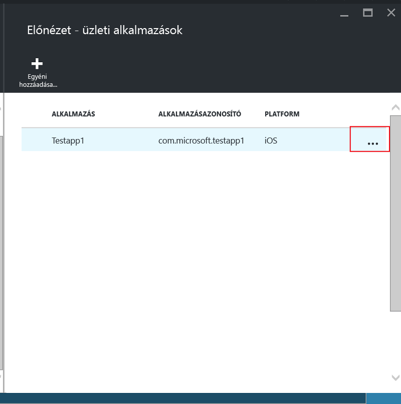
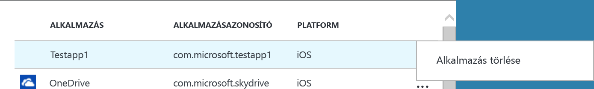

---
# required metadata

title: [Az üzleti alkalmazások és az adatok védelme a nem regisztrált eszközökön | Microsoft Intune]
description:
keywords:
author: [karthikaraman]
manager: [jeffgilb]
ms.date: 04/28/2016
ms.topic: article
ms.prod:
ms.service:
ms.technology:
ms.assetid: [00219467-a62e-43b6-954b-3084f54c45ba]

# optional metadata

#ROBOTS:
#audience:
#ms.devlang:
#ms.reviewer: [joglocke]
#ms.suite: ems
#ms.tgt_pltfrm:
#ms.custom:

---

# Az üzleti alkalmazások és az adatok védelme a nem regisztrált eszközökön a Microsot Intune-ban

A mobilalkalmazás-kezelési (MAM) házirendek korlátozzák az adatáthelyezést (például a másolást és a beillesztést), valamint megakadályozzák, hogy a felhasználók vállalati dokumentumokat mentsenek a személyes helyekre, így védik a vállalati adatait.   A MAM-házirendek iOS- vagy Android-rendszeren futó üzleti alkalmazásokon való használatához először a Microsoft Intune alkalmazásburkolóval burkolnia kell az alkalmazást.  Az alkalmazásburkolás az a folyamat, amely során kezelési réteggel lát el egy mobilalkalmazást anélkül, hogy a mögöttes alkalmazást bárhogyan módosítaná.  Az alkalmazás burkolása után azt MAM-házirenddel láthatja el, és kioszthatja végfelhasználói között.  

Ez a témakör ismerteti a MAM-házirendek **nem kezelt, alkalmazotti eszközökön**, és **harmadik fél által nyújtott mobileszköz-kezelési (MDM) megoldások** által kezelt eszközökön futó alkalmazásokhoz való rendelését.  Az **Intune-ban regisztrált eszközökön futó üzleti alkalmazások** előkészítéséhez tekintse meg az [Annak eldöntése, hogyan készíti elő az alkalmazásokat a mobilalkalmazás-kezeléshez a Microsoft Intune-nal](decide-how-to-prepare-apps-for-mobile-application-management-with-microsoft-intune.md) című cikket.
##  1. lépés: Az alkalmazás előkészítése
Mielőtt MAM-házirendet rendelne egy alkalmazáshoz, először burkolnia kell az alkalmazást a Microsoft Intune alkalmazásburkolóval.  Az alkalmazásburkoló letöltési és használati útmutatója a letöltés részét képezi.  
>[!IMPORTANT]  
>Az alkalmazásburkoló ezen verziója, amely a nem az Intune-ban regisztrált alkalmazásokat támogatja, a közeljövőben elérhető lesz Private preview verzióban. Ha részt szeretne venni a programban, küldjön egy levelet a msintuneappsdk@microsoft.com címre részletesebb tájékoztatásért.

## 2. lépés: Az alkalmazás hozzáadása

Ha üzletági alkalmazását MAM-házirenddel szeretné ellátni, az alkalmazás részleteit hozzá kell adnia az Intune-előfizetéséhez vagy a bérlőjéhez, az alábbi lépéseket követve:

1. Az [Azure-portálon](https://portal.azure.com/) válassza az **Intune mobilalkalmazás-kezelés > Beállítások** lehetőséget, majd az **Üzletági alkalmazások** elemet.

  

2. Az **Üzletági alkalmazások** panelen válassza az **Egyéni alkalmazás hozzáadása** lehetőséget.

  
3.  Adjon meg egy nevet az alkalmazásnak, az Alkalmazásazonosító mezőben található csomagazonosítónak, és a platformnak (iOS vagy Android).

   Ezzel a lépéssel egyéni leírást hozhat létre az alkalmazáshoz.  Az alkalmazás a bérlő számára is megjelenik a MAM-házirendre váró Célzott alkalmazások listájában, ahogyan azt a következő lépés ismerteti.

## 3. lépés: A MAM-házirend alkalmazása
Ha az alkalmazás metaadatai feltöltődtek a szolgáltatásra, az alkalmazás megjelenik az alkalmazáslistában.  Innentől kezdve [új vagy meglévő házirendet is létrehozhat](create-and-deploy-mobile-app-management-policies-with-microsoft-intune.md), és alkalmazhatja azt a 2. lépésben hozzáadott üzletági alkalmazásra.
  
## 4. lépés: Az alkalmazás terjesztése
Az alkalmazásokat az alábbi módszerekkel telepítheti a végfelhasználói számára:
* A harmadik felek által nyújtott MDM-megoldásokban regisztrált eszközökre az MDM-megoldáson keresztül juttathatja el az alkalmazásokat.
* A nem MDM-megoldásokkal kezelt eszközökhöz egyéni megoldásra van szüksége. A végfelhasználóknak maguknak kell letölteni és telepíteni az alkalmazást az eszközükre.

## A metaadatok módosítása
Ha módosítani szeretné az alkalmazás részleteit, például az alkalmazás nevét vagy a csomagazonosítót, először [el kell távolítania az alkalmazást](#remove-apps), majd [hozzá kell adnia](#add-the-app) az új metaadatokkal.

##  Alkalmazások eltávolítása
Az üzletági alkalmazásokat az alkalmazáslistából távolíthatja el.  Ezzel eltávolítja az alkalmazást a listából és megszünteti a MAM-házirendekhez való hozzárendelést, de nem törli az alkalmazást a végfelhasználó eszközéről.  

1.  Az [Azure-portálon](https://portal.azure.com/) válassza az **Intune mobilalkalmazás-kezelés > Beállítások** lehetőséget.  A **Beállítások** panelen válassza az **Üzletági** lehetőséget a meglévő alkalmazások listájának megnyitásához.  
2.  Válassza ki az eltávolítani kívánt alkalmazást, és válassza a **(...) helyi** menüt.

  
3.  Válassza az **Alkalmazás törlése** lehetőséget az alkalmazás törléséhez.

  

  Ez eltávolítja az alkalmazást az üzletági alkalmazások listájából és a MAM-házirend Célzott alkalmazáslistájából.

<!--HONumber=Jun16_HO1-->

