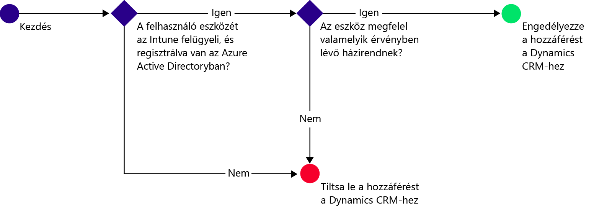
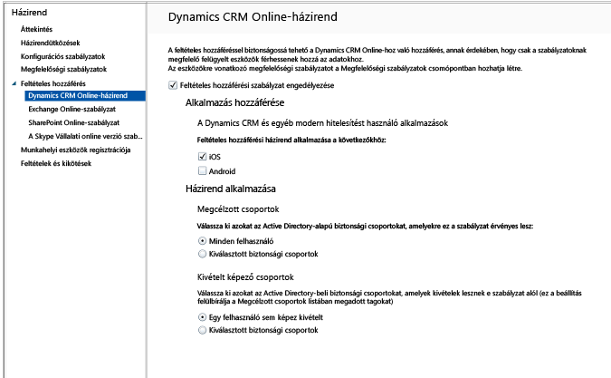

# A Dynamics CRM Online-hoz való e-mail-hozzáférés korlátozása
A Microsoft Dynamics CRM Online-hoz való hozzáférést a Microsoft Intune feltételes hozzáférésű iOS- és Android eszközeiről irányíthatja.  Az Intune feltételes hozzáférése két összetevőből áll:
* Egy [eszközmegfelelőségi szabályzat](introduction-to-device-compliance-policies-in-microsoft-intune.md), amelynek az eszköznek meg kell felelnie, hogy a rendszer megfelelőnek találja.
* Egy [feltételes hozzáférési szabályzat](restrict-access-to-email-and-o365-services-with-microsoft-intune.md), amelyben meg kell határoznia a feltételeket, amelyeknek az eszköznek meg kell felelnie ahhoz, hogy hozzáférhessen a szolgáltatáshoz.

Ha szeretné jobban megismerni a feltételes hozzáférés működését, olvassa el a [Restrict access to email, 0365, and other services](restrict-access-to-email-and-o365-services-with-microsoft-intune.md) (Az e-mailek, az O365- és egyéb szolgáltatások elérésének korlátozása) című cikket.

Amikor egy célzott felhasználó a Dynamics CRM alkalmazást szeretné használni az eszközén, a következő ellenőrzés megy végbe:

A Dynamics CRM Online alkalmazáshoz hozzáférést igénylő eszközre vonatkozóan a következőknek kell teljesülniük:
* Az eszköz legyen **Android** vagy **iOS** rendszerű.
* Az eszköz legyen **regisztrálva** a Microsoft Intune-ban.
* Az eszköz **feleljen meg** a Microsoft Intune összes telepített megfelelőségi szabályzatának.

Az eszköz állapotát a rendszer az Azure Active Directoryban tárolja, amely a megadott feltételek alapján engedélyezi vagy letiltja a hozzáférést.

Ha egy feltétel nem teljesül, a felhasználó számára az alábbi üzenetek egyike jelenik meg a bejelentkezéskor:
* Ha az eszköz nincs regisztrálva a Microsoft Intune-ban vagy az Azure Active Directoryban, megjelenik egy üzenet, amely leírja, hogyan kell telepíteni a Vállalati portál alkalmazást és regisztrálni az eszközt.
* Ha az eszköz nem megfelelő, egy üzenet jelenik meg, amely a felhasználót a Microsoft Intune Vállalati portál webhelyére vagy a Vállalati portál alkalmazásba irányítja, ahol további információt talál a problémáról és megoldásáról.

## A Dynamics CRM Online feltételes hozzáférésének beállítása  
### 1. lépés: Az Active Directory-alapú biztonsági csoportok beállítása

Kezdés előtt állítsa be az Azure Active Directory-alapú biztonsági csoportokat a feltételes hozzáférési szabályzathoz. Ezeket a csoportokat az **Office 365 Felügyeleti központban** konfigurálhatja. A rendszer ezen csoportok alapján célozza meg a felhasználókat, illetve helyezi őket kivétel alá. Amikor egy felhasználóra házirend vonatkozik, az erőforrások eléréséhez az általa használt összes eszköznek meg kell felelnie a házirendnek.

A Dynamics CRM Online-ra vonatkozó szabályzatban két csoporttípust határozhat meg:
* **Megcélzott csoportok** – A szabályzat hatálya alá eső felhasználók csoportjait tartalmazza.
* **Kivétel alá eső csoportok** – A szabályzat alól mentesülő felhasználók csoportjait tartalmazza.

Ha egy felhasználó mindkét csoportban szerepel, mentesül a házirend alól.

### 2. lépés: Megfelelőségi szabályzat konfigurálása és telepítése
[Hozzon létre](create-a-device-compliance-policy-in-microsoft-intune.md) és [telepítsen](deploy-and-monitor-a-device-compliance-policy-in-microsoft-intune.md) megfelelőségi szabályzatot a szabályzat hatálya alá eső összes eszközre. Ez minden olyan eszközre értendő, amelyet a Megcélzott csoportok csoporthoz tartozó felhasználók használnak.

> [!NOTE]
> A megfelelőségi szabályzatok a Microsoft Intune csoportjaira vonatkoznak, a feltételes hozzáférési szabályzatok viszont az Azure Active Directory biztonsági csoportokat célozzák meg.

> [!IMPORTANT]
> Amennyiben nem telepített megfelelőségi szabályzatot, a rendszer megfelelőként fogja értékelni az eszközöket.

Ha készen áll, folytassa a 3. lépéssel.
### 3. lépés: A Dynamics CRM házirendjének konfigurálása
Ezután állítsa be úgy a házirendet, hogy csak a felügyelt és a feltételeknek megfelelő eszközök érhessék el a Dynamics CRM-et. A szabályzat ezek után az Azure Active Directoryban tárolódik.

1.  A Microsoft Intune felügyeleti konzolon kattintson a **Házirend > Feltételes hozzáférés > Dynamics CRM Online-házirend** elemre.

  

2.  Válassza a **Feltételes hozzáférési szabályzat engedélyezése** lehetőséget.
3.  Az **Alkalmazás-hozzáférés** szakaszban kiválaszthatja, hogy mire szeretné alkalmazni a feltételes hozzáférési szabályzatot:
  * **iOS**
  * **Android**
4.  A **Megcélzott csoportok** területen kattintson a **Módosítás** lehetőségre azon Active Directory-alapú biztonsági csoportok kiválasztásához, amelyekre érvényes a szabályzat. Kiválaszthatja, hogy a szabályzat minden felhasználóra, vagy csak felhasználók bizonyos csoportjaira vonatkozzon.
5.  A **Kivétel alá eső csoportok**területen kattintson a **Módosítás** lehetőségre azon Active Directory-alapú biztonsági csoportok kiválasztásához, amelyekre nem érvényes a szabályzat.
6.  Ha elkészült, válassza a **Mentés** elemet.

Ezzel elvégezte a Dynamics CRM feltételes elérésének beállítását. Nem kell telepítenie a feltételes hozzáférési szabályzatot, az azonnal érvénybe lép.
##  A megfelelőség és a feltételes hozzáférési házirendek megfigyelése

A **Csoportok** munkaterületen megtekintheti eszközei feltételes hozzáférési állapotát.

Válassza ki bármelyik mobileszköz-csoportot, majd az **Eszközök** lapon válasszon az alábbi **Szűrők**közül:
* **Az AAD-ben nem regisztrált eszközök** – Ezeknek az eszközöknek nincs hozzáférése a Dynamics CRM-hez.
* **Nem megfelelő eszközök** – Ezeknek az eszközöknek nincs hozzáférése a Dynamics CRM-hez.
* **Az AAD-ben regisztrált és megfelelő eszközök** – Ezek az eszközök hozzáférhetnek a Dynamics CRM-hez.

##  További lépések
[A Exchange Online-hoz való hozzáférés korlátozása](restrict-access-to-exchange-online-with-microsoft-intune.md)

[Restrict access to Exchange on-premises](restrict-access-to-exchange-onpremises-with-microsoft-intune.md) (A helyszíni Exchange-hez való hozzáférés korlátozása)
[Restrict access to SharePoint Online](restrict-access-to-sharepoint-online-with-microsoft-intune.md) (A SharePoint Online-hoz való hozzáférés korlátozása)

[A Skype Vállalati online verzióhoz való hozzáférés korlátozása](restrict-access-to-skype-for-business-online-with-microsoft-intune.md)

<!--HONumber=Jul16_HO3-->

