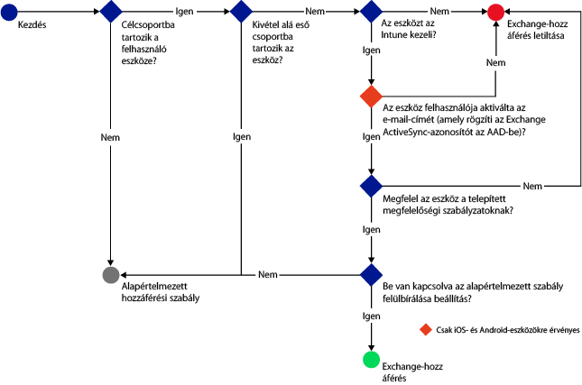
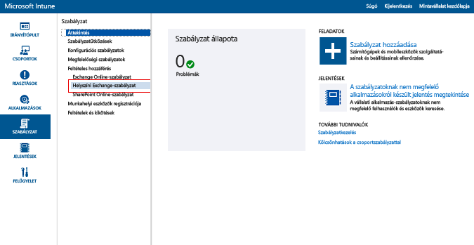
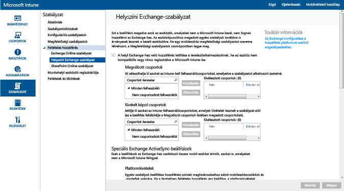

---
# required metadata

title: A helyszíni Exchange-hez és az örökölt dedikált Exchange Online-hoz való e-mail-hozzáférés korlátozása | Microsoft Intune
description:
keywords:
author: karthikaraman
manager: jeffgilb
ms.date: 04/28/2016
ms.topic: article
ms.prod:
ms.service: microsoft-intune
ms.technology:
ms.assetid: a55071f5-101e-4829-908d-07d3414011fc

# optional metadata

#ROBOTS:
#audience:
#ms.devlang:
ms.reviewer: jeffgilb
ms.suite: ems
#ms.tgt_pltfrm:
#ms.custom:

---

# A helyszíni Exchange-hez és az örökölt dedikált Exchange Online-hoz való e-mail-hozzáférés korlátozása

Ha dedikált Exchange Online-környezettel rendelkezik, és szeretné tudni, hogy az új vagy az örökölt konfiguráció tartozik-e hozzá, lépjen kapcsolatba a fiókkezelővel.

A helyszíni Exchange-hez vagy az örökölt dedikált Exchange Online környezethez való e-mail hozzáférés szabályozásához az Intune-ban konfiguráljon feltételes hozzáférést a helyszíni Exchange-hez.
Ha szeretné jobban megismerni a feltételes hozzáférés működését, olvassa el [Az e-mailek és az O365-szolgáltatások elérésének korlátozása]( restrict-access-to-email-and-o365-services-with-microsoft-intune.md) című cikket.

**Mielőtt** konfigurálja a feltételes hozzáférést, ellenőrizze a következőket:

-   Az Exchange esetében **Exchange 2010-es vagy újabb verzió** szükséges. Az Exchange-kiszolgáló ügyfél-hozzáférési kiszolgálótömbje (CAS) nem támogatott.

-   A **helyszíni Exchange összekötőjét** kell használnia, amely összeköti az [!INCLUDE[wit_nextref](../includes/wit_nextref_md.md)]-t és a helyszíni Microsoft Exchange-et. Ez lehetővé az eszközök kezelését az [!INCLUDE[wit_nextref](../includes/wit_nextref_md.md)] konzolján keresztül. További tudnivalók az összekötőről: [Az Intune helyszíni Exchange-összekötője](intune-on-premises-exchange-connector.md).

    -   Az Intune-konzolon elérhető helyszíni Exchange-összekötő az Intune-bérlőjéhez tartozik, és semmilyen más bérlővel nem használható. Gondoskodnia kell arról, hogy a bérlőjének Exchange-összekötője **csak egy számítógépen** legyen telepítve..

        Ezt az összekötőt az Intune felügyeleti konzoljáról kell letölteni.  A helyszíni Exchange-összekötő konfigurálásával kapcsolatos általános bemutatót lásd: [Az Exchange helyszíni összekötő konfigurálása helyszíni vagy üzemeltetett Exchange használatához](intune-on-premises-exchange-connector.md)..

    -   Az összekötő bármely gépre telepíthető, amennyiben az képes az Exchange-kiszolgálóval való kommunikációra.

    -   Ez az összekötő támogatja az **Exchange CAS-környezetet**. Ha szeretné, technikailag az is megoldható, hogy közvetlenül az Exchange CAS-kiszolgálóra telepítse az összetevőt, ez azonban nem javasolt, mert növeli a kiszolgálót érő terhelést.
    Az összekötőt úgy kell konfigurálni, hogy az kommunikáljon az Exchange CAS-kiszolgálók valamelyikével.

-   Az **Exchange ActiveSync** tanúsítványalapú hitelesítéssel vagy felhasználó által megadott hitelesítő adatokkal konfigurálandó.

Amikor feltételes hozzáférési szabályzatokat konfigurál és rendel hozzá felhasználókhoz, a felhasználók csak akkor csatlakozhatnak az e-mail fiókjukhoz, ha a használt **eszköz**:

-  **Regisztrálva** van az [!INCLUDE[wit_nextref](../includes/wit_nextref_md.md)]-nal vagy egy tartományhoz csatlakozó számítógép.

-  **Regisztrálva van az Azure Active Directoryban**. Ezenkívül az ügyfél Exchange ActiveSync-azonosítójának regisztrálva kell lennie az Azure Active Directoryban.

  Az AAD DRS szolgáltatás automatikusan aktiválódik az Intune-t és az Office 365-öt használó ügyfelek számára. Azok az ügyfelek, akik már telepítették az ADFS eszközregisztrációs szolgáltatását, nem fogják látni a regisztrált eszközöket a helyszíni Active Directoryban. **Ez nem érvényes a Windows rendszerű számítógépekre és a Windows Phone-eszközökre.**.

-   **Meg kell felelnie** az eszközre telepített összes [!INCLUDE[wit_nextref](../includes/wit_nextref_md.md)] megfelelőségi házirendnek.

A következő diagram azt a folyamatot mutatja be, amelyet a helyszíni Exchange-környezet feltételes hozzáférési házirendjei használnak annak kiértékeléséhez, hogy engedélyezzék vagy letiltsák-e az eszközöket.

Ha a feltételes hozzáférési szabályzat valamelyik feltétele nem teljesül, a felhasználó számára az alábbi üzenetek egyike jelenik meg a bejelentkezéskor:

- Ha az eszköz nincs regisztrálva az [!INCLUDE[wit_nextref](../includes/wit_nextref_md.md)]-ban vagy az Azure Active Directoryban, megjelenik egy üzenet, amely leírja, hogyan kell telepíteni a Vállalati portál alkalmazást, regisztrálni az eszközt és aktiválni az e-mailt. Ez a folyamat hozzárendeli az eszköz Exchange ActiveSync-azonosítóját is az Azure Active Directoryban lévő eszközrekordhoz.

-   Ha az eszköz nem megfelelő, egy üzenet jelenik meg, amely a felhasználót az [!INCLUDE[wit_nextref](../includes/wit_nextref_md.md)] vállalati portál webhelyére vagy a Vállalati portál alkalmazásba irányítja, ahol a felhasználó további információt talál a problémáról és annak megoldásáról.

## A mobileszközök támogatása
-   Windows Phone 8 és újabb verziók

-   Natív e-mail alkalmazás iOS rendszerű eszközökön.

-   Natív e-mail alkalmazás Android 4 vagy újabb rendszerű eszközökön

## Számítógépek támogatása

A **Posta** alkalmazás a Windows 8-as és újabb verzióiban (regisztrálás: [!INCLUDE[wit_nextref](../includes/wit_nextref_md.md)])

##  Feltételes hozzáférési házirend konfigurálása

1.  A [Microsoft Intune felügyeleti konzoljában](https://manage.microsoft.com) válassza a **Házirend** > **Feltételes hozzáférés** > **Helyszíni Exchange-házirend** elemet..

2.  Konfigurálja a házirendet a szükséges beállításokkal:

  - **A helyi Exchange-hez való hozzáférés letiltása a levelezőalkalmazásoknak, ha az eszköz nem kompatibilis vagy nincs regisztrálva a Microsoft Intune-ba:** Ha bejelöli ezt a beállítást, akkor blokkolva lesz a nem az [!INCLUDE[wit_nextref](../includes/wit_nextref_md.md)] által kezelt vagy a megfelelőségi házirendnek nem megfelelő eszközök hozzáférése az Exchange-szolgáltatásokhoz.

  - **Alapértelmezett szabály felülbírálása: A regisztrált és megfelelő eszközök mindig hozzáférhetnek az Exchange-hez:** Ha ezt beállítást választja, az Intune-ban regisztrált azon eszközök, amelyek eleget tesznek a megfelelőségi szabályzatoknak, hozzáférhetnek az Exchange-hez.  
  Ez a szabály felülírja az **alapértelmezett szabályt.** Ha tehát az **alapértelmezett szabály** úgy van beállítva, hogy blokkolja a hozzáférést, a megfelelőnek minősülő regisztrált eszközök továbbra is hozzáférhetnek az Exchange-hez.

  - **Megcélzott csoportok:** Válassza ki azon [!INCLUDE[wit_nextref](../includes/wit_nextref_md.md)] felhasználói csoportokat, amelyeknek regisztrálniuk kell az eszközüket az [!INCLUDE[wit_nextref](../includes/wit_nextref_md.md)]-ban az Exchange eléréséhez.

  - **Kivétel alá eső csoportok:** Válassza ki azon [!INCLUDE[wit_nextref](../includes/wit_nextref_md.md)] felhasználói csoportokat, amelyek mentesülnek a feltételes hozzáférési házirend alól. A listán szereplő felhasználók mentesülnek akkor is, ha szerepelnek a **Megcélzott csoportok** listán.

  - **Platformkivételek:** Kattintson a **Szabály hozzáadása** lehetőségre olyan szabály konfigurálásához, amely meghatározza az adott mobileszközcsaládok és -modellek hozzáférési szintjeit. Mivel ezek az eszközök bármilyen típusúak lehetnek, olyan eszköztípusokat is konfigurálhat, amelyeket nem támogat az [!INCLUDE[wit_nextref](../includes/wit_nextref_md.md)].

  - **Alapértelmezett szabály:** A többi szabály alól mentes eszközökhöz kiválaszthatja, hogy engedélyezi-e az Exchange-hozzáférést, esetleg letiltja vagy karanténba helyezi az eszközt. Ha úgy állítja be a szabályt, hogy engedélyezze a hozzáférést, a megfelelőnek minősülő regisztrált eszközök automatikusan hozzáférést kapnak a levelezéshez (iOS, Windows és Samsung KNOX rendszerű eszközök esetén). A végfelhasználónak semmilyen teendője sincs az e-mail fiókjával kapcsolatban.  A nem Samsung KNOX-alapú androidos eszközök esetén a végfelhasználók értesítést kapnak e-mailben az eszközeik karanténba helyezéséről. Az e-mailben található egy részletes útmutató arról, hogy a levelezéshez való hozzáférés előtt miként kell ellenőrizni az eszközök regisztrációját és megfelelőségét. Ha úgy állítja be a szabályt, hogy az engedélyezze a hozzáférést vagy karanténba helyezze az eszközt, egyetlen eszköz sem fog hozzáférni az Exchange-hez, függetlenül attól, hogy regisztrálták-e már őket az Intune-ban. Amennyiben nem szeretné, hogy ez a szabály vonatkozzon a megfelelőnek minősülő regisztrált eszközökre, válassza az **Alapértelmezett szabály felülbírálása** lehetőséget.
>[!TIP]
>Ha a levelezéshez való hozzáférést megelőzően minden eszközt blokkolni szeretne, válassza inkább a hozzáférést blokkoló vagy a karanténba helyezést kiváltó szabályt. Az alapértelmezett szabály az összes eszköztípusra érvényes, így hatással van a platformkivételként konfigurált és az [!INCLUDE[wit_nextref](../includes/wit_nextref_md.md)] által nem támogatott eszköztípusokra is.

  - **Felhasználó értesítése:** Az Exchange által küldött értesítő e-mail mellett az Intune e-mailt küld, amely tartalmazza az eszköz feloldásának lépéseit. Az alapértelmezett üzenetet az igényeinek megfelelően módosíthatja. Mivel a javítással kapcsolatos utasításokat tartalmazó Intune értesítő e-mail a felhasználó Exchange-postaládájába kerül, ha a felhasználó eszköze le van tiltva az e-mail üzenet megérkezése előtt, egy le nem tiltott eszközzel vagy más módon érheti el az Exchange-fiókot és tekintheti meg az üzenetet. Ez különösen igaz olyankor, ha az **Alapértelmezett szabály** az eszközök blokkolására vagy karanténba helyezésére van beállítva.  Ilyen esetben a végfelhasználónak meg kell nyitnia az alkalmazás-áruházat, le kell töltenie a Microsoft Vállalati portál alkalmazást, és regisztrálnia kell az eszközét. Ez egyaránt vonatkozik az iOS, a Windows és a Samsung KNOX rendszerű eszközökre.  A nem Samsung KNOX-alapú androidos eszközök esetében egy másodlagos e-mail fiókba kell küldenie a karanténba helyezésről értesítő e-mailt, amelyet a regisztrálási és megfelelőség-ellenőrzési folyamat elvégzéséhez a végfelhasználónak a blokkolt eszközére kell másolnia.
  > [!NOTE]
  > Meg kell adnia az értesítő e-mail elküldéséhez használt fiókot, hogy az Exchange elküldhesse az értesítő e-mailt.
  >
  > A részleteket lásd: [A helyszíni Exchange-összekötő konfigurálása helyszíni vagy üzemeltetett Exchange használatához](intune-on-premises-exchange-connector.md)..

3.  Ha elkészült, válassza a **Mentés** elemet..

-   Nem kell telepítenie a feltételes hozzáférési házirendet, azonnal érvénybe lép.

-   Miután a felhasználó beállítja az Exchange ActiveSync-profilt, az eszköz letiltása 1–3 órát vehet igénybe (ha nem kezeli az [!INCLUDE[wit_nextref](../includes/wit_nextref_md.md)]).

-   Ha egy letiltott felhasználó ezután regisztrálja az eszközt az [!INCLUDE[wit_nextref](../includes/wit_nextref_md.md)]-ban, és kijavítja a nem megfelelőséget, a rendszer 2 percen belül feloldja az e-mailek elérését.

-   Ha a felhasználó megszünteti az eszköz regisztrációját az [!INCLUDE[wit_nextref](../includes/wit_nextref_md.md)]-ban, az eszköz letiltása 1–3 órát igénybe vehet.

**Ha meg szeretne tekinteni néhány példát arra vonatkozóan, hogyan konfigurálhat feltételes hozzáférési szabályzatot az eszközök hozzáférésének korlátozásához, olvassa el [az e-mail hozzáférés korlátozását bemutató példák](restrict-email-access-example-scenarios.md) leírását..**

## További lépések
[A SharePoint Online-hoz való hozzáférés korlátozása](restrict-access-to-sharepoint-online-with-microsoft-intune.md)

[A Skype Vállalati online verzióhoz való hozzáférés korlátozása](restrict-access-to-skype-for-business-online-with-microsoft-intune.md)

<!--HONumber=May16_HO1-->

