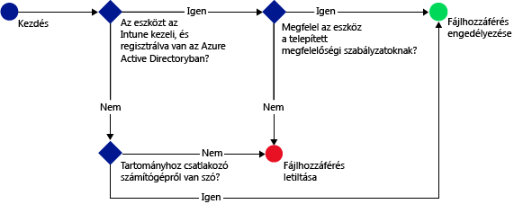

# A SharePoint Online-hoz való hozzáférés korlátozása a Microsoft Intune-nal
Használja az [!INCLUDE[wit_firstref](../includes/wit_firstref_md.md)] feltételes hozzáférés funkcióját a SharePoint Online-on lévő fájlok elérésének szabályozására.
A feltételes hozzáférés két összetevőből áll:
- Egy eszközmegfelelőségi szabályzat, amelynek az eszköznek meg kell felelnie, hogy a rendszer megfelelőnek találja.
- Egy feltételes hozzáférési szabályzat, amelyben meg kell határoznia a feltételeket, amelyeknek az eszköznek meg kell felelnie ahhoz, hogy hozzáférhessen a szolgáltatáshoz.
Ha szeretné jobban megismerni a feltételes hozzáférés működését, olvassa el a [Restrict access to email, O365, and other services](restrict-access-to-email-and-o365-services-with-microsoft-intune.md) (Az e-mailek és az O365-szolgáltatások elérésének korlátozása) című témakört.

A megfelelőség és a feltételes hozzáférési szabályzatok a felhasználónál vannak telepítve. A rendszer minden olyan eszköz megfelelőségét ellenőrzi, amelyről a felhasználó használja a szolgáltatásokat.

Amikor egy felhasználó támogatott alkalmazással (mint például a OneDrive) próbál csatlakozni egy fájlhoz az eszközéről, a következő kiértékelést hajtja végre a rendszer:

**Mielőtt** beállítaná a SharePoint Online-ra vonatkozó feltételes hozzáférési szabályzatot, a következőknek kell teljesülniük:
- Rendelkeznie kell **SharePoint Online-előfizetéssel**, a felhasználóknak pedig licenccel kell rendelkezniük a SharePoint Online-hoz.
- Rendelkeznie kell **Enterprise Mobility + Security vagy Azure Active Directory Premium szintű előfizetéssel**, és a felhasználóknak licenccel kell rendelkezniük az EMS-hez vagy az AD-hoz. Részletesebb tájékoztatást az [Enterprise Mobility díjszabását](https://www.microsoft.com/en-us/cloud-platform/enterprise-mobility-pricing) vagy az [Azure Active Directory díjszabását ismertető lapon](https://azure.microsoft.com/en-us/pricing/details/active-directory/) talál.

  Ha csatlakozni szeretne a kívánt fájlokhoz, az eszköznek az alábbi feltételeknek kell megfelelniük:
-   Az [!INCLUDE[wit_nextref](../includes/wit_nextref_md.md)]-nal **regisztrálva** kell lennie, vagy egy tartományhoz csatlakozó számítógépnek kell lennie.

-   **Az eszközt regisztrálni kell** az Azure Active Directoryban (ez automatikusan megtörténik, amikor az eszközt regisztrálják a következőn: [!INCLUDE[wit_nextref](../includes/wit_nextref_md.md)]).

-   Meg kell felelnie az összes telepített [!INCLUDE[wit_nextref](../includes/wit_nextref_md.md)] megfelelőségi szabályzatnak.

Az eszköz állapotát a rendszer az Azure Active Directoryban tárolja, amely a megadott feltételek alapján engedélyezi vagy letiltja a fájlok elérését.

Ha egy feltétel nem teljesül, a felhasználó számára az alábbi üzenetek egyike jelenik meg a bejelentkezéskor:

-   Ha az eszköz nincs regisztrálva az [!INCLUDE[wit_nextref](../includes/wit_nextref_md.md)]-ban vagy az Azure Active Directoryban, megjelenik egy üzenet, amely leírja, hogyan kell telepíteni a Vállalati portál alkalmazást és regisztrálni az eszközt.

-   Ha az eszköz nem megfelelő, egy üzenet jelenik meg, amely a felhasználót az [!INCLUDE[wit_nextref](../includes/wit_nextref_md.md)] Vállalati portál webhelyre irányítja, ahol további információt talál a problémáról és megoldásáról.

**A feltételes hozzáférés minden SharePoint-helyen kényszerítve van, és blokkolva van a külső megosztás**

>[!NOTE]
>Ha engedélyezi a SharePoint Online-on a feltételes hozzáférést, javasoljuk, hogy tiltsa le a tartományt a listán a [Remove-SPOTenantSyncClientRestriction](https://technet.microsoft.com/en-us/library/dn917451.aspx) témakörben ismertetett módon.  

## A mobileszközök támogatása
- iOS 8.0 és újabb verziók
- Android 4.0-s és újabb verziók, Samsung KNOX szabvány 4.0-s vagy újabb verziók
- Windows Phone 8.1 és újabb verziók

Letilthatja a SharePoint Online-hoz való **iOS** és **Android** böngészőkkel történő hozzáférést.  A hozzáférés csak a szabályzatnak megfelelő eszközök támogatott böngészőiről engedélyezett:
* Safari (iOS)
* Chrome (Android)
* Managed Browser (iOS és Android)

**A nem támogatott böngészők le lesznek tiltva**.

## Számítógépek támogatása
- Windows 8.1 és újabb (az Intune-nal történt regisztráció esetén)
- Windows 7.0, Windows 8.1 vagy Windows 10 (ha tartományhoz csatlakozik)
> [!NOTE]
>Ahhoz, hogy feltételes hozzáférést használhasson Windows 10-es számítógépeken, frissítenie kell a gépeket a Windows 10 évfordulós frissítéssel.

  - Tartományhoz csatlakozó számítógépek esetén be kell állítani az Azure Active Directoryban való [automatikus regisztrációt](https://azure.microsoft.com/en-us/documentation/articles/active-directory-conditional-access-automatic-device-registration/).
Az AAD DRS szolgáltatás automatikusan aktiválódik az Intune-t és az Office 365-öt használó ügyfelek számára. Azok az ügyfelek, akik már telepítették az ADFS eszközregisztrációs szolgáltatását, nem fogják látni a regisztrált eszközöket a helyszíni Active Directoryban.

  - Ha a szabályzat úgy van beállítva, hogy megkövetelje a tartományhoz való csatlakozást, és a számítógép nem csatlakozik tartományhoz, megjelenik egy üzenet, amely jelzi, hogy kapcsolatba kell lépni a rendszergazdával.

  - Ha a szabályzat úgy van beállítva, hogy tartományhoz való csatlakozást vagy megfelelőséget követeljen meg, és a számítógép egyik követelménynek sem felel meg, egy utasításokat tartalmazó üzenet jelenik meg, amely leírja, hogyan telepítse a Vállalati portál alkalmazást, és hogyan regisztrálja az eszközt.
  >[!NOTE]
  >A feltételes hozzáférés nem támogatott az Intune-számítógépügyfelet futtató számítógépeken.

-    Az [Office 365 modern hitelesítésének engedélyezve kell lennie](https://support.office.com/en-US/article/Using-Office-365-modern-authentication-with-Office-clients-776c0036-66fd-41cb-8928-5495c0f9168a), és a számítógépre telepíteni kell az Office legújabb frissítéseit.

    A modern hitelesítéssel Active Directory Authentication Library-alapú (ADAL-alapú) bejelentkezés biztosítható az Office 2013 Windows-ügyfelein, és jobb biztonságot kínál, többek között a **többtényezős hitelesítéssel** és a **tanúsítványalapú hitelesítéssel**.

## A SharePoint Online feltételes hozzáférésének beállítása

### 1. lépés: Az Active Directory-alapú biztonsági csoportok beállítása
Kezdés előtt állítsa be az Azure Active Directory-alapú biztonsági csoportokat a feltételes hozzáférési szabályzathoz. Ezeket a csoportokat az **Office 365 Felügyeleti központban**vagy az **Intune-fiókportálon**konfigurálhatja. A rendszer ezen csoportok alapján célozza meg a felhasználókat, illetve helyezi őket kivétel alá. Amikor egy felhasználóra házirend vonatkozik, az erőforrások eléréséhez az általa használt összes eszköznek meg kell felelnie a házirendnek.

Egy SharePoint Online-szabályzatban két csoporttípust adhat meg:

-   **Megcélzott csoportok** – A szabályzat hatálya alá eső felhasználók csoportjait tartalmazza.

-   **Kivétel alá eső csoportok** – A szabályzat alól mentesülő felhasználók csoportjait tartalmazza.

Ha egy felhasználó mindkét csoportban szerepel, mentesül a házirend alól.

### 2. lépés: Megfelelőségi szabályzat konfigurálása és telepítése
Ha eddig még nem tette meg, hozza létre és regisztrálja a megfelelőségi szabályzatot azoknak a felhasználóknak, akikre a SharePoint Online-szabályzat vonatkozni fog.

> [!NOTE]
> A megfelelőségi szabályzatok az [!INCLUDE[wit_nextref](../includes/wit_nextref_md.md)]-csoportokra vonatkoznak, a feltételes hozzáférési szabályzatok viszont az Azure Active Direct orybiztonsági csoportokat célozzák meg.

A megfelelőségi szabályzat konfigurálásának részletei a [Megfelelőségi szabályzat létrehozása](create-a-device-compliance-policy-in-microsoft-intune.md) című részben találhatók.

> [!IMPORTANT]
> Amennyiben nem telepített megfelelőségi szabályzatot, a rendszer megfelelőként fogja értékelni az eszközöket.

Ha készen áll, folytassa a **3. lépéssel**.

### 3. lépés: A SharePoint Online-szabályzat beállítása
Ezután állítsa be úgy a házirendet, hogy csak a felügyelt és a feltételeknek megfelelő eszközök érhessék el a SharePoint Online-t. A szabályzat ezek után az Azure Active Directoryban tárolódik.

#### 

>[!NOTE]
> Az Azure AD felügyeleti konzolján is létrehozhat feltételes hozzáférési szabályzatot. Az Azure AD felügyeleti konzolon a többtényezős hitelesítéshez hasonló egyéb feltételes hozzáférési szabályzatokon kívül létrehozhatja az Intune-eszközök feltételes hozzáférési szabályzatát is (ennek neve az Azure AD-ben **eszközalapú hozzáférési szabályzat**).  Külső gyártók vállalati alkalmazásaihoz is beállíthat hozzáférési szabályzatokat, ha az Azure AD támogatja őket (például a Salesforce-hoz és a Boxhoz). További részleteket a [How to set Azure Active Directory device-based conditional access policy for access control to Azure Active Directory connected applications](https://azure.microsoft.com/en-us/documentation/articles/active-directory-conditional-access-policy-connected-applications/) (Hogyan állítható be eszközalapú feltételes hozzáférési szabályzat az Azure Active Directoryban az Azure Active Directoryhoz csatlakozó eszközök hozzáférés-vezérlésére) című cikkben olvashat.

1.  A [Microsoft Intune felügyeleti konzolon](https://manage.microsoft.com) kattintson a **Szabályzat** > **Feltételes hozzáférés** > **SharePoint Online-szabályzat** lehetőségre.

2.  Válassza a **Feltételes hozzáférési szabályzat engedélyezése SharePoint Online-hoz** lehetőséget.

3.  Az **Alkalmazás-hozzáférés** szakaszban kiválaszthatja, hogy mire szeretné alkalmazni a feltételes hozzáférési szabályzatot:

    -   **Összes platform**

        Ha ezt a beállítást szeretné használni, a **SharePoint Online** elérésére használt összes eszköznek regisztrálva kell lennie az Intune-ban, és meg kell felelnie a szabályzatoknak.  Minden **modern hitelesítést** használó ügyfélalkalmazás a feltételes hozzáférési szabályzat hatálya alá tartozik. Ha a platformot az Intune jelenleg nem támogatja, akkor a **SharePoint Online**-hoz való hozzáférés le van tiltva.

        A **Minden platform** beállítás kiválasztásával az Azure Active Directory minden hitelesítési kérelemre alkalmazza a szabályzatot, az ügyfélalkalmazás által jelentett platformtól függetlenül.  Az alábbiakat kivéve minden platform köteles regisztrálni és megfelelni:
        *   A Windows-eszközöknek kötelező regisztrálni és megfelelni, a tartományt csatlakoztatni a helyszíni Active Directoryhoz, vagy mindkettő
        * Nem támogatott platformok, például a Mac.  Azonban az ezekről a platformokról származó, modern hitelesítést használó alkalmazások továbbra is le lesznek tiltva.

    -   **Megadott platformok**

         A megadott platformokon minden modern hitelesítést használó ügyfélalkalmazás a feltételes hozzáférési szabályzat hatálya alá tartozik.

     A Windows rendszerű számítógépek esetében a számítógépnek vagy tartományhoz kell csatlakoznia, vagy regisztrálva kell lennie az [!INCLUDE[wit_nextref](../includes/wit_nextref_md.md)]-nal, és meg kell felelnie a szabályzatnak. A következő követelményeket állíthatja be:

     -   **Az eszközöknek tartományhoz kell csatlakozniuk vagy meg kell felelniük a szabályzatnak.** Válassza ezt a lehetőséget, ha a számítógépeknek  tartományhoz kell csatlakozniuk, vagy meg kell felelniük az [!INCLUDE[wit_nextref](../includes/wit_nextref_md.md)]-ban beállított szabályzatoknak. Ha a számítógép egyik követelménynek sem felel meg, a rendszer kérni fogja a felhasználótól, hogy regisztrálja az eszközt a következővel: [!INCLUDE[wit_nextref](../includes/wit_nextref_md.md)].

     -   **Az eszközöknek tartományhoz kell csatlakozniuk.** Válassza ezt a lehetőséget, ha elő kívánja írni, hogy a számítógépeknek tartományhoz kell csatlakozniuk az Exchange Online-hoz való hozzáféréshez. Ha a számítógép nem csatlakozik tartományhoz, a rendszer blokkolja a levelezéshez való hozzáférést és kéri a felhasználót, hogy lépjen kapcsolatba a rendszergazdával.

     -   **Az eszközöknek meg kell felelniük a szabályzatnak.** Válassza ezt a lehetőséget, ha elő kívánja írni, hogy a számítógépek regisztrálva legyenek az [!INCLUDE[wit_nextref](../includes/wit_nextref_md.md)]-nal és megfeleljenek a szabályzatnak. Ha a számítógép nincs regisztrálva, megjelenik egy utasításokat tartalmazó üzenet, amely leírja, hogyan regisztrálja az eszközt.

4.   A **Böngészőalapú hozzáférés** SharePoint online-hoz és a OneDrive-hoz beállítás alatt engedélyezheti, hogy az Exchange Online-hoz csak a támogatott böngészőkkel lehessen hozzáférni: Safari (iOS), és Chrome (Android). A más böngészőkkel történő hozzáférés le lesz tiltva.  A OneDrive megadott alkalmazás-hozzáférési platformkorlátozásai itt is érvényesek.

  Az **Android** eszközök felhasználóinak engedélyezni kell a böngészőalapú hozzáférést.  A végfelhasználónak ehhez a regisztrált eszközön be kell kapcsolnia a „Böngészőalapú hozzáférés engedélyezése” opciót az alábbi módon:
  1.    Nyissa meg a **Vállalati portál alkalmazást**.
  2.    Nyissa meg a **Beállítások** lapot a három pontra (...) vagy a hardver menü gombjára kattintva.
  3.    Kattintson a **Böngészőalapú hozzáférés engedélyezése** gombra.
  4.  A Chrome böngészőben jelentkezzen ki az Office 365-ből, majd indítsa újra a Chrome-ot.

  **iOS és Android** platformokon a szolgáltatás eléréséhez használt eszköz azonosításához az Azure Active Directory egy Transport Layer Security (TLS-) tanúsítványt rendel az eszközhöz.  Az eszköz az alábbi képernyőfelvételnek megfelelően megjeleníti a tanúsítványt, és a végfelhasználótól annak kiválasztását kéri. A végfelhasználónak a böngésző további használatához ki kell választania ezt a tanúsítványt.

  **iOS**

  

  **Android**

  
5.  A **Megcélzott csoportok** területen kattintson a **Módosítás** lehetőségre azon Active Directory-alapú biztonsági csoportok kiválasztásához, amelyekre érvényes a szabályzat. Kiválaszthatja, hogy a szabályzat minden felhasználóra, vagy csak felhasználók bizonyos csoportjaira vonatkozzon.

6.  A **Kivétel alá eső csoportok**területen kattintson a **Módosítás** lehetőségre azon Active Directory-alapú biztonsági csoportok kiválasztásához, amelyekre nem érvényes a szabályzat.

6.  Ha elkészült, válassza a **Mentés** elemet.

Nem kell telepítenie a feltételes hozzáférési szabályzatot, az azonnal érvénybe lép.

### 4. lépés: A megfelelőség és a feltételes hozzáférési szabályzatok figyelése
A **Csoportok** munkaterületen megtekintheti eszközei állapotát.

Válassza ki bármelyik mobileszköz-csoportot, majd az **Eszközök** lapon válasszon az alábbi **Szűrők**közül:

-   **Az AAD-ben nem regisztrált eszközök** – Ezeknek az eszközöknek nincs hozzáférése a SharePoint Online-hoz.

-   **Nem megfelelő eszközök** – Ezeknek az eszközöknek nincs hozzáférése a SharePoint Online-hoz.

-   **Az AAD-ben regisztrált és megfelelő eszközök** – Ezek az eszközök hozzáférhetnek a SharePoint Online-hoz.

### További információ
[Az e-mailek és az O365-szolgáltatások elérésének korlátozása a Microsoft Intune-ban](restrict-access-to-email-and-o365-services-with-microsoft-intune.md)

<!--HONumber=Oct16_HO1-->

