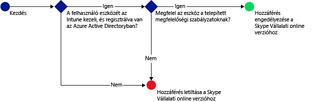

# A Skype Vállalati online verzió elérésének korlátozása a Microsoft Intune-nal
A Skype Vállalati online verzióhoz való hozzáférés korlátozásához állítson be feltételes hozzáférési szabályzatot a **Skype Vállalati online verzióhoz**.
A feltételes hozzáférés két összetevőből áll:
- Egy eszközmegfelelőségi szabályzatból, amelynek az eszköznek meg kell felelnie ahhoz, hogy a rendszer megfelelőnek találja.
- Egy feltételes hozzáférési szabályzatból, amelyben meg kell határoznia a feltételeket, amelyeknek az eszköznek meg kell felelnie ahhoz, hogy hozzáférhessen a szolgáltatáshoz.
Ha szeretné jobban megismerni a feltételes hozzáférés működését, olvassa el [Az e-mailek és az O365-szolgáltatások elérésének korlátozása](restrict-access-to-email-and-o365-services-with-microsoft-intune.md) című cikket.

Amikor egy célzott felhasználó a Skype Vállalati online verziót szeretné használni eszközén, a következő ellenőrzés megy végbe:

**Mielőtt** beállítaná a Skype Vállalati online verzióra vonatkozó feltételes hozzáférési szabályzatot, a következőknek kell teljesülniük:
- Rendelkeznie kell **Skype Vállalati online verzió-előfizetéssel**, valamint ki kell osztania a Skype Vállalati online verzió licenceit a felhasználóknak.
- Rendelkeznie kell **Enterprise Mobility + Security vagy Azure Active Directory Premium szintű előfizetéssel**, és a felhasználóknak licenccel kell rendelkezniük az EMS-hez vagy az AD-hoz. Részletesebb tájékoztatást az [Enterprise Mobility díjszabását](https://www.microsoft.com/en-us/cloud-platform/enterprise-mobility-pricing) vagy az [Azure Active Directory díjszabását ismertető lapon](https://azure.microsoft.com/en-us/pricing/details/active-directory/) talál. 

-   [Engedélyeznie kell a modern hitelesítést](https://docs.microsoft.com/en-us/intune/deploy-use/restrict-access-to-skype-for-business-online-with-microsoft-intune) a Skype Vállalati online verzióhoz.
-  Minden végfelhasználónak a **Skype Vállalati online verziót** kell használnia. Amennyiben a telepítésben Skype Vállalati online verzió és helyi Skype Vállalati verzió is szerepel, a rendszer nem alkalmazza a feltételes hozzáférési szabályzatot a végfelhasználókra.

    A Skype Vállalati online verzióhoz hozzáférést igénylő eszközre vonatkozóan a következőknek kell teljesülniük:

-   Az eszköz legyen **Android** vagy **iOS** rendszerű.

-   Legyen **regisztrálva** a következővel: [!INCLUDE[wit_nextref](../includes/wit_nextref_md.md)].

-   **Feleljen meg** a telepített [!INCLUDE[wit_nextref](../includes/wit_nextref_md.md)] megfelelőségi szabályzatoknak.

Az eszköz állapotát a rendszer az Azure Active Directoryban tárolja, amely a megadott feltételek alapján engedélyezi vagy letiltja a hozzáférést.

Ha egy feltétel nem teljesül, a felhasználó számára az alábbi üzenetek egyike jelenik meg a bejelentkezéskor:

-   Ha az eszköz nincs regisztrálva az [!INCLUDE[wit_nextref](../includes/wit_nextref_md.md)]-ban vagy az Azure Active Directoryban, megjelenik egy üzenet, amely leírja, hogyan kell telepíteni a Vállalati portál alkalmazást, illetve regisztrálni az eszközt.

-   Ha az eszköz nem megfelelő, egy üzenet jelenik meg, amely az [!INCLUDE[wit_nextref](../includes/wit_nextref_md.md)] vállalati portálra vagy a Vállalati portál alkalmazásba irányítja a felhasználót, ahol további információt talál a problémáról, és annak megoldásáról.

## A Skype Vállalati online verzió feltételes elérésének beállítása

### 1. lépés: Az Active Directory-alapú biztonsági csoportok beállítása
Kezdés előtt állítsa be az Azure Active Directory-alapú biztonsági csoportokat a feltételes hozzáférési szabályzathoz. Ezeket a csoportokat az **Office 365 Felügyeleti központban** konfigurálhatja. A rendszer ezen csoportok alapján célozza meg a felhasználókat, illetve helyezi őket kivétel alá. Amikor egy felhasználóra házirend vonatkozik, az erőforrások eléréséhez az általa használt összes eszköznek meg kell felelnie a házirendnek.

A Skype Vállalati verziójára vonatkozó szabályzatban két csoporttípust határozhat meg:

-   **Megcélzott csoportok** – A szabályzat hatálya alá eső felhasználók csoportjait tartalmazza.

-   **Kivétel alá eső csoportok** – A szabályzat alól mentesülő felhasználók csoportjait tartalmazza.

Ha egy felhasználó mindkét csoportban szerepel, mentesül a házirend alól.

### 2. lépés: Megfelelőségi szabályzat konfigurálása és telepítése
[Hozzon létre](create-a-device-compliance-policy-in-microsoft-intune.md) és [telepítsen](deploy-and-monitor-a-device-compliance-policy-in-microsoft-intune.md) megfelelőségi szabályzatot a szabályzat hatálya alá eső összes eszközre. Ez minden olyan eszközre értendő, amelyet a **Megcélzott csoportok** csoporthoz tartozó felhasználók használnak.

> [!NOTE]
> A megfelelőségi szabályzatok az [!INCLUDE[wit_nextref](../includes/wit_nextref_md.md)]-csoportokra vonatkoznak, a feltételes hozzáférési szabályzatok viszont az Azure Active Direct orybiztonsági csoportokat célozzák meg.

> [!IMPORTANT]
> Amennyiben nem telepített megfelelőségi szabályzatot, a rendszer megfelelőként fogja értékelni az eszközöket.

Ha készen áll, folytassa a **3. lépéssel**.

### 3. lépés: A Skype Vállalati online verzióra vonatkozó szabályzat beállítása
Ezután állítsa be úgy a szabályzatot, hogy csak a felügyelt és a feltételeknek megfelelő eszközök érhessék el a Skype Vállalati online verziót. A szabályzat ezek után az Azure Active Directoryban tárolódik.

####
1.  A [Microsoft Intune felügyeleti konzolon](https://manage.microsoft.com) kattintson a **Házirend** > **Feltételes hozzáférés** > **A Skype Vállalati online verzió szabályzata** lehetőségre.

2.  Válassza a **Feltételes hozzáférési szabályzat engedélyezése** lehetőséget.

3.  Az **Alkalmazás-hozzáférés** szakaszban kiválaszthatja, hogy mire szeretné alkalmazni a feltételes hozzáférési szabályzatot:

    -   **iOS**

    -   **Android**

4.  A **Megcélzott csoportok**területen kattintson a **Módosítás** lehetőségre azon Active Directory-alapú biztonsági csoportok kiválasztásához, amelyekre érvényes a szabályzat. Kiválaszthatja, hogy a szabályzat minden felhasználóra, vagy csak felhasználók bizonyos csoportjaira vonatkozzon.

5.  A **Kivétel alá eső csoportok**területen kattintson a **Módosítás** lehetőségre azon Active Directory-alapú biztonsági csoportok kiválasztásához, amelyekre nem érvényes a szabályzat.

6.  Amikor elkészült, kattintson a **Mentés**gombra.

Ezzel elvégezte a Skype Vállalati online verzió feltételes elérésének beállítását. Nem kell telepítenie a feltételes hozzáférési házirendet, azonnal érvénybe lép.

## A megfelelőség és a feltételes hozzáférési házirendek megfigyelése
A **Csoportok** munkaterületen megtekintheti eszközei feltételes hozzáférési állapotát.

Válassza ki bármelyik mobileszköz-csoportot, majd az **Eszközök** lapon válasszon az alábbi **Szűrők**közül:

* **Az AAD-ben nem regisztrált eszközök** – Ezeknek az eszközöknek nincs hozzáférésük a Skype Vállalati online verzióhoz.

* **Nem megfelelő eszközök** – Ezeknek az eszközöknek nincs hozzáférésük a Skype Vállalati online verzióhoz.

* **Az AAD-ben regisztrált és megfelelő eszközök** – Ezek az eszközök hozzáférhetnek a Skype Vállalati online verzióhoz.

<!--HONumber=Oct16_HO1-->

