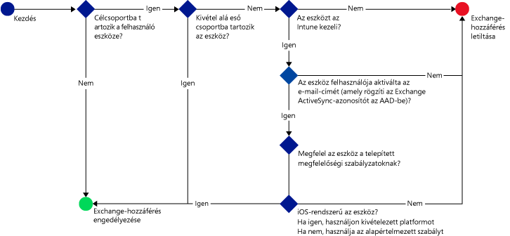

---
# required metadata

title: E-mailekhez való hozzáférés korlátozása – Példaforgatókönyvek | Microsoft Intune
description:
keywords:
author: karthikaraman
manager: jeffgilb
ms.date: 04/28/2016
ms.topic: article
ms.prod:
ms.service: microsoft-intune
ms.technology:
ms.assetid: 454eab79-b620-42c9-b8e6-fada6e719fcd

# optional metadata

#ROBOTS:
#audience:
#ms.devlang:
ms.reviewer: jeffgilb
ms.suite: ems
#ms.tgt_pltfrm:
#ms.custom:

---

# Az e-mailek elérésének korlátozása a Microsoft Intune használatával: Példaforgatókönyvek

## Felhasználók megakadályozása az Exchange Online nem megfelelő eszközökkel való elérésében.
### Forgatókönyv követelményei
- A **Könyvelés** Active Directory biztonsági csoportban lévő összes felhasználó számára le kell tiltani az Exchange Online elérését, ha az eszközük nem felel meg egy telepített megfelelőségi szabályzatnak.
- Ha tartozik a csoportba olyan felhasználó, akinek az eszközeit az [!INCLUDE[wit_nextref](../includes/wit_nextref_md.md)] nem támogatja, számára le kell tiltani az Exchange Online elérését a kérdéses eszközökön.
- A **Pénzügy** Active Directory biztonsági csoportba tartozó egyik felhasználóra sem lehet érvényes a szabályzat, még akkor sem, ha az adott felhasználó a **Könyvelés** biztonsági csoportban is szerepel.

Ennek eléréséhez hozzon létre egy feltételes hozzáférési szabályzatot az Exchange Online rendszerre vonatkozóan a következő beállításokkal:

-   Válassza a **Feltételes hozzáférési szabályzat engedélyezése** lehetőséget..

- Válassza ki a platformot, amelyhez hozzáférést szeretne biztosítani a modern hitelesítést használó alkalmazásokból.
- Az Exchange ActiveSync alkalmazások esetében jelölje be a következőket: **A nem megfelelő eszközök letiltása a Microsoft Intune által támogatott platformokon** és **Minden egyéb eszköz letiltása a Microsoft Intune által nem támogatott platformokon.**
-   A **Célcsoport** részben, a **Kiválasztott biztonsági csoportok** alatt válassza a **Könyvelés** felhasználói csoportot.

-   A **Kivétel alá eső csoportok** részben, a **Kiválasztott biztonsági csoportok** alatt válassza a **Pénzügy** felhasználói csoportot.

A következő folyamattal határozható meg, hogy mely eszközök érhessék el az Exchange Online-t:

## A helyi Exchange-et elérő összes iOS-eszközt az Intune-nak kell kezelnie
### Forgatókönyv követelményei
- A helyi Exchange-hez kizárólag iOS-rendszerrel működő eszközöknek lehessen hozzáférése.
- Ahhoz, hogy az eszközöket használni lehessen az Exchange elérésére, regisztrálni kell őket az Intune-ban, illetve meg kell felelniük a megfelelőségi szabályzat előírásainak.

Ennek eléréséhez hozzon létre egy feltételes hozzáférési szabályzatot a helyi Exchange-re vonatkozóan a következő beállításokkal:

-   Válassza **A helyi Exchange-hez való hozzáférés letiltása a levelezőalkalmazásoknak, ha az eszköz nem kompatibilis vagy nincs regisztrálva a Microsoft Intune-ba** lehetőséget. Ezzel a beállítással engedélyezi a feltételes hozzáférési szabályzatot, amely gondoskodik arról, hogy csak azok az eszközök férjenek hozzá az Exchange-hez, amelyeket regisztráltak a Microsoft Intune-ban, illetve amelyek megfelelnek a megfelelőségi szabályzat előírásainak.

-   Az Exchange Active Sync speciális beállításainak megadásához hozza létre a következőket:

  -   Platformkivétel, amely lehetővé teszi, hogy az iOS rendszerű eszközök hozzáférjenek az Exchange-hez.   

  -   Alapértelmezett szabály, amely meghatározza, hogy amennyiben egy adott eszközre nem vonatkoznak a platformkivétel szabályai, az eszköz ne férhessen hozzá az Exchange-hez. Ez a szabály gondoskodik arról, hogy az Exchange-hez kizárólag az iOS rendszerű eszközök férjenek hozzá.

A következő folyamattal határozható meg, mely eszközök férhetnek hozzá az Exchange-hez:

## Az Android-eszközök nem férnek hozzá a helyi Exchange-hez.
### Forgatókönyv követelményei
- Android-eszközök ne férhessenek hozzá az Exchange-hez.
- Az összes többi támogatott eszköz hozzáfér az Exchange-hez, ha a következő kezeli őket: [!INCLUDE[wit_nextref](../includes/wit_nextref_md.md)].

Ennek eléréséhez hozzon létre egy feltételes hozzáférési szabályzatot a helyi Exchange rendszerre vonatkozóan a következő beállításokkal:

-   Válassza **A helyi Exchange-hez való hozzáférés letiltása a levelezőalkalmazásoknak, ha az eszköz nem kompatibilis vagy nincs regisztrálva a Microsoft Intune-ba** lehetőséget. A beállítás kiválasztásával megköveteli az eszközök regisztrálását az Intune-ban, valamint a megfelelőségi szabályzat előírásainak betartását.

- Az Exchange Active Sync speciális beállításainak megadásához hozza létre a következőket:
  -   Platformkivétel, amely blokkolja az Android rendszerű eszközök hozzáférését az Exchange-hez. Ez a szabály gondoskodik arról, hogy az Android-eszközök ne érhessék el az Exchange-t.

  -   Alapértelmezett szabály, amely meghatározza, hogy ha egy eszközre nem érvényes más szabály, akkor engedélyezni kell számára az Exchange-hez való hozzáférést. Ez az alapértelmezett szabály gondoskodik arról, hogy azon eszközök, amelyeken nem Android, hanem a Microsoft Intune által támogatott más platform fut, hozzáférhessenek az Exchange-hez. Azonban ezeket is regisztrálni kell az Intune-ban, illetve ezeknek is meg kell felelniük a megfelelőségi szabályzat előírásainak.

A következő folyamattal határozható meg, mely eszközök férhetnek hozzá az Exchange-hez:

<!--HONumber=May16_HO1-->

