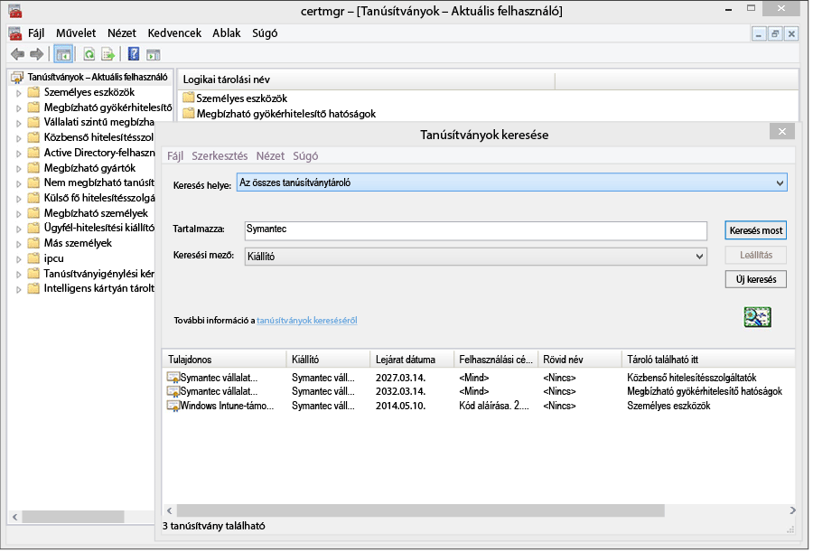
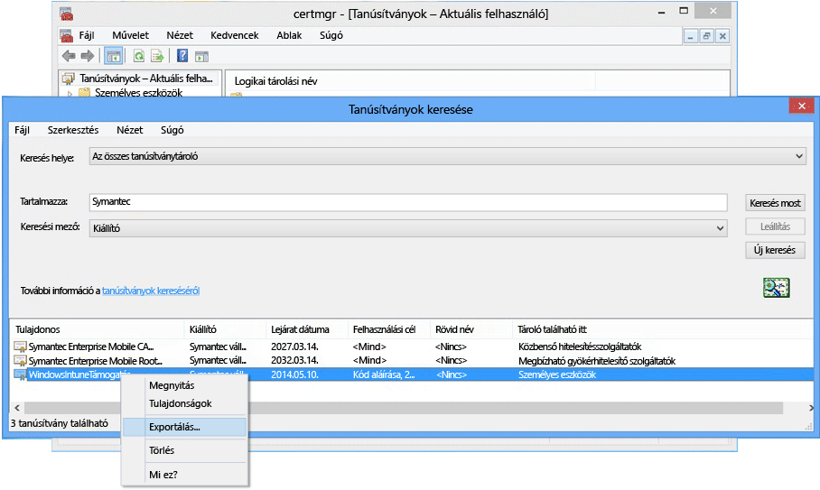

---
# required metadata

title: Windows Phone 8.0 rendszerű telefonok Microsoft Intune-beli felügyeletének beállítása | Microsoft Intune
description:
keywords:
author: NathBarn
manager: jeffgilb
ms.date: 04/28/2016
ms.topic: article
ms.prod:
ms.service: microsoft-intune
ms.technology:
ms.assetid: 61e9b6c3-8795-49b0-8ab2-a9a05ee3ea1f

# optional metadata

#ROBOTS:
#audience:
#ms.devlang:
ms.reviewer: jeffgilb
ms.suite: ems
#ms.tgt_pltfrm:
#ms.custom:

---

# Eszközfelügyelet beállítása Windows Phone 8.0 rendszeren

A Windows Phone 8.0 rendszerű eszközökön az Intune Vállalati portál alkalmazás telepítéséhez, valamint az eszközfelügyelet lehetővé tételéhez Symantec-tanúsítvány szükséges. Ugyancsak tanúsítvány szükséges az üzletági alkalmazások aláírásához. Ez a témakör kizárólag a Windows Phone 8.0 rendszerre vonatkozik. A Windows Phone 8.1 és újabb rendszerű eszközök (ideértve a Windows 10 Mobile rendszert is) felügyeletével kapcsolatban olvassa el a [Windows Phone rendszerű eszközök regisztrálásának beállítása](set-up-windows-phone-management-with-microsoft-intune.md) című témakört.

-   **Windows Phone 8** – Tanúsítvány szükséges
-   A **Windows Phone 8.1 és a Windows 10 Mobile** kizárólag a következő esetekben igényel tanúsítványt:

    -   A Vállalati portál alkalmazásnak az Intune használatával történő telepítésekor

    -   Üzletági (közvetlen telepítésűnek is nevezett) alkalmazások telepítésekor


  > [!IMPORTANT] Az egyes Windows és Windows Phone rendszerű mobileszközök kezelésére szolgáló Symantec-tanúsítványt [rendszeres időközönként meg kell újítani](renew-a-symantec-code-signing-certificate.md).

A Windows Phone-telefonok kezelésével kapcsolatos beállítási követelmények a kezelés módjától függenek.  Ha a munkahely DNS-regisztrációs beállításai között két CNAME rekord is meg van adva, a felhasználók egyszerűbben regisztrálhatják az eszközeiket. Ha a felhasználók letöltik az Áruházból a Vállalati portál alkalmazást, akkor a DNS-beállítások konfigurálása után csupán be kell állítani a portált, majd értesíteni kell a felhasználókat az eszközregisztrálás mikéntjéről.  A Windows Phone 8.0-s és a Windows Phone 8.1-es telefonokon a vállalati portál üzembe helyezésekor a Symantec megfelelő tanúsítványát is telepíteni kell, mert csak így lehet aláírni az alkalmazás kódját.

## Telepítési követelmények konfigurálása a Windows Phone rendszerű eszközök felügyeletének engedélyezése érdekében
1.  **Az Intune beállítása** – Ha még nem tette meg, készítse elő a mobileszköz-kezelést úgy, hogy a **Microsoft Intune-t** állítja be a [mobileszköz-kezelő szolgáltatóként](get-ready-to-enroll-devices-in-microsoft-intune.md#set-mobile-device-management-authority), valamint beállítja a mobileszköz-kezelést.

2.  **A regisztrációs kiszolgáló címéhez tartozó DNS-alias beállítása** (nem kötelező)

    DNS-alias (a CNAME rekordtípus) beállításával megkönnyíthető a felhasználóknak az eszközök regisztrálása, mert így a regisztráláskor a program automatikusan kitölti a kiszolgálónevet tartalmazó mezőt.

    1.  Az [Intune felügyeleti konzoljában](http://manage.microsoft.com) válassza a **Felügyelet** &gt; **Mobileszköz-kezelés** &gt; **Windows Phone** lehetőséget.

    2.  Írja be a munkahelyi webhely ellenőrzött tartományának URL-címét az **Adja meg egy ellenőrzött tartomány nevét** mezőbe, majd kattintson az **Automatikus észlelés tesztelése** elemre.

    3.  Hozza létre a megfelelő **CNAME** DNS-erőforrásrekordokat a munkahelyi tartományhoz. A CNAME erőforrásrekordoknak a következő adatokat kell tartalmazniuk:

        |Állomásnév|A következő helyre mutat|Élettartam|
        |-------------|-------------|-------|
        |enterpriseenrollment.vállalat_tartományneve.com|enterpriseenrollment-s.manage.microsoft.com |1 óra|
        |enterpriseregistration.vállalat_tartományneve.com|enterpriseregistration.windows.net|1 óra|
        Ha a munkahelyi webhely címe például contoso.com, akkor olyan CNAME rekordot kell létrehoznia a DNS-ben, amely az EnterpriseEnrollment.contoso.com webhelyről átirányítja a felhasználókat a manage.microsoft.com webhelyre. Több ellenőrzött tartomány esetén minden tartományhoz külön CNAME rekordot kell létrehozni.

        -   `enterpriseenrollment-s.manage.microsoft.com` – A levelezési tartomány nevéből felismert tartománynév használatával irányítja át a felhasználókat az Intune-ba.

        -   `enterpriseregistration.windows.net` – A mobileszközök munkahelyi hálózathoz való csatlakoztatását teszi lehetővé. emellett a Windows 8.1 feltételes hozzáférést biztosító funkcióját is támogatja.

    

3.  **Tanúsítványkezelés az alkalmazás-aláírás támogatásához** (Olyan Windows Phone 8.0-s vagy Windows Phone 8.1-es telefonok esetében szükséges, amelyeknek nincs hozzáférése a Windows Phone Áruházhoz és/vagy amelyekre üzletági alkalmazásokat kell telepíteni.)

    A Vállalati portál alkalmazás csak akkor használható a Windows Phone 8.0-s telefonokon, illetve csak akkor telepíthetők munkahelyi alkalmazások a Windows Phone 8.1-es telefonokra, ha előbb telepítik azokra a **Symantec Enterprise Mobile Code Signing Certificate**nevű tanúsítványt. Windows Phone-telefonok esetén csak a Symantec-tanúsítványok megbízhatók, így nem használhat saját hitelesítésszolgáltató által kibocsátott tanúsítványokat. Ez a tanúsítvány az alábbiakhoz szükséges:

    -   A Vállalati portál alkalmazás aláírása [!INCLUDE[winphone8_client_1](../includes/winphone8_client_1_md.md)] rendszerre való telepítéshez regisztráció és telefonkezelés céljából

    -   A munkahely üzletági alkalmazásainak aláírásához, hogy az [!INCLUDE[wit_nextref](../includes/wit_nextref_md.md)] telepíthesse őket Windows Phone-telefonokra

    Az alábbi lépésekkel beszerezheti a szükséges tanúsítványokat, és aláírhatja a vállalati portál alkalmazást. Szüksége lesz egy fiókra a Windows Phone-fejlesztői központhoz, majd vásárolnia kell egy Symantec-tanúsítványt.

    1.  **Csatlakozás a Windows Phone-fejlesztői központhoz** A munkahelyi fiók megvásárlásához bejelentkezéskor a céges fiókadatok megadásával csatlakozzon a [Windows Phone-fejlesztői központhoz](http://go.microsoft.com/fwlink/?LinkId=268442). Ezt a kérelmet engedélyeznie kell egy vállalati tisztviselőnek ahhoz, hogy kódaláíró tanúsítványt kaphasson.

    2.  **Céges Symantec-tanúsítvány beszerzése** A [Symantec webhelyén](http://go.microsoft.com/fwlink/?LinkId=268441) vásárolhat tanúsítványt a Symantec-azonosítójával. A tanúsítvány megvásárlása után a Windows Phone-fejlesztői központban regisztrált fiókjában kijelölt munkahelyi jóváhagyó kap egy e-mailt, amely a tanúsítványkérelem jóváhagyását kéri. A Symantec-tanúsítványra vonatkozó követelményekről a [Miért szükséges a Windows Phone-telefonok kezeléséhez Symantec-tanúsítvány?](https://technet.microsoft.com/en-us/library/dn764959.aspx#BKMK_Symantec) című részben talál további információkat. „Gyakori kérdések a Windows Phone rendszerű mobileszközök kezelésével kapcsolatban” szakaszban.

    3.  **Tanúsítványok importálása** A kérelem jóváhagyását követően e-mailt fog kapni, amelyben megtalálja a tanúsítványok importálására vonatkozó utasításokat. A tanúsítványok importálásához kövesse az e-mailben szereplő utasításokat.

    4.  **Az importált tanúsítványok ellenőrzése** Ha ellenőrizni szeretné, hogy helyesen importálta-e a tanúsítványokat, nyissa meg a **Tanúsítványok** beépülő modult, kattintson jobb gombbal a **Tanúsítványok** elemre, majd válassza a **Tanúsítványok keresése** lehetőséget. A **Tartalmazza** mezőben adja meg a „Symantec” kifejezést, majd kattintson a **Keresés most**lehetőségre. Az eredmények között meg kell jelennie az importált tanúsítványoknak.

        

    5.  **Aláíró tanúsítvány exportálása** Miután ellenőrizte a tanúsítványok telepítését, exportálhatja a vállalati portál aláírásához szükséges PFX-fájlt. Válassza ki azt a Symantec-tanúsítványt, amelynek **Felhasználási célja** a következő: „kód aláírása”. Kattintson jobb gombbal a kódaláíró tanúsítványra, majd válassza az **Exportálás** lehetőséget.

        

        A **Tanúsítványexportáló varázslóban**válassza az **Igen, a titkos kulcs exportálását választom** lehetőséget, majd kattintson a **Tovább**gombra. Válassza ki a **Személyes információcsere - PKCS #12 (*.PFX)** lehetőséget, majd jelölje be a **Minden tanúsítvány felvétele a tanúsítványláncba, ha lehetséges** jelölőnégyzetet. Fejezze be a varázslót. További tudnivalókért lásd: [Tanúsítvány exportálása a titkos kulccsal](http://go.microsoft.com/fwlink/?LinkID=203031).

    6.  **A Vállalati portál alkalmazás letöltése és aláírása**

        A Windows Phone-telefonok regisztrálásának támogatásához alá kell írni a Windows Phone 8.0-s Vállalati portál alkalmazást, és fel kell tölteni azt az Intune-ba.

        1.  **A Vállalati portál alkalmazás letöltése** Töltse le a [Windows Phone-os Vállalati Intune-portál](http://go.microsoft.com/fwlink/?LinkId=268440) alkalmazást a letöltőközpontból. Az alapértelmezett telepítési hely a `C:\Program Files (x86)\Microsoft Corporation\Windows Intune Company Portal for Windows Phone`mappa.

        2.  **A Windows Phone 8.0 SDK letöltése** Töltse le a [Windows Phone SDK-t](http://go.microsoft.com/fwlink/?LinkId=615570).

        3.  **A Vállalati portál alkalmazás kódjának aláírása** Az SDK-val letöltött XAPSignTool alkalmazást használva írja alá a vállalati portált a Symantec-tanúsítványból létrehozott PFX-fájllal. További tudnivalókat [a vállalati alkalmazások a XapSignTool eszközzel való aláírásával foglalkozó cikkben](http://go.microsoft.com/fwlink/?LinkID=280195)találhat.

    7.  **A Vállalati portál alkalmazás feltöltése az Intune-ba** Töltse fel az aláírt Vállalati portál alkalmazás fájlját és a kódaláíró tanúsítványt, hogy a végfelhasználók letölthessék az alkalmazást.

        1.  Az [Intune felügyeleti konzoljában](http://manage.microsoft.com) válassza a **Felügyelet** &gt; **Windows Phone** lehetőséget.

        2.  Kattintson az **Aláírt alkalmazásfájl feltöltése** lehetőségre, és jelentkezzen be az Intune-rendszergazdai azonosítójával.

        3.  A **Szoftver telepítése** lap **Adja meg a szoftver telepítőfájljainak helyét** mezőjében keresse meg az aláírt kódú Vállalati portál alkalmazás fájlját (Windows Phone 8.0 esetén .xap, Windows Phone 8.1 esetén pedig .appx).

            Ha éppen kipróbálja az Intune szolgáltatást, ezért Intune-próbafiókban tölt fel aláírt kódú alkalmazást, törölje a jelet **A Vállalati portál alkalmazás a Symantec kódaláíró tanúsítványával aláírt fájljának használata** jelölőnégyzetből.

        4.  Adja hozzá az exportált tanúsítványfájlt (.pfx) a **Kódaláíró tanúsítvány** elemhez, és hozzon létre egy jelszót a tanúsítványhoz.

        5.  A **Szoftver leírása** lapon töltse ki a mezőket, figyelembe véve, hogy a felhasználók ezeket az adatokat fogják látni az eszközeiken, amikor a Vállalati portálon megtekintik az alkalmazás részleteit.

        6.  Fejezze be a varázslót. Most már a Windows Phone 8.0 rendszerű eszközt regisztráló felhasználók a regisztráció során megkapják a Vállalati portál alkalmazást az eszközeikre. A Windows Phone 8.1-es telefont használók a vállalati portál áruházi verziójából is telepíthetik a Vállalati portál alkalmazást.  Ha a Windows Phone 8.1-es telefonok nem rendelkeznek hozzáféréssel a Windows Phone Áruházhoz, vagy az Intune használatával szeretné telepíteni a Vállalati portál alkalmazást, akkor le kell töltenie és alá kell írnia a Windows Phone 8.1-es Vállalati portál alkalmazást (SSP.appx).

4.  **A felhasználók megismertetése azzal, hogy hogyan férhetnek hozzá a munkahelyi erőforrásokhoz a vállalati portálon keresztül** A felhasználóknak tudniuk kell, hogy hogyan regisztrálhatják eszközeiket, és milyen szolgáltatásokat vehetnek majd igénybe a mobileszköz-kezelésbe bevont eszközökön. [Mit kell tudniuk a végfelhasználóknak az Intune használatáról?](what-to-tell-your-end-users-about-using-microsoft-intune.md)

## A Windows Phone 8.1-es Vállalati portál alkalmazás telepítése
Az Intune-t tartalmazó Windows Phone 8.1-es telefonokra a Windows Phone Áruházból való letöltés helyett közvetlenül is telepíthető a Vállalati portál alkalmazás. Ettől függetlenül a fenti lépések elvégzésével és a megfelelő Symantec-tanúsítvány telepítésével engedélyezni kell a Windows Phone-telefonok regisztrálását. Ezután le kell tölteni a Windows Phone 8.1-es Vállalati portál alkalmazást, és alá kell azt írni a Symantec-tanúsítvánnyal.  Erre csak akkor van szükség, ha a felhasználók nem fogják igénybe venni a Vállalati portál alkalmazást, és Windows Phone 8.1-es telefonokra szeretné azt telepíteni.


1.  **A Vállalati portál alkalmazás letöltése**

    Töltse le a [Windows Phone 8.1 rendszerhez készült Microsoft Intune Vállalati portál alkalmazást](http://go.microsoft.com/fwlink/?LinkId=615799) a letöltőközpontból, és futtassa az önkicsomagoló (.exe) fájlt. Ez a fájl két fájlt tartalmaz:

    -   CompanyPortal.appx – a Windows Phone 8.1 rendszerhez készült vállalati portált telepítő alkalmazás

    -   WinPhoneCompanyPortal.ps1 – egy PowerShell-parancsprogram, amellyel aláírhatja a Vállalati portál alkalmazás fájlját, hogy az telepíthető legyen Windows Phone 8.1-es telefonokra

2.  **A Windows Phone SDK letöltése** Töltse le a [Windows Phone SDK 8.0-s verzióját](http://go.microsoft.com/fwlink/?LinkId=615570) (http://go.microsoft.com/fwlink/?LinkId=268439), és telepítse azt a számítógépre. Az SDK az alkalmazásregisztrációs adatblokkok létrehozásához szükséges.

3.  **AETX-fájl létrehozása** Hozza létre az alkalmazásregisztrációs adatblokk .aetx kiterjesztésű fájlját a Symantec PFX-fájlból a Windows Phone SDK 8.0 részét képező AETGenerator.exe eszközzel. Az AETX-fájlok létrehozásával kapcsolatos útmutatást itt találja: [Alkalmazásregisztrációs adatblokk létrehozása a Windows Phone rendszerhez](https://msdn.microsoft.com/library/windows/apps/jj735576.aspx)

4.  **A Windows 8.1 rendszerhez készült Windows SDK letöltése** Töltse le és telepítse a [Windows Phone SDK-t](http://go.microsoft.com/fwlink/?LinkId=613525) (http://go.microsoft.com/fwlink/?LinkId=613525). Ügyeljen arra, hogy a Vállalati portál alkalmazás PowerShell-parancsprogramja az alapértelmezett telepítési helyet ( `${env:ProgramFiles(x86)}\Windows Kits\8.1`) használja. Ha máshová telepíti, meg kell adnia a helyet egy parancsmag-paraméterben.

5.  **Az alkalmazás kódjának aláírása a PowerShell használatával** A telepített Windows SDK-t és a Symantec Enterprise Mobile Code Signing Certificate tanúsítványt tartalmazó gazdagépről nyissa meg a **Windows PowerShell** alkalmazást rendszergazdaként, keresse meg a Sign-WinPhoneCompanyPortal.ps1 fájlt, és futtassa a parancsprogramot.

    **1. példa**

    ```
    .\Sign-WinPhoneCompanyPortal.ps1 -InputAppx 'C:\temp\CompanyPortal.appx' -OutputAppx 'C:\temp\CompanyPortalEnterpriseSigned.appx' -PfxFilePath 'C:\signing\cert.pfx' -PfxPassword '1234' -AetxPath 'C:\signing\cert.aetx'
    ```
    Ebben a példában a CompanyPortal.appx fájl lesz aláírva a C:\temp\ mappában, így létrejön a CompanyPortalEnterpriseSigned.appx fájl. A program az 1234 PFX-jelszót használja, a gyártó azonosítóját pedig a PFX-fájlból olvassa be. Emellett beolvassa a vállalati azonosítót is a cert.aetx fájlból.

    **2. példa**

    ```
    .\Sign-WinPhoneCompanyPortal.ps1 -InputAppx 'C:\temp\CompanyPortal.appx' -OutputAppx 'C:\temp\CompanyPortalEnterpriseSigned.appx' -PfxFilePath 'C:\signing\cert.pfx' -PfxPassword '1234' -PublisherId 'OID.0.9.2342.19200300.100.1.1=1000000001, CN="Test, Inc.", OU=Test 1' -EnterpriseId 1000000001
    ```
    Ebben a példában a CompanyPortal.appx fájl lesz aláírva a C:\temp\ mappában, így létrejön a CompanyPortalEnterpriseSigned.appx fájl. A program az 1234 PFX-jelszót, valamint a megadott gyártóazonosítót használja.

    **Paraméterek:**

    -   `-InputAppx` – A CompanyPortal.appx fájl helyi elérési útja szimpla idézőjelben. Például: 'C:\temp\CompanyPortal.appx'.

    -   `-OutputAppx` – Az aláírt Vállalati portál alkalmazás helyi elérési útja és fájlneve szimpla idézőjelben. Például: 'C:\temp\CompanyPortalEnterpriseSigned.appx'.

    -   `-PfxFilePath` – A Symantec-tanúsítvány exportált PFX-fájljának helyi elérési útja és fájlneve. Például: 'C:\signing\cert.pfx'.

    -   `-PfxPassword` – A PFX-fájl aláírásához használt jelszó szimpla idézőjelben. Például: '1234'.

    -   `-AetxPath` A vállalati azonosító beolvasásához használt .aetx fájl helyi elérési útja, ha nincs megadva az EnterpriseId argumentum. Ezt az argumentumot vagy az EnterpriseId argumentumot kötelező megadni. Például: 'C:\signing\cert.aetx'.

    -   `-PublisherId` – A vállalat gyártóazonosítója. Ha nincs megadva, a program a Symantec Enterprise Mobile Code Signing Certificate tanúsítvány Subject (Tulajdonos) mezőjének értékét használja. Például: 'OID.0.9.2342.19200300.100.1.1=1000000001, CN="Test, Inc.", OU=Test 1'.

    -   `-SdkPath` – A Windows 8.1 rendszerhez készült Windows SDK gyökérmappájának elérési útja. Ezt az argumentumot nem kötelező megadni, alapértelmezett értéke pedig ${env:ProgramFiles(x86)}\Windows Kits\8.1.

    -   `-EnterpriseId` – A vállalat azonosítója. Ezt az argumentumot vagy az AetxPath argumentumot kötelező megadni. Ha nincs megadva ez az argumentum, a program az AETX-fájlból olvassa be a vállalat azonosítóját. Például: 1000000001.

6.  Telepítse a Windows Phone 8.1-es Vállalati portál alkalmazást (SSP.appx).

    > [!IMPORTANT]
    > Az ssp.xap fájl és az áruházbeli Vállalati portál egyszerre is telepíthető, ami zavaró lehet a felhasználók számára. Ha azt szeretné, hogy minden felhasználó az ssp.xap fájlt használja, hozzon létre egy letiltott alkalmazást a Vállalati portál áruházbeli verziójához. Három lehetősége van annak elérésére, hogy az összes Windows Phone 8.1 rendszerű eszköz kizárólag a Vállalati portál áruházbeli verzióját használja:
    >
    > -   Ha nem fog közvetlenül telepíteni alkalmazásokat, és nem szükséges támogatnia a Windows Phone 8.0 rendszert, ne töltse fel az aláírt ssp.xap  fájlt.
    > -   Ha szükség van közvetlenül telepített alkalmazásokra, és nincsenek regisztrálva Windows Phone 8 rendszerű eszközök, módosítsa az ssp.xap fájl automatikusan létrehozott telepítését az „elérhető” értékről az „eltávolítás” értékre.
    > -   Ha szükség van közvetlenül telepített alkalmazások telepítésére, valamint Windows Phone 8.0 rendszerű eszközöket is regisztrálni kell, és azoknak fogadnia kell az ssp.xap fájlt, hozzon létre egy új szoftvertelepítést az ssp.xap fájlhoz, és terjessze azt az **Eltávolítás** művelettel. A Windows Phone 8.0 rendszerű eszközök nem támogatják az alkalmazások kényszerített telepítését és eltávolítását, így azok figyelmen kívül fogják hagyni a telepítést. A Windows Phone 8.1 rendszerű eszközök támogatják az eltávolítási műveletet, és el fogják távolítani az ssp.xap alkalmazást.


<!--HONumber=Jun16_HO1-->


