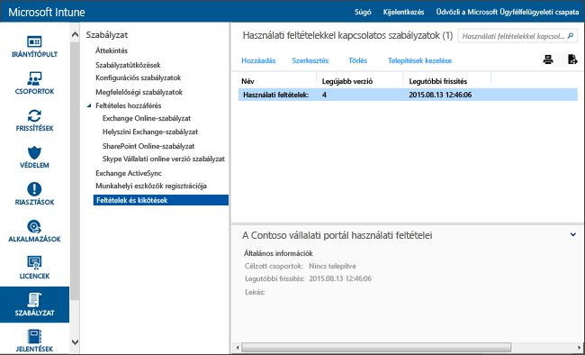

# Használati feltételek házirend-beállításai a Microsoft Intune-ban
A felhasználói csoportok számára megjelenítheti az Intune használati feltételeit. Ezek elmagyarázzák, hogyan érinti az eszközöket és a felhasználókat a regisztráció, a munkahelyi erőforrásokhoz való hozzáférés és a Vállalati portál alkalmazás használata. A felhasználóknak el kell fogadniuk a használati feltételeket ahhoz, hogy regisztrálhassanak a vállalati portálon, és így hozzáférhessenek a munkájukhoz.

Több, különböző használati feltételeket tartalmazó házirendet is létrehozhat és telepíthet. Emellett ugyanazon használati feltételek különböző nyelvű verzióit is elkészítheti, majd telepítheti azokat a megfelelő csoportokban.

## Használati feltételekre vonatkozó szabályzat létrehozása

1.  A [Microsoft Intune felügyeleti konzolon](http://manage.microsoft.com) kattintson a **Házirend** &gt; **Feltételek és kikötések** elemre.

    

2.  Egy új, használati feltételekre vonatkozó házirend létrehozásához kattintson a **Hozzáadás** elemre.

    A meglévő házirendeket **szerkesztheti** és **törölheti** is.

3.  A **Használati feltételek létrehozása** lapon adja meg a következő adatokat:

    -   **Név** – az Intune-konzolon megjelenő egyedi házirendnév

    -   **Leírás** – a házirend az Intune-konzolon való azonosítását segítő részletek

    -   **Cím** – a vállalati portálon a felhasználók számára megjelenő cím

    -   **Annak magyarázata, hogy mit jelent a feltételek elfogadása a felhasználó részéről** – a felhasználók számára megjelenő, az elfogadásra vonatkozó címke. **Például**: „Elfogadom a feltételeket és kikötéseket.”

4.  Amikor végzett, kattintson a **Mentés** gombra. Az új házirend megjelenik a **Házirend** munkaterület **Feltételek és kikötések** csomópontjában.

## A használati feltételekre vonatkozó szabályzat telepítése

1.  A [Microsoft Intune felügyeleti konzolon](http://manage.microsoft.com) kattintson a **Házirend** &gt; **Feltételek és kikötések** elemre.

2.  A **Használati feltételekkel kapcsolatos házirendek** listáról válassza ki a bevezetni kívánt házirendet, majd kattintson a **Központi telepítés kezelése** elemre.

3.  A **Központi telepítés kezelése** párbeszédpanelen válassza ki azt a felhasználói csoportot, amely számára telepíteni kívánja a házirendet, majd kattintson az **OK** gombra.

    Amikor a megcélzott felhasználók hozzáférnek a vállalati portálhoz, az Intune megjeleníti a telepített feltételeket és kikötéseket. Ahhoz, hogy hozzáférhessenek a vállalati erőforrásokhoz, a felhasználóknak el kell fogadniuk ezeket a feltételeket.

## A használati feltételekre vonatkozó szabályzat figyelése

1.  A [Microsoft Intune felügyeleti konzolon](http://manage.microsoft.com) kattintson a **Házirend** &gt; **Feltételek és kikötések** elemre.

2.  Kattintson a **Jelentés megtekintése** lehetőségre az **Új jelentés létrehozása** ablakban. Ekkor megnyílik a jelentés, és részletesen leírja, hogy mely felhasználók fogadták el a telepített használati feltételeket.

### A használati feltételek frissítése és a verziókövetése
Egy meglévő használati feltételekre vonatkozó házirend szerkesztésekor beállíthatja, hogy mi történjen a házirend telepítésekor. Az alábbi eljárással frissítheti a meglévő használati feltételekre vonatkozó házirendeket.

## A használati feltételek több változatának használata

1.  A [Microsoft Intune felügyeleti konzolon](http://manage.microsoft.com) kattintson a **Házirend** &gt; **Feltételek és kikötések** elemre.

2.  Jelölje ki a szerkeszteni kívánt használati feltételekre vonatkozó házirendet, majd kattintson a **Szerkesztés** elemre.

3.  A **Használati feltételek szerkesztése** lapon végezze el a szükséges módosításokat, majd adja meg, hogy az új verzió minden felhasználótól megkövetelje-e a használati feltételek elfogadását, vagy az új verzió csak az új felhasználók számára jelenjen meg.

    Javasoljuk, hogy amikor jelentős módosításokat végez a használati feltételeken, mindig növelje meg a verziószámot és követelje meg azok elfogadását. Akkor tartsa meg az aktuális verziószámot, ha például gépelési hibákat javít vagy a formázást módosítja.

### További információ
[Az eszközök beállításainak és funkcióinak kezelése a Microsoft Intune-házirendek használatával](manage-settings-and-features-on-your-devices-with-microsoft-intune-policies.md)

<!--HONumber=Jul16_HO3-->

