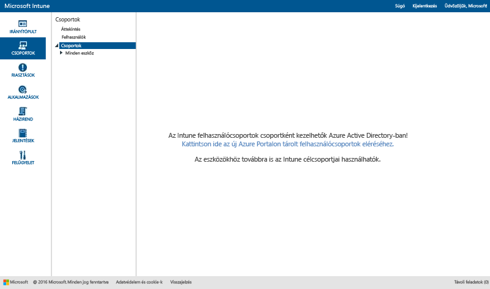

# Csoportok használata felhasználók és eszközök kezelésére a Microsoft Intune-ban

Ez a témakör ismerteti, hogy hogyan lehet csoportokat létrehozni az Intune-ban. Azt is megtudhatja belőle, hogy hogyan változik majd a csoportok kezelése az elkövetkező hónapok során. 

>[!IMPORTANT]
>
>Ha az Intune-portál Csoportok munkaterületét megnyitva megjelenik egy hivatkozás, amely az Azure Active Directory (Azure AD) portálra mutat, akkor ön már az Intune *új* Azure AD biztonságicsoport-alapú csoportkezelését használja, amelynek ismertetése az [Értesítés a csoportkezeléssel kapcsolatos rendszergazdai feladatok fejlesztéséről](#notice-of-upcoming-improvements-to-the-admin-experience-for-groups) című részben található. Kattintson az Azure AD-portálra mutató hivatkozásra.
>
> 
>
>Ha nem látja az Azure AD-portálra mutató hivatkozást, akkor Ön még a *jelenlegi* csoportkezelési módszert használja, amelynek leírása a jelen témakör [Csoportok létrehozása a felhasználók és eszközök kezeléséhez a Microsoft Intune-nal](#Create-groups-to-manage-users-and-devices-with-Microsoft-Intune) című részében található.

## Értesítés a csoportkezeléssel kapcsolatos rendszergazdai feladatok fejlesztéséről

Önök a tudomásunkra hozták, hogy a nagyvállalati mobilitás és biztonság területe egészén egységes csoportosítást és célcsoport-kezelést szeretnének. Mi pedig hallgattunk Önökre. Visszajelzéseik alapján hamarosan Azure Active Directory-alapú biztonsági csoportokká alakítjuk át az Intune-csoportokat. Ez a változás egységesíti a csoportfelügyeletet az Intune és az Azure Active Directory (Azure AD) egészében. Ez annyit jelent, hogy a jövőben nem kell csoportokat duplikálniuk a különböző szolgáltatásokhoz. A Windows PowerShell és a Microsoft Graph alkalmazásának lehetősége egyúttal bővíthetőséget biztosít.

### Hogyan érint ez engem jelen pillanatban?
Az Intune-ügyfeleket most nem érinti a változás. A jövőben azonban:

-   Az új fiókok az Azure AD biztonsági csoportjait fogják használni az Intune *felhasználói* csoportjai helyett.   
-   2016 novemberétől a havi szolgáltatásverzió kiadása után létesített új fiókok a felhasználó- és az eszközalapú csoportokat is az Azure AD-portálon kezelik majd. A meglévő ügyfelekre ez nem lesz hatással.
-   2016 decemberében az Intune-termékcsapat megkezdi a meglévő ügyfelek áttelepítését az új, Azure AD-alapú csoportfelügyeleti rendszerbe. A jelenleg az Intune-ban lévő felhasználó- és eszközcsoportok mindegyikét Azure AD-alapú biztonsági csoportokba telepítjük át. Az áttelepítést nem kezdjük mindaddig, amíg nem tudjuk minimálisra csökkenteni a napi munkára gyakorolt hatását és nem látjuk úgy, hogy az várhatóan semmiféle hatással nem lesz a felhasználókra. A fiókja áttelepítését megelőzően értesíteni fogjuk.

### Hogyan és mikor kerülök át az új csoportkezelési rendszerbe?
Az aktuális Intune-ügyfelek áttelepítését fokozatosan végezzük. Az áttelepítés ütemezését jelenleg véglegesítjük, és néhány héten belül további információkkal frissítjük ezt a témakört. Az áttelepítés előtt értesíteni fogjuk. Ha bármilyen kérdése vagy problémája van a migrálással kapcsolatban, kérjük, forduljon a migrálási csapathoz az [intunegrps@microsoft.com](mailto:intunegrps@microsoft.com) címen. A csoportok áttelepítéséről a [Migrating groups to Azure Active Directory](migrating-groups-to-azure-active-directory.md) (Csoportok áttelepítése az Azure Active Directoryba) című cikk nyújt tájékoztatást.

### Mi történik a meglévő felhasználó- és eszközcsoportjaimmal?
 Az Intune-ban létrehozott felhasználói csoportokat és eszközcsoportokat Azure AD biztonsági csoportokba telepítjük át. Az olyan alapértelmezett Intune-csoportokat, mint a Minden felhasználó, csak akkor telepítjük át, ha az áttelepítés időpontjában üzemelő példányokban használják őket. Bizonyos csoportok esetében az áttelepítés összetettebb művelet lehet. Értesíteni fogjuk, ha szervezetében az áttelepítéshez további lépésekre van szükség.

### Milyen új funkciókat érhetek el?
Az Intune-ról Azure Active Directoryra való áttérés nyomán a következő új funkciók válnak elérhetővé:

-    Az Intune minden telepítéstípus esetében támogatni fogja az Azure AD-alapú biztonsági csoportokat.
-    Az Azure AD-alapú biztonsági csoportok támogatni fogják az eszközök és a felhasználók csoportosítását.
-    Az Azure AD-alapú biztonsági csoportok támogatni fogják az Intune-eszközattribútumokkal rendelkező dinamikus csoportokat. Például lehetséges lesz platform (például iOS) alapján dinamikusan csoportosítani az eszközöket. Amikor új iOS-eszközt regisztrálnak a szervezetnél, az automatikusan hozzáadódik az iOS dinamikus eszközcsoporthoz.
-    A csoportfelügyelet egységes lesz az Azure AD-ben és az Intune-ban.
- Az Azure AD-be bekerül az Intune-szolgáltatásadminisztrátor szerepkör, így az Intune szolgáltatásadminisztrátorai az Azure AD-ben is végrehajthatnak csoportfelügyeleti feladatokat.

### Mely Intune-funkciók nem lesznek elérhetők?
Jóllehet a csoportokkal kapcsolatos felhasználói élmény javulni fog, vannak bizonyos olyan Intune-funkciók, amelyek a szervezet Intune-csoportokról Azure AD biztonsági csoportokra történő áttérését követően nem lesznek elérhetők.

#### Csoportfelügyeleti funkciók

-   Az áttelepítés után új csoport létrehozásakor nem lesz lehetséges tagok vagy csoportok kizárása. Ugyanakkor az Azure AD dinamikus csoportok esetében attribútumok segítségével létrehozhatók olyan speciális szabályok, amellyel lehetséges tagok kizárása valamely csoportból meghatározott feltételek alapján.
-   A Nem csoportosított felhasználók és a Nem csoportosított eszközök csoportjainak támogatása megszűnik. Ezeket a csoportokat nem fogjuk áttelepíteni az Intune-ból az Azure AD-be.

#### Csoportfüggő funkciók

-   A Szolgáltatásadminisztrátor szerepkör nem rendelkezik majd **Csoportok kezelése** engedéllyel.
-   Az Exchange ActiveSync-eszközök nem lesznek csoportosíthatók. A Minden EAS által kezelt eszköz csoport csoportnézetből jelentésnézetté alakul.
-  A jelentésekben nem lesz elérhető a csoportok alapján történő kimutatás.
-  Az értesítési szabályok egyedi csoportcélzási lehetősége megszűnik.

### Hogyan készüljek fel a változásra?
 A következőket ajánljuk a zökkenőmentes átállás érdekében:

- A migrálás előtt töröljön minden olyan Intune-csoportot, amelyre nincs szüksége.
- Vizsgálja felül a csoportokból való kizárás eddigi használatát, és próbálja meg úgy átalakítani a csoportokat, hogy a jövőben ne legyen szüksége erre a funkcióra.
-  Ha vannak olyan rendszergazdák, akik számára nem engedélyezett csoportok létrehozása az Azure AD-ben, kérje meg Azure AD-rendszergazdáját, hogy adja hozzá őket az Intune-szolgáltatásadminisztrátor Azure AD-szerepkörhöz.

## Csoportok létrehozása felhasználók és eszközök kezelésére a Microsoft Intune-nal

Ez a szakasz azt ismerteti, hogy hogyan hozhat létre Intune-csoportokat az Intune felügyeleti konzolján.

Csoportok létrehozásához és kezeléséhez lépjen a **Csoportok** munkaterületre a Microsoft Intune felügyeleti konzolon. A **Csoportok áttekintése** oldalon olyan állapotösszegzések láthatók, amelyek segíthetnek az intézkedést igénylő problémák azonosításában és rangsorolásában. Az állapotösszegzések a következő területeket fedik le:

-   Riasztások
-   Szoftverfrissítések
-   Endpoint Protection
-   Házirend
-   Szoftverkezelés

A csoporthierarchia is megjelenít állapotösszegzéseket, amelyek segítenek azonosítani és megoldani a kiválasztott csoport tagjaival kapcsolatos problémákat.

## Csoportok létrehozása

> [!TIP]
> A csoportok létrehozásakor gondolja át, hogyan szeretné alkalmazni a szabályzatokat. Lehetnek például az eszközök operációs rendszereire szabott, vagy a szervezet különböző szerepköreinek, illetve az Active Directoryban már definiált szervezeti egységeknek megfelelő szabályzatok. Hasznos lehet külön eszközcsoportokat létrehozni az iOS, Android és Windows operációs rendszerekhez rendelt eszközcsoportok számára, valamint külön felhasználói csoportokat az egyes szerepekörök számára a szervezeten belül.
>
> Érdemes létrehozni egy valamennyi csoportra és eszközre vonatkozó alapértelmezett szabályzatot a szervezetre vonatkozó alapvető megfelelőségi követelmények meghatározásához. Ezt követően létrehozhatók részletesebb szabályzatok a felhasználók és eszközök legszélesebb kategóriáira. Létrehozhat például levelezési szabályzatokat az eszközök különböző operációs rendszerei számára.
>
> A későbbi könnyű azonosíthatóság érdekében érdemes odafigyelni a szabályzatok elnevezésére. Ilyen könnyen érthető, leíró szabályzatnév lehet például a következő: **WP e-mail szabályzat a teljes vállalat számára**.
>
> Valahányszor korlátozó szabályzatot hoz létre, arról értesíteni kell a felhasználókat. A felesleges kommunikáció csökkentése érdekében az általánosabb csoportok és szabályzatok létrehozása után különösen ügyeljen a kisebb csoportok létrehozására.

### Eszközcsoport létrehozása

1.  Az Intune felügyeleti konzolján kattintson a **Csoportok** &gt; **Áttekintés** &gt; **Csoport létrehozása** elemre.

2.  Adja meg a csoport nevét és leírását (az utóbbi nem kötelező), majd válasszon egy eszközcsoportot szülőcsoportként. Kattintson a **Tovább** gombra.

3.  A **Tagság feltételeinek meghatározása** oldalon válassza ki, hogy a csoport milyen típusú eszközökből álljon. A kiválasztott eszközök típusán alapuló további konfigurációs lehetőségek között szerepelnek a következők:

    -   **Számítógép**. Megadhatja, hogy a szülőcsoport minden tagját fel kívánja-e venni a csoportba, illetve meghatározhatja a felvenni és kizárni kívánt szervezeti egységeket és tartományokat. A számítógép szervezeti egységére és tartományára vonatkozó információk a leltárból érhetők el.

    -   **Mobil**. Megadhatja, hogy csak az Intune, csak az Exchange ActiveSync vagy mindkettő által felügyelt eszközök tartozzanak a csoportba.

    -   **Minden eszköz**. Ez a beállítás minden eszközt magában foglal, feltételeken alapuló kivételek nélkül.

4.  A **Közvetlen tagság meghatározása** oldalon a **Tallózás** lehetőséget választva vonhat be vagy zárhat ki egyedi eszközöket. Ha olyan eszközöket választ ki, amelyek nem tagjai a megadott szülőcsoportnak, akkor az Intune ezeket automatikusan hozzáadja a szülőcsoporthoz.

5.  Az **Összegzés** lapon ellenőrizze a beállításokat, majd kattintson a **Befejezés** gombra.

Az újonnan létrehozott csoport megjelenik a **Csoportok** munkaterület **Csoportok** listáján, a szülőcsoport alatt. Ugyanitt szerkesztheti és törölheti is a csoportot.

### Felhasználói csoport létrehozása

1.  Az Intune felügyeleti konzolján kattintson a **Csoportok** &gt; **Áttekintés** &gt; **Csoport létrehozása** elemre.

2.  Adja meg a csoport nevét és leírását (az utóbbi nem kötelező), majd válasszon egy felhasználói csoportot szülőcsoportként. Kattintson a **Tovább** gombra.

3.  A **Tagság feltételeinek meghatározása** oldalon válassza ki, hogy a szülőcsoport minden tagját be kívánja-e vonni vagy inkább üres csoportot használ első lépésként. Ezután bevonhat vagy kizárhat tagokat a felhasználók olyan biztonsági csoportjai alapján, amelyeket vagy manuálisan konfigurál az [Office 365 felügyeleti központjában](http://go.microsoft.com/fwlink/?LinkId=698854), vagy az Active Directoryból szinkronizál. Ha egy biztonsági csoport tagsága megváltozik, akkor az azon a csoporton alapuló felhasználói csoportok tagsága is módosulhat.

    > [!IMPORTANT]
    > Jelenleg ha a csoport meghatározott biztonsági, illetve menedzseri csoportokból tartalmaz tagokat, és kizárja meghatározott csoportok tagjait, a rendszer eltávolítja a korábban bevont tagokat. Az javasoljuk, hogy olyan csoport létrehozásához, amely egyaránt tartalmaz bevont és kizárt tagokat, mindenekelőtt hozzon létre egy szülőcsoportot, amely a bevont tagokat tartalmazza. Ezután hozzon létre ehhez a szülőcsoporthoz egy gyermekcsoportot. Az új gyermekcsoportban adja meg a kizárt tagok listáját. Ezt a gyermekcsoportot használja az Intune szabályzatainak, profiljainak és alkalmazás-terjesztésének kezelésére.

    > [!NOTE]
    > Az Azure-portálon létrehozhat csoportokat a felhasználók felettesei alapján. Az ilyen csoport dinamikus és aszerint változik, ahogy az Azure Active Directoryban alkalmazottakat adnak hozzá az adott menedzser csapatához vagy távolítanak el onnan. Az Azure-csoportok menedzser alapján történő létrehozását a [Using attributes to create advanced rules](https://azure.microsoft.com/en-us/documentation/articles/active-directory-accessmanagement-groups-with-advanced-rules/) (Speciális szabályok létrehozása attribútumokkal) című témakör **To configure a group as a “Manager” group** (Csoport konfigurálása „Menedzser” csoportként) című szakasza ismerteti.

4.  A **Közvetlen tagság meghatározása** oldalon a **Tallózás** lehetőséget választva vonhat be vagy zárhat ki egyedi felhasználókat. Ha olyan felhasználókat választ ki, akik nem tagjai a megadott szülőcsoportnak, akkor ezeket a rendszer automatikusan hozzáadja a szülőcsoporthoz. A **Tagok kiválasztása** párbeszédpanel alsó részén található a felhasználó manuális felvételére szolgáló beállítás. Ez akkor hasznos, ha olyan felhasználót szeretne felvenni a csoportba, aki még nem rendelkezik regisztrált eszközzel.

5.  Az **Összegzés** lapon ellenőrizze a beállításokat, majd kattintson a **Befejezés** gombra.

Az újonnan létrehozott csoport megjelenik a **Csoportok** munkaterület **Csoportok** listáján, a szülőcsoport alatt. Ugyanitt szerkesztheti és törölheti is a csoportot.

> [!TIP]
> A biztonsági csoportok jól használhatók a felhasználói csoportok feltöltésekor. Mivel a biztonsági csoportok határozzák meg, hogy mely erőforrásokhoz kinek van hozzáférése, azok egyszerűen leképezhetők Intune felhasználói csoportokra. Azok a biztonsági csoportok, amelyeket az Active Directoryból szinkronizált az Azure Active Directoryba, illetve amelyeket közvetlenül az Azure Active Directoryban hoz létre az Office 365 Felügyeleti központban vagy az Azure felügyeleti portálján, mind elérhetők a felhasználói csoportok létrehozásához az Intune-ban.

## Felügyeleti nézetek szűrése szerepkör alapján
A szűrt csoportnézetekben szabható meg, hogy szerepköre alapján mit láthat a rendszergazda. A szűrt csoportnézetek révén az egyes rendszergazdák által kezelhető csoportok köre is korlátozható. Ez a következő esetekben lehet hasznos:

-   Azt szeretné, hogy a rendszergazdák csak bizonyos felhasználókra és eszközökre vonatkozóan végezhessenek központi telepítéseket
-   Azt szeretné, hogy a rendszergazdák csak a számukra releváns csoportokat láthassák

A szolgáltatás-rendszergazdák számára az Intune felügyeleti konzolján állíthat be szűrt csoportnézeteket. Részletekért lásd: [Tudnivalók a Microsoft Intune elindítása előtt](/intune/get-started/what-to-know-before-you-start-microsoft-intune).

Miután beállította a szűrt csoportnézeteket valamelyik szolgáltatás-rendszergazda számára, akkor, amikor az illető rendszergazda szoftverek vagy szabályzatok központi telepítését végzi vagy jelentéseket futtat, csak a meghatározott csoportokat láthatja és választhatja ki. Emellett a rendszergazda számára a felügyeleti konzol alábbi oldalain nem jelennek meg állapotinformációk:

-   **Rendszer áttekintése**
-   **Csoportok áttekintése**
-   **Az Endpoint Protection áttekintése**
-   **Riasztások áttekintése**
-   **Szoftverek áttekintése**
-   **Házirendek áttekintése**

### Szűrt csoportnézetek konfigurálása

1.  Az Intune felügyeleti konzolon válassza a **Felügyelet** &gt; **Rendszergazdák kezelése** &gt; **Szolgáltatás-rendszergazdák** lehetőséget.

2.  Válassza ki a szolgáltatás-rendszergazdát, akihez szűrt csoportnézetet kíván létrehozni, majd válassza a **Csoportok kezelése** lehetőséget.

3.  A **Szolgáltatás-rendszergazda számára látható csoportok kiválasztása** párbeszédpanelen adja hozzá azokat a csoportokat, amelyekhez a rendszergazda hozzáférhet, majd kattintson az **OK**gombra.

Miután konfigurálta a szűrt csoportnézeteket, a rendszergazda csak a kiválasztott csoportokat tudja megnézni és kijelölni.

## Csoportok kezelése
Létrehozásuk után a csoportokat a szervezet igényeinek megfelelően kezelheti.

Szerkesztheti a csoportot, hogy módosítsa a nevét, leírását és a hozzá tartozó felhasználókat.

Ha úgy látja, hogy egy csoport már nem szükséges a szervezet számára, törölheti az Intune-ból. A csoport törlése nem érinti a csoporthoz tartozó felhasználókat.

## További lépések
A csoportok és szabályzatok beállítását követően a **Kívánt érték** és az **Állapot** alapján ellenőrizheti a felügyelet gyakorlati megvalósítását.

### A megvalósítás ellenőrzése

1. Válassza ki bármelyik eszközt valamelyik eszközcsoportból, és tallózzon a képernyő tetején található információs kategóriák között.
2. Válassza a **Szabályzat** lehetőséget. Az Androidos eszközök házirend-beállításaihoz tartozó alábbi képernyőfelvételéhez hasonlót fog látni.

Minden egyes házirend rendelkezik egy **Kívánt érték** és egy **Állapot**jellemzővel. A kívánt érték az az érték, amelyet a szabályzat hozzárendelésekor el kívánt érni. Az állapot az eszközre érvényes valamennyi szabályzat alkalmazása, valamint a hardver és az operációs rendszer által szabott korlátozások és rendszerkövetelmények együttese alapján elért érték. Ezen a képernyőfelvételen két egyszerű példa látható:

-   Az **Egyszerű jelszavak engedélyezése** beállított értéke **Igen**, ahogy az a **Kívánt érték** oszlopban látható, az **Állapot** értéke azonban **Nem alkalmazható**. Ez azért van, mert az egyszerű jelszavak az Android-eszközökön nem támogatottak.
-   Ehhez hasonlóan az **iOS-eszközök e-mail beállításai** kiterjesztett szabályzat erre az eszközre nem alkalmazható, mivel ez egy Android-eszköz.

> [!NOTE]
> Ne feledje, hogy ha két különböző korlátozási szintű szabályzat vonatkozik egy eszközre vagy felhasználóra, akkor a gyakorlatban a szigorúbb szabályzat lesz érvényes.

<!--HONumber=Oct16_HO2-->

