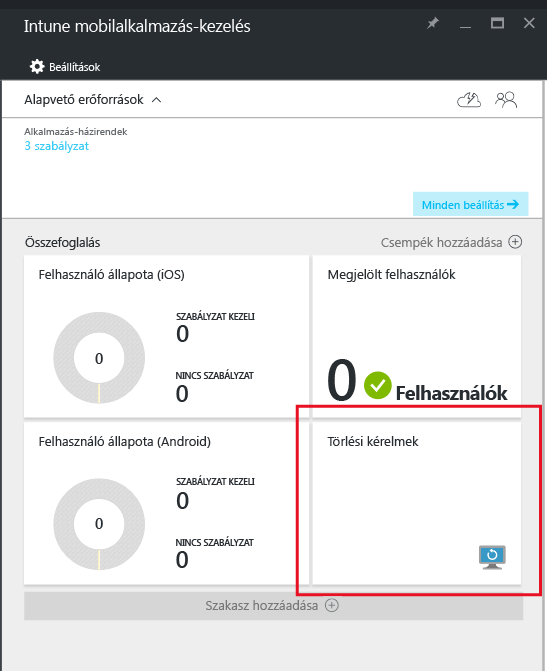
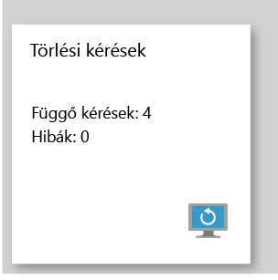

# A Microsoft Intune-nal felügyelt vállalati alkalmazások adatainak törlése
Ha egy eszközt elveszítenek vagy ellopnak, vagy ha a dolgozó elhagyja a vállalatot, fontos eltávolítani a vállalati alkalmazásadatokat az eszközről. Előfordul azonban, hogy a személyes adatokat meg kell őrizni, különösen, ha az eszköz a dolgozó saját tulajdona.

A vállalati alkalmazásadatok szelektív törléséhez hozzon létre törlési kérést a jelen témakör **Törlési kérés** szakaszában leírt lépésekkel.  A kérelem teljesítése után az alkalmazás a következő futtatásakor az eszközön a vállalati adatok el lesznek távolítva az alkalmazásból.
>[!NOTE]
> Az alkalmazásból a natív címjegyzékbe közvetlenül szinkronizált névjegyeket a rendszer eltávolítja. A natív címjegyzékből egy másik külső forrásba szinkronizált névjegyek nem törölhetők. Jelenleg ez csak a Microsoft Outlook alkalmazásra érvényes.

## Törlési kérés

1.  Az **Intune mobilalkalmazás-kezelés** panelen kattintson a **Törlési kérések** csempére.

    

2.  Kattintson az **Új törlési kérés** lehetőségre.

    

3.  Az **Új törlési kérés** panelen kattintson a **Felhasználó** elemre a **Felhasználó** panel megnyitásához, és válassza ki azt a felhasználót, akinek az alkalmazásadatait törölni kívánja.

4.  Válassza az **Eszköz** lehetőséget.  Ekkor megnyílik a **Eszköz** panel, amelyen látható a kijelölt felhasználóhoz társított összes eszköz listája.  Válassza ki a törölni kívánt eszközt.

5.  Ekkor ismét az **Új törlési kérés** panel jelenik meg. A törlési kérés elindításához kattintson az **OK** gombra. A szolgáltatás külön törlési kéréseket hoz létre az egyes védett alkalmazásokhoz az eszközön, és nyomon követi azokat.

## A törlési kérelmek figyelése
Az **Intune mobilalkalmazás-felügyelet** panel összefoglaló jelentést jelenít meg a **Törlési kérés** csempén.  Ez megjeleníti a törlés összesített állapotát és a függőben lévő kérések és hibák számát. További részletek megjelenítéséhez kövesse a következő lépéseket:

1.  Az **Intune mobilalkalmazás-kezelés** panelen kattintson a **Törlési kérések** csempére a **Törlési kérés** panel megnyitásához.

2.  A **Törlési kérés** panelen a kérelmek felhasználók szerint csoportosított listája látható.  Mivel a rendszer az eszközön futó minden védett alkalmazáshoz törlési kérést hoz létre, egy felhasználóhoz több kérés jelenhet meg.  Az állapot mutatja, hogy a törlési kérés továbbra is **függőben van**, **sikertelen**, vagy **sikeres**-e.

### Lásd még:
[Alkalmazásadatok védelme mobilalkalmazás-felügyeleti házirendekkel ](protect-app-data-using-mobile-app-management-policies-with-microsoft-intune.md)

[Az Azure-portál használata](azure-portal-for-microsoft-intune-mam-policies.md)

<!--HONumber=Jun16_HO4-->

