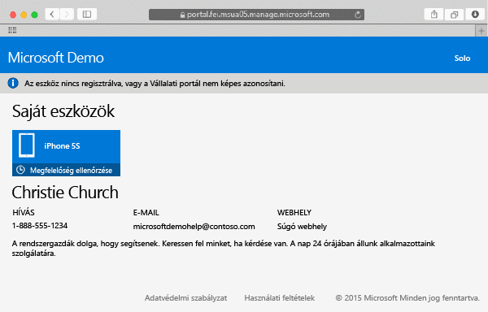

---
# required metadata

title: Mac OS X-eszköz regisztrálása az Intune-ban | Microsoft Intune
description:
keywords:
author: Staciebarker
manager: jeffgilb
ms.date: 05/30/2016
ms.topic: article
ms.prod:
ms.service: microsoft-intune
ms.technology:
ms.assetid: 58eb0e7a-1321-4c66-a281-88fb01e72c1c

# optional metadata

ROBOTS:
#audience:
#ms.devlang:
ms.reviewer: esmich
ms.suite: ems
#ms.tgt_pltfrm:
#ms.custom:

---

# Mac OS X-eszköz regisztrálása az Intune-ban

Ha regisztrálja Mac OS X-eszközét az Intune-ban, hozzáférhet munkahelye hálózatához, a munkahelyi levelezéséhez, a munkája során használt fájlokhoz és a munkahelyi alkalmazásokhoz. A [Mi történik a Vállalati portál alkalmazás telepítésekor és az eszköz Intune-beli regisztrálásakor?](what-happens-if-you-install-the-company-portal-app-and-enroll-your-device-in-intune-ios.md) című rész bővebben ismerteti, hogy mi történik az eszköz regisztrálásakor.

Ha iOS rendszerű eszközt szeretne regisztrálni, lásd: [iOS-eszköz regisztrálása az Intune-ban](enroll-your-device-in-intune-ios.md).

A Mac OS X-eszköz regisztrálása:

1.  A Safari böngészőben nyissa meg a [Vállalati portál webhelyét](https://portal.manage.microsoft.com), és koppintson az értesítési sávra.

2.  Koppintson **Az eszköz nincs regisztrálva, vagy a Vállalati portál nem képes azonosítani** elemre.

     

3.  Koppintson a **Telepítés** gombra az eszköz regisztrálásának megkezdéséhez.

     

4.  A **Felügyeleti profil telepítése** párbeszédpanelen koppintson a **Telepítés** gombra. Ha megjelenik a hitelesítő adatai megadását kérő párbeszédpanel, írja be a felhasználónevét és jelszavát, majd koppintson a **Folytatás** &gt; **Telepítés** elemre.

     

    Amikor végzett a regisztrálással, megjelenik a felügyeleti profil oldala, amely jelzi, hogy a profil jóvá lett hagyva.

     

További segítségre van szüksége? Forduljon a rendszergazdához. Az elérhetőségét keresse meg a [Vállalati portál webhelyén](http://portal.manage.microsoft.com).

### További információ
[Using your iOS or Mac OS X device with Intune](using-your-ios-or-mac-os-x-device-with-intune.md)

<!--HONumber=Jun16_HO2-->

