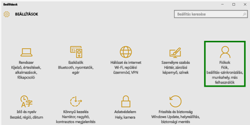

# Windows 10 Mobile-eszköz vagy Windows 10 asztali eszköz regisztrálása az Intune-ban

Ha munkahelye vagy iskolája a Microsoft Intune-t használja, eszközének regisztrálásával hozzáférhet a vállalati levelezéséhez, fájljaihoz és egyéb vállalati erőforrásaihoz. Az eszközök regisztrálása lehetővé teszi munkahelye számára, hogy megóvhassa a vállalati adatokat. További információk a regisztrációval kapcsolatban: [Mi történik a Vállalati portál alkalmazás telepítésekor és az eszköz Intune-beli regisztrálásakor?](what-happens-if-you-install-the-company-portal-app-and-enroll-your-device-in-intune-windows.md), illetve [Mit láthat a rendszergazda az eszközén, és mit nem?](what-can-your-it-administrator-see-when-you-enroll-your-device-in-intune-windows.md) témakörben.

Windows 10 Mobile-eszköz vagy Windows 10 asztali eszköz regisztrálása:

1.  Válassza a Windows **Gépház** területét, majd koppintson a **Fiókok** elemre.

    

2.  Koppintson a **Saját fiók** elemre.

    

3.  Koppintson a **Munkahelyi vagy iskolai fiók beállítása** pontra.

    

4.  Jelentkezzen be a munkahelyi vagy iskolai fiókjával.

    

Ha követte a fenti lépéseket, de továbbra sem tud hozzáférni munkahelyi vagy iskolai e-mailjeihez, fájljaihoz vagy egyéb adataihoz, lépjen vissza a **Fiókok** elemre, és koppintson a **Munkahelyi hozzáférés** gombra.

-   Ha megjelenik a munkahelyi vagy iskolai fiók, akkor minden rendben van, mert sikerült csatlakoznia.

-   Ha nem látja saját munkahelyi vagy iskolai fiókját, koppintson a **Csatlakozás** elemre, majd jelentkezzen be munkahelyi vagy iskolai hitelesítő adataival.

Azt javasoljuk, hogy telepítse a Vállalati portál alkalmazást, mert azzal egyszerűen megismerheti és letöltheti az Ön és munkaköre szempontjából fontos vállalati alkalmazásokat. Attól függően, hogy vállalata hogyan konfigurálta az Intune-t, előfordulhat,  hogy a Vállalati portál alkalmazás már a regisztrációs folyamat részeként települt. Ha az alkalmazáslistában szerepel a **Vállalati portál**, akkor már megvan Önnek az alkalmazás. Ha a vállalati portál nem jelenik meg az alkalmazáslistán, akkor a következő lépésekkel telepítheti.

1.  Koppintson a **Start** &gt; **Áruház** parancsra.

2.  Koppintson a **Keresés** elemre, és írja be a **vállalati portál** kifejezést.

3.  Az eredmények listájában koppintson a **Vállalati portál** &gt; **Telepítés** lehetőségre.

4.  Koppintson a **Telepítés** vagy az **Ingyenes** lehetőségre. Attól függ, hogy melyik beállítás jelenik meg, hogy a vállalat hogyan konfigurálta az alkalmazást.

További segítségre van szüksége? Forduljon a rendszergazdához. Az elérhetőségét keresse meg a [Vállalati portál webhelyén](http://portal.manage.microsoft.com).

### További információ
[Windows-eszköz regisztrálása az Intune-ban](enroll-your-device-in-intune-windows.md) 
[Windows-eszköz használata az Intune-nal](using-your-windows-device-with-intune.md)

<!--HONumber=Jun16_HO4-->

