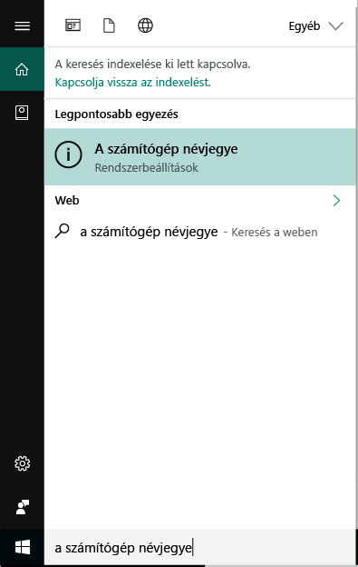

# Windows 10 rendszerű eszközök regisztrálása az Intune-ban

A vállalati eszközök Microsoft Intune-beli regisztrálása lehetővé teszi, hogy a Windows 10 rendszerű eszközök hozzáférjenek a szervezet védett adataihoz, beleértve az e-maileket, a fájlokat és az egyéb erőforrásokat. Ez a Windows 10 rendszerű asztali számítógépekre és a Windows 10 Mobile rendszerű eszközökre egyaránt vonatkozik. Az eszközök regisztrálásával biztonságossá tehető ez a hozzáférés Ön és a szervezet számára, és elkülöníthetők a munkahelyi adatok a személyes adatoktól.

Szeretne még többet megtudni? Tekintse át, hogy mi történik, amikor [regisztrálja az eszközét az Intune-ban](what-happens-if-you-install-the-company-portal-app-and-enroll-your-device-in-intune-windows.md), és mit jelent ez az [eszközön található adatok szempontjából](what-can-your-it-administrator-see-when-you-enroll-your-device-in-intune-windows.md).

## Windows 10 rendszerű asztali eszközök
1.    Lépjen a __Start__ menüre.

 .

2. Írja be „a gép névjegye” kifejezést a __keresősávba__, majd válassza __A gép névjegye__ lehetőséget.

 

2.    A __Beállítások__ képernyőn megjelenik a számítógépre telepített Windows 10 verziójára vonatkozó adatok listája. A listában keresse meg a __Verzió__ bejegyzést.

 

3.    Ha a verzió __1607__, folytassa [ezekkel a lépésekkel](enroll-your-w10-device-access-work-or-school.md). Ha a verzió __1511 vagy régebbi__, folytassa [ezekkel a lépésekkel](enroll-your-w10-device-your-account.md).

## Windows 10 Mobile rendszerű eszközök

1.    A __Start__ menüben pöccintéssel lépjen a __Minden alkalmazás__ listához, és válassza ki a __Beállítások__ alkalmazást.
2.    Koppintson a __Rendszer__, majd a __Névjegy__ elemre.
3.    Az __Eszközadatok__ bejegyzésnél koppintson a __További információ__ elemre. Megjelenik az eszköz adatait tartalmazó lista. A listában keresse meg a __Verzió__ bejegyzést.
4.    Ha a verzió __1607__, folytassa [ezekkel a lépésekkel](enroll-your-w10-device-access-work-or-school.md). Ha a verzió __1511 vagy régebbi__, folytassa [ezekkel a lépésekkel](enroll-your-w10-device-your-account.md).

További segítségre van szüksége? Forduljon a rendszergazdához. Az elérhetőségét keresse meg a [Vállalati portál webhelyén](http://portal.manage.microsoft.com).

<!--HONumber=Jan17_HO2-->

