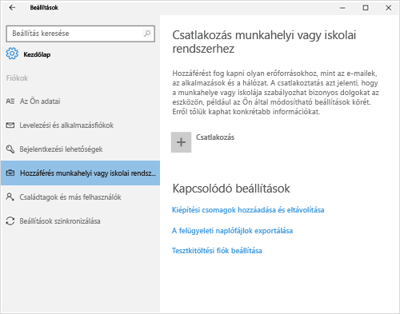
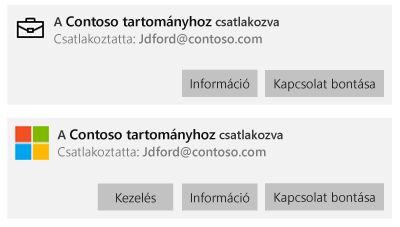
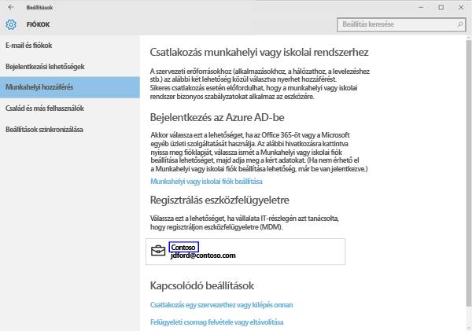
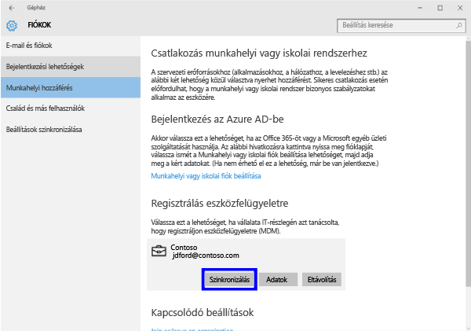
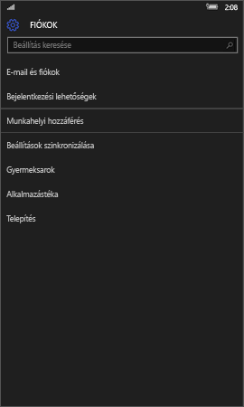
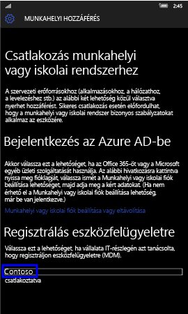
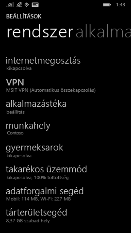
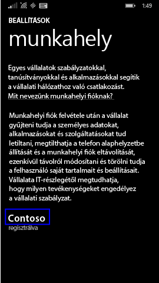
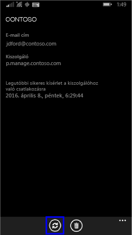

# Windows-eszköz manuális szinkronizálása

Előfordulhat, hogy egy alkalmazás telepítése a windowsos eszközre a várhatónál hosszabb időt vesz igénybe. Ilyen esetben megpróbálhatja manuálisan szinkronizálni a windowsos eszközt. A szinkronizálással esetleg gyorsítható a telepítés.

> [!Note]
> Alacsonyabb sebességű hálózatokon, vagy ha egyszerre nagy számú eszközön végeznek letöltést, az alkalmazások telepítése hosszabb időt is igénybe vehet.

A Windows alábbi verzióit manuálisan is lehet szinkronizálni. Ha az eszközön a Windows más verziója fut, a manuális szinkronizálás sajnos nem elérhető.

* [Windows 10 asztali verzió szinkronizálása](#windows-10-desktop)
* [Windows 10 mobil verzió szinkronizálása](#windows-10-mobile)
* [Windows Phone 8.1 szinkronizálása](#windows-phone-81)

## Windows 10 asztali verzió
A Windows 10 rendszernek egynél több verziója van, így a lépések két részre oszthatók. Annak megállapításához, hogy mely lépések szükségesek, tekintse meg a képernyőképeket, és kövesse azokat a lépéseket, amelyek a leginkább hasonlítanak az eszközön látható állapotra.

1. Kattintson a **Start** gombra, majd a **Beállítások** elemre.

    

2. A **Beállítások** lapon válassza **Fiókok** lehetőséget.

    

3. A következő két képernyő közül válassza ki azt, amelyen ugyanaz látszik, mint az eszközön. Hajtsa végre a kiválasztott képernyőhöz tartozó lépéseket.

    Ha a „Hozzáférés munkahelyi vagy iskolai rendszerhez” feliratú képernyőt látja, hajtsa végre a [Teendők, ha ezt látja: Hozzáférés munkahelyi vagy iskolai rendszerhez](#steps-to-follow-if-you-see-access-work-or-school) című részben leírt lépéseket.

    

    Ha a „Hozzáférés munkahelyi rendszerhez” feliratú képernyőt látja, hajtsa végre a [Teendők, ha ezt látja: Hozzáférés munkahelyi rendszerhez](#steps-to-follow-if-you-see-your-account) című részben leírt lépéseket.

    

### Teendők, ha ezt látja: Hozzáférés munkahelyi vagy iskolai rendszerhez

1. A **Fiókok** lapon válassza ki a **Munkahelyi vagy iskolai hozzáférés** elemet.

    

2. Válassza ki a munkahelyi vagy iskolai fiókját. Attól függően, hogy a rendszergazda hogyan állította be a rendszert, két fiókot láthat, amelyek az alábbiakban látható példához hasonlóak. Az egyik fiók mellett egy aktatáska látható, a másik mellett a Microsoft emblémája.

    - Ha az aktatáskás fiókot látja, válassza ki azt, és keresse az alatta lévő **Információ** gombot.
    - Ha csak a Microsoft emblémás fiókot látja, válassza ki azt, és keresse az alatta lévő **Információ** gombot.

    

3. Kattintson az **Információ** gombra. Az alábbi példához hasonlóan megnyílik egy párbeszédpanel.

    

4. Kattintson a **Szinkronizálás** gombra. Az eszköz Intune-nal való szinkronizálása megtörténik.

### Teendők, ha ezt látja: Munkahelyi hozzáférés

1. A **Fiókok** lapon válassza a **Munkahelyi hozzáférés** elemet.

    

2. A **Regisztrálás eszközfelügyeletre** részen válassza ki a cég nevét.

    

3. Kattintson a **Szinkronizálás** gombra.

    

   A gomb a szinkronizálás befejezéséig szürke marad.

   ## Windows 10 mobil verzió
   Windows 10 Mobile rendszerű eszköz manuális szinkronizálása a lassú alkalmazástelepítés felgyorsítása érdekében:

   1. Lépjen a **Minden alkalmazás** > **Beállítások** > **Fiókok** menüpontra.

       

   2. Válassza a **Munkahelyi hozzáférés** elemet.

       

   3. A **Regisztrálás eszközfelügyeletre** részen válassza ki a cég nevét.

       

   4. Kattintson a **Szinkronizálás** ikonra.

       

       A képernyő tetején megjelenik a „Fiók szinkronizálása” üzenet. Amíg az eszköz szinkronizálása be nem fejeződik, a **Szinkronizálás** gomb inaktív marad.

## Windows Phone 8.1
Windows Phone 8.1 rendszerű eszköz manuális szinkronizálása a lassú alkalmazástelepítés felgyorsítása érdekében:

1. Lépjen a **Minden alkalmazás** > **Beállítások** > **Munkahely** menüpontra.

    

2. Válassza ki a cég nevét.

    

3. Kattintson a **Szinkronizálás** ikonra.

    

   A képernyő tetején a „Fiók szinkronizálása” üzenet lesz látható egészen addig, amíg az eszköz szinkronizálása be nem fejeződik.

További segítségre van szüksége? Forduljon a rendszergazdához. Az elérhetőségét keresse meg a [Vállalati portál webhelyén](http://portal.manage.microsoft.com).

