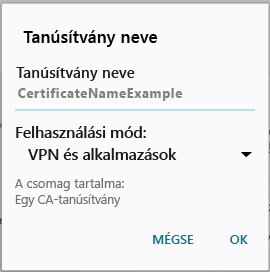

# Az eszközhöz hiányzik egy szükséges tanúsítvány

## Az eszközhöz hiányzik egy rendszerint a telefonon előre telepített tanúsítvány
Ha az androidos eszköz nincs regisztrálva az Intune-ban, és hiányzik róla egy, rendszerint a telefonon előre telepített tanúsítvány, nem fog tudni bejelentkezni az androidos Vállalati portál alkalmazásba. Amikor megpróbál bejelentkezni, a következő üzenet jelenik meg:

A probléma megoldásához és a szükséges tanúsítvány beszerzéséhez hajtsa végre a következő lépéseket:

1.  Böngészőben nyissa meg a [Digicert tanúsítványlapját](https://www.digicert.com/digicert-root-certificates.htm).

2.  Keresse meg és töltse le a Baltimore CyberTrust legfelső szintű tanúsítványát (https://www.digicert.com/CACerts/BaltimoreCyberTrustRoot.crt).

3.  Húzza le az értesítéseket fentről, és koppintson a **BaltimoreCyberTrustRoot.crt** elemre az értesítések listájában.

4.  A **Name the Certificate** (A tanúsítvány elnevezése) képernyőn fogadja el az alapértelmezett tanúsítványnevet.

5. Győződjön meg arról, hogy **Credential Use** (Hitelesítő adatok használata) beállítás értéke **Used for VPN and apps** (VPN-hez és az alkalmazásokhoz használt), és koppintson az **OK** gombra.

    

6. Zárja be a böngészőt és a Vállalati portál alkalmazást.

7. Nyissa ismét meg a Vállalati portál alkalmazást. Ekkor már be kell, hogy tudjon jelentkezni a Vállalati portál alkalmazásba. Ha segítségre van szüksége, lépjen kapcsolatba a rendszergazdával.

## Az eszközhöz hiányzik egy, a rendszergazda által kért tanúsítvány
Ha az androidos eszköz nincs regisztrálva az Intune-ban, és hiányzik róla egy, a rendszergazda által kért tanúsítvány, nem fog tudni bejelentkezni az androidos Vállalati portál alkalmazásba. Amikor megpróbál bejelentkezni, a következő üzenet jelenik meg:

>[!NOTE]
> Nem számít, ha már megjelent egy „hiányzó tanúsítvány” tartalmú üzenet, és követte [Az eszközhöz hiányzik egy rendszerint a telefonon előre telepített tanúsítvány](#your-device-is-missing-a-certificate-that-usually-comes-installed-on-your-phone) részben leírt lépéseket. Ez egy másik üzenet és tanúsítvány, ezért kövesse az ebben a részben leírt lépéseket a hiányzó tanúsítvány beszerzéséhez.

A probléma megoldásához és a szükséges tanúsítvány beszerzéséhez hajtsa végre a következő két fő lépést:

- Azonosítsa a hiányzó tanúsítványt azáltal, hogy megtekinti egy vállalati vagy iskolai számítógépen.
- Használja az eszközt a hiányzó tanúsítvány letöltéséhez az internetről.

### Azonosítsa a hiányzó tanúsítványt azáltal, hogy megtekinti egy vállalati vagy iskolai számítógépen

1. Nyissa meg egy számítógépen az Internet Explorert. Ha nincs erre a célra használható számítógépe, forduljon a rendszergazdához. A rendszergazda elérhetőségét a [Vállalati portál webhelyén](http://portal.manage.microsoft.com) találja.

2. Lépjen a [Vállalati portál webhelyére](http://portal.manage.microsoft.com), és jelentkezzen be a munkahelyi vagy iskolai fiókjával.

3. A böngésző címsorának jobb szélén kattintson a lent látható, lakat alakú szimbólumra. Ha nem látja a lakat alakú szimbólumot, ne lépjen tovább, hanem forduljon a rendszergazdához. A lakat azt jelenti, hogy biztonságosan jelentkezett be, ezért ha nem látja a szimbólumot, nem javasolt a továbblépés.

    

4. Kattintson a **Tanúsítványok megtekintése** elemre.

    

5. A **Tanúsítvány** párbeszédpanelen kattintson a **Tanúsítványlánc** elemre, majd azonosítsa a tanúsítványt, amelyet le kell töltenie az internetről. A szükséges tanúsítvány neve ugyanazon a helyen lesz, mint a fenti képernyőfelvételen kiemelt tanúsítványé.

### Töltse le és telepítse a hiányzó tanúsítványt Android-mobileszközére

1. Ha keresőmotort, például Binget vagy Google-t használ, keressen rá az előző szakaszban azonosított hiányzó tanúsítvány nevére. A tanúsítvány különböző „kiterjesztésekkel” rendelkezhet, például „.crt”, „.pem” stb.

2. Töltse le a főtanúsítványt a webhelyről.

3. Miután a tanúsítvány letöltése befejeződött, húzza le az értesítéseket fentről, és koppintson a tanúsítvány nevére az értesítések listájában.

4. A lent látható**Name the Certificate** (A tanúsítvány elnevezése) képernyőn fogadja el az alapértelmezett tanúsítványnevet.

5. Győződjön meg arról, hogy **Credential Use** (Hitelesítő adatok használata) beállítás értéke **Used for VPN and apps** (VPN-hez és az alkalmazásokhoz használt), és koppintson az **OK** gombra.

    

6. Zárja be a Vállalati portál alkalmazást.

7. Nyissa ismét meg a Vállalati portál alkalmazást. Ekkor már be kell, hogy tudjon jelentkezni a Vállalati portál alkalmazásba. Ha segítségre van szüksége, lépjen kapcsolatba a rendszergazdával.

Ha ugyanazt a „Hiányzó tanúsítvány” üzenetet látja, mint amelyik fentebb is látható, és már követte a fenti lépéseket, akkor valószínűleg egy másik tanúsítvány is van, amelyet a rendszergazda segítségével telepíteni kell. Forduljon a rendszergazdához, és továbbítsa neki ezt a [hivatkozást](/intune/troubleshoot/troubleshoot-device-enrollment-in-intune#android-certificate-issues), amely tartalmazza a probléma megoldásához szükséges lépéseket.

<!--HONumber=Sep16_HO3-->

