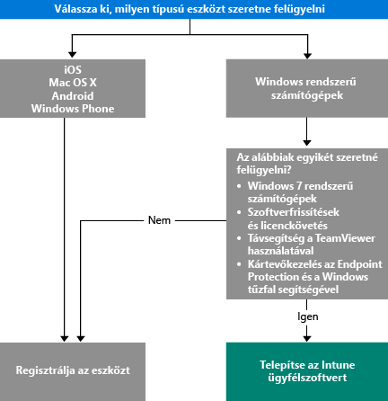

# Az eszközkezelés módjának kiválasztása

Ahhoz, hogy kihasználhassa az Intune által kínált számos funkciót, így például az alkalmazástelepítést és az eszközbeállítások szabályozását, az eszközöket *kezelni* kell. Az eszközkezelés módja attól függ, hogy az Intune mely képességeit szeretné használni.
A jelen témakör segít kiválasztani az igényeinek megfelelő módszert.

iOS, Mac OS X, Android vagy Windows Phone rendszerű eszközök kezeléséhez az eszközöket *regisztrálni* kell.

Windows rendszerű számítógépek kezelésére két lehetősége van:

1. Az eszköz regisztrálása **vagy**
2. Az *Intune-szoftverügyfél* telepítése.

## A megfelelő módszer meghatározása
Az alábbi döntési folyamat segítségével döntheti el, hogyan kezelje eszközeit.

A lehető legtöbb funkció eléréséhez regisztrálja a Windows rendszerű számítógépeket. Ugyanakkor előfordulhat, hogy az Intune-szoftverügyfél jobban megfelel az igényeinek a következő esetekben:

- A számítógépen Windows 7 fut
- Felügyelni kívánja a Windows-szoftverfrissítéseket és a licenchasználatot
- Az Endpoint Protection és a Windows tűzfal segítségével kívánja kezelni a kártevőket
- A TeamViewer szoftver segítségével távsegítséget kíván nyújtani a felhasználóknak

Az egyes módszerekkel elérhető felügyeleti képességek részletes felsorolását lásd: [Mobileszköz-kezelési képességek](mobile-device-management-capabilities-in-microsoft-intune.md) és [Az Intune PC-szoftverügyfél képességei](windows-pc-management-capabilities-in-microsoft-intune.md).
Az Intune által támogatott eszközökről és számítógépekről lásd: [Támogatott mobileszközök és számítógépek](/intune/get-started/supported-mobile-devices-and-computers)

## Felügyelet az Exchange ActiveSync segítségével
Az eszköz regisztrációja vagy az Intune-szoftverügyfél telepítése mellett az [Exchange ActiveSync](/intune/deploy-use/mobile-device-management-with-exchange-activesync-and-microsoft-intune) segítségével is felügyelheti az eszközöket. Ehhez telepítenie kell az On-Premises Connector összekötőt, vagy a beépített Service-to-Service Connector összekötővel kell kapcsolódnia az Exchange Serverhez.
Bár ezen harmadik módszerrel is lehetséges az eszközök felügyelete, a másik két módszerhez képest ez korlátozott mennyiségű felügyeleti képességet biztosít.

## További lépések

- [A mobileszközök regisztrálásának módjai](/intune/get-started/choose-how-to-enroll-devices1)
- [Windows rendszerű számítógépek felügyelete az Intune számítógépügyféllel](/intune/deploy-use/manage-windows-pcs-with-microsoft-intune)

- [Exchange ActiveSync mobileszköz-felügyelet a Microsoft Intune-nal](/intune/deploy-use/mobile-device-management-with-exchange-activesync-and-microsoft-intune).

<!--HONumber=Nov16_HO1-->

