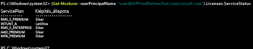

# Intune-licencek kezelése a PowerShell használatával
Ahhoz, hogy a felhasználók bejelentkezhessenek az Intune szolgáltatásba, illetve regisztrálhassák az eszközeiket felügyeletre, minden felhasználó számára egy licencet kell hozzárendelnie az Intune-előfizetéséhez, a [Manage Intune licenses](start-with-a-paid-subscription-to-microsoft-intune-step-4.md) (Intune-licencek kezelése) című témakörnek megfelelően. Előfordulhat azonban, hogy a Microsoft Enterprise Mobility + Security megoldást használó szervezeteknek vannak olyan felhasználói, akiknek csak az EMS csomagban foglalt Azure Active Directory Premium vagy Intune szolgáltatásra van szükségük. Az [Azure Active Directory PowerShell-parancsmagok](https://msdn.microsoft.com/library/jj151815.aspx) használatával egy-egy szolgáltatás vagy a szolgáltatások egy részhalmaza is hozzárendelhető.

A felhasználói licencek EMS-szolgáltatásokhoz való szelektív hozzárendeléséhez nyissa meg a PowerShellt rendszergazdaként egy olyan számítógépen, amelyre telepítve van a [Windows PowerShellhez készült Microsoft Azure Active Directory-modul ](https://msdn.microsoft.com/library/jj151815.aspx#bkmk_installmodule) megoldással rendelkező számítógépen. A PowerShell helyi számítógépre vagy ADFS-kiszolgálóra telepíthető.

Létre kell hoznia egy új licenctermékváltozat-definíciót, amely csak a szükséges szolgáltatáscsomagokra vonatkozik. Ehhez tiltsa le az alkalmazni nem kívánt csomagokat. Például létrehozhat olyan licenctermékváltozat-definíciót, amely nem rendel hozzá Intune-licencet. Az elérhető szolgáltatások listájának megtekintéséhez írja be:

    (Get-MsolAccountSku | Where {$_.SkuPartNumber -eq "EMS"}).ServiceStatus

Az Intune szolgáltatáscsomag kizárásához a következő parancsot futtathatja. Ugyanezzel a módszerrel kibonthat egy teljes biztonsági csoportot, vagy még részletesebb szűrőket is használhat.

**1. példa** Új felhasználó létrehozása a parancssorból, és EMS-licenc hozzárendelése a licenc Intune-részének engedélyezése nélkül:

    Connect-MsolService

    New-MsolUser -DisplayName “Test User” -FirstName FName -LastName LName -UserPrincipalName user@<TenantName>.onmicrosoft.com –Department DName -UsageLocation US

    $CustomEMS = New-MsolLicenseOptions -AccountSkuId "<TenantName>:EMS" -DisabledPlans INTUNE_A
    Set-MsolUserLicense -UserPrincipalName user@<TenantName>.onmicrosoft.com -AddLicenses <TenantName>:EMS -LicenseOptions $CustomEMS

Ellenőrizze a következővel:

    (Get-MsolUser -UserPrincipalName "user@<TenantName>.onmicrosoft.com").Licenses.ServiceStatus

**2. példa** Az Intune-rész letiltása a hozzárendelt licenccel már rendelkező felhasználó EMS-licencéből:

    Connect-MsolService

    Set-MsolUserLicense -UserPrincipalName user@<TenantName>.onmicrosoft.com -RemoveLicenses IAPProdPartnerTest:EMS

    $CustomEMS = New-MsolLicenseOptions -AccountSkuId "<TenantName>:EMS" -DisabledPlans INTUNE_A
    Set-MsolUserLicense -UserPrincipalName user@<TenantName>.onmicrosoft.com -AddLicenses <TenantName>:EMS -LicenseOptions $CustomEMS

Ellenőrizze a következővel:

    (Get-MsolUser -UserPrincipalName "user@<TenantName>.onmicrosoft.com" .Licenses.ServiceStatus

### További lépések
Gratulálunk! Ezzel befejezte az *Intune – Első lépések* útmutató 4. lépését.
>[!div class="step-by-step"]

>[&larr; **Felhasználók szinkronizálása az Intune-nal**](.\start-with-a-paid-subscription-to-microsoft-intune-step-2.md)     [**Felhasználók és eszközök rendszerezése** &rarr;](.\start-with-a-paid-subscription-to-microsoft-intune-step-5.md)  

<!--HONumber=Sep16_HO3-->

