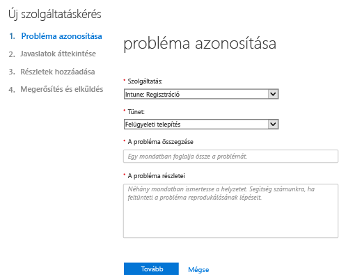
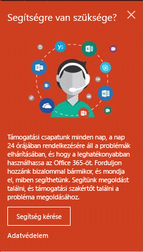
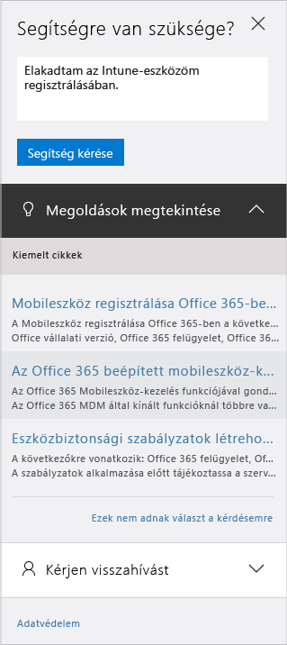

# Hogyan kérhet rendszergazdai támogatást az Intune-hoz

A Microsoft Intune-hoz a Microsoft globális műszaki, értékesítés előtti, számlázási és előfizetési támogatást nyújt. A támogatás interneten és telefonon is elérhető mind a fizetős, mind a próbaverziós előfizetésekhez. Az online műszaki támogatás angolul és japánul érhető el. Telefonos támogatás és online számlázási támogatás más nyelveken is elérhető.

Az Intune támogatása és a Configuration Managerrel használt Intune támogatása díjtalan. A Premier támogatással rendelkező ügyfeleknél eljárási kérdés esetén (például hogyan kell konfigurálni egy Intune funkciót) költségek lépnek fel.

## Online szolgáltatásjegy létrehozása

1.  Jelentkezzen be az [Office 365 felügyeleti központjába](https://portal.office.com) az Intune-beli hitelesítő adataival.
    >[!NOTE]
    >
    >Premier támogatással rendelkező ügyfelek a [Premier támogatási lapon](https://support.microsoft.com/en-us/premier/contacts) nyithatnak meg Intune támogatási jegyet.

2.  Válassza a **Rendszergazda** csempét.
3.  A jegy megnyitásához a bal oldalon a **Támogatás** elem alatt válassza a **Támogatás** lehetőséget.

    

    >[!NOTE]
    >  Azok az ügyfelek látják ezt az üzenetet, akik 100 vagy kevesebb licenccel bíró O365-fiókkal rendelkeznek vagy rendelkeztek. Ha látja az üzentet,olvassa el [Támogatási jegy létrehozása alternatív módszerekkel](#create-a-support-ticket-with-alternate-methods) című részt.

    > 

    -   Számlázási, licencelési és fiókproblémák esetén válassza a **Számlázási és termékinformáció** lehetőséget.

    -   Az Intune-nal kapcsolatos bármely más probléma esetén válassza a **Mobileszköz-kezelés** elemet.

    > [!NOTE]
    > Lehet, hogy az összes kategória csak a lista alján lévő **továbbiak** elemet választva jelenik meg.

3.  Kérelme megnyitásához kövesse az utasításokat.

### Támogatási jegy létrehozása alternatív módszerekkel

Ha támogatási lapja így néz ki, hajtsa végre az alábbi utasítást:

1. Válassza a **Segítségre van szükségem** lehetőséget.
2. Írja le problémáját a szövegdobozban, majd válassza a **Segítség kérése** elemet.

    

3. Tekintse át a javasolt online forrásokat, vagy válassza a **Visszahívást kérek** lehetőséget, és várja meg a Microsoft ügyfélszolgálata telefonhívását.

## Telefonos segítség
A [Kapcsolatfelvétel a Microsoft Intune telefonos tanácsadással](contact-assisted-phone-support-for-microsoft-intune.md) témakörben megtalálja az ország és régió szerinti támogatási telefonszámokat, a támogatási órákat és a támogatott nyelveket mindegyik régióhoz.

## Szolgáltatáskérések nyomon követése
1.  Jelentkezzen be az [Office 365 felügyeleti központjába](https://portal.office.com) az Intune-beli hitelesítő adataival.
2.  Válassza a **Rendszergazda** csempét.
3.  A bal oldalon a **Támogatás** elem alatt válassza a **Szolgáltatáskérések** lehetőséget. Ezután megtekintheti a kéréseit.

A szolgáltatáskérésekre adott válasz ideje függ a probléma súlyosságától. A legsúlyosabb problémák esetén a Professional ügyfeleknek két órán belül adunk választ. A Premier támogatással rendelkező ügyfelek esetén a válasz a támogatási szerződés függvénye. Léteznek esetek, mikor:

- Egy vagy több szolgáltatás nem érhető el, vagy nem használható.
- A probléma súlyosan érinti a termelést, a műveleteket vagy a központi telepítési határidőket, vagy súlyos következményekkel fog járni a termelésre vagy a nyereségességre nézve.
- A probléma több felhasználót vagy szolgáltatást érint.

A közepesen súlyos problémák esetén a Professional ügyfeleknek négy órán belül adunk választ. A Premier támogatással rendelkező ügyfelek esetén a válasz a támogatási szerződés függvénye.  Léteznek esetek, mikor:

- Használható a szolgáltatás, de nem úgy működik, ahogyan általában.
- A helyzet mérsékelten érinti az üzletmenetet, és a megoldás ráér a munkaidő alatt is.
- A probléma részlegesen érint egyetlen felhasználót, egy ügyfelet vagy egy szolgáltatást.

A többi probléma esetén a Professional ügyfeleknek nyolc órán belül adunk választ. A Premier támogatással rendelkező ügyfelek esetén a válasz a támogatási szerződés függvénye.  Léteznek esetek, mikor:

- A helyzet csak minimálisan érinti az üzletmenetet.
- A probléma fontos, de az ügyfél szempontjából nincs azonnali jelentős hatással a szolgáltatásra vagy a hatékonyságra.
- Csak egyetlen felhasználó tapasztal részleges problémákat, de létezik egy elfogadható megkerülő megoldás.

> [!NOTE]
> A **Microsoft System Center Configuration Manager** vagy a **Microsoft System Center Endpoint Protection esetén:** Ha technikai támogatást szeretne a Configuration Managerhez vagy az Endpoint Protectionhöz, forduljon a partneréhez, vagy keresse fel a [Microsoft System Center Configuration Manager és a System Center Endpoint Protection megoldásközpontját](http://www.microsoft.com/en-us/server-cloud/products/system-center-2012-r2/resources.aspx), ahol számos anyagot találhat az önsegítő technikai támogatáshoz. Emellett online vagy telefonos támogatási kérést adhat be.
>
> A System Center Configuration Manager vagy a System Center Endpoint Protection technikai támogatása vagy fizetésköteles, vagy levonásra kerül a meglévő licencelésből vagy Premier támogatási szerződésből.

## Problémák megoldása támogatási jegy megnyitása nélkül

Előfordulhat, hogy a probléma megoldásához nem szükséges támogatási jegy megnyitása.

Ha saját maga szeretné megtalálni a választ az Intune használatával kapcsolatos kérdésekre, az [Általános hibaelhárítási tippek a Microsoft Intune rendszerhez](general-troubleshooting-tips-for-microsoft-intune.md) című témakörből, illetve a vonatkozó hibaelhárítási cikkekből tájékozódhat. Emellett az [Intune fórumban](https://social.technet.microsoft.com/Forums/en-US/home?forum=microsoftintuneprod) is kereshet megoldást vagy kérdést tehet fel.

## A mennyiségi licenc támogatása
Ha már vásárolt a Microsofttól licenceket a mennyiségi licencprogram keretében, a támogatáshoz használja a következő erőforrásokat:

-   A licencekkel és a kulcsok helyének meghatározásával kapcsolatos támogatáshoz lásd: [Mennyiségi licencszolgáltatási központ](http://go.microsoft.com/fwlink/p/?LinkID=282016).

-   A számlázási kérdésekhez lásd: [Számlázási és előfizetés-kezelési támogatás](http://support.microsoft.com/oas/default.aspx?prid=15371).

-   A mennyiségi licenceléssel kapcsolatos általános információkhoz lásd: [Mennyiségi licencelés](http://go.microsoft.com/fwlink/p/?LinkID=282015).

<!--HONumber=Dec16_HO1-->

