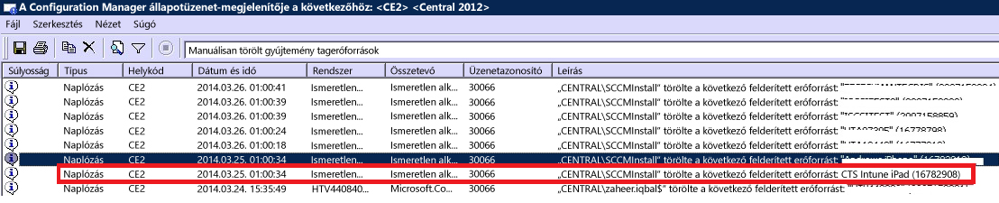

# Eszközök regisztrálásával kapcsolatos problémák elhárítása az Intune-ban

Ez a témakör az eszközök regisztrálásával kapcsolatos problémák megoldásához nyújt segítséget. Ha ezekkel az információkkal nem tudja megoldani a problémát, a [Hogyan kérhet támogatást az Intune-hoz](how-to-get-support-for-microsoft-intune.md) című témakörben talál további részleteket a segítségkéréshez.

## Első hibaelhárítási lépések

A hibaelhárítás megkezdése előtt ellenőrizze, hogy az Intune megfelelően van-e konfigurálva a regisztráláshoz. Ezekről a konfigurációs követelményekről itt olvashat:

-   [Felkészülés az eszközök regisztrálására a Microsoft Intune-ban](/intune/deploy-use/get-ready-to-enroll-devices-in-microsoft-intune)
-   [iOS- és Mac-eszközök kezelésének beállítása](/intune/deploy-use/set-up-ios-and-mac-management-with-microsoft-intune)
-   [Windows Phone és Windows 10 Mobile rendszerű telefonok Microsoft Intune-beli felügyeletének beállítása](/intune/deploy-use/set-up-windows-phone-management-with-microsoft-intune)
-   [Windowsos eszközök kezelésének beállítása](/intune/deploy-use/set-up-windows-device-management-with-microsoft-intune)

A felügyelt eszközök felhasználói össze tudják gyűjteni a regisztrációs és diagnosztikai naplókat, hogy átnézhesse őket. A naplók felhasználók általi gyűjtésére vonatkozó utasítások itt találhatók:

- [Az Android diagnosztikai adatait tartalmazó naplófájlok elküldése USB-kábelen keresztül a rendszergazdának](/intune/enduser/send-diagnostic-data-logs-to-your-it-administrator-using-a-usb-cable-android)
- [Az Android diagnosztikai adatait tartalmazó naplófájlok elküldése e-mailben a rendszergazdának](/intune/enduser/send-diagnostic-data-logs-to-your-it-administrator-using-email-android)
- [Az Android regisztrálási hibáinak elküldése a rendszergazdának](/intune/enduser/send-enrollment-errors-to-your-it-administrator-android)
- [Az iOS regisztrálási hibáinak elküldése a rendszergazdának](/intune/enduser/send-errors-to-your-it-admin-ios)

## Eszközök regisztrálásával kapcsolatos általános problémák
Ezek a problémák az összes eszközplatformon előfordulhatnak.

### Eszközök maximális száma elérve
**Probléma:** A regisztráció során hibaüzenet (például **A Vállalati portál átmenetileg nem érhető el**) jelenik meg egy iOS-eszközön, és a Configuration Managerben a DMPdownloader.log a **DeviceCapReached** hibát tartalmazza.

**Megoldás:** A felhasználók legfeljebb 5 eszközt regisztrálhatnak.

#### A regisztrált és engedélyezett eszközök számának ellenőrzése

1.  Ellenőrizze az Intune felügyeleti portálon, hogy nincs-e 5 eszköznél több hozzárendelve a felhasználóhoz.

2.  Az Intune felügyeleti portál Felügyelet\Mobileszköz-kezelés\Regisztráció szabályai részén ellenőrizze, hogy a regisztrált eszközök maximális száma 5-re van-e állítva.

A mobileszköz-felhasználók a következő URL-címen törölhetnek eszközöket: [https://byodtestservice.azurewebsites.net/](https://byodtestservice.azurewebsites.net/).

A rendszergazdák az Azure Active Directory portálon törölhetnek eszközöket.

#### Eszközök törlése az Azure Active Directory portálon

1.  Nyissa meg a [http://aka.ms/accessaad](http://aka.ms/accessaad) weblapot, vagy válassza a **Felügyelet** &gt; **Azure AD** lehetőséget a [https://portal.office.com](https://portal.office.com) portálon.

2.  A lap bal oldalán található hivatkozást használva jelentkezzen be a szervezeti azonosítójával.

3.  Ha még nem rendelkezik Azure-előfizetéssel, hozzon létre egyet. Ha díjköteles fiókkal rendelkezik, ennek elvégzéséhez nem szükséges hitelkártya vagy díjrendezés (kattintson a **Register your free Azure Active Directory** előfizetési hivatkozásra).

4.  Válassza az **Active Directory** lehetőséget, és jelölje ki a szervezetét.

5.  Válassza a **Felhasználók** fület.

6.  Jelölje ki azokat a felhasználókat, akiknek az eszközeit törölni szeretné.

7.  Válassza az **Eszközök** lehetőséget.

8.  Szükség szerint távolítson el eszközöket, többek között azokat, amelyeket már nem használnak vagy pontatlan definíciókkal rendelkeznek.

> [!NOTE]

> Az eszközregisztráció-kezelők használatával elkerülheti a maximális szám elérését az eszközregisztráció során. Lásd: [Vállalati tulajdonban lévő eszközök regisztrálása az Eszközregisztráció-kezelővel a Microsoft Intune-ban](/intune/deploy-use/enroll-corporate-owned-devices-with-the-device-enrollment-manager-in-microsoft-intune).
>
> A Készülékregisztráció-kezelők csoportba felvett felhasználói fiók nem tud regisztrálást végrehajtani, ha az adott felhasználói bejelentkezéshez a Feltételes hozzáférés szabályzat érvényes.

### A Vállalati portál átmenetileg nem érhető el
**Probléma:** Az eszközön **A Vállalati portál átmenetileg nem érhető el** hibaüzenet jelenik meg.

#### A Vállalati portál átmenetileg nem érhető el hiba elhárítása

1.  Távolítsa el az eszközről az Intune Vállalati portál alkalmazást.

2.  Nyissa meg a böngészőt az eszközön, keresse meg a [https://portal.manage.microsoft.com](https://portal.manage.microsoft.com)portált, és tegyen kísérletet egy felhasználói bejelentkezésre.

3.  Ha a felhasználó nem tud bejelentkezni, próbálkozzon meg egy másik hálózattal.

4.  Ha nem sikerül, ellenőrizze, hogy a felhasználói hitelesítő adatokat megfelelően szinkronizálta-e a rendszer az Azure Active Directoryval.

5.  Ha a felhasználó bejelentkezése sikerül, egy iOS-eszköz kérni fogja, hogy telepítse az Intune Vállalati portál alkalmazást, és regisztráljon. Az Android-eszközökön manuálisan kell telepítenie az Intune Vállalati portál alkalmazást, amelyet követően újból megpróbálkozhat a regisztrációval.

### Nincs megadva mobileszköz-kezelési szolgáltató
**Hiba:** Megjelenik egy **Nincs megadva mobileszköz-kezelési szolgáltató** hibaüzenet.

#### A Nincs megadva mobileszköz-kezelési szolgáltató hiba elhárítása

1.  Ellenőrizze, hogy a mobileszköz-kezelési szolgáltató megfelelően be van-e állítva a használt Intune szolgáltatáshoz, az O365 Mobileszköz-kezeléshez vagy a System Center Configuration Managerbe integrált Intune-hoz. Az Intune esetében a mobileszköz-kezelési szolgáltató a **Felügyelet** &gt; **Mobileszköz-kezelés** részen állítható be. Az Intune-ba integrált Configuration Manager esetében az Intune-összekötő konfigurálásakor adhatja meg, míg az O365 esetén ez a **Mobileszközök** beállításai közé tartozik.

    > [!NOTE]
    > Ha egyszer már megadta a mobileszköz-kezelési szolgáltatót, azt csak az ügyfélszolgálaton keresztül tudja módosítani a [How to get support for Microsoft Intune](how-to-get-support-for-microsoft-intune.md) (Hogyan kérhet támogatást a Microsoft Intune-hoz) című cikkben leírtak szerint.

2.  Győződjön meg arról, hogy a rendszer megfelelően szinkronizálta a felhasználói hitelesítő adatokat az Azure Active Directoryval. Ehhez ellenőrizze, hogy az egyszerű felhasználónevük megegyezik-e az Active Directory adataival a fiókportálon.
    Ha a felhasználónév nem egyezik meg az Active Directory adataival:

    1.  Kapcsolja ki a DirSync eszközt a helyi kiszolgálón.

    2.  Törölje a nem egyező felhasználót az **Intune-fiókportál** felhasználói listáról.

    3.  Várjon körülbelül egy óráig, amíg az Azure szolgáltatás eltávolítja a helytelen adatokat.

    4.  Kapcsolja be újból a DirSync eszközt, és ellenőrizze, hogy most már megfelelően van-e szinkronizálva a felhasználó.

3.  A System Center Configuration Managerbe integrált Intune használata esetén ellenőrizze, hogy a felhasználó érvényes felhőbeli felhasználói azonosítóval rendelkezik-e:

    1.  Nyissa meg az SQL Management Studiót.

    2.  Csatlakozzon a megfelelő adatbázishoz.

    3.  Nyissa meg az adatbázismappát, és keresse meg, majd nyissa meg a **CM_DBName** mappát, ahol a DBName az ügyféladatbázis neve.

    4.  A lap tetején kattintson az **Új lekérdezés** elemre, majd hajtsa végre az alábbi lekérdezéseket:

        -   Az összes felhasználó megjelenítése: `select * from [CM_ DBName].[dbo].[User_DISC]`.

        -   Adott felhasználók megjelenítéséhez használja a következő lekérdezést, ahol a %testuser1% képviseli a megkeresni kívánt felhasználóhoz tartozó felhasznalonev@tartomany.com címet: `select * from [CM_ DBName].[dbo].[User_DISC] where User_Principal_Name0 like '%testuser1%'`

        A lekérdezés megírása után válassza az **!Execute** lehetőséget.
        Az eredmények visszaadása után keresse meg a felhő felhasználójának azonosítóját.  Ha nem található azonosító, a felhasználó nem rendelkezik Intune-licenccel.

### Nem lehet szabályzatot létrehozni vagy eszközöket regisztrálni, ha a vállalat neve speciális karaktereket tartalmaz.
**Hiba:** Nem lehet szabályzatot létrehozni vagy eszközöket regisztrálni.

**Megoldás:** Az [Office 365 felügyeleti központban](https://portal.office.com/) törölje a speciális karaktereket a vállalat nevéből, és mentse a vállalati adatokat.

### Nem lehet bejelentkezni vagy eszközöket regisztrálni több ellenőrzött tartomány esetén.
**Hiba:** Amikor a második ellenőrzött tartományt adja hozzá az AD FS-hez, a második tartomány egyszerű felhasználóneves (UPN) utótagjával rendelkező felhasználók nem tudnak bejelentkezni a portálokra vagy nem tudnak eszközöket regisztrálni. 

**Megoldás:** Az olyan Microsoft Office 365-ügyfelek, akik egyszeri bejelentkezést (SSO) használnak az AD FS 2.0-n keresztül, és a szervezetükben több felső szintű tartomány szerepel az UPN-utótagban (például @contoso.com vagy @fabrikam.com), az AD FS 2.0 összevonási szolgáltatás külön példányát kell telepíteni minden utótag esetében.  Már létezik egy [összegzés az AD FS 2.0-hoz](http://support.microsoft.com/kb/2607496), amelyhez használható a **SupportMultipleDomain** kapcsolóval, hogy az AD FS-kiszolgáló támogassa az ilyen helyzetet anélkül, hogy további AD FS 2.0 kiszolgálókra lenne szükség. További információkat [ebben a blogban](https://blogs.technet.microsoft.com/abizerh/2013/02/05/supportmultipledomain-switch-when-managing-sso-to-office-365/) talál.

## Android-problémák
### Profiltelepítési hiba
**Hiba:** **Profiltelepítési hiba** üzenet jelenik meg egy Android-eszközön.

### Sikertelen profiltelepítés hibaelhárításának lépései

1.  Ellenőrizze, hogy az Ön által használt Intune szolgáltatás verziójának megfelelő licenc van-e hozzárendelve a felhasználóhoz.

2.  Győződjön meg arról, hogy az eszköz még nincs egy másik MDM szolgáltatóhoz regisztrálva, vagy még nincs hozzá felügyeleti profil telepítve.

4.  Ellenőrizze, hogy az Androidhoz készült Chrome az alapértelmezett böngésző-e, és a cookie-k engedélyezettek-e.
## iOS-problémák
### Profiltelepítési hiba
**Hiba:** **Profiltelepítési hiba** üzenet jelenik meg egy iOS-eszközön.

### Sikertelen profiltelepítés hibaelhárításának lépései

1.  Ellenőrizze, hogy az Ön által használt Intune szolgáltatás verziójának megfelelő licenc van-e hozzárendelve a felhasználóhoz.

2.  Győződjön meg arról, hogy az eszköz még nincs egy másik MDM szolgáltatóhoz regisztrálva, vagy még nincs hozzá felügyeleti profil telepítve.

3.  Nyissa meg a [https://portal.manage.microsoft.com](https://portal.manage.microsoft.com) portált, és amikor a rendszer kéri, telepítse a profilt.

4.  Ellenőrizze, hogy az iOS-hez készült Safari az alapértelmezett böngésző-e, és a cookie-k engedélyezettek-e.

### A regisztrált iOS-eszköz nem jelenik meg a konzolon a System Center Configuration Managerbe integrált Intune használata esetén
**Hiba:** A felhasználó regisztrálja az iOS-eszközt, de az nem jelenik meg a Configuration Manager felügyeleti konzolon. Az eszköz nem jelzi, hogy már regisztrálva van. Lehetséges okok:

- Előfordulhat, hogy az Intune-összekötőt az egyik fiókba regisztrálta, majd egy másik fiókba is regisztrálta. 
- Előfordulhat, hogy az MDM-tanúsítványt az egyik fiókból töltötte le, és egy másik fiókban használta.

**Megoldás:** Hajtsa végre a következő lépéseket:

1. Tiltsa le az iOS rendszert a Windows Intune-összekötőben. 
    1. Kattintson a jobb gombbal az Intune-előfizetésre, és válassza a **Tulajdonságok** lehetőséget.
    1. Az „iOS” lapon törölje a jelet az „iOS-eszközök regisztrációjának engedélyezése” jelölőnégyzetből.

1. Az SQL-ben futtassa a következő lépéseket a CAS-adatbázison:
  
    1. update SC_ClientComponent_Property set Value2 = '' where Name like '%APNS%' 
    1. delete from MDMPolicy where PolicyType = 7 
    1. delete from MDMPolicyAssignment where PolicyType = 7
    1. update SC_ClientComponent_Property set Value2 = '' where Name like '%APNS%' 
    1. delete from MDMPolicy where PolicyType = 11 
    1. delete from MDMPolicyAssignment where PolicyType = 11 
    1. DELETE Drs_Signals
1. Indítsa újra az SMS Executive szolgáltatást vagy a CM-kiszolgálót. 

1. Szerezzen be egy APN-tanúsítványt és töltse fel: az egér jobb gombjával kattintson az Intune-előfizetésre a Configuration Manager bal oldali ablaktáblájában. Válassza az **APN szolgáltatás tanúsítványkérésének létrehozása** parancsot, és kövesse az utasításokat.
## Problémák a System Center Configuration Managerbe integrált Intune használatakor
### Mobileszközök tűnnek el 
**Hiba:** Miután sikeresen regisztrált egy mobileszközt a Configuration Managerbe, eltűnik a mobileszköz-gyűjteményből, de továbbra is rendelkezik felügyeleti profillal, és szerepel a CSS-átjáróban.

**Megoldás:** Ez azért fordulhat elő, mert egyedi eljárással rendelkezik a tartományhoz nem csatlakozó eszközök eltávolításához, vagy a felhasználó kivonta az eszközt az előfizetésből. Ha meg szeretné állapítani, hogy melyik eljárás vagy felhasználói fiók távolította el az eszközt a Configuration Manager konzolból, hajtsa végre az alábbi lépéseket.

#### Az eszköz eltávolításának ellenőrzése

1.  A Configuration Manager felügyeleti konzolban válassza a **Figyelés** &gt; **Rendszer állapota** &gt; **Állapotüzenet-lekérdezések** elemet.

2.  Kattintson a jobb gombbal a **Manuálisan törölt gyűjtemény tagerőforrások** elemre, és válassza az **Üzenetek megjelenítése** parancsot.

3.  Válasszon ki egy megfelelő időpontot vagy dátumot, illetve az elmúlt 12 órát.

4.  Keresse meg a kérdéses eszközt, és ellenőrizze, hogy miként történt az eltávolítása. Az alábbi példában látható, hogy az SCCMInstall fiók törölte az eszközt egy ismeretlen alkalmazáson keresztül.

    

5.  Ellenőrizze, hogy a Configuration Manager nem rendelkezik-e ütemezett feladattal, parancsfájllal vagy egyéb folyamattal, amely automatikusan kiürítheti a tartományhoz nem csatlakozó, a mobil- vagy a kapcsolódó eszközöket.

### Egyéb iOS-beléptetési hibák
Az iOS-eszközök regisztrálási hibáinak listáját az eszközfelhasználói dokumentáció [Hibába ütközik, amikor megpróbálja regisztrálni az eszközt az Intune-ban](/intune/enduser/using-your-ios-or-mac-os-x-device-with-intune) című szakaszában találhatja.

## PC-kkel kapcsolatos problémák

### A gép már regisztrálva van – hibakód: hr 0x8007064c
**Hiba:** A regisztrálás sikertelen **A gép már regisztrálva van** hibaüzenettel. A regisztrálási napló a **hr 0x8007064c** hibakódot tartalmazza.
  
Ennek az lehet az oka, hogy a számítógép korábban regisztrálva volt, vagy olyan számítógép klónozott lemezképét tartalmazza, amely már regisztrálva volt. Az előző fiók fióktanúsítványa továbbra is megtalálható a számítógépen.

**Megoldás:** 

1. A **Start** menüben válassza a **Futtatás** -> **MMC** parancsot. 
1. Válassza a **Fájl** -> **Beépülő modulok hozzáadása/eltávolítása** parancsot.
1. Kattintson duplán a **Tanúsítványok** elemre, válassza a **Számítógépfiók** lehetőséget, kattintson a **Tovább** gombra, végül válassza a **Helyi számítógép** lehetőséget.
1. Kattintson duplán a **Tanúsítványok (Helyi számítógép)** elemre, majd válassza a **Személyes/Tanúsítványok** lehetőséget. 
1. Keresse meg az Sc_Online_Issuing által kiadott Intune-tanúsítványt, és ha létezik, törölje.
1. Ha létezik, törölje a következő beállításkulcsot és az összes alkulcsát: **HKEY_LOCAL_MACHINE\SOFTWARE\Microsoft\OnlineManagement regkey**.
1. Próbálja meg újból elvégezni a regisztrálást. 
1. Ha a gépet továbbra sem lehet regisztrálni, keresse meg a következő beállításkulcsot, és ha létezik, törölje: **KEY_CLASSES_ROOT\Installer\Products\6985F0077D3EEB44AB6849B5D7913E95**. 
1. Próbálja meg újból elvégezni a regisztrálást. 

    > [!IMPORTANT]
    > Ez a szakasz, módszer vagy feladat olyan lépéseket tartalmaz, amelyekkel módosítja a beállításjegyzéket. A beállításjegyzék nem megfelelő módosítása azonban súlyos hibákat okozhat. Ezért ügyeljen arra, hogy pontosan kövesse a leírtakat. További biztonsági intézkedésként a módosítások végrehajtása előtt készítsen biztonsági másolatot a beállításjegyzékről. Így probléma esetén helyreállíthatja a beállításjegyzéket.
    > Ha további tájékoztatásra van szüksége a beállításjegyzék biztonsági mentéséről és visszaállításáról, olvassa el a [How to back up and restore the registry in Windows](https://support.microsoft.com/en-us/kb/322756) (A beállításjegyzék biztonsági mentése és visszaállítása a Windows rendszerben) című témakört.

## Általános beléptetési hibakódok

|Hibakód|Lehetséges probléma|Javasolt megoldás|
|--------------|--------------------|----------------------------------------|
|0x80CF0437 |Az ügyfélszámítógép órája nem a helyes időre van beállítva.|Győződjön meg róla, hogy az ügyfélszámítógép órája és időzónája a helyes értékre van beállítva.|
|0x80240438, 0x80CF0438, 0x80CF402C|Nem lehet kapcsolódni az Intune szolgáltatáshoz. Ellenőrizze az ügyfél proxybeállításait.|Ellenőrizze, hogy az Intune támogatja-e az ügyfélszámítógép proxybeállításait, és hogy az ügyfélszámítógépnek van-e internetkapcsolata.|
|0x80240438, 0x80CF0438|Az Internet Explorer és a helyi rendszer proxybeállításai nincsenek konfigurálva.|Nem lehet kapcsolódni az Intune szolgáltatáshoz. Ellenőrizze az ügyfél proxybeállításait, és győződjön meg arról, hogy az Intune támogatja őket, illetve hogy az ügyfélszámítógépnek van internetkapcsolata.|
|0x80043001, 0x80CF3001, 0x80043004, 0x80CF3004|A beléptetési csomag elavult.|Töltse le és telepítse az aktuális ügyfélszoftvercsomagot a Felügyelet munkaterületen.|
|0x80043002, 0x80CF3002|A fiók karbantartási módban van.|Nem tud új ügyfélszámítógépeket beléptetni, ha a fiók karbantartási módban van. A fiókbeállítások megtekintéséhez jelentkezzen be a fiókba.|
|0x80043003, 0x80CF3003|A fiókot törölték.|Ellenőrizze, hogy az Intune-fiókja és -előfizetése aktív-e. A fiókbeállítások megtekintéséhez jelentkezzen be a fiókba.|
|0x80043005, 0x80CF3005|Az ügyfélszámítógépet eltávolították.|Várjon néhány órát, távolítsa el az ügyfélszoftver minden régebbi verzióját a számítógépről, majd próbálja meg újból telepíteni az ügyfélszoftvert.|
|0x80043006, 0x80CF3006|Elérte a fiók számára engedélyezett maximális munkaállomásszámot.|A szervezetnek további munkaállomásokat kell vásárolnia, mielőtt további ügyfélszámítógépeket léptethet be a szolgáltatásba.|
|0x80043007, 0x80CF3007|A tanúsítványfájl nem található abban a mappában, amelyben a telepítőprogram van.|A telepítés kezdete előtt az összes fájlt csomagolja ki. Ne nevezze át és ne helyezze át a kicsomagolt fájlokat: az összes fájlnak ugyanabban a mappában kell lennie, különben a telepítés sikertelen lesz.|
|0x8024D015, 0x00240005, 0x80070BC2, 0x80070BC9, 0x80CFD015|A szoftvert nem lehet telepíteni, mert függőben van az ügyfélszámítógép újraindítása.|Indítsa újra a számítógépet, majd próbálja meg újból az ügyfélszoftver telepítését.|
|0x80070032|Az ügyfélszámítógép nem felel meg az ügyfélszoftver telepítéséhez szükséges egy vagy több előfeltételnek.|Gondoskodjon róla, hogy minden szükséges frissítés telepítve legyen az ügyfélszámítógépen, majd próbálja meg újból az ügyfélszoftver telepítését.|
|0x80043008, 0x80CF3008|Nem sikerült elindítani a Microsoft Online Management Updates szolgáltatást.|Lépjen kapcsolatba a Microsoft ügyfélszolgálatával a [Hogyan kérhet támogatást az Intune-hoz](how-to-get-support-for-microsoft-intune.md) című szakaszban leírtak szerint.|
|0x80043009, 0x80CF3009|Az ügyfélszámítógép már be van léptetve a szolgáltatásba.|Az ügyfélszámítógépet el kell távolítania, mielőtt újból beléptetheti a szolgáltatásba.|
|0x8004300B, 0x80CF300B|Az ügyfélszoftver telepítési csomagja nem futtatható, mert az ügyfélen futó Windows-verzió nem támogatott.|Az Intune nem támogatja az ügyfélszámítógépen futó Windows-verziót.|
|0xAB2|A Windows Installer nem tud hozzáférni a VBScript futtatókörnyezethez egy egyéni művelet végrehajtásához.|A hibát egy egyéni művelet okozza, amely dinamikus kötésű kódtárakon (DLL-eken) alapul. Előfordulhat, hogy a DLL hibáinak elhárításához a következő témakörben ismertetett eszközöket kell használnia: [Microsoft Support KB198038: Useful Tools for Package and Deployment Issues](https://support.microsoft.com/en-us/kb/198038) (Hasznos eszközök csomag- és telepítési problémák esetére).|
|0x80cf0440|Megszakadt a kapcsolat a szolgáltatásvégponttal.|A próbafiók vagy a díjköteles fiók fel van függesztve. Hozzon létre egy új próbafiókot vagy díjköteles fiókot, és végezze el újból a regisztrálást.|

### További lépések
Ha ezek a hibaelhárítási információk nem oldották meg a problémát, forduljon a Microsoft támogatási szolgálatához a [Hogyan kérhet támogatást a Microsoft Intune-hoz](how-to-get-support-for-microsoft-intune.md) című témakörben leírtak szerint.

<!--HONumber=Jul16_HO1-->

