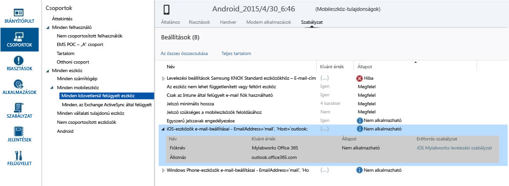

# Szabályzatokkal kapcsolatos problémák elhárítása a Microsoft Intune-ban

Ha problémába ütközik az Intune-szabályzatok érvénybe léptetése vagy kezelése során, kezdje itt. Ez a témakör néhány gyakori problémát és azok megoldását ismerteti.

## Vonatkozik szabályzat az eszközre?
**Probléma:** Nem egyértelmű, hogy vonatkozik-e az eszközre adott szabályzat, vagy az eszköz egy szabályzattal ellentétesen viselkedik-e.

Az egyes eszközökre vonatkozó szabályzat adatainak tanulmányozásával állapítsa meg, hogy milyen hatással van egy szabályzat egy adott eszközre.

Az Intune felügyeleti konzoljában az **Eszköztulajdonságok**csoportban minden eszközhöz tartozik egy szabályzatlap. Ha nincs lap, akkor lehetséges, hogy az eszköz regisztrálása még folyamatban van, vagy nem tartozik hozzá szabályzat. Minden egyes házirend rendelkezik egy **Kívánt érték** és egy **Állapot**jellemzővel. A kívánt érték az az érték, amelyet a házirend hozzárendelésekor el kívánt érni. Az állapot az eszközre érvényes összes házirend alkalmazása, valamint a hardver és az operációs rendszer által szabott korlátozások és rendszerkövetelmények együttese alapján elért érték. A lehetséges állapotok az alábbiak:

-   **Megfelelő:**Az eszköz megkapta a szabályzatot, és jelenti a szolgáltatásnak, hogy megfelel a beállításnak.

-   **Nem alkalmazható:**A szabályzatbeállítás nem alkalmazható. Az iOS-eszközök e-mail beállításai például nem alkalmazhatók az androidos eszközökre.

-   **Folyamatban:**A rendszer elküldte a szabályzatot az eszköznek, de az nem jelentette az állapotot a szolgáltatásnak. Például az Android rendszeren csak akkor működik a titkosítás, ha a felhasználó engedélyezi, ezért függőben lehet.

Az alábbi képernyőképen két világos példa látható:

-   Az **Egyszerű jelszavak engedélyezése** beállított értéke **Igen**, ahogy az a **Kívánt érték** oszlopban látható, az **Állapot** értéke azonban **Nem alkalmazható**. Ez azért van, mert az egyszerű jelszavak az Android-eszközökön nem támogatottak.

-   Ehhez hasonlóan az **iOS-eszközök e-mail beállításai** kiterjesztett szabályzat erre az eszközre nem alkalmazható, mert ez Android-eszköz.

> [!NOTE]
> Ne felejtse el, hogy ha két különböző korlátozási szintű házirend vonatkozik egy eszközre vagy felhasználóra, akkor gyakorlatban a szigorúbb házirend lesz érvényes.

## Microsoft Intune-házirendekkel kapcsolatos hibák a policyplatform.log fájlban
Nem mobileszköz-felügyelet alá tartozó Windows-eszközök esetén a policyplatform.log fájlban lévő házirendhibák az eszközön lévő Windows Felhasználói fiókok felügyelete (UAC) nem alapértelmezett beállításainak eredményei lehetnek. Néhány nem alapértelmezett UAC-beállítás hatással lehet a Microsoft Intune ügyféltelepítéseire és a házirendek érvénybe léptetésére.

### Az UAC-problémák megoldása

1.  Vonja ki a számítógépet az [Eszközök kivonása a Microsoft Intune-nal való felügyelet alól](/intune/deploy-use/retire-devices-from-microsoft-intune-management) szakaszban leírtak szerint.

2.  Várjon 20 percet az ügyfélszoftver eltávolításáig.

    > [!NOTE]
    > Ne próbálja meg eltávolítani az ügyfelet a Programok és szolgáltatások területről.

3.  A Start menüben írja be az **UAC** kifejezést a Felhasználói fiókok felügyelete beállításainak megnyitásához.

4.  Mozgassa az értesítési csúszkát az alapértelmezett beállításhoz.

## Figyelmeztetés: A hozzáférési szabályok mentése az Exchange szolgáltatásba sikertelen
**Probléma:**A felügyeleti konzolban megjelenik **A hozzáférési szabályok mentése az Exchange szolgáltatásba sikertelen**  figyelmeztetés.

Ha a felügyeleti konzol Helyszíni Exchange-szabályzat munkaterületén szabályzatot hozott létre, de O365-öt használ, az Intune nem kényszeríti ki a konfigurált szabályzatbeállítások használatát. Jegyezze fel a figyelmeztetésben szereplő szabályzatforrást.  A Helyszíni Exchange-szabályzat munkaterületen törölje az örökölt szabályokat, mivel azok a helyszíni Exchange-hez készült Intune-on belüli globális Exchange-szabályok, és nem vonatkoznak az O365-re. Ezután hozzon létre új szabályzatot az O365-höz.

## HIBA: Nem szerezhető be érték a számítógépről, 0x80041013
Ez akkor fordulhat elő, ha a helyi rendszeren lévő idő legalább öt perccel eltér a szinkronizált értéktől. Ha a helyi számítógépen lévő idő nincs szinkronban, a biztonságos tranzakciók meghiúsulnak, mert az időbélyegek érvénytelenek lesznek.

A hiba megoldásához állítsa a helyi időt a lehető legközelebb az internetes időhöz, vagy a hálózaton lévő tartományvezérlőkben megadott időhöz.

## Nem módosítható a különféle MDM-eszközök biztonsági szabályzata
A Windows Phone-telefonok és a Windows RT-eszközök nem teszik lehetővé, hogy a beállításukat követően csökkentse az MDM-en vagy az EAS-on keresztül megadott biztonsági szabályzatok biztonságát. Ilyen eset például, ha beállítja a **jelszó minimális karakterszámát** 8-ra, majd megpróbálja 4-re csökkenteni. Az eszközhöz már a szigorúbb szabályzat tartozik.

Az eszköz platformjától függően előfordulhat, hogy ha módosítani szeretné a szabályzatot egy kevésbé biztonságos értékre, alaphelyzetbe kell állítania a biztonsági szabályzatokat.
Windows RT rendszerben például pöccintsen jobbról a **Gombok** sáv megnyitásához, majd válassza a **Beállítások** &gt; **Vezérlőpult** lehetőséget.  Válassza a **Felhasználói fiókok** kisalkalmazást.
A bal oldali navigációs menü alján található egy **Biztonsági házirendek mellőzése** hivatkozás. Válassza ki, majd kattintson a **Házirendek mellőzése** gombra.
Előfordulhat, hogy egyéb MDM-eszközöket (például Android, Windows Phone 8.1 és újabb, valamint iOS) ki kell vonni, majd újból regisztrálni kell a szolgáltatásba egy kevésbé korlátozó szabályzat alkalmazásához.

## Nem lehet szabályzatot létrehozni vagy ügyfeleket regisztrálni, ha a vállalat neve speciális karaktereket tartalmaz.
**Hiba:** nem lehet szabályzatot létrehozni vagy ügyfeleket regisztrálni.

**Megoldás:** Az [Office 365 felügyeleti központban](https://portal.office.com/) törölje a speciális karaktereket a vállalat nevéből, és mentse a vállalati adatokat.

### További lépések
Ha ezek a hibaelhárítási információk nem oldották meg a problémát, forduljon a Microsoft támogatási szolgálatához a [Hogyan kérhet támogatást a Microsoft Intune-hoz](how-to-get-support-for-microsoft-intune.md) című témakörben leírtak szerint.

<!--HONumber=Aug16_HO4-->

