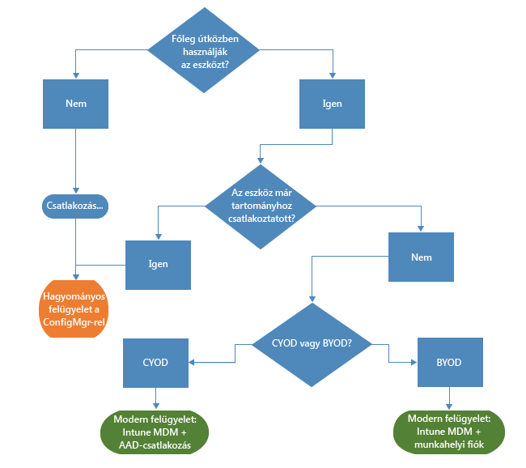

# Úton a modern Windows-felügyelet felé a Microsoft Intune-nal

A személyes eszközök használata a munkahelyen csakúgy, mint a dolgozók irodán kívüli munkavégzése, megváltoztatja azt, ahogyan a szervezetek az eszközöket kezelik. Míg egyes szervezetekben az eszközök mélyreható, részletes ellenőrzésére van szükség, más szervezetek könnyedebb, forgatókönyv-alapú felügyeletet alkalmaznak, ami hatékonyabbá teszi a modern munkaerőt.

Folytatva a Windows hagyományait, a Windows 10 a legjobban felügyelt operációs rendszert kínálja a szervezetek számára. A Windows olyan technológiákkal támogatja a részletes felügyeletet és biztonságot, mint csoportházirendek, az Active Directory és a System Center Configuration Manager. Emellett a „mobile first, cloud first” („első helyen a mobil és a felhő”) jelszó jegyében egyszerű, modern felügyeleti lehetőséget kínál olyan felhőalapú eszközkezelési megoldások segítségével, mint a Microsoft Nagyvállalati mobilitási csomag (EMS). A Windows szoftverszolgáltatáson keresztül nyújtott jövőbeni Windows-innovációkat olyan rugalmas felhőalapú szolgáltatások egészítik ki, mint a Microsoft Intune, az Azure Active Directory, az Azure Rights Management szolgáltatás, az Office 365 és a Vállalati Windows Áruház.

Az informatikai szervezetek számára ez nagyobb rugalmasságot biztosít, és kihasználhatják az innováció és a költségmegtakarítás előnyeit. A jelen dokumentum a Windows 10 központi telepítésének és felügyeletének stratégiáival kapcsolatban nyújt útmutatást. Emellett bepillantást enged a Microsoft stratégiai gondolkodásába az eszközfelügyeleti megoldásokkal kapcsolatban. Amikor a felügyelet alapjairól és arról gondolkodunk, hogyan kívánjuk azokat alkalmazni a különböző eszközökre, érdemes figyelembe venni az eszközök életciklusának következő négy fázisát:

## Telepítés és jogosultságkiosztás

Ellentétben a hagyományos operációsrendszer-telepítési módszerekkel, amelyek bonyolult informatikai műveleteket igényelnek, az eszközkezelés megnyitja az utat az „azonnali felügyelethez”. Az informatikai részleg szeretné egyszerűen elérni új eszközök teljes körű konfigurálását és felügyeletét anélkül, hogy szükség lenne a rendszerképből való újratelepítésre.  Az olyan felhőalapú eszközfelügyeleti szolgáltatások, mint a Microsoft Intune, minden eddiginél egyszerűbbé teszik a dinamikus kiépítést. A Windows Imaging and Configuration Designer (ICD) eszköz segítségével önálló kiépítési csomagok is létrehozhatók. Természetesen továbbra is támogatjuk a hagyományos lemezkép-készítési technikákat, így a szervezetek számára az egyéni lemezképek központi telepítése ugyancsak lehetséges marad a System Center Configuration Manager révén.

## Identitás és hitelesítés

A Windows 10 és az olyan szolgáltatások, mint az Azure Active Directory, új lehetőségeket nyitnak a felhőalapú identitás-kezelés, hitelesítés és felügyelet számára. Az olyan forgatókönyvek, mint a BYOD (saját eszköz munkahelyi használata) és a CYOD (saját eszköz választása) lehetővé teszik a vállalatok számára, hogy újragondolják, hogyan érik el a felhasználók a vállalati erőforrásokat és alkalmazásokat. A felhasználó- és eszközkezelés két kategóriára oszlik:

- A vállalati (CYOD) vagy személyes (BYOD) eszközöket mobilfelhasználók használják olyan szoftverszolgáltatások eléréshez, mint az Office 365.

  A Windows 10 lehetővé teszi, hogy a felhasználók önkiszolgáló módon helyezzék üzembe az eszközöket. Az Azure AD Join funkció segítségével a vállalati eszközök egyszerűen beállíthatják a hozzáférést a vállalati rendszerekhez. Hasonlóan, a BYOD nyújtotta új, egyszerűsített felhasználói élmény lehetővé teszi, hogy a felhasználók hozzáadják munkahelyi fiókjukat a Windows rendszerhez és személyes eszközeikkel érjék el a munkahelyi erőforrásokat. Az Azure AD Join funkció és az automatikus Intune MDM-regisztráció kombinációja révén az eszközök [egyetlen egyszerű lépéssel](https://blogs.technet.microsoft.com/ad/2015/08/14/windows-10-azure-ad-and-microsoft-intune-automatic-mdm-enrollment-powered-by-the-cloud/) kerülnek a vállalat felügyelete alá, és mindez a felhőben történik. Az Azure AD Join egyúttal nagyszerű megoldás az ideiglenes alkalmazottak, a partnerek és a részmunkaidős dolgozók számára is. Ezek a fiókok elkülöníthetők a helyszíni AD-tartománytól, ugyanakkor hozzáférhetnek a szükséges vállalati erőforrásokhoz.
- A tartományhoz csatlakozó számítógépek és táblagépek, amelyek hitelesítést igénylő hagyományos alkalmazásokat és erőforrásokat használnak, vagy amelyek a helyszínen rendkívül érzékeny vagy bizalmas erőforrásokhoz férnek hozzá

  A helyszíni Active Directory-tartományhoz csatlakozó Windows 10-eszközök automatikusan regisztrálnak az Azure AD-ben, így a felhasználók továbbra is élvezhetik a Windows 10 nyújtotta felhasználói élmény olyan előnyeit, mint a bárhonnan végrehajtható egyszeri bejelentkezés a felhőbe és a vállalati erőforrásokba, a beállítások vállalati hordozhatósága, a Microsoft Passport for Work és a Windows Hello. A tartományhoz csatlakozó számítógépeket és táblagépeket továbbra is a System Center Configuration Manager-ügyféllel vagy Csoportházirenddel kell felügyelni.

Tekintse át szervezete szerepköreit. Azonosítsa azokat a felhasználókat vagy eszközöket, amelyek esetében szükség van a tartományhoz való csatlakozásra, és fontolja meg a többiek átállítását Azure AD-re. Ebben a [cikkben](https://azure.microsoft.com/en-us/documentation/articles/active-directory-azureadjoin-windows10-devices/) talál további információt azzal kapcsolatban, hogy hogyan optimalizálja a Windows 10 és az Azure AD a hozzáférést a munkahelyi erőforrásokhoz egy sor különböző eszköz és forgatókönyv esetében.

Így néz ki egy általánosított döntési fa. Természetesen bizonyos esetekben vannak kivételek.

## Beállítások és konfiguráció

A szükséges felügyelet szintje, a felügyelt eszközök és adatok köre és az iparági előírások együttesen határozzák meg a konfigurációs követelményeket. Az alkalmazottak ugyanakkor gyakran aggódnak amiatt, hogy az informatikai részleg szigorú szabályzatokat alkalmaz személyes eszközeikre, mindazonáltal igénylik a hozzáférést vállalati e-mailjeikhez és dokumentumaikhoz. A Windows 10 a közös MDM-rétegen keresztül konzisztens konfiguráció-együttest biztosít a számítógépek, a táblagépek és a telefonok számára. Az MDM-személet olyan beállításokat kíván, amelyek anélkül valósítják meg a rendszergazda szándékát, hogy minden lehetséges beállítást közzétennének. Ezzel szemben a csoportházirend közzéteszi a rendszergazda által külön-külön szabályozott részletes beállításokat. Az MDM egyik előnye, hogy rugalmasabb és hatékonyabb eszközök segítségével szélesebb körű adatvédelmi, biztonsági és alkalmazás-felügyeleti beállításokat alkalmazzanak. Ez teszi az MDM-et ideális megoldássá az olyan eszközök vonatkozásában, amelyek folyamatosan mozgásban vannak.

Számos szervezetnek még mindig olyan részletességgel kell felügyelnie a tartományhoz csatlakoztatott számítógépeket, mint az Internet Explorer 1500 konfigurálható Csoportházirend-beállítása vagy a rendkívül részletes Windows tűzfal-szabályok. Az ilyen esetekben a Csoportházirend és a System Center Configuration Manager továbbra is kiváló felügyeleti eszközök. A Csoportházirend kínálja a legjobb megoldást a Windows-alapú eszközökkel a vállalati hálózathoz csatlakozó tartományhoz csatlakoztatott Windows rendszerű számítógépek és táblagépek részletes szintű konfigurálására. A Microsoft továbbra is biztosítja a Csoportházirend-beállításokat valamennyi új Windows-verzióhoz. A robusztus központi szoftvertelepítések, a Windows-frissítések és az operációs rendszerek központi telepítése esetén továbbra is a Configuration Manager a javasolt megoldás.

## Windows-eszközök frissítése

A Windows mint szolgáltatás jóvoltából az informatikai szervezeteknek már nem kell összetett lemezkép-készítési feladatokat (törlés és töltés) végrehajtaniuk minden egyes új Windows-kiadás esetén. Akár az aktuális ághoz (CB), akár az aktuális üzleti ághoz (CBB) tartoznak, az eszközök egyszerű – gyakran automatikus – javítási folyamatokon keresztül kapják meg a legújabb funkció- és minőségi frissítéseket. Az Intune mobileszköz-kezelési képessége biztosítja a Windows-frissítések alkalmazását a vállalat ügyfélszámítógépein. A Configuration Manager gazdag felügyeleti és követési funkciókat biztosít ezekhez a frissítésekhez, ideértve a karbantartási időszakok beállítását és az automatikus központi telepítésre vonatkozó szabályokat.

## Összefoglalás

Ha modern eszközfelügyelet megvalósítását tervezi szervezetében, tekintse át azokat a lépéseket, amelyekkel elindulhat ezen az úton.

1. **Vannak olyan beruházások, amelyeket már ma végrehajthat.** A hagyományos eszközfelügyelet mely elemeit kell megőrizni, és melyek azok a területek, ahol lehetséges a modernizáció? Akár az egyedi lemezképkészítés, akár a beállítások kezelésének átértékelése vagy a hitelesítés és megfelelőség újragondolása irányában tesz lépéseket, ezzel azonnali előnyöket realizálhat.

2. **Értékelje környezete különböző használati eseteit.** Vannak olyan eszközcsoportok, amelyeknek hasznukra lenne a könnyebb és egyszerűbb felügyelet? A BYOD-eszközök esetében például kézenfekvő lehetőség a felhőalapú felügyelet. A szigorúbban szabályozott adatokat kezelő felhasználók és eszközök esetében szükség lehet a helyszíni AD-tartományra a hitelesítéshez. A Configuration Manager és az EMS biztosítja a modern felügyeleti forgatókönyvek előkészítéséhez szükséges rugalmasságot, miközben az üzleti igényeknek legmegfelelőbb módon célozza meg a különböző eszközöket. A döntés az Öné.

## Mik a legközelebbi teendők?

- **Mérje fel környezete felügyeleti szükségleteit.** Nem biztos, hogy valamennyi igényének ugyanaz a méret a legmegfelelőbb; ez az emberektől, a mobilitásuktól, az eszközöktől és az általuk elért adatoktól függ.
- **Gondolja át a követelményeket.** A Windows 10, a Configuration Manager és a Nagyvállalati mobilitási csomag együttesen bármilyen forgatókönyv mellett képes biztosítani a lemezképkészítéshez, a hitelesítéshez, a beállításokhoz és a felügyeleti eszközökhöz szükséges rugalmasságot.
- **Haladjon kis lépésekben.** A modern eszközfelügyelet megvalósítása nem feltétlenül máról holnapra történik.
- **Optimalizálja meglévő befektetéseit.** A hagyományos, helyszíni felügyelettől a modern, felhőalapú felügyelet felé tartó úton használja ki a Configuration Manager és az Intune rugalmas, hibrid architektúráját. Ahogy egyre több lehetőség válik elérhetővé a felhőidentitási/MDM modellben, a Microsoft elkötelezett amellett, hogy világos és egyértelmű utat biztosítson a hagyományostól az új típusú felügyelet felé.

<!--HONumber=Sep16_HO2-->

