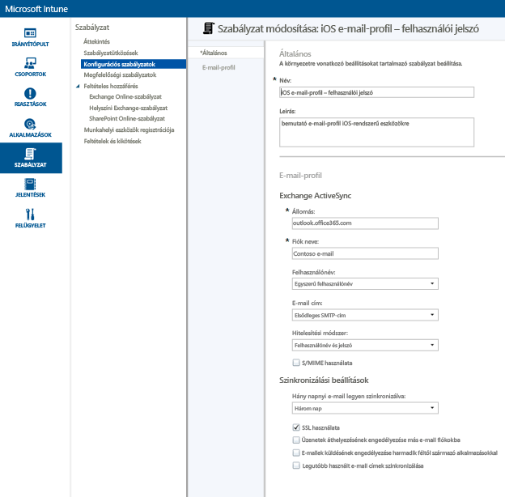
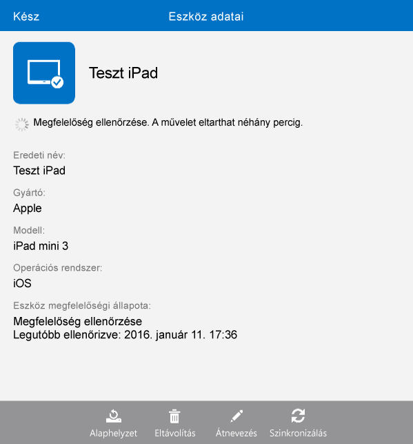

# E-mail hozzáférés beállítása iOS-eszközökhöz a Microsoft Intune-nal
Ha az eszközöket az Intune-nal regisztrálja, azokat konfigurálhatja úgy, hogy a felhasználóik hozzáférhessenek a vállalati e-mailekhez. Ezt meghatározott eszköztípusok esetében úgy hajthatja végre, hogy létrehoz és telepít egy **e-mail profilt**. Az e-mail profilok olyan Intune-szabályzatok, amelyek beállítják és összekapcsolják a felhasználó eszközét a vállalati e-mail szolgáltatással.
E-mail profil használatával az e-mailek elérése automatizálható a regisztrált eszközök számára, amivel elkerülhető az eszközök kézi beállítása. Az e-mail profil azt is biztosítja, hogy az összes végfelhasználónál azonos módon legyen beállítva a hozzáférés, ugyanazokkal az alapvető beállításokkal.

## A jelen kalauz céljai

- E-mail profil létrehozása és telepítése az iOS-eszközökhöz
- Az e-mail profilra vonatkozó szabályzat sikeres alkalmazásának ellenőrzése

## Mire van szükség a kezdéshez?

- Exchange Server, akár helyszíni, akár az Azure-ban működik az Office/E3 előfizetés részeként.
- A vállalati Exchange-kiszolgáló állomásneve. Ez a teljes tartománynév (FQDN), például: **contosodemo55.onmicrosoft.com**.
- Felhasználói csoport, amelyhez az e-mail profilt telepíti. Ha végrehajtotta [A Microsoft Intune próbaverziójának elindítása és az iOS PIN-kódokra vonatkozó szabályzatának alkalmazása](start-a-microsoft-intune-trial-and-deploy-ios-pin-policy.md) kalauzban leírt műveleteket, használhatja az ekkor létrehozott **GroupDemo** felhasználói csoportot.
- Regisztrált iOS-eszközök, amelyekre a profilt telepíti. Ha végrehajtotta [A Microsoft Intune próbaverziójának elindítása és az iOS PIN-kódokra vonatkozó szabályzatának alkalmazása](start-a-microsoft-intune-trial-and-deploy-ios-pin-policy.md) kalauzban leírt műveleteket, már rendelkezik néhány regisztrált iOS-eszközzel.

## Az iOS-eszközökhöz tartozó e-mail profil létrehozásának és telepítésének lépései

Ebben a kalauzban a próba-előfizetéshez tartozó szolgáltatott Exchange-kiszolgálót fogjuk használni.
1. Az Intune-konzolon kattintson a **Házirend**, majd a **Házirend hozzáadása** elemre.

2. Az **Új házirend létrehozása** párbeszédpanelen bontsa ki az **iOS** elemet, jelölje be az **E-mail-profil** elemet, és kattintson a **Házirend létrehozása** elemre.

3. A szabályzat-létrehozási lapon adja meg a szabályzat nevét, például **iOS e-mail profil - felhasználói jelszó**, és adja meg a szabályzat leírását. Lehet, hogy többféle e-mail-profilt fog használni a különböző eszköztípusokhoz és a különböző hitelesítési módszerekhez, ezért a névben érdemes jeleznie azt, hogy mihez tartozik az adott profil.
4. Adja meg az Exchange-kiszolgáló állomásnevét. Mivel az Azure-platformon futó Exchange-kiszolgálót használjuk, az állomásnév ebben az esetben a következő: **outlook.office365.com**

5. Adja meg a fiók nevét, amely megjelenik az eszköz felhasználóinál, és jelzi az e-mail szolgáltatást. Például: **Contoso e-mail**.
6. Mivel felhasználónevet és jelszót használunk a felhasználó hitelesítéséhez az Exchange szolgáltatásban, ne változtassa meg a meglévő felhasználónevet és jelszót.
7. Módosítsa az igényeinek megfelelően a szinkronizálási beállításokat. Most használja az alapértelmezett értékeket, hacsak nincs köztük olyan, amelyet kifejezett módosítani szeretne.  
8. Kattintson a **Házirend mentése** gombra.
9. Megjelenik egy párbeszédpanel azzal a kérdéssel, hogy kívánja-e most telepíteni a szabályzatot. Kattintson az **Igen** gombra.

10. A következő megjelenő ablakban válassza ki azt a felhasználói csoportot, amelyhez telepíteni szeretné az e-mail-profilt, és kattintson a **Hozzáadás**, majd az **OK** gombra.
 Miután rákattintott az **OK** gombra, a szabályzat egy-két percen belül érvényesítve lesz a regisztrált eszközökön.

## A profil sikeres alkalmazásának ellenőrzéséhez végrehajtandó lépések

Ellenőrizze, hogy megtörtént-e a profil alkalmazása. Ehhez hozzáférésre lesz szüksége az egyik olyan eszközhöz, amelyre telepítette az e-mail profilt.
1. Az iOS-eszközön nyissa meg a levelezőalkalmazást.
Az alkalmazás kéri a felhasználó e-mail fiókjához tartozó felhasználónevet és jelszót.

2. Adja meg a felhasználó Exchange e-mail-fiókjának felhasználónevét és jelszavát, és koppintson az **OK** elemre.
 A levelezőalkalmazás megnyitja az Exchange-fiókot, és elkezdődik az e-mailek szinkronizálása az eszközre.

3. Ellenőrizze a fiókbeállításokat a levelezőalkalmazásban, és győződjön meg arról, hogy a fiók neve megegyezik az e-mail profilban megadott névvel (például **Contoso e-mail**), és arról is, hogy a szinkronizálási beállítások helyesen vannak megadva.

 Ha úgy látja, hogy még nem történt meg az e-mail-profil automatikus alkalmazása az eszközre, az eszközön található Vállalati portál alkalmazás használatával kézzel alkalmazhatja a szabályzatot.
1. Nyissa meg a Vállalati portál alkalmazást.
2. Koppintson az **Eszközök** elemre.
3. Koppintson az eszköz nevére.

4. Koppintson a **Szinkronizálási** > **Megfelelőség ellenőrzése** elemre.
 Az e-mail-profil néhány másodpercen belül alkalmazva lesz az eszközre. Ezután az ellenőrző lépések végrehajtásával győződjön meg arról, hogy a profil megfelelően lett alkalmazva.

## Lásd még:
[Útmutató az Intune próbaverziójához](get-started-with-a-30-day-trial-of-microsoft-intune.md)

<!--HONumber=Jun16_HO4-->

