# A Microsoft Intune próbaverziójának elindítása és az iOS PIN-kódokra vonatkozó szabályzatának alkalmazása
Ezek a részletes útmutatók segítenek az Intune próbaverziójának beállításában és PIN-házirend konfigurálásában az iOS-eszközökhöz. Az Intune értékelésével kapcsolatos további kipróbálható általános feladatok listáját a [Common Microsoft Intune evaluation tasks](common-microsoft-intune-evaluation-tasks.md) (A Microsoft Intune értékelésével kapcsolatos általános feladatok) című témakörben tekintheti meg.

## A feladat előfeltételeinek áttekintése

-   Windows rendszerű számítógép, amelyen Internet Explorer található – adminisztratív feladatokhoz

-   iOS 7.1-es vagy újabb verzió a felhasználói házirend érvényesítésének teszteléséhez

-   Telefon a hitelesítéséhez próbafeliratkozás során

## Ingyenes Intune-próbafiók létrehozása
> [!NOTE]
> Ha már rendelkezik Intune-előfizetéssel, hagyja ki ezt a szakaszt, és folytassa a következő szakasszal.

1.  Windows rendszerű számítógépen kattintson a jobb gombbal az **Internet Explorer** (IE) elemre, és válassza az **InPrivate-böngészés** lehetőséget.

    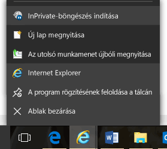

2.  Lépjen az [Intune feliratkozási portálra](https://portal.office.com/Signup/Signup.aspx?OfferId=40BE278A-DFD1-470a-9EF7-9F2596EA7FF9&dl=INTUNE_A&ali=1), adja meg a kért információkat, és kattintson a **Tovább** gombra.

    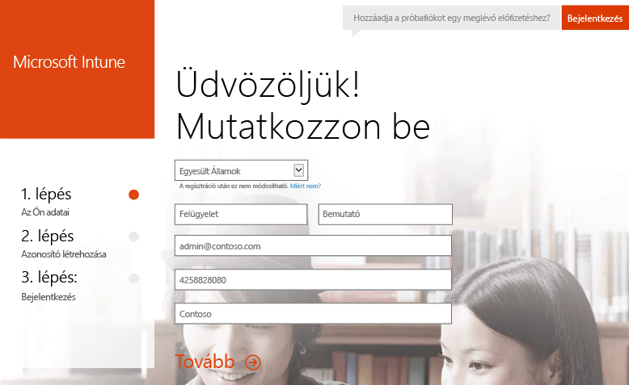

3.  Adjon meg egy felhasználói azonosítót és egy jelszót a rendszergazdai fiókhoz, és kattintson a **Tovább** gombra. Ezzel az azonosítóval fog bejelentkezni az Intune-portálra a rendszergazdai feladatok elvégzéséhez.

    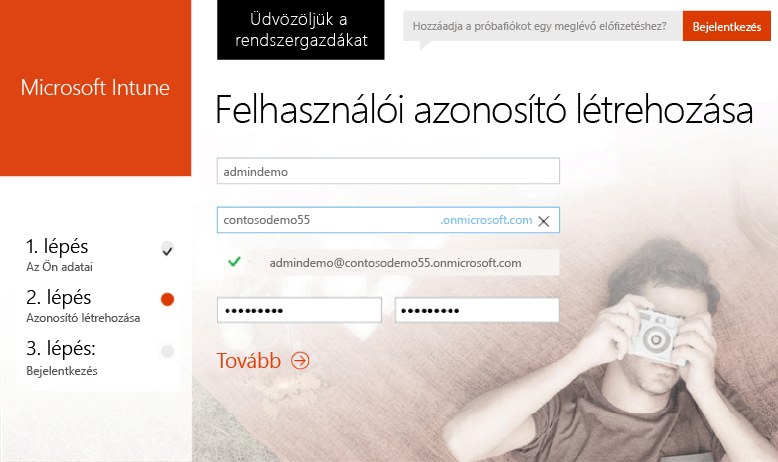

4.  Adja meg a mobiltelefonszámát, és kattintson az **SMS-t kérek** gombra a szám érvényesítéséhez.

    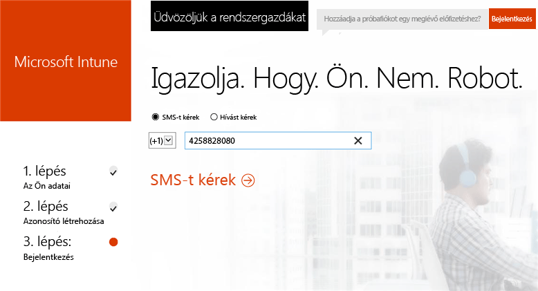

5.  Mentse el a képernyőn megjelenő információkat, majd kattintson a **Készen áll...** gombra.

    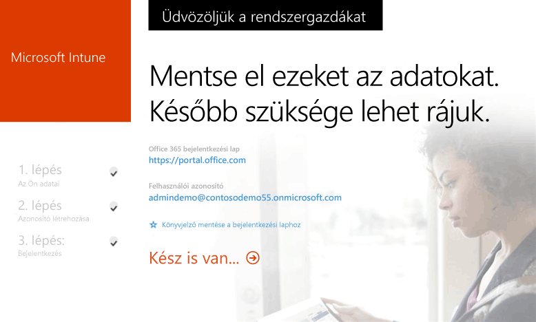

## Tesztfelhasználó létrehozása

1.  Windows rendszerű számítógépen kattintson a **Start** gomba a felhasználófelügyeleti lapra lépéshez.

    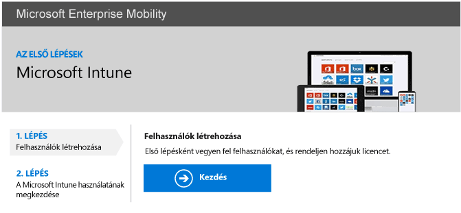

2.  Felhasználó hozzáadásához kattintson a **+** gombra.

    

3.  Az **Új felhasználói fiók létrehozása** lapon:

    1.  Adja meg a tesztfelhasználó információit.

    2.  Válassza a **Jelszó beírása** lehetőséget.

    3.  Törölje az **Ennek a személynek a következő bejelentkezéskor módosítania kell a jelszavát** jelölőnégyzet bejelölését.

    4.  Kattintson a **Létrehozás** gombra.

    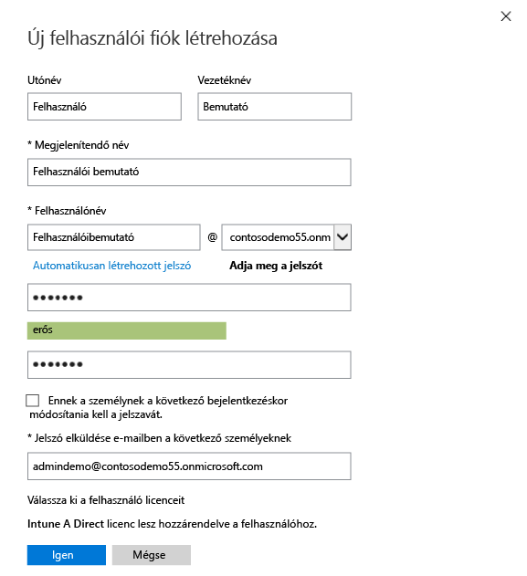

4.  A felhasználó létrehozásának megerősítési oldalán kattintson a **Bezárás** gombra.

    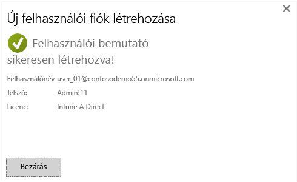

5.  Kattintson a **Frissítés** gombra a létrehozott tesztfelhasználó megtekintéséhez.

    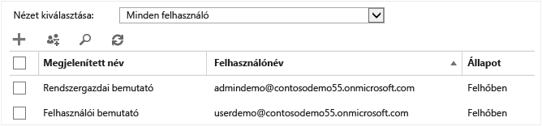

## iOS PIN-kódokra vonatkozó házirend konfigurálása a tesztfelhasználó számára

1.  Windows rendszerű számítógépen állítsa be az Intune-t mobileszköz-kezelő szolgáltatóként:

    1.  Lépjen az [Intune felügyeleti konzoljára](http://manage.microsoft.com/), jelentkezzen be a rendszergazdai fiókjával, és kattintson a **Mobileszközök kezelésének megkezdése** gombra. Megnyílik a mobileszköz-kezelő szolgáltató oldala.

        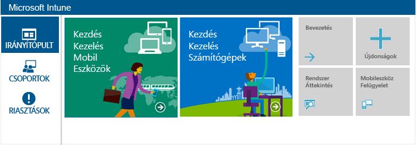

    2.  Kattintson a **Mobileszköz-kezelő szolgáltató megadása** hivatkozásra.

        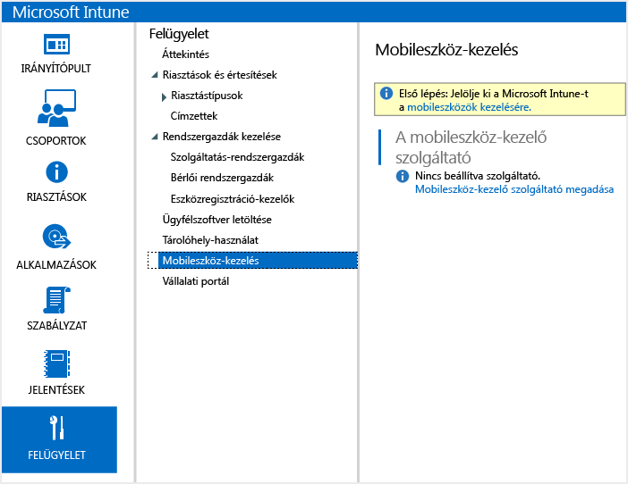

2.  Engedélyezze az iOS-eszközök regisztrációját. Ez a folyamat megbízható tanúsítványt állít be az Apple Push Notification szolgáltatás (APNs) és az Intune-előfizetés között.

    1.  Kattintson **Az iOS és a Mac OS X platform engedélyezése** gombra.

        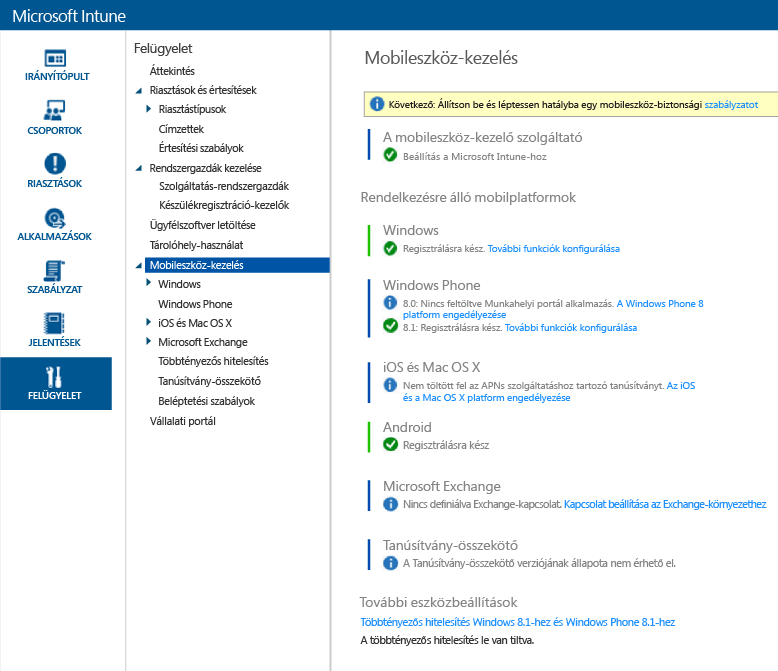

    2.  Kattintson **Az APNs-tanúsítványkérelem letöltése** gombra.

        

    3.  Adjon meg egy fájlnevet és egy helyet a tanúsítvány-aláírási kérelem számára, majd kattintson a **Mentés** parancsra. Ebben a fájlban található az Intune-előfizetés által őrzött titkos kulcsnak megfelelő nyilvános kulcs.

        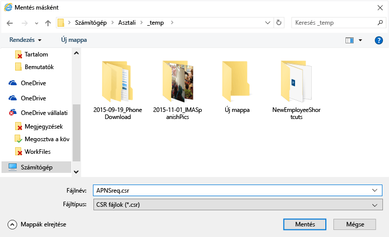

    4.  Kattintson az **Apple Push Certificates portálra** új lap megnyitásához.

        

    5.  Adja meg az Apple ID-t és a jelszót, és kattintson a **Sign in** (Bejelentkezés) gombra. Ez az azonosító az iOS-eszközön alkalmazások az iOS App Store áruházból való beszerzéséhez használt azonosító lehet.

        

    6.  Kattintson a **Create a Certificate** (Tanúsítvány létrehozása) gombra.

        

    7.  Olvassa el az Apple felhasználási feltételeit, jelölje be a jelölőnégyzetet, és kattintson az **Accept** (Elfogadás) gombra.

        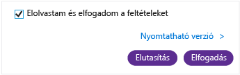

    8.  Kattintson a **Tallózás** gombra.

        

    9. Válassza ki a korábban mentett CSR-fájlt, és kattintson az **Open** (Megnyitás) gombra.

        

    10. Kattintson az **Upload** (Feltöltés) gombra.

        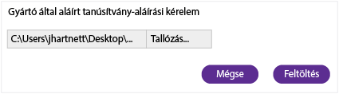

    11. Ha a rendszer rákérdez a JSON-fájl letöltésére, kattintson a **Save as** (Mentés másként) gombra.

        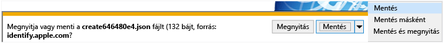

    12. Adjon meg egy helyet a JSON-fájl számára, majd kattintson a **Save** (Mentés) parancsra.

        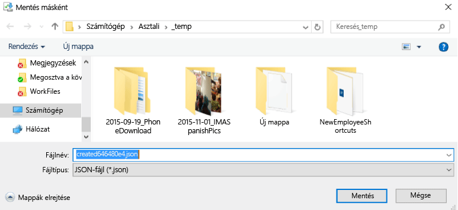

        Ha az oldala nem irányítja át automatikusan néhány másodpercen belül, kattintson a **Cancel** (Mégse) gombra.

        

    13. Az újonnan létrehozott tanúsítványfájl lekéréséhez kattintson a **Download** (Letöltés) gombra.

        

    14. Ha a rendszer rákérdez a PEM-fájl letöltésére, kattintson a **Save as** (Mentés másként) gombra.

        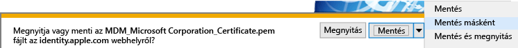

    15. Adjon meg egy helyet a PEM-fájl számára, majd kattintson a **Save** (Mentés) parancsra.

        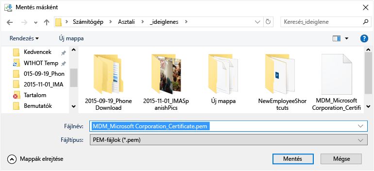

    16. Térjen vissza az Intune felügyeleti konzoljára, és kattintson **Az APNs-tanúsítvány feltöltése** gombra.

        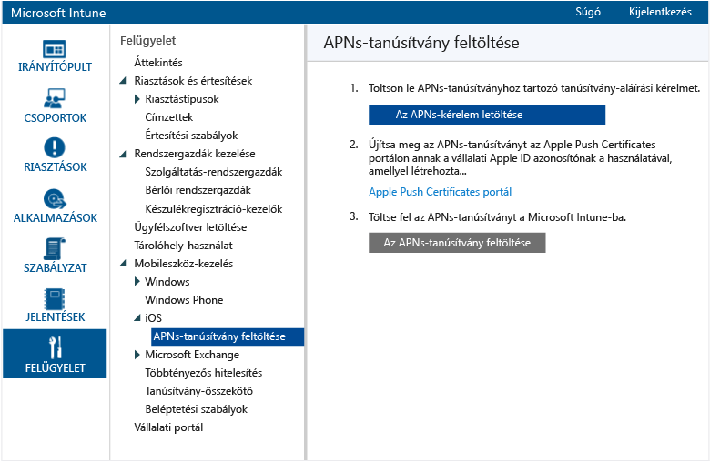

    17. Adja meg az Apple ID-t, és kattintson a **Tallózás** gombra.

        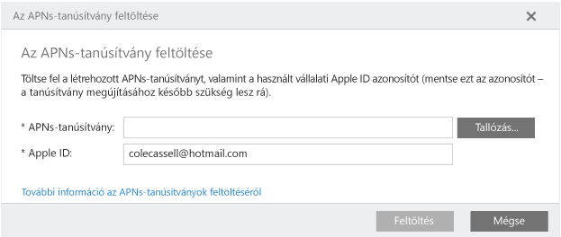

    18. Válassza ki a nemrég mentett PEM-fájlt, és kattintson a **Megnyitás** gombra.

        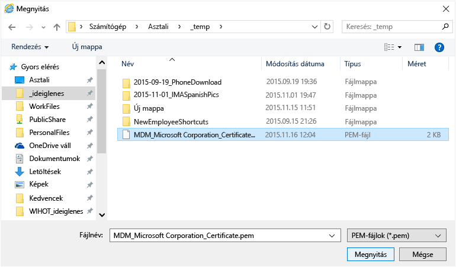

    19. A befejezéshez kattintson a **Feltöltés**.

        

        Az APNs-tanúsítvány most már konfigurálva van.

        

3.  Tesztfelhasználói csoport létrehozása a házirendek célzásához:

    1.  A bal oldali panelen kattintson a **Csoportok** elemre.

        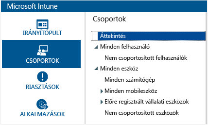

    2.  A jobb szélen kattintson a **Csoport létrehozása** elemre.

        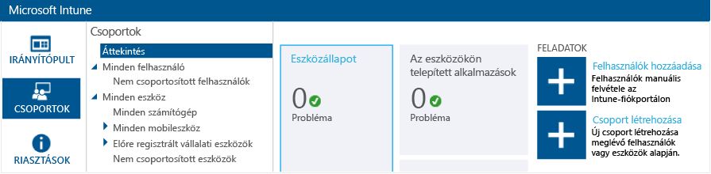

    3.  Adjon meg egy csoportnevet, válassza a **Minden felhasználó** elemet szülőcsoportként, és kattintson a **Tovább** gombra.

        

    4.  A **Csoporttagság kezdése a következővel:** mezőben válassza **A szülőcsoport összes felhasználója** elemet, és kattintson a **Befejezés** gombra.

        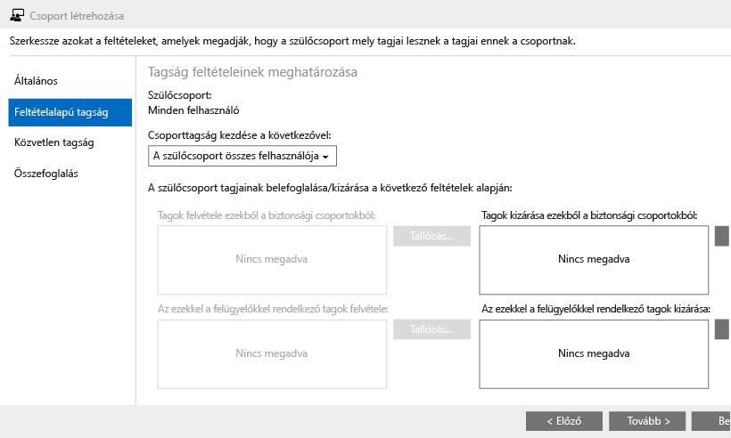

4.  Hozzon létre egy iOS PIN-kódokra vonatkozó házirendet és célozza meg azzal a tesztfelhasználói csoportot:

    1.  A bal oldali panelen kattintson a **Házirend** elemre.

        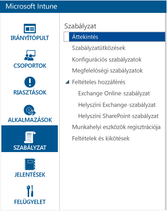

    2.  A jobb szélen kattintson a **Házirend hozzáadása** elemre.

        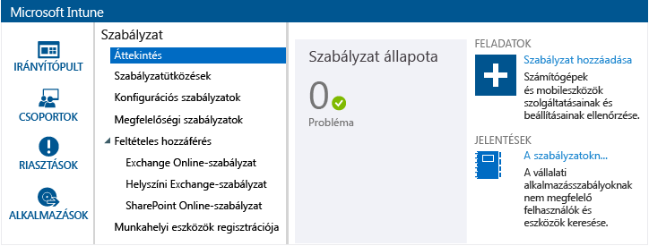

    3.  Bontsa ki az iOS csomópontot, válassza az **Általános konfiguráció** sort, és kattintson a **Házirend létrehozása** elemre.

        

    4.  Adjon meg egy nevet a házirend számára, kapcsolja be **A mobileszközök zárolásának feloldásához jelszó szükséges** beállítást, és állítsa a **Jelszó minimális hossza** beállítást **4** értékre.

        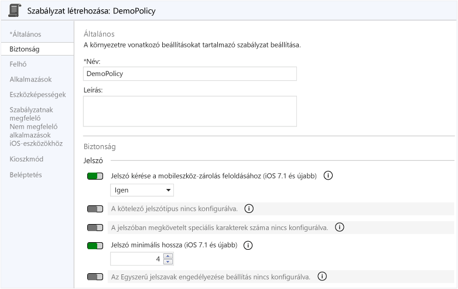

    5.  Kattintson az **Igen** gombra a házirend telepítéséhez.

        

    6.  Kattintson a korábban létrehozott felhasználói csoportra, kattintson a **Hozzáadás** gombra, és kattintson az **OK** gombra.

        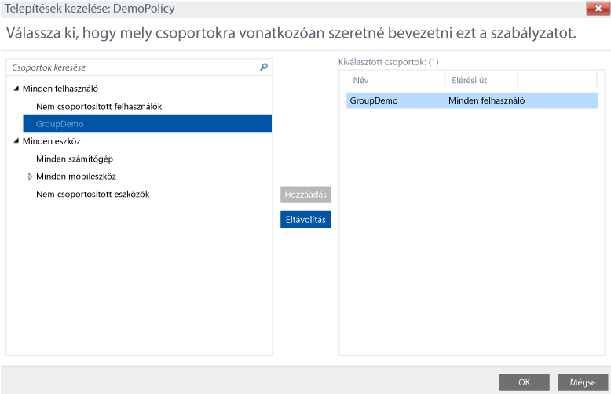

        Most egy olyan, iOS PIN-kódokra vonatkozó házirenddel rendelkezik, amely a tesztfelhasználói csoportot célozza.

        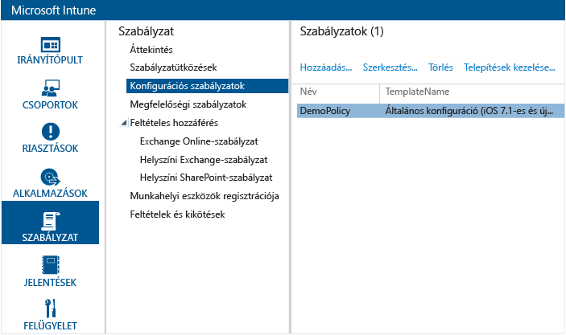

## Annak ellenőrzése, hogy a házirend ki van-e kényszerítve az iOS-eszközökön

1.  Egy iPad készüléken indítsa el az iOS App Store áruházat, telepítse az ingyenes **Microsoft Intune Munkahelyi portál** alkalmazást, majd nyissa meg azt.

    

2.  Adja meg a tesztfelhasználói fiók nevét és jelszavát, és koppintson a **Bejelentkezés** gombra.

    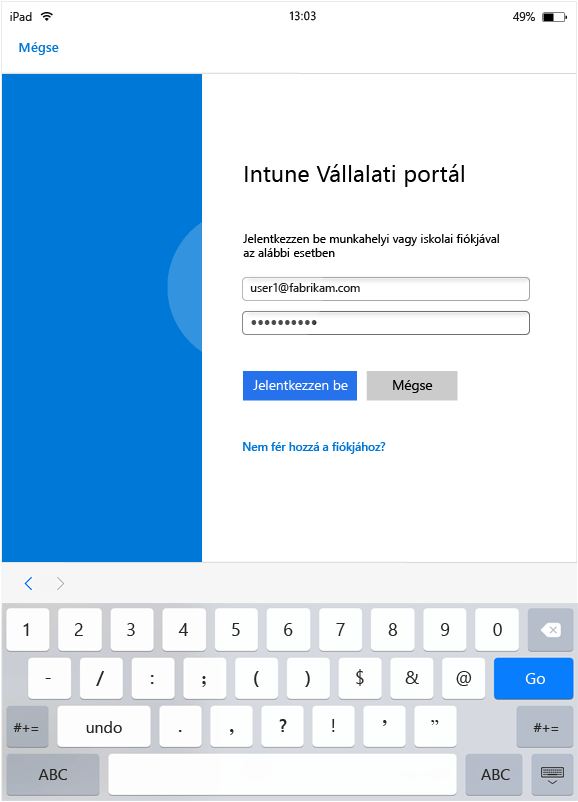

3.  Koppintson a **Regisztrálás** gombra az eszköz Intune-ban való regisztrálásának megkezdéséhez.

    

4.  A **Profil telepítése** képernyőn koppintson a **Telepítés** gombra.

    

5.  A **Profil telepítése** párbeszédpanelen koppintson a **Telepítés** gombra.

    

6.  A **Figyelmeztetés** képernyőn koppintson a **Telepítés** gombra.

    

7.  A **Távoli felügyelet** párbeszédpanelen koppintson a **Megbízhatóság** gombra.

    

8.  A felügyeleti profil telepítésének befejezésekor koppintson a **Kész** gombra. A regisztrálás kész.

    

9. A regisztrálás befejezésekor koppintson az **OK** gombra, és zárja be a Munkahelyi portál alkalmazást.

    

10. Amikor a rendszer PIN-kód konfigurálását kéri be, koppintson a **Folytatás** gombra.

    

11. Írja be a PIN-kódját, koppintson a **Folytatás** gombra, írja be ismét a PIN-kódját, és koppintson a **Mentés** gombra.

    

12. Nyomja meg a bekapcsológombot az iPad zárolásához, csúsztassa el a zárolás feloldásához, és láthatja, hogy most be kell írnia a PIN-kódot az eszköz feloldásához.

### További információ
[Útmutató az Intune próbaverziójához](get-started-with-a-30-day-trial-of-microsoft-intune.md)

<!--HONumber=Jun16_HO4-->

