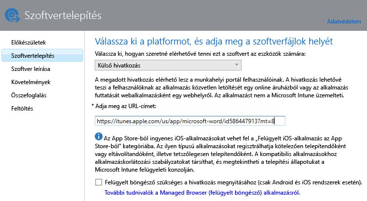

# Alkalmazások hozzáadása beléptetett eszközökhöz az Intune-ban

Mielőtt központilag telepíthetne vagy kezelhetne egy alkalmazást, hozzá kell adnia azt a Microsoft Intune-hoz. Ez a témakör bemutatja, hogyan vehet fel alkalmazásokat a beléptetett eszközökhöz.

> [!IMPORTANT]
> Az ebben a témakörben található információk megkönnyítik a regisztrált eszközökre és regisztrált Windows rendszerű számítógépekre telepíteni kívánt alkalmazások hozzáadását. Ha az Intune ügyfélszoftverével felügyelt Windows-számítógépekhez kíván alkalmazásokat adni, olvassa el az [Alkalmazások hozzáadása Windows-számítógépekhez a Microsoft Intune-ban](add-apps-for-windows-pcs-in-microsoft-intune.md) című témakört.

## Az alkalmazás hozzáadása
Az Intune Software Publisherrel konfigurálhatja az alkalmazás tulajdonságait, és töltheti fel az alkalmazást a felhőbeli tárhelyre (ha ez lehetséges). Kövesse az alábbi lépéseket:

1.  A [Microsoft Intune felügyeleti konzoljában](https://manage.microsoft.com) válassza az **Alkalmazások** &gt; **Alkalmazások felvétele** elemet az Intune Software Publisher elindításához.

    > [!TIP]
    > Előfordulhat, hogy a szoftverközzétevő elindulása előtt meg kell adnia Intune-felhasználónevét és jelszavát.

2.  A Publisher **Szoftvertelepítés** lapján, a **Válassza ki, hogyan legyen elérhető a szoftver az eszközök számára** beállításnál válasszon a következő lehetőségek közül:
    - **Szoftvertelepítő**, az **.msi** kiterjesztésű alkalmazásokhoz:
        - **Válassza ki a szoftver telepítőjének fájltípusát**. Itt adhatja meg a telepíteni kívánt szoftver típusát. Ha például iOS-alkalmazást szeretne telepíteni, válassza a **Csomag hozzáadása iOS-hez (&#42;.ipa-fájl)** lehetőséget.
        - **Adja meg a szoftver telepítőfájljainak helyét**. Adja meg a telepítőfájlok helyét, vagy kattintson a **Tallózás** gombra a kívánt hely listából való kiválasztásához.
        - **A mappában található további fájlokkal és almappákkal együtt**. Ez a lehetőség csa a **Windows Installer** fájltípus esetében érhető el. A Windows Installert használó szoftverek némelyike kiegészítő fájlokat igényel, amelyek általában a telepítőfájlokkal azonos mappában találhatók. Akkor válassza ezt a lehetőséget, ha ezeket a fájlokat is telepíteni kívánja. Ez a telepítési típus némi helykapacitást igényel a felhőbeli tárhelyen.

  -   **Külső hivatkozás**, olyan alkalmazások esetén, amelyeket alkalmazásáruházra mutató hivatkozás megadásával kíván létrehozni:

        - **Adja meg az URL-címet**. Adja meg az alábbi URL-címek valamelyikét:
            - Itt adhatja meg a telepíteni kívánt alkalmazás alkalmazásáruházbeli URL-címét. Ha például telepíteni szeretné a Microsoft Távoli asztal alkalmazást Android rendszerre, adja meg a **https://play.google.com/store/apps/details?id=com.microsoft.rdc.android** URL-címet. Az alkalmazás URL-címét úgy érheti el, ha egy keresőmotorban megkeresi az alkalmazást tartalmazó áruházi oldalt. A Távoli asztal alkalmazás megkereséséhez például keressen rá a **Microsoft Távoli asztal Android** kifejezésre.
            - Egy webhely. Az Intune telepíti az eszközre a webhely parancsikonját (avagy webklipjét).
            - Egy alkalmazásét az interneten. Az Intune telepíti az eszközre az alkalmazás parancsikonját.
        - **Felügyelt böngésző szükséges a hivatkozás megnyitásához (csak Android és iOS rendszerek esetén)**. Ha egy webhelyre vagy webalkalmazásra mutató hivatkozást telepít a felhasználók számára, az csak az Intune által felügyelt böngészőben lesz megnyitható. Ezt a böngészőt telepíteni kell az eszközökön. A felügyelt böngészővel kapcsolatos további részletekért olvassa el [Az internet-hozzáférés felügyelt böngészőszabályzatokkal való kezelése a Microsoft Intune-ban](manage-internet-access-using-managed-browser-policies.md) című témakört. Ez a telepítési típus nem igényel szabad területet a felhőbeli tárhelyen.

  -   **Felügyelt iOS-alkalmazás az alkalmazás-áruházból**, az iTunes áruházból származó ingyenes alkalmazások esetén, amelyeket mobilalkalmazás-kezelési (MAM) házirendekkel kíván felügyelni:

        - **Adja meg az URL-címet**. Adja meg a telepíteni kívánt alkalmazás alkalmazásáruházbeli URL-címét. Ha például telepíteni szeretné a Microsoft Munkamappák alkalmazást iOS rendszerre, adja meg a **https://itunes.apple.com/us/app/work-folders/id950878067?mt=8** URL-címet. Ez a telepítési típus nem igényel szabad területet a felhőbeli tárhelyen.

        Ha például Microsoft Word alkalmazást kívánja az iTunes áruházból eszközökre telepíteni, az oldal így jelenne meg:

        

3.  A **Szoftver leírása** lapon konfigurálja a következő beállításokat:

    > [!TIP]
    > A telepítő típusától függően előfordulhat, hogy az alábbi értékek némelyikét a rendszer automatikusan megadja.

    - **Kiadó**. Itt adhatja meg az alkalmazás kiadójának nevét.
    - **Név**. Itt adhatja meg az alkalmazás vállalati portálon megjelenő nevét. Ügyeljen arra, hogy a megadott alkalmazásnevek egyediek legyenek. Ha ugyanazt az alkalmazásnevet kétszer adja meg, csak az egyik alkalmazás fog megjelenni a felhasználók számára a vállalati portálon.
    - **Leírás**. Adja meg az alkalmazás leírását. amelyet meg szeretne jeleníteni a felhasználók számára a vállalati portálon.
    - **Szoftveradatok URL-címe**. Csak akkor érhető el, ha a **Szoftver telepítője** lehetőséget választotta. Nem kötelező: megadhatja az alkalmazással kapcsolatos információkat tartalmazó webhely URL-címét. Ez az URL-cím fog megjelenni a felhasználók számára a vállalati portálon.
    - **Adatvédelmi nyilatkozat URL-címe**. Csak akkor érhető el, ha a **Szoftver telepítője** lehetőséget választotta. Nem kötelező: megadhatja az alkalmazás adatvédelmi nyilatkozatát tartalmazó webhely URL-címét. Ez az URL-cím fog megjelenni a felhasználók számára a vállalati portálon.
    - **Kategória** (nem kötelező). Itt választhatja ki a beépített alkalmazáskategóriák egyikét. Ezzel megkönnyítheti a felhasználók számára az alkalmazás megkeresését a vállalati portálon való böngészés során.
    - **Megjelenítés kiemelt alkalmazásként és kiemelés a vállalati portálon**. Az alkalmazás jól észrevehető módon való megjelenítése a vállalati portál fő lapján, amikor a felhasználók tallózással alkalmazásokat keresnek.
    - **Ikon** (nem kötelező). Itt töltheti fel az alkalmazáshoz hozzárendelni kívánt ikont. Ez az alkalmazásikon jelenik meg a vállalati portálon böngésző felhasználók számára.

        Ebben a példában az iOS rendszerhez készült Microsoft Word alkalmazás leírását adta meg:

        

4.  A **Követelmények** lapon adja meg az alkalmazás telepítéséhez szükséges követelményeket, amelyeket teljesíteni kell az alkalmazás egy eszközre való telepítése előtt. Például egy iOS-alkalmazáscsomag esetében megadhatja a szükséges legalacsonyabb iOS-verziót. Emellett megszabhatja az eszköz típusát, például iPhone vagy iPad.

    > [!TIP]
    > A **Követelmények** lap nem minden alkalmazástípus esetében jelenik meg.

5.  További varázslólapok jelennek meg, ha a **Windows Installer** fájltípust választja. Ez a fájltípus akkor használatos, ha az Intune-ban regisztrált, Windows 10 vagy újabb rendszert futtató számítógépekre telepít szoftvert.

6.  Az **Összefoglalás** lapon ellenőrizze a megadott adatokat. Ha elkészült, válassza a **Feltöltés** elemet.

7.  A befejezéshez válassza a **Bezárás** elemet.

Az alkalmazás megjelenik az **Alkalmazások** munkaterület **Alkalmazások** csomópontjában.

## Példa: .msi-alkalmazások telepítése Windows 10-eszközökre
Ebből a négy perces videóból megtanulhatja, hogyan telepíthet Windows Installer (.msi) típusú alkalmazásokat a Windows 10 rendszerű regisztrált eszközökre.  

<iframe src="https://channel9.msdn.com/Series/How-to-Control-the-Uncontrolled/6--How-to-Deploy-MSI-Applications-to-Windows-10-Using-Intune-and-Mobile-Device-Management-MDM/player" width="640" height="360" allowFullScreen frameBorder="0"></iframe>

## További lépések

Ha létrehozta az alkalmazást, a következő lépés a telepítés. További információért lásd: [Alkalmazások telepítése a Microsoft Intune-ban](deploy-apps.md).

<!--HONumber=Nov16_HO4-->

