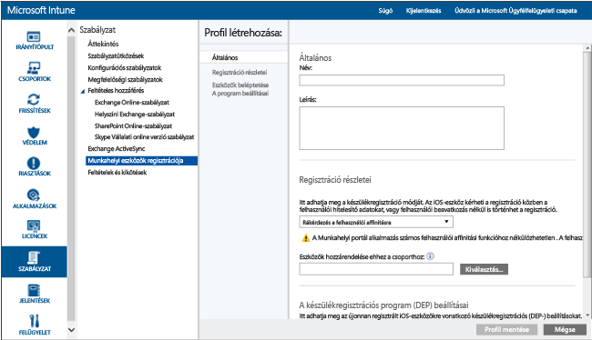

# iOS-eszközök közvetlen regisztrálása az Apple Configurator használatával

[!INCLUDE[classic-portal](../includes/classic-portal.md)]

Az Intune támogatja a vállalat által birtokolt iOS-eszközök Mac számítógépen futó [Apple Configurator](http://go.microsoft.com/fwlink/?LinkId=518017) eszköz segítségével történő regisztrálását. Ez a folyamat nem állítja vissza az eszköz gyári beállításait, és előre definiált szabályzattal regisztrálja azt. Ez a módszer azokon az eszközökön használható, amelyeken **Nincs megadva felhasználói affinitás**. A módszer használatához az iOS-eszközt USB-kapcsolaton egy Mac géphez kell csatlakoztatni a vállalati regisztráció beállítása érdekében.

Amikor közvetlenül regisztrál iOS-eszközöket, regisztrálhat egy eszközt anélkül, hogy lekérné az eszköz sorozatszámát. Az eszközt el is nevezheti azonosítási célból, mielőtt az Intune rögzítené az eszköz nevét a regisztráció alatt. A Céges portál alkalmazás nem támogatott a közvetlen módon regisztrált eszközökön. Ez az útmutató feltételezi, hogy az Apple Configurator 2.0 verzióját használja egy Mac-gépen.

>[!NOTE]
>Ezt a regisztrációs módszert nem lehet használni az [eszközregisztráció-kezelői](enroll-corporate-owned-devices-with-the-device-enrollment-manager-in-microsoft-intune.md) módszerrel.

1.  Ha még nem tette meg, az Apple Configurator eszközzel regisztrált iOS-eszközökhöz hozzon létre egy eszközregisztrációs profilt. Egy eszközregisztrációs profil meghatározza az eszközökre alkalmazott beállításokat.

    1.  A [Microsoft Intune felügyeleti konzolon](https://manage.microsoft.com) ugorjon a **Házirend** &gt; **Munkahelyi eszközök regisztrációja** elemre, majd válassza a **Hozzáadás** lehetőséget.

        

    2.  Adja meg az eszközprofilok részleteit:

        -   **Név** - Az eszközregisztrációs profil neve. A felhasználók számára nem látható.

        -   **Leírás** – Az eszközregisztrációs profil leírása. A felhasználók számára nem látható.

        -   **Felhasználói kapcsolat** – Meghatározza az eszközök regisztrációjának módját. A közvetlen regisztrációhoz válassza a **Nincs felhasználói affinitás**lehetőséget.

        -   **Előzetes eszközcsoport-hozzárendelés** – Minden, ezzel a profillal rendelkező eszköz kezdetben ehhez a csoporthoz fog tartozni. A regisztrálás után új csoportba sorolhatja az eszközöket.

            [!INCLUDE[groups deprecated](../includes/group-deprecation.md)]

    3.  Profil hozzáadásához válassza a **Profil mentése** lehetőséget.

5.  Az iOS-eszközökre telepíteni kívánt profil exportálása .mobileconfig fájlként:

    1.   Válassza ki a létrehozott eszközprofilt.

    2.   A tálcán válassza az **Exportálás** lehetőséget.

    3.   Válassza a **Profil letöltése** elemet, és mentse a letöltött .mobileconfig fájlt.

6.  A letöltött .mobileconfig fájl másolásával vigye át a fájlt egy Mac számítógépre.
    > [!NOTE]
    > A regisztrációs profil URL-címe az exportálástól számított két hétig érvényes. Két hét után új regisztrációs profil URL-címet kell exportálnia az iOS-eszközök Beállítási asszisztenssel végzett regisztrálásához.

7.  Az eszköz előkészítése az Apple Configuratorral. Az iOS-eszközök csatlakoznak a Mac számítógéphez, és regisztrálva vannak a mobileszköz-kezelésre.

    1.  A Mac-számítógépen nyissa meg az **Apple Configurator 2.0** eszközt.

    2.  Csatlakoztassa az iOS-eszközt a Mac számítógéphez egy USB-kábellel. Zárja be a **Fotók**, az **iTunes** és más alkalmazásokat, amelyek nyitva voltak az eszköz észlelésekor.

    3.  Az Apple Configuratorban válassza ki a csatlakoztatott iOS-eszközt, majd kattintson az **Add** (Hozzáadás) gombra. Az eszközhöz adható lehetőségek a legördülő listában jelennek meg. Válassza a **Profilok** lehetőséget.

    4.  A fájlkiválasztóval válassza ki az Intune-ból exportált .mobileconfig fájlt, majd válassza az **Add** (Hozzáadás) gombot. Ezzel a profil hozzá lesz adva az eszközhöz.  Ha az eszköz **Felügyeletlen**, a telepítéshez az eszköz elfogadására van szükség.

8.  Most már készen áll a profil telepítésére az iOS-eszközön. Az eszköz elvileg elvégezte a Beállítási asszisztens lépéseit, és készen áll a használatra. Ha a regisztrációba alkalmazástelepítések tartoznak, az eszközhöz be kell állítani egy Apple ID-t, mert az alkalmazástelepítésekhez Apple ID-vel kell bejelentkezni az Apple Store áruházba.

    1.  Oldja fel az iOS-eszköz zárolását.

    2.  A **Felügyeleti profil** **Profil telepítése** párbeszédpanelén kattintson a **Telepítés** gombra.

    3.  Adja meg az **Eszköz PIN-kódját** vagy az **Apple ID-t**, ha szükséges.

    4.  Fogadja el a **Figyelmeztetést**, és válassza a **Telepítés** gombot.

    5.  Fogadja el a **Távoli figyelmeztetést**, és válassza a **Megbízható** gombot.

    6.  Amikor a **Profil telepítve** mező megerősíti, hogy a profil **Telepítve** van, válassza a **Kész** gombot.

9.  Az iOS-eszközön nyissa meg a **Beállítások** alkalmazást, majd válassza az **Általános** &gt; **Eszközkezelés** &gt; **Felügyeleti profil** lehetőséget. Ellenőrizze, hogy a profiltelepítés szerepel-e a listán, valamint ellenőrizze az iOS-házirend korlátozásait és a telepített alkalmazásokat. A házirend-korlátozások és alkalmazások megjelenítése az eszközön akár 10 percet is igénybe vehet.

10.  Eszközök terjesztése. Az iOS-eszköz most már felügyelt, és regisztrálva van az Intune-nal.

