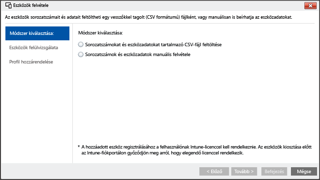

# <a name="enroll-ios-devices-with-apple-configurator-by-using-setup-assistant"></a>iOS-eszközök regisztrálása az Apple Configurator és a Beállítási asszisztens segítségével

[!INCLUDE[classic-portal](../includes/classic-portal.md)]

Az Intune támogatja a vállalat által birtokolt iOS-eszközöknek a Mac számítógépen futó [Apple Configurator](http://go.microsoft.com/fwlink/?LinkId=518017) segítségével történő regisztrálását. Ez a folyamat visszaállítja az eszköz gyári beállításait, és felkészíti az eszközt a Beállítási asszisztens futtatására, amely telepíti a vállalat szabályzatait az eszköz új felhasználója számára.

>[!NOTE]
>Ezt a regisztrációs módszert nem lehet használni az [eszközregisztráció-kezelői](enroll-corporate-owned-devices-with-the-device-enrollment-manager-in-microsoft-intune.md) módszerrel.

Az Apple Configuratorrel visszaállíthatja az iOS-eszközök gyári beállításait, és előkészítheti őket az új felhasználójuk általi használatra. Ehhez a módszerhez az iOS-eszközt egy Mac számítógéphez kell csatlakoztatni USB-kapcsolattal a vállalati regisztráció beállítása érdekében. A módszer emellett feltételezi, hogy Ön az Apple Configurator 2.0 verziót használja. Az iOS-eszközre alkalmazott szabályzatnak általában **felhasználói affinitást** kell tartalmaznia az Intune Céges portál alkalmazás használatának engedélyezése érdekében.

## <a name="prerequisites-for-enrolling-ios-devices-by-using-apple-configurator-with-setup-assistant"></a>iOS-es eszközök Apple Configuratorrel és a Beállítási asszisztenssel való regisztrálásának előfeltételei

- [APNs-tanúsítvány telepítése](set-up-ios-and-mac-management-with-microsoft-intune.md)

- Győződjön meg róla, hogy fizikailag hozzáfér az iOS-es eszközökhöz – ezeket úgy kell visszaállítani a gyári beállításokra, hogy ne legyen rájuk érvényes a jelszavas védelem.

- Eszközök sorozatszámának beszerzése – erről [Az iOS-eszközök sorozatszámának megkeresését](https://support.apple.com/en-us/HT204308) ismertető cikk nyújt tájékoztatást.

- USB csatlakozókábelek előkészítése

- Az [Apple Configurator 2.0](https://itunes.apple.com/us/app/apple-configurator-2/id1037126344?mt=12)-s verzióját futtató Mac számítógép


## <a name="steps-to-enroll-ios-devices-by-using-apple-configurator-with-setup-assistant"></a>iOS-es eszközök Apple Configuratorrel és a Beállítási asszisztenssel való regisztrálásának menete

Az alábbi lépések azt ismertetik, hogyan lehet azonnal regisztrálni az iOS-es eszközöket az Apple Configurator és a Beállítási asszisztens segítségével. Ahogyan az eszközök bekerülnek a céghez, majd kikerülnek onnan, bizonyos alább leírt lépéseket – például a sorozatszámok felvételét és eltávolítását – valószínűleg többször el kell majd végezni.

### <a name="create-mobile-device-groups-optional"></a>Mobileszköz-csoport létrehozása (nem kötelező)

Ha vállalatának mobileszköz-csoportokra van szüksége az eszközök kezeléséhez, létrehozhat ilyeneket. Erről részletesebben a [Csoportok használata felhasználók és eszközök kezelésére a Microsoft Intune-nal](use-groups-to-manage-users-and-devices-with-microsoft-intune.md) című cikk nyújt tájékoztatást.

### <a name="create-a-profile-for-devices"></a>Profil létrehozása az eszközökhöz

Egy eszközregisztrációs profil meghatározza az egy eszközcsoportra alkalmazott beállításokat.

1. A [Microsoft Intune felügyeleti konzoljában](http://manage.microsoft.com) lépjen a **Házirend** &gt; **Munkahelyi eszközök regisztrációja** lapra, majd válassza a **Hozzáadás** lehetőséget.

  

2. Adja meg az eszközprofilok részleteit:

   -   **Név** – Az eszközbeléptetési profil neve (nem látják a felhasználók).

   -   **Leírás** – Az eszközbeléptetési profil leírása (nem látják a felhasználók).

   -   **Regisztráció részletei** – Meghatározza az eszközök regisztrációjának módját.

       -   **Rákérdezés a felhasználói affinitásra** – Az eszközt össze kell kapcsolni egy felhasználóval a kezdeti beállítás során, majd engedélyezhető számára a vállalati adatok és e-mailek elérése. A **felhasználói affinitást** a DEP programmal felügyelt olyan eszközöknél kell beállítani, amelyek felhasználók tulajdonában vannak, de a Munkahelyi portált kell rajtuk használni például az eszközök telepítéséhez.

       -   **Nincs megadva a felhasználói affinitás** – Az eszköz egyetlen felhasználóhoz sincs társítva. Ezt a kapcsolatot olyan eszközök esetén alkalmazza, amelyek a helyi felhasználói adatok nélkül hajtanak végre feladatokat. A felhasználói kapcsolatot igénylő alkalmazások, az üzletági alkalmazások telepítéséhez használt Munkahelyi portál alkalmazást is beleértve, nem fognak működni.

   -   **Előzetes eszközcsoport-hozzárendelés** – Minden, ezzel a profillal telepített eszköz kezdetben ehhez a csoporthoz fog tartozni. A regisztrálás után új csoportba sorolhatja az eszközöket.

   > [!Important]
   > A csoport-hozzárendelések az Intune-ból az Azure Active Directory-ba kerülnek át. Az Intune-fiók vonatkozó frissítése után az **Eszközök hozzárendelése ehhez a csoporthoz** nem jelenik meg többé. [További információ](/intune/deploy-use/ios-device-enrollment-program-in-microsoft-intune#changes-to-intune-group-assignments).

   -  **Device Enrollment Program** – Az Apple Device Enrollment Program (DEP) nem használható a Beállítási asszisztenssel végzett regisztrációhoz. Ellenőrizze, hogy a váltógomb **ki** értékre van-e állítva.

3.  Profil hozzáadásához válassza a **Profil mentése** lehetőséget.

### <a name="add-ios-devices-to-enroll-with-setup-assistant"></a>iOS-eszközök regisztrálása a Beállítási asszisztenssel

1. A [Microsoft Intune felügyeleti konzolján](http://manage.microsoft.com) lépjen a **Csoportok** &gt; **Minden eszköz** &gt; **Minden céges eszköz** &gt; **Minden eszköz** területre, majd kattintson az **Eszközök felvétele** gombra. 

   Két módon adhat hozzá eszközöket:

   

   -  **Sorozatszámokat tartalmazó CSV-fájl feltöltése** – Hozzon létre egy vesszővel tagolt, kétoszlopos, fejléc nélküli értéklistát (.csv), amelyben legfeljebb 5000 eszköz szerepel. A csv-fájl mérete nem haladja meg az 5 MB-ot.

    |||
    |-|-|
    |&lt;1. sorozatszám&gt;|&lt;1. eszköz részletei&gt;|
    |&lt;2. sorozatszám&gt;|&lt;2. eszköz részletei&gt;|

  Ez a .csv- fájl így jelenik meg egy szövegszerkesztőben:

    ```
    0000000,PO 1234
    111111111,PO 1234
    ```

  -  **Eszközadatok kézi hozzáadása** – Adja meg legfeljebb 15 eszköz sorozatszámát, adatait és az esetleges megjegyzéseket.

  Az **Eszközök felülvizsgálata** panelen ellenőrizheti a sorozatszámokat. Azt is eldöntheti, hogy felülírja-e az újból importált sorozatszámok **részleteit**, vagy a **Felülírás** jelölőnégyzet jelölését törölve megtartja az aktuális részleteket. 

> [!NOTE] 
> Az Intune korábbi felügyeleti konzolján a rendszergazdák egy feltöltött CSV-fájlból fogadhatják el a társított részleteket, így írhatják felül az egyes sorozatszámok korábbi részleteit. Az új Azure Portalon csak az összes sorozatszám adatainak felülírására vagy az új részletek figyelmen kívül hagyására lesz lehetőség.

  > [!NOTE]
  > Ha később el szeretne távolítani vállalati tulajdonú eszközöket az Intune kezeléséből, akkor előfordulhat, hogy az eszköz regisztrációjának letiltásához az **Előre regisztrált vállalati eszközök** elemcsoportban található **iOS-sorozatszám szerint** eszközcsoportban el kell távolítania az eszköz gyári számát az Intune-ból. Ha az Intune vészhelyreállítási eljárást hajt végre a sorozatszámok eltávolítása közben vagy ahhoz közeli időpontban, győződjön meg arról, hogy a csoportban csak az aktív eszközök sorozatszámai szerepelnek.

2. Kattintson a **Tovább** gombra.

3. Jelölje ki a regisztrálni kívánt eszközöket. A már regisztrált vagy más módszerrel már regisztrált sorozatszámok nem importálhatók. A folytatáshoz válassza a **Tovább** gombot.

### <a name="assign-a-profile"></a>Profil hozzárendelése

Adja meg a hozzáadott eszközökhöz hozzárendelendő profilt az elérhető profilok listájából, tekintse át a **Regisztrációs profil részleteit** elemet, és válassza a **Befejezés** gombot. A manuálisan hozzáadott eszközök bármilyen regisztrációs profilhoz hozzárendelhetők.

> [!Important]
> Jelenleg az Intune-ban megadhat egy „alapértelmezett” eszközregisztrációs profilt, és amikor új sorozatszámokat szinkronizál az Apple DEP szolgáltatással, akkor azok automatikusan ehhez a profilhoz lesznek hozzárendelve. Onnantól kezdve, hogy a közeljövőben a bérlője az új Azure Portalra lesz migrálva, nem fog tudni alapértelmezett profilt megadni és ahhoz sorozatszámokat automatikusan hozzárendelni. Ehelyett a sorozatszámokat egy profilhoz kell hozzárendelnie. [További információ](https://docs.microsoft.com/intune-azure/enroll-devices/enroll-ios-devices-using-device-enrollment-program)

### <a name="export-a-profile-to-deploy-to-ios-devices"></a>Az iOS-eszközökre telepíteni kívánt profil exportálása

1. A [Microsoft Intune felügyeleti konzolban](http://manage.microsoft.com) válassza a **Házirend** &gt; **Munkahelyi eszközök regisztrációja** lehetőséget, majd válassza ki a mobileszközökre telepítendő eszközprofilt. 

2. A tálcán válassza az **Exportálás** lehetőséget. Másolja ki és mentse el a **Profil URL-címét**. A címet később fel kell töltenie az Apple Configurator eszközbe az iOS-eszközök által használt Intune profil meghatározásához.

  Az Apple Configurator 2 támogatásához módosítania kell a 2.0-s profil URL-címét. Ehhez a írja be a következő kód helyére:
    ```
    https://manage.microsoft.com/EnrollmentServer/Discovery.svc/iOS/ESProxy?id=
    ```
    ezt a kódot:

    ```
    https://appleconfigurator2.manage.microsoft.com/MDMServiceConfig?id=
    ```

   Az itt következő eljárás keretében az Apple Configurator segítségével feltölti a profil URL-címét az Apple DEP szolgáltatásába, ezzel meghatározza az iOS-eszközök által használandó Intune-profilt.


### <a name="prepare-the-device-with-apple-configurator"></a>Az eszköz előkészítése az Apple Configuratorral

Az iOS-eszközök csatlakoznak a Mac számítógéphez, és regisztrálva vannak a mobileszköz-kezelésre.

1.  A Mac-számítógépen nyissa meg az **Apple Configurator 2** eszközt. A menüsávban válassza az **Apple Configurator 2**, majd a **Beállítások** elemet.

   > [!WARNING]
   > Az eszközökön vissza kell állítani a gyári beállításokat a regisztrációs folyamat során. Az ajánlott eljárás szerint állítsa alaphelyzetbe az eszközt, és kapcsolja be. Az eszközön az **üdvözlőképernyőnek** kell látszania az eszköz csatlakoztatásakor.

2. Válassza a beállítások paneljén a **Servers** (Kiszolgálók) elemét, majd az MDM Server wizard (MDM-kiszolgáló varázsló) elindításához válassza a „+” szimbólumot. Kattintson a **Tovább** gombra.

3. Írja be az iOS-eszközök regisztrálása a Beállítási asszisztens segítségével a Microsoft Intune-ban című cikk 6. lépésében megadott MDM-kiszolgáló nevét a **Name** (Név) és az **Enrollment URL** (Regisztrációs URL-cím) mezőbe. Az Enrollment URL (Regisztrációs URL-cím) mezőnél az Intune-ból exportált regisztrációs profil URL-címét adja meg. Kattintson a **Tovább** gombra.  

   Ha a rendszer figyelmezteti, hogy nincs ellenőrizve a kiszolgáló URL-címe, nyugodtan figyelmen kívül hagyhatja. Kattintson minden megjelenő oldalon a **Next** (Tovább) gombra, amíg be nem fejeződik a varázsló.

4.  Az iOS-mobileszközöket csatlakoztassa a Mac számítógéphez egy USB-adapterrel.

    > [!WARNING]
    > Az eszközökön vissza kell állítani a gyári beállításokat a regisztrációs folyamat során. Az ajánlott eljárás szerint állítsa alaphelyzetbe az eszközt, és kapcsolja be. A Beállítási asszisztens indításakor az eszközön az **üdvözlőképernyőnek** kell látszania.

5.  Válassza a **Prepare** (Előkészítés) lehetőséget. A Prepare iOS Device (iOS-eszköz előkészítése) panelen válassza a **Manual** (Manuális) elemet, majd a **Next** (Tovább) gombot.

6. Az Enroll in MDM Server (Regisztrálás MDM-kiszolgálón) panelen válassza ki a létrehozott kiszolgáló nevét, majd válassza a **Next** (Tovább) gombot.

7. A Supervise Devices (Eszközök felügyelete) panelen válassza ki a felügyelet szintjét, majd válassza a **Next** (Tovább) gombot.

8. A Create an Organization (Szervezet létrehozása) panelen válassza ki a szervezetet az **Organization** mezőben, vagy hozzon létre új szervezetet, majd válassza a **Next** (Tovább) gombot.

9. A Configure iOS Setup Assistant (iOS-alapú Beállítási asszisztens konfigurálása) panelen válassza ki a felhasználó számára megjelenő lépéseket, majd válassza a **Prepare** (Előkészítés) gombot. Ha a rendszer kéri, végezzen hitelesítést a megbízhatósági beállítások frissítése érdekében.  

10. Az iOS-eszköz előkészítésének befejezésekor válassza le az USB-kábelt.  

### <a name="distribute-devices"></a>Eszközök terjesztése

Az eszközök most már készen állnak a vállalati regisztrációra. 

Kapcsolja ki az eszközöket, és ossza ki őket a felhasználóknak. Amikor a felhasználók bekapcsolják az eszközüket, elindul a Beállítási asszisztens.


### <a name="see-also"></a>További információ
[Az eszközök regisztrálásának előfeltételei](prerequisites-for-enrollment.md)


<!--HONumber=Feb17_HO2-->


