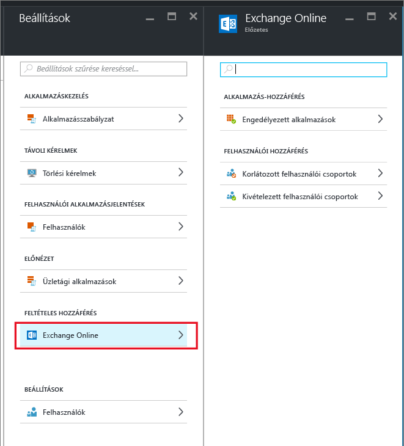
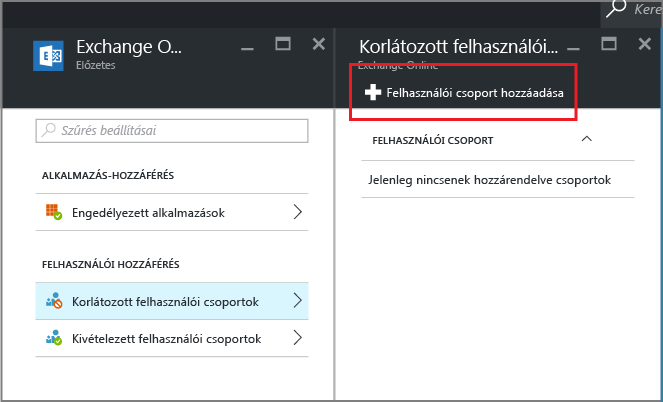

# Exchange Online feltételes hozzáférés konfigurálása kizárólag az MAM által támogatott alkalmazások engedélyezéséhez
Ez a témakör lépésről lépésre végigvezeti azon, hogy miként tud feltételes hozzáférést beállítani az Exchange Online-hoz úgy, hogy csak az Intune mobilalkalmazás-kezelési (MAM) szabályzatokat támogató mobilalkalmazások legyenek engedélyezettek.

## Exchange Online-szabályzat létrehozása
1.  Jelentkezzen be az alkalmazás-hozzáférési funkciót tartalmazó [Azure-portálon](https://portal.azure.com). Ha még csak most ismerkedik az Azure-portállal, olvassa el a [MAM-szabályzatok az Azure-portálon](azure-portal-for-microsoft-intune-mam-policies.md) témakört.

2.  Válassza a **Tallózás > Intune > Intune mobilalkalmazás-felügyeleti panel > Beállítások** lehetőséget, és a **feltételes hozzáférés** területen válassza az **Exchange Online-t**.

  

3.  Az **Engedélyezett alkalmazások** panelen válassza az **Intune alkalmazás-szabályzatokat támogató alkalmazások engedélyezése** lehetőséget, hogy csak az Intune MAM-szabályzatai által támogatott alkalmazások férhessenek hozzá az Exchange Online-hoz. Amikor kiválasztja ezt a beállítást, megjelenik a támogatott alkalmazások listája.

  >[!NOTE]
  >Ebben az esetben egyik Exchange Active Sync e-mail ügyfélprogram sem, így az iOS és az Android Exchange Online-hoz csatlakozó beépített e-mail ügyfélprogramjai sem küldhetnek vagy fogadhatnak leveleket. A felhasználók ehelyett egyetlen e-mail üzenetet kapnak, amely tájékoztatja őket, hogy az Outlook e-mail alkalmazást kell használniuk. 
4.   A szabályzatnak a felhasználókra való alkalmazásához nyissa meg a **Korlátozott felhasználói csoportok** panelt, és válassza a **Felhasználói csoport hozzáadása** lehetőséget. Válasszon ki egy vagy több felhasználói csoportot, amelyre alkalmazni kívánja ezt a szabályzatot.

  

5.  Előfordulhat, hogy az előző lépésben kiválasztott felhasználói csoportnak vannak olyan tagjai, akikre nem kívánja alkalmazni ezt a szabályzatot. Ilyen esetben e felhasználók csoportját adja hozzá a kivétel alá eső felhasználók listájához. Az **Exchange Online** panelen válassza a **Kivétel alá eső felhasználói csoportok** lehetőséget. A felhasználói csoportok listájának megnyitásához válassza a **Felhasználói csoport hozzáadása** lehetőséget. Válassza ki azokat a csoportokat, amelyeket szeretné kivonni a szabályzat hatálya alól.  

## Meglévő szabályzat módosítása
### Felhasználói csoportok hozzáadása vagy törlése

**Felhasználói csoport törléséhez** a **korlátozás alá eső felhasználói csoportok** listáról nyissa meg a **Korlátozás alá eső felhasználó csoportok** panelt, jelölje ki a törölni kívánt felhasználói csoportot és kattintson a **három pontra (...)** a **Törlés** opció megjelenítéséhez. A felhasználói csoportnak a listáról való eltávolításához válassza a **Törlés** opciót. Ugyanezzel az eljárással törölhet felhasználói csoportot a **kivétel alá eső felhasználói csoportok** listáról.

## További lépések
[Modern hitelesítés nélküli alkalmazások blokkolása](block-apps-with-no-modern-authentication.md)
### További információ
[Alkalmazásadatok védelme MAM-szabályzatok használatával](protect-app-data-using-mobile-app-management-policies-with-microsoft-intune.md)

<!--HONumber=Dec16_HO2-->

