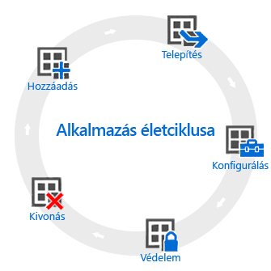

# Az alkalmazás-életciklus áttekintése

Az Intune-ban az alkalmazások életciklusa az alkalmazás felvételével kezdődik. Ezt követően az alkalmazás különböző fázisokon halad át egészen addig, amíg el nem távolítják.

## Hozzáadás

Az alkalmazások központi telepítésének első lépéseként fel kell vennie az Intune-ba a felügyelni és telepíteni kívánt alkalmazásokat. Jóllehet számos különböző típusú alkalmazással dolgozhat, az alapvető eljárás mindegyiknél ugyanaz. Az Intune-ban [regisztrált eszközökhöz](add-apps-for-mobile-devices-in-microsoft-intune.md), valamint [az Intune ügyfélszoftverével felügyelt Windows-számítógépekhez](add-apps-for-windows-pcs-in-microsoft-intune.md) egyaránt vehet fel alkalmazásokat.

## Telepítés

Az Intune-ba való felvételét követően [telepítheti az alkalmazást a felügyelni kívánt eszközökre](deploy-apps.md). Az Intune jelentős mértékben leegyszerűsíti ezt a folyamatot, ráadásul az alkalmazás telepítését követően az Intune felügyeleti konzoljából [ellenőrizheti a telepítés sikerességét](monitor-apps-in-microsoft-intune.md). Emellett egyes alkalmazás-áruházakban, például az [Apple](manage-ios-apps-you-purchased-through-a-volume-purchase-program-with-microsoft-intune.md) és a [Windows](manage-apps-you-purchased-from-the-windows-store-for-business-with-microsoft-intune.md) alkalmazás-áruházaiban nagyban is vásárolhat alkalmazáslicenceket vállalata számára. Az Intune képes szinkronizálni az adatokat ezekkel az áruházakkal, így Ön közvetlenül az Intune felügyeleti konzoljából hajthatja végre a központi telepítést és követheti nyomon a licenchasználatot.

## Konfigurálás

Az alkalmazások életciklusa során általában az alkalmazás több új verziója is megjelenik. Az Intune számos eszközt kínál a központilag telepített alkalmazások [verziófrissítésére](update-apps-using-microsoft-intune.md). Ezen túlmenően bizonyos alkalmazásokhoz további funkciók is konfigurálhatók, például:
- Az [iOS-alkalmazáskonfigurációs szabályzatok](configure-ios-apps-with-mobile-app-configuration-policies-in-microsoft-intune.md) segítségével meghatározhatja, hogy a kompatibilis iOS-alkalmazások futása esetén mely beállítások lépjenek érvénybe. Az alkalmazásokhoz megadhat például márkajelzési beállításokat, illetve meghatározhatja a kiszolgáló nevét, amelyhez szeretné, hogy az alkalmazás csatlakozzon.
- A [felügyeltböngésző-szabályzatok](manage-internet-access-using-managed-browser-policies.md) segítségével konfigurálhatja az Intune által felügyelt, az eszközök alapértelmezett böngészőjét felváltó böngésző beállításait, illetve korlátozhatja, hogy a felhasználók milyen weboldalakat nyithatnak meg.

## Védelem

Az Intune számos módszert kínál az alkalmazásokban tárolt adatok védelmére. A legfontosabb megoldások a következők:
- A [feltételes hozzáférés](restrict-access-to-email-and-o365-services-with-microsoft-intune.md) az Ön által megadott feltételek alapján szabályozza az email és egyéb szolgáltatások elérését. Ilyen feltétel lehet az eszköz típusa, vagy az, hogy megfelel-e a központilag telepített [eszközmegfelelőségi szabályzatnak](introduction-to-device-compliance-policies-in-microsoft-intune.md).
- A [mobilalkalmazás-kezelés (MAM)](protect-app-data-using-mobile-app-management-policies-with-microsoft-intune.md) funkció az egyes alkalmazásokkal együttműködve nyújt védelmet az általuk használt vállalati adatok számára. Letilthatja például az adatok másolását a nem felügyelt és a felügyelt alkalmazások között, illetve megakadályozhatja az alkalmazások futtatását függetlenített vagy feltört eszközökön.

## Kivonás

Az idő múlásával a telepített alkalmazások elavulttá válnak, így el kell őket távolítani. Az Intune segítségével egyszerűen [kivonhatja a kívánt alkalmazásokat a szolgáltatásból](retire-apps-using-microsoft-intune.md).

<!--HONumber=Oct16_HO4-->

