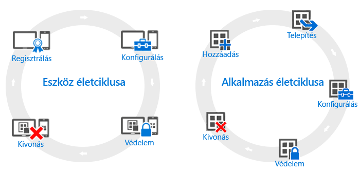

# Az eszközök és alkalmazások életciklusának áttekintése

Habár az egyes szervezetek igényei eltérőek lehetnek, vannak olyan közös lépések, melyeket minden szervezetnek folyamatosan végre kell hajtania, egyéb működési igényeiktől függetlenül. Ezek két fő kategóriába sorolhatók, melyeket **életciklusoknak** nevezünk. A követendő telepítési életciklus attól függ, hogy milyen helyzet kezelési feltételeit próbálja megteremteni. Előfordulhat például, hogy csak az eszközéletciklusra vagy csak az alkalmazás-életciklusra van szüksége, illetve az is, hogy mindkettőre.

Felügyeleti szempontból minden eszköz rendelkezik életciklussal. Ez az eszköz regisztrálásakor kezdődik, és annak kivonásáig tart. Az [eszközfelügyeleti életciklus](overview-of-device-lifecycle-in-microsoft-intune.md) végigvezeti Önt az eszköz regisztrálásán, annak konfigurálásán és védelmén, majd felügyeletének megszüntetésén.

Hasonlóképpen, a használt alkalmazásoknak is megvan a saját [alkalmazás-életciklusuk](overview-of-app-lifecycle-in-microsoft-intune.md). Ennek lépcsőfokai az alkalmazásnak az Intune-ba való felvételétől az eltávolításáig, vagyis szükségtelenné válásáig tartanak.

<!--HONumber=Nov16_HO5-->

