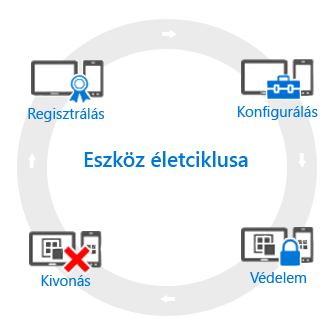

# A mobileszköz-kezelés (MDM) életciklusának áttekintése

[!INCLUDE[classic-portal](../includes/classic-portal.md)]

Valamennyi Ön által kezelt eszköz rendelkezik úgynevezett *életciklussal*. Az Intune segít ennek az életciklusnak a kezelésében a regisztrációtól a beállításon és védelmen át egészen az eszköz kivonásáig, amikor már nincs rá szükség:

## Regisztrálás
A mai mobileszköz-kezelési (MDM) stratégiák számos különböző telefont, táblagépet és számítógépet kezelnek (iOS, Android, Windows és Mac OS X). Ha szükség van az eszköz felügyeletére – és a vállalati tulajdonú eszközök esetében általában ez a helyzet –, akkor az első lépés [beállítani az eszköz regisztrációját](enroll-devices-in-microsoft-intune.md). Windows rendszerű számítógépeket is kezelhet, ha regisztrálja azokat az Intune-ban (MDM), vagy [telepíti az Intune ügyfélszoftverét](manage-windows-pcs-with-microsoft-intune.md).

## Konfigurálás
Az eszközök regisztrálása csak az első lépés. Az Intune teljes funkcionalitásának kihasználásához, valamint az eszközök biztonságosságának és a vállalati előírásoknak való megfelelőségének biztosításához számos szabályzat közül választhat. Ezek segítségével a felügyelt eszközök működésének szinte minden vetületét meghatározhatja. Szeretné például, hogy a felhasználóknak jelszót kelljen megadniuk a vállalati adatokat tartalmazó eszközök használatához? A jelszó használata kötelezővé tehető. Rendelkezik vállalati Wi-Fi eléréssel? Ha igen, automatikusan konfigurálhatja. Az elérhető konfigurációs lehetőségek a következők:

- [**Konfigurációs szabályzatok**](manage-settings-and-features-on-your-devices-with-microsoft-intune-policies.md). Ezekkel a szabályzatokkal beállíthatja a felügyelt eszközök szolgáltatásainak és funkcióinak működését. Előírhatja például jelszó használatát a Windows Phone-telefonokon, vagy letilthatja a kamera használatát az iPhone-okon.
- [**A vállalati erőforrásokra vonatkozó szabályzatok**](enable-access-to-company-resources-with-microsoft-intune.md). Ha engedélyezi a felhasználóknak a munkájukhoz kapcsolódó anyagok elérését a saját, személyes eszközükről, ez több megoldandó feladatot is teremthet. Például hogyan gondoskodik az olyan eszközök megfelelő beállításáról, amelyeknek hozzá kell férniük a vállalati levelezéshez? Hogyan biztosítja a hozzáférést a vállalati hálózathoz VPN-kapcsolaton keresztül anélkül, hogy bonyolult beállításokat kellene elvégezniük a felhasználóknak? Az Intune segítségével úgy csökkentheti ezt a terhet, hogy automatikusan konfigurálja a felügyelt eszközök közös vállalati erőforrásokhoz való hozzáférését.
- [**Windows rendszerű számítógépek felügyeleti szabályzatai (Intune ügyfélszoftverrel)**](common-windows-pc-management-tasks-with-the-microsoft-intune-computer-client.md). Jóllehet a legszéleskörűbb eszközfelügyeleti lehetőségeket az nyújtja, ha a Windows rendszerű számítógépeket regisztrálja az Intune-ban, az Intune továbbra is támogatja a Windows rendszerű számítógépek felügyeletét az Intune ügyfélszoftverrel. Ha információt szeretne azzal kapcsolatban, milyen feladatokat hajthat végre a számítógépekkel, kezdje itt.

## Védelem
A modern informatikai világban az eszközök jogosulatlan hozzáférés elleni védelme az egyik legfontosabb feladat. Az eszközök életciklusának **Konfigurálás** lépésében található lehetőségek mellett az Intune további olyan funkciókat kínál, amelyek segítenek megvédeni a felügyelt eszközöket az illetéktelen hozzáféréstől és a rosszindulatú támadásoktól:
- [**Többtényezős hitelesítés**](protect-your-devices-with-microsoft-intune.md). Ez a megoldás még biztonságosabbá teszi az eszközöket azzal, hogy a felhasználók bejelentkezési folyamatába egy további hitelesítési réteget iktat. Számos eszköz támogatja a többtényezős hitelesítést, azaz előírja egy második hitelesítési szint teljesítését is – például telefonhívást vagy SMS-t – ahhoz, hogy a felhasználók hozzáférést kapjanak.
- [**Microsoft Passport-beállítások**](control-microsoft-passport-settings-on-devices-with-microsoft-intune.md). A Microsoft Passport olyan alternatív bejelentkezési módszer, amely lehetővé teszi a felhasználók számára hogy *mozdulatok* segítségével, például egy ujjlenyomattal vagy a Windows Hello funkcióval jelentkezzenek be anélkül, hogy jelszót kellene megadniuk.
- [**Szabályzatok a Windows rendszerű számítógépek védelméhez (Intune ügyfélszoftverrel)**](policies-to-protect-windows-pcs-in-microsoft-intune.md). A Windows rendszerű számítógépek Intune ügyfélszoftverrel való felügyelete esetén olyan szabályzatok állnak rendelkezésre, amelyekkel meghatározhatja az Endpoint Protection, a szoftverfrissítések és a Windows tűzfal beállításait a felügyelt számítógépeken.

## Kivonás
Az eszközök elvesztése, ellopása vagy lecserélése esetén, illetve ha a felhasználók más helyre vagy beosztásba kerülnek, az adott eszközt általában [ki kell vonni vagy törölni kell a tartalmát](use-remote-wipe-to-help-protect-data-using-microsoft-intune.md). Ezt többféleképpen is megteheti, például alaphelyzetbe állíthatja az eszközt vagy megszüntetheti a felügyeletét és törölheti az eszközön található vállalati adatokat.

