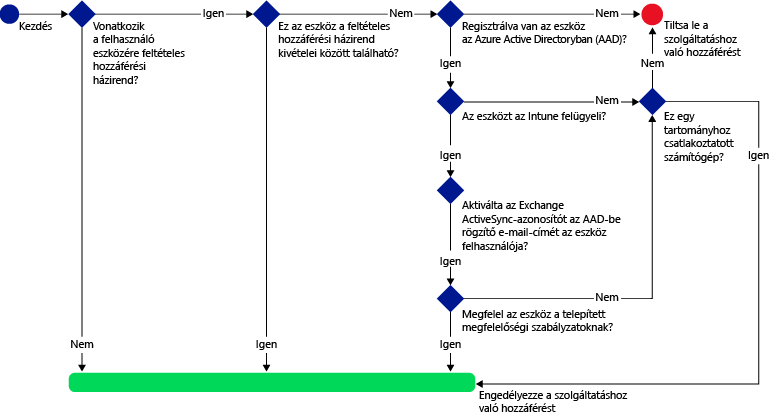
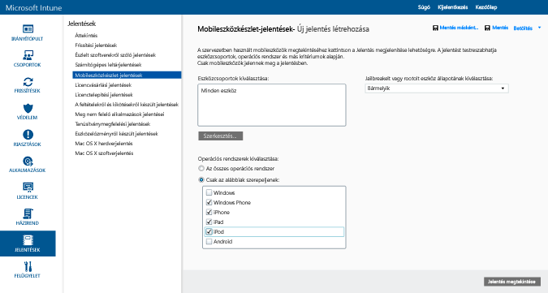
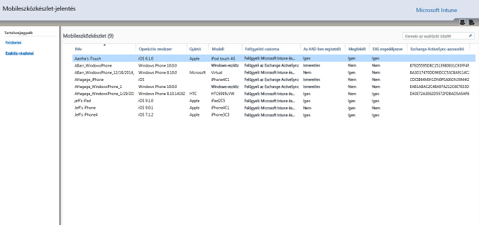
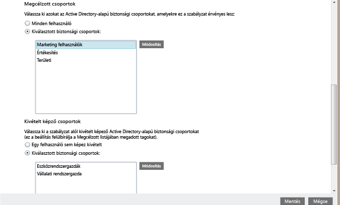
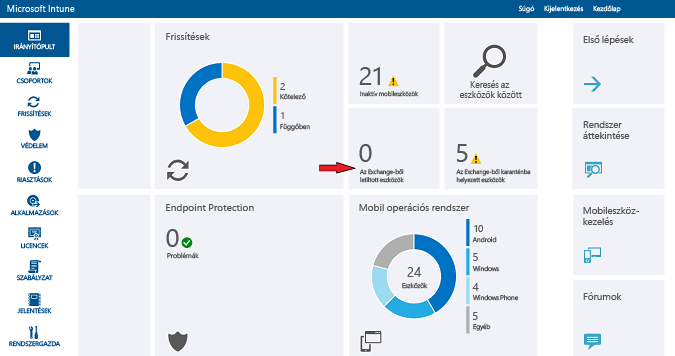

# Az Exchange Online-hoz és az új dedikált Exchange Online-hoz való e-mailes hozzáférés védelme

[!INCLUDE[classic-portal](../includes/classic-portal.md)]

Az Exchange Online vagy a dedikált Exchange Online szolgáltatásokhoz való feltételes hozzáférést a Microsoft Intune-ban konfigurálhatja. Ha szeretné jobban megismerni a feltételes hozzáférés működését, olvassa el [Az e-mailek, az O365- és egyéb szolgáltatások elérésének védelme](restrict-access-to-email-and-o365-services-with-microsoft-intune.md) című cikket.

> [!NOTE]
>Ha dedikált Exchange Online-környezettel rendelkezik, és szeretné tudni, hogy az új vagy az örökölt konfiguráció tartozik-e hozzá, lépjen kapcsolatba a fiókkezelővel.

## Előkészületek

A feltételes hozzáférés konfigurálásához az alábbiakra van szükség:

-   Rendelkeznie kell egy olyan **Office 365-előfizetéssel, amely tartalmazza az Exchange Online-t (például E3)**, és a felhasználóknak licenccel kell rendelkezniük az Exchange Online-hoz.

- Rendelkeznie kell **Enterprise Mobility + Security (EMS) előfizetéssel** vagy **Azure Active Directory (Azure AD) Premium előfizetéssel**, és a felhasználóknak is licenccel kell rendelkezniük az EMS-hez vagy az Azure AD-hoz. Részletesebb tájékoztatást az [Enterprise Mobility díjszabását](https://www.microsoft.com/cloud-platform/enterprise-mobility-pricing) vagy az [Azure Active Directory díjszabását ismertető lapon](https://azure.microsoft.com/pricing/details/active-directory/) talál.

-  Fontolja meg a választható **Intune szolgáltatások közötti összekötő** beállítását, amely az Intune-t az Exchange Online-hoz csatlakoztatja, és segítségével az eszközinformációkat az Intune konzoljával kezelheti. Feltételes házirendek vagy feltételes hozzáférési házirendek használatához nincs szükség az összekötő használatára, szükség van rá azonban az olyan jelentések futtatásához, amelyek segítenek a feltételes hozzáférés hatásának vizsgálatában.
    -  További információ az [Intune szolgáltatások közötti összekötőjéről](intune-service-to-service-exchange-connector.md).

   > [!NOTE]
   > Ne konfigurálja az Intune szolgáltatások közötti összekötőjét, ha feltételes hozzáférést szeretne használni az Exchange Online-hoz és a helyszíni Exchange-hez.

### Eszközmegfelelőségi követelmények

Ha feltételes hozzáférési szabályzatokat konfigurál és rendel hozzá felhasználókhoz, a felhasználók csak akkor csatlakozhatnak az e-mail-fiókjukhoz, ha a használt **eszköz** megfelel az alábbi feltételeknek:

-   **Regisztrálva** kell lennie az Intune-ban, vagy egy tartományhoz csatlakozó számítógépnek kell lennie.

-  **Regisztrálva van az Azure Active Directoryban**. Ez automatikusan megtörténik, amikor az eszköz regisztrálva van az Intune-ban. Ezenkívül az ügyfél Exchange ActiveSync-azonosítójának regisztrálva kell lennie az Azure Active Directoryban.

  Az Azure Active Directory eszközregisztrációs szolgáltatása automatikusan aktiválódik az Intune-t és az Office 365-öt használó ügyfelek számára. Azok az ügyfelek, akik már telepítették az ADFS eszközregisztrációs szolgáltatását, nem fogják látni a regisztrált eszközöket a helyszíni Active Directoryban.

-   **Megfelel** az eszközre telepített összes Intune megfelelőségi szabályzatának, vagy tartományhoz van csatlakoztatva egy helyszíni tartományban.

### Ha az eszköz nem megfelelő

Ha a feltételes hozzáférési szabályzat nem teljesül, az eszköz azonnal karanténba kerül és a felhasználó egy e-mailt kap, és bejelentkezéskor a következő karantén-értesítések valamelyikét fogja látni:

- Ha az eszköz nincs regisztrálva az Intune-nal vagy az Azure Active Directoryban, egy üzenet jelenik meg, amely leírja, hogyan kell telepíteni a Céges portál alkalmazást, regisztrálni az eszközt és aktiválni az e-mailt. Ez a folyamat hozzárendeli az eszköz Exchange ActiveSync-azonosítóját is az Azure Active Directoryban lévő rekordhoz.

-   Ha az eszköz nem felel meg a megfelelőségi szabályzat előírásainak, egy üzenet jelenik meg, amely a felhasználót az Intune Céges portál webhelyére vagy a Céges portál alkalmazásba irányítja, ahol a felhasználó további információt talál a problémáról és annak megoldásáról.

### Az Exchange Online-beli feltételes hozzáférés működése

A következő ábra az Exchange Online feltételes hozzáférési szabályzatai által használt folyamatot szemlélteti.

## A mobileszközök támogatása
Védheti az Exchange Online e-mailjeinek az **Outlook** alkalmazásból és a **modern hitelesítést használó más alkalmazásokból** történő elérését. A következők támogatottak:

- Android 4.0-ás és újabb verziók, Samsung Knox Standard 4.0-ás és újabb verziók és Android for Work
- iOS 8.0 és újabb verziók

A **modern hitelesítéssel** Active Directory Authentication Library-alapú (ADAL-alapú) bejelentkezés biztosítható a Microsoft Office-ügyfelekhez.

-   Az ADAL-alapú hitelesítéssel az Office-ügyfelek végezhetnek böngészőalapú hitelesítést (más néven passzív hitelesítést). A hitelesítéshez a felhasználó egy bejelentkezési weblapra van átirányítva.
-   Ez az új bejelentkezési módszer nagyobb biztonságot tesz lehetővé, például a **többtényezős hitelesítés** és a **tanúsítványalapú hitelesítés** funkcióit. Részletesebb információt a [How modern authentication works](https://support.office.com/article/How-modern-authentication-works-for-Office-2013-and-Office-2016-client-apps-e4c45989-4b1a-462e-a81b-2a13191cf517) (A modern hitelesítés használata) című cikkben olvashat. ADFS-jogcímszabályokat állíthat be a nem modern hitelesítési protokollok letiltására. Részletes útmutatót a [3. forgatókönyv: Az O365-höz való hozzáférés teljes letiltása a böngészőalapú alkalmazások kivételével](https://technet.microsoft.com/library/dn592182.aspx) című cikk tartalmaz.

Az Exchange Online-on védheti az **Outlook Web Access-hez (OWA)** az **iOS-** és **Android-** eszközök böngészőin keresztül történő hozzáférést. A hozzáférés csak a szabályzatnak megfelelő eszközök támogatott böngészőiről engedélyezett:

* Safari (iOS)
* Chrome (Android)
* Intune Managed Browser (iOS és Android 5.0 és újabb)

   > [!IMPORTANT]
   > **A nem támogatott böngészőkből nem lehetséges hozzáférni a szolgáltatáshoz**.

**Az iOS-re és az Androidra készült OWA alkalmazás módosítható úgy, hogy ne a modern hitelesítést használja, és nem támogatott. Az OWA alkalmazásból való elérést le kell tiltani az ADFS jogcímszabályai között.**

A következő platformokon védheti az Exchange e-mailjeinek elérését a beépített **Exchange ActiveSync levelezési ügyfélről**:

- Android 4.0-s és újabb verziók, Samsung KNOX szabvány 4.0-s és újabb verziók

- iOS 8.0 és újabb verziók

- Windows Phone 8.1 és újabb verziók

## Számítógépek támogatása

Az asztali Office-alkalmazásokat futtató számítógépekhez beállíthatja az **Exchange Online** és a **SharePoint Online** feltételes hozzáférését, ha a számítógépek megfelelnek az alábbi követelményeknek:

-   A számítógépen Windows 7.0, Windows 8.1 vagy Windows 10 operációs rendszernek kell futnia.

  >[!NOTE]
  > Ahhoz, hogy feltételes hozzáférést használhasson Windows 10-es számítógépeken, frissítenie kell a gépeket a Windows 10 évfordulós frissítéssel.

  A számítógépnek tartományhoz kell csatlakoznia, vagy meg kell felelnie a megfelelőségi szabályzat előírásainak.

  A megfelelőség érdekében a számítógépnek regisztrálva kell lennie az Intune-ban, és meg kell felelnie a szabályzatoknak.

  Tartományhoz csatlakozó számítógépek esetén feltételes hozzáférést kell beállítania az [eszköz automatikus regisztrációjához](https://azure.microsoft.com/documentation/articles/active-directory-conditional-access-automatic-device-registration/) az Azure Active Directoryban.

  >[!NOTE]
    >A feltételes hozzáférés nem támogatott az Intune-számítógépügyfelet futtató számítógépeken.

-   Az [Office 365 modern hitelesítésének engedélyezve kell lennie](https://support.office.com/article/Using-Office-365-modern-authentication-with-Office-clients-776c0036-66fd-41cb-8928-5495c0f9168a), és a számítógépre telepíteni kell az Office legújabb frissítéseit.

    A modern hitelesítéssel Active Directory Authentication Library-alapú (ADAL-alapú) bejelentkezés biztosítható az Office 2013/Windows-ügyfelekhez. Ez nagyobb biztonságot tesz lehetővé, például a **többtényezős hitelesítés** és a **tanúsítványalapú hitelesítés** funkcióit.

-   ADFS-jogcímszabályok állíthatók be a nem modern hitelesítési protokollok letiltása. Részletes útmutatót a [3. forgatókönyv: Az O365-höz való hozzáférés teljes letiltása a böngészőalapú alkalmazások kivételével](https://technet.microsoft.com/library/dn592182.aspx) című cikk tartalmaz.

## Feltételes hozzáférés konfigurálása
### 1. lépés: Megfelelőségi szabályzat konfigurálása és telepítése
[Hozza létre](create-a-device-compliance-policy-in-microsoft-intune.md) és [telepítse](deploy-and-monitor-a-device-compliance-policy-in-microsoft-intune.md) a megfelelőségi szabályzatot azon felhasználói csoportok számára, amelyekre érvényes lesz a feltételes hozzáférési szabályzat is.

> [!IMPORTANT]
> Ha nem telepített megfelelőségi szabályzatot, akkor az eszközök megfelelőnek minősülnek, és az Exchange-hez való hozzáférésük engedélyezett lesz.

### 2. lépés: A feltételes hozzáférési szabályzat hatásának értékelése
A feltételes hozzáférési szabályzat konfigurálása után a **Mobileszközkészlet-jelentések** használatával azonosíthatja azokat az eszközöket, amelyek Exchange-hozzáférése le van tiltva.

Ehhez a [Microsoft Intune szolgáltatások közötti összekötő](intune-service-to-service-exchange-connector.md) használatával állítsa be a kapcsolatot az Intune és az Exchange között.
1.  Keresse meg a **Jelentések** > **Mobileszközkészlet-jelentések** területet.

2.  A jelentés paramétereiben válassza ki az értékelni kívánt Intune-csoportot és szükség esetén azokat az eszközplatformokat, amelyekre alkalmazni szeretné a szabályzatot.
3.  A szervezet igényeinek megfelelő feltételek kiválasztása után válassza a **Jelentés megtekintése** lehetőséget.
A Jelentésmegjelenítő egy új ablakban nyílik meg.

A jelentés futtatása után vizsgálja meg a következő négy oszlopot annak meghatározásához, hogy a felhasználók le lesznek-e tiltva:

-   **Kezelési csatorna**: Jelzi, hogy az eszközt az Intune, az Exchange ActiveSync vagy mindkettő kezeli.

-   **Az AAD-ben regisztrált**: Jelzi, hogy az eszköz regisztrálva van-e az Azure Active Directoryban (vagyis munkahelyi csatlakoztatással).

-   **Megfelelő**: Jelzi, hogy az eszköz megfelel-e az érvénybe léptetett megfelelőségi szabályzatoknak.

-   **Exchange ActiveSync-azonosító**: Az iOS- és Android-eszközök Exchange ActiveSync-azonosítójának társítva kell lennie az Azure Active Directoryban található eszközregisztrációs rekorddal. Ez akkor történik meg, amikor a felhasználó a **Levelezés aktiválása** hivatkozást választja a karanténba helyezett e-mailben.

    > [!NOTE]
    > Windows Phone-telefonok esetén ebben az oszlopban mindig szerepel érték.

A célcsoporthoz tartozó eszközök Exchange-hozzáférése le lesz tiltva, ha az oszlop értékei nem egyeznek a következő táblázatban lévő értékekkel:

--------------------------
|Kezelési csatorna|Az AAD-ben regisztrált|Compliant (Megfelelő)|Exchange ActiveSync-azonosító|Eredményművelet|
|----------------------|------------------|-------------|--------------------------|--------------------|
|**A Microsoft Intune és az Exchange ActiveSync kezeli**|Igen|Igen|Érték jelenik meg|Az e-mail-hozzáférés engedélyezett|
|Bármely más érték|Nem|Nem|Nem jelenik meg érték|Az e-mail-hozzáférés letiltott|
----------------------
Exportálhatja a jelentés tartalmát, és az **E-mail cím** oszlop segítségével értesítheti a felhasználókat arról, hogy le lesznek tiltva.

### 3. lépés: Felhasználói csoportok konfigurálása a feltételes hozzáférési szabályzathoz
A feltételes hozzáférési szabályzatokkal a felhasználók különböző Azure Active Directory biztonsági csoportjai célozhatók meg. Ezenkívül meghatározott felhasználói csoportok mentesíthetők is a feltételes szabályzat alól. Amikor egy felhasználóra szabályzat vonatkozik, az általa használt összes eszköznek megfelelőnek kell lennie az e-mailek eléréséhez.

Ezeket a csoportokat az **Office 365 Felügyeleti központban** vagy az **Intune-fiókportálon** konfigurálhatja.

Minden házirendben két csoporttípust adhat meg:

-   **Megcélzott csoportok**: Azon felhasználói csoportok, amelyekre a szabályzat érvényes.

-   **Kivétel alá eső csoportok**: Azon felhasználói csoportok, amelyek mentesülnek a szabályzat alól (választható).

Ha egy felhasználó mindkét csoportban szerepel, mentesül a szabályzat alól.

Csak a feltételes hozzáférési szabályzat által célzott csoportokat értékeli ki a rendszer.

### 4. lépés: A feltételes hozzáférési szabályzat konfigurálása

>[!NOTE]
> Az Azure AD felügyeleti konzolján is létrehozhat feltételes hozzáférési szabályzatot. Az Azure AD felügyeleti konzolon a többtényezős hitelesítéshez hasonló egyéb feltételes hozzáférési szabályzatokon kívül létrehozhatja az Intune-eszközök feltételes hozzáférési szabályzatát is (ennek neve az Azure AD-ben **eszközalapú hozzáférési szabályzat**).

>Külső gyártók vállalati alkalmazásaihoz is beállíthat feltételes hozzáférési szabályzatokat, ha az Azure AD támogatja őket (ilyen például a Salesforce és a Box). További részleteket a [How to set Azure Active Directory device-based conditional access policy for access control to Azure Active Directory connected applications](https://azure.microsoft.com/documentation/articles/active-directory-conditional-access-policy-connected-applications/) (Hogyan állítható be eszközalapú feltételes hozzáférési szabályzat az Azure Active Directoryban az Azure Active Directoryhoz csatlakozó eszközök hozzáférés-vezérlésére) című cikkben olvashat.

1.  A [Microsoft Intune felügyeleti konzoljában](https://manage.microsoft.com) válassza a **Házirend** > **Feltételes hozzáférés** > **Exchange Online-szabályzat** elemet.

2.  Az **Exchange Online-szabályzat** lapon válassza a **Feltételes hozzáférési házirend engedélyezése Exchange Online-hoz** lehetőséget.

    > [!NOTE]
    > Ha nem léptetett életbe megfelelőségi szabályzatot, a rendszer megfelelőnek tekinti az eszközöket.
    >
    > A megfelelőségi állapottól függetlenül a szabályzat által megcélzott összes felhasználónak regisztrálnia kell az eszközét az Intune-ban.

3.  Az **Alkalmazás-hozzáférés** beállításnál két módszer közül választhat annak megadásához, hogy a szabályzat mely platformokra lesz érvényes a modern hitelesítést használó alkalmazások esetében. A támogatott platformok a következők: Android, iOS, Windows és Windows Phone.

    -   **Összes platform**

        Ha ezt a beállítást szeretné használni, az **Exchange Online** elérésére használt összes eszköznek regisztrálva kell lennie az Intune-ban, és meg kell felelnie a szabályzatoknak. Minden **modern hitelesítést** használó ügyfélalkalmazás a feltételes hozzáférési szabályzat hatálya alá tartozik. Ha a platformot az Intune jelenleg nem támogatja, akkor az **Exchange Online**-hoz való hozzáférés le van tiltva.

        A **Minden platform** beállítás kiválasztása esetén az Azure Active Directory minden hitelesítési kérelemre alkalmazza a szabályzatot, az ügyfélalkalmazás által jelentett platformtól függetlenül. Az alábbiakat kivéve minden platformot kötelező regisztrálni, illetve meg kell felelniük a szabályzatoknak:
        *    Azok a Windows-eszközök, amelyeket regisztrálni kell, illetve amelyeknek meg kell felelniük a szabályzatoknak, akár tartományhoz csatlakoznak, akár helyszíni Active Directoryt használnak, akár mindkettő igaz rájuk.
        * Nem támogatott platformok, például a Mac OS. Azonban az ezekről a platformokról származó, modern hitelesítést használó alkalmazások továbbra is le lesznek tiltva.

    -   **Megadott platformok**

         A megadott eszközplatformokon minden **modern hitelesítést** használó ügyfélalkalmazás a feltételes hozzáférési szabályzat hatálya alá tartozik.

4. Az **Outlook Web Access (OWA)** alatt engedélyezheti, hogy az Exchange Online-hoz csak a támogatott böngészőkkel lehessen hozzáférni: Safari (iOS) és Chrome (Android). Más böngészőkkel nem lehetséges a hozzáférés. Az Outlook megadott alkalmazás-hozzáférési platformkorlátozásai itt is érvényesek.

  Az **Android** rendszerű eszközök felhasználóinak engedélyezniük kell a böngészőalapú hozzáférést. A felhasználónak ehhez a regisztrált eszközön be kell kapcsolnia a **Böngészőalapú hozzáférés engedélyezése** lehetőséget az alábbi módon:
  1.    Nyissa meg a **Munkahelyi portál** alkalmazást.
  2.    A három pontra (...) koppintva vagy a hardveres menü gombbal nyissa meg a **Beállítások** lapot.
  3.    Kattintson a **Böngészőalapú hozzáférés engedélyezése** gombra.
  4.    A Chrome böngészőben jelentkezzen ki az Office 365-ből, majd indítsa újra a Chrome-ot.

  Az **iOS** és az **Android** platformokon a szolgáltatás eléréséhez használt eszköz azonosításához az Azure Active Directory egy TLS-tanúsítványt (Transport Layer Security) rendel az eszközhöz. Az eszköz az alábbi képernyőfelvételnek megfelelően megjeleníti a tanúsítványt, és felkéri a felhasználót, hogy válassza ki a tanúsítványt. A felhasználónak a böngésző további használatához ki kell választania ezt a tanúsítványt.

  **iOS**

  

  **Android**

  

5.  Az **Exchange ActiveSync-alkalmazások** beállításnál megadhatja a nem megfelelő eszközök Exchange Online-hozzáférésének letiltását. Azt is kiválaszthatja, hogy engedélyezi vagy letiltja az e-mailek elérését, amikor az eszköz nem támogatott platformmal működik. A támogatott platformok a következők: Android, iOS, Windows és Windows Phone.

 Exchange Active Sync-alkalmazások **Android for Work** rendszerű eszközökhöz:
 -  Az Android for Work eszközökön a **munka profilban** csak a **Gmail** és a **Nine Work** alkalmazások támogatottak. Ahhoz, hogy a feltételes hozzáférés működjön Android for Work rendszerű eszközökön, **kötelező** telepítésként telepíteni kell egy e-mail-profit a Gmail vagy a Nine Work alkalmazáshoz.

6.  A **Megcélzott csoportok** területen válassza ki azon felhasználók Active Directorybeli biztonsági csoportjait, akikre érvényes a házirend. Az összes felhasználót vagy a felhasználói csoportok egy kiválasztott listáját is megadhatja.

    > [!NOTE]
    > A **Megcélzott csoportok** listán lévő felhasználók esetében az Intune-szabályzatok felváltják az Exchange-szabályokat és -szabályzatokat.
    >
    > Az Exchange csak a következő esetekben érvényesíti az engedélyezési, blokkolási és karanténba helyezési szabályokat és az Exchange-szabályzatokat:
    >
    > -   A felhasználó nem rendelkezik Intune-licenccel.
    > -   A felhasználó rendelkezik Intune-licenccel, de egy, a feltételes hozzáférési házirendben megcélzott biztonsági csoportnak sem tagja.

6.  A **Kivétel alá eső csoportok**területen válassza ki azon felhasználók Active Directory biztonsági csoportjait, akikre nem érvényes a házirend. Ha egy felhasználó a megcélzott és a mentesített csoportban is szerepel, mentes a szabályzat alól.

7.  Ha elkészült, válassza a **Mentés** elemet.

-   Nem kell telepítenie a feltételes hozzáférési szabályzatot, az azonnal érvénybe lép.

-   Miután egy felhasználó e-mail fiókot hoz létre, azonnal letiltja az eszközt.

-   Ha egy letiltott felhasználó regisztrálja az eszközt az Intune-ban és kijavítja a megfelelőségi hibákat, a rendszer két percen belül feloldja az e-mail-hozzáférés letiltását.

-   Ha a felhasználó megszünteti az eszköz regisztrációját, a rendszer körülbelül hat óra múlva letiltja az e-maileket.

**Ha szeretne arra vonatkozó példákat megtekinteni, hogy hogyan konfigurálhat feltételes hozzáférési szabályzatot az eszközök hozzáférésének védelméhez, olvassa el az** e-mail-hozzáférés védelmét bemutató példák[ leírását](restrict-email-access-example-scenarios.md).

## A megfelelőség és a feltételes hozzáférési házirendek megfigyelése

#### Az Exchange szolgáltatásból kitiltott eszközök megtekintése

Az Intune irányítópultján kattintson **Az Exchange szolgáltatásból kitiltott eszközök** csempére a letiltott eszközök számának és további információkat megjelenítő hivatkozások megtekintéséhez.

## További lépések
- [A SharePoint Online-hoz való hozzáférés védelme](restrict-access-to-sharepoint-online-with-microsoft-intune.md)

- [A Skype Vállalati online verzióhoz való hozzáférés védelme](restrict-access-to-skype-for-business-online-with-microsoft-intune.md)

