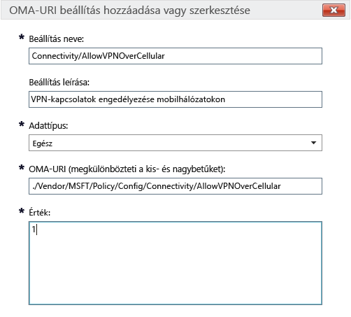

# A Microsoft Intune-ban regisztrált Windows 10-eszközökre vonatkozó Intune-házirendbeállítások

Ez a témakör ismerteti azokat az Intune-szabályzatbeállításokat, amelyeket Windows 10-eszközök felügyeletére használhat. A témakört [Az eszközök beállításainak és funkcióinak kezelése a Microsoft Intune-házirendek használatával](manage-settings-and-features-on-your-devices-with-microsoft-intune-policies.md) című témakörben ismertetett eljárásokkal együtt olvassa el a Windows 10 asztali verziójú és Windows 10 Mobile rendszerű eszközök beépített és egyéni beállításainak konfigurálásához. E szabályzatok nem használhatók olyan számítógépeken, amelyeken az [Intune PC-ügyfélszoftvert](/intune/get-started/windows-pc-management-capabilities-in-microsoft-intune) fut.

Két szabályzattípus közül választhat:

- **Egyéni szabályzat**: A Microsoft Intune a Windows 10 és a Windows 10 Mobile rendszerhez készült **egyéni szabályzatával** OMA-URI (Open Mobile Alliance egységes erőforrás-azonosító) beállítások telepíthetők, amelyek segítségével szabályozhatók az eszközök funkciói. A Windows 10 számos beállítást tesz elérhetővé a [Szabályzat-konfigurációszolgáltatón (Policy Configuration Service Provider, Policy CSP)](https://technet.microsoft.com/itpro/windows/manage/how-it-pros-can-use-configuration-service-providers) keresztül.
- **Általános konfigurációs szabályzat**: Ezt a szabályzattípust használja, ha a Microsoft Intune-hoz biztosított beépített listából szeretne beállításokat választani.

## Egyéni szabályzatbeállítások

Egyéni szabályzatokban a következő beállításokat adja meg.

### Általános

Adja meg a szabályzat nevét és – szükség esetén – a leírását, hogy könnyebben megtalálja az Intune-konzolon.

### OMA-URI-beállítások

Minden egyes hozzáadni kívánt OMA-URI-beállításhoz adja meg a következő információkat. A rendelkezésre álló beállítások áttekintését a jelen témakör [Windows 10 URI-beállítások](/intune/deploy-use/windows-10-policy-settings-in-microsoft-intune#Windows-10-URI-settings) című részében találja:

- **Beállítás neve**: Adjon meg egy egyedi nevet az OMA-URI beállítás számára, amellyel az egyszerűen azonosítható a beállítások listájában.
- **Beállítás leírása**: Itt adhatja meg a beállítás leírását (nem kötelező).
- **Adattípus**: A következő adattípusok közül választhat:
    - **Karakterlánc**
    - **Karakterlánc (XML)**
    - **Dátum és időpont**
    - **Egész**
    - **Lebegőpontos szám**
    - **Logikai**
- **OMA-URI (megkülönbözteti a kis- és nagybetűket)**: Adja meg az OMA-URI azonosítót, amelyhez beállítást kíván megadni.
- **Érték**: Adja meg a megadott OMA-URI azonosítóhoz társítandó értéket.

### Példa
A következő képernyőképen a **Connectivity/AllowVPNOverCellular** beállítást engedélyezték. Ez lehetővé teszi, hogy a Windows 10-es eszköz VPN-kapcsolatot nyisson meg, ha éppen mobilhálózathoz csatlakozik.

> 

## Windows 10 URI-beállítások
Ebben a szakaszban az **egyéni Windows 10-szabályzatokkal** konfigurálható OMA-URI beállításokat ismerheti meg.

### Házirend

|Házirend neve és URI azonosítója|Részletek|
|---------------|------------|-----------|
|**Automatikus frissítés engedélyezése** ./Vendor/MSFT/Policy/Config/Update/AllowAutoUpdate|Csak asztali verziók **Adattípus:** Egész szám **Értékek:** **0** - **5** (alapértelmezett: **1**)|
|**Telepítés napjának ütemezése** ./Vendor/MSFT/Policy/Config/Update/ScheduledInstallDay|Csak mobil verziók **Adattípus:** Egész szám **Értékek:** **0** – minden nap (alapértelmezés) **1** – vasárnap **2** – hétfő **3** – kedd **4** – szerda **5** – csütörtök **6** – péntek **7** – szombat|
|**Telepítés időpontjának ütemezése** ./Vendor/MSFT/Policy/Config/Update/ScheduledInstallTime|Asztali és mobil verziók **Adattípus:** Egész szám **Értékek:**  **0** – **23** óra (**0**: éjfél) (alapértelmezés: **3**)|
|**DeviceLock/AllowIdleReturnWithoutPassword** ./Vendor/MSFT/Policy/Config/DeviceLock/AllowIdleReturnWithoutPassword|Csak mobil verziók **Adattípus:** Egész szám **Értékek:** **0** – a felhasználó nem állíthatja be a jelszó türelmi idejének időzítőjét; az érték „minden alkalommal” lesz **1** – a felhasználó beállíthatja a jelszó türelmi idejének időzítőjét (alapértelmezés)|
|**WiFi/AllowWiFi** ./Vendor/MSFT/Policy/Config/WiFi/AllowWiFi|Csak mobil verziók **Adattípus:** Egész szám **Értékek:** **0** – Nem engedélyezi a **Wi-Fi kapcsolat használatát** **1** – **Engedélyezi a Wi-Fi kapcsolat használatát** (alapértelmezés)|
|**WiFi/AllowInternetSharing** ./Vendor/MSFT/Policy/Config/WiFi/AllowInternetSharing|Asztali és mobil verziók **Adattípus:** Egész szám **Értékek: ** **0** – Nem engedélyezi az internetmegosztást   **1** – Engedélyezi az internetmegosztást (alapértelmezés)|
|**WiFi/AllowAutoConnectToWiFiSenseHotspots** ./Vendor/MSFT/Policy/Config/WiFi/AllowAutoConnectToWiFiSenseHotspots|Asztali és mobil verziók **Adattípus:** Egész szám **Értékek: ** **0** – Nem engedélyezett  **1** – engedélyezett (alapértelmezés)|
|**WiFi/AllowManualWiFiConfiguration** ./Vendor/MSFT/Policy/Config/WiFi/AllowManualWiFiConfiguration|Csak mobil verziók **Adattípus:** Egész szám **Értékek:** **0** – Csak az MDM-mel konfigurált Wi-Fi-kapcsolatok használatának engedélyezése. **1** – Engedélyezett az új hálózati SSID-k hozzáadása az MDM által már létrehozott SSID-k mellett (alapértelmezés)|
|**System/AllowLocation** ./Vendor/MSFT/Policy/Config/System/AllowLocation|Asztali és mobil verziók **Adattípus:** Egész szám **Értékek: ** **0** – Nem engedélyezett  **1** – engedélyezett (alapértelmezés)|
|**System/AllowTelemetry** ./Vendor/MSFT/Policy/Config/System/AllowTelemetry|Asztali és mobil verziók **Adattípus:** Egész szám **Értékek:** **0** – Nem engedélyezett (csak Enterprise rendszerekre vonatkozó beállítás) **1** – Korlátozott **2** – Teljes (alapértelmezés) **3** – Teljes és diagnosztikai információk|
|**System/AllowExperimentation** ./Vendor/MSFT/Policy/Config/System/AllowExperimentation|Asztali és mobil verziók **Adattípus:** Egész szám **Értékek:** **0** – Nem engedélyezett **1** – Csak beállítások (alapértelmezés) **2** – Beállítások és kísérletezés|
|**Security/AntiTheftMode** ./Vendor/MSFT/Policy/Config/Security/AntiTheftMode|Csak mobil verziók **Adattípus:** Egész szám **Értékek:** **0** – Lopásgátló üzemmód tiltása **1** – Felhasználói beállítás szerint (alapértelmezés)|
|**Connectivity/AllowUSBConnection** ./Vendor/MSFT/Policy/Config/Connectivity/AllowUSBConnection|Csak mobil verziók **Adattípus:** Egész szám **Értékek ** **0** – Nem engedélyezett  **1** – engedélyezett (alapértelmezés)|
|**System/AllowUserToResetPhone** ./Vendor/MSFT/Policy/Config/System/AllowUserToResetPhone|Csak mobil verziók **Adattípus:** Egész szám **Értékek: ** **0** – Nem engedélyezett **1** – engedélyezett (alapértelmezés)|
|**Connectivity/AllowCellularDataRoaming** ./Vendor/MSFT/Policy/Config/Connectivity/AllowCellularDataRoaming|Asztali és mobil verziók **Adattípus:** Egész szám **Értékek: ** **0** – Nem engedélyezett  **1** – engedélyezett (alapértelmezés)|
|**Connectivity/AllowVPNOverCellular** ./Vendor/MSFT/Policy/Config/Connectivity/AllowVPNOverCellular|Asztali és mobil verziók **Adattípus:** Egész szám **Értékek:** **0** – VPN tiltása mobileszközökön **1** – a VPN bármilyen kapcsolatot használhat, beleértve a mobilkapcsolatot is (alapértelmezés)|
|**Connectivity/AllowVPNRoamingOverCellular** ./Vendor/MSFT/Policy/Config/Connectivity/AllowVPNRoamingOverCellular|Csak mobil verziók **Adattípus:** Egész szám **Értékek: ** **0** – Nem engedélyezett  **1** – engedélyezett (alapértelmezés)|
|**Connectivity/AllowVPNRoamingOverCellular** ./Vendor/MSFT/Policy/Config/Connectivity/AllowVPNRoamingOverCellular|Csak mobil verziók **Adattípus:** Egész szám **Értékek: ** **0** – Nem engedélyezett  **1** – engedélyezett (alapértelmezés)|
|**Connectivity/AllowBluetooth** ./Vendor/MSFT/Policy/Config/Connectivity/AllowBluetooth|Asztali és mobil verziók **Adattípus:** Egész szám **Értékek:** **0** – Nem engedélyezi a felhasználónak a Bluetooth aktiválását. **1** – Fenntartva. A Bluetooth bekapcsolásának és konfigurálásának engedélyezése a felhasználónak (nem támogatott Windows Phone 8.1 MDM, EAS, a Windows 10 asztali verziója és Windows 10 Mobile esetén). **2** – Engedélyezett. A Bluetooth bekapcsolásának és konfigurálásának engedélyezése a felhasználónak (alapértelmezés).|
|**Experience/AllowScreenCapture** ./Vendor/MSFT/Policy/Config/Experience/AllowScreenCapture|Csak mobil verziók **Adattípus:** Egész szám **Értékek: ** **0** – Nem engedélyezett  **1** – engedélyezett (alapértelmezés)|
|**Experience/AllowTaskSwitcher** ./Vendor/MSFT/Policy/Config/Experience/AllowTaskSwitcher|Csak mobil verziók **Adattípus:** Egész szám **Értékek: ** **0** – Nem engedélyezett  **1** – engedélyezett (alapértelmezés)|
|**Experience/AllowVoiceRecording** ./Vendor/MSFT/Policy/Config/Experience/AllowVoiceRecording|Csak mobil verziók **Adattípus:** Egész szám **Értékek: ** **0** – Nem engedélyezett  **1** – engedélyezett (alapértelmezés)|
|**Experience/AllowSyncMySettings** ./Vendor/MSFT/Policy/Config/Experience/AllowSyncMySettings|Csak mobil verziók **Adattípus:** Egész szám **Értékek: ** **0** – Roaming tiltása  **1** – Roaming engedélyezése (alapértelmezés)|
|**Experience/AllowManualMDMUnenrollment** ./Vendor/MSFT/Policy/Config/Experience/AllowManualMDMUnenrollment|Asztali és mobil verziók **Adattípus:** Egész szám **Értékek: ** **0** – Nem engedélyezett  **1** – engedélyezett (alapértelmezés)|
|**Accounts/AllowMicrosoftAccountConnection** ./Vendor/MSFT/Policy/Config/Accounts/AllowMicrosoftAccountConnection|Asztali és mobil verziók **Adattípus:** Egész szám **Értékek:**  **0** – Nem engedélyezett  **1** – engedélyezett (alapértelmezés)|
|**Accounts/AllowAddingNonMicrosoftAccountsManually** ./Vendor/MSFT/Policy/Config/Accounts/AllowAddingNonMicrosoftAccountsManually|Asztali és mobil verziók **Adattípus:** Egész szám **Értékek:**  **0** – Nem engedélyezett  **1** – engedélyezett (alapértelmezés)|
|**Security/AllowManualRootCertificateInstallation** ./Vendor/MSFT/Policy/Config/Security/AllowManualRootCertificateInstallation|Csak mobil verziók **Adattípus:** Egész szám **Értékek: ** **0** – Nem engedélyezett  **1** – engedélyezett (alapértelmezés)|
|**Security/AllowAddProvisioningPackages** ./Vendor/MSFT/Policy/Config/Security/AllowAddProvisioningPackages|Asztali és mobil verziók **Adattípus:** Egész szám **Értékek: ** **0** – Nem engedélyezett  **1** – engedélyezett (alapértelmezés)|
|**Search/DisableBackoff** ./Vendor/MSFT/Policy/Config/Search/DisableBackoff|Asztali és mobil verziók **Adattípus:** Egész szám **Értékek:**  **0** (alapértelmezés)  **1**|
|**Search/PreventRemoteQueries** ./Vendor/MSFT/Policy/Config/Search/PreventRemoteQueries|Asztali és mobil verziók **Adattípus:** Egész szám **Értékek:**  **0**  **1** (alapértelmezés)|
|**Search/AllowUsingDiacritics** ./Vendor/MSFT/Policy/Config/Search/AllowUsingDiacritics|Asztali és mobil verziók **Adattípus:** Egész szám **Értékek:**  **0** (alapértelmezés)  **1**|
|**Search/AlwaysUseAutoLangDetection** ./Vendor/MSFT/Policy/Config/Search/AlwaysUseAutoLangDetection|Asztali és mobil verziók **Adattípus:** Egész szám **Értékek:**  **0** (alapértelmezés)  **1**|
|**Search/DisableRemovableDriveIndexing** ./Vendor/MSFT/Policy/Config/Search/DisableRemovableDriveIndexing|Asztali és mobil verziók **Adattípus:** Egész szám **Értékek:  ** **0** (alapértelmezés)  **1**|
|**Search/PreventIndexingLowDiskSpaceMB** ./Vendor/MSFT/Policy/Config/Search/PreventIndexingLowDiskSpaceMB|Asztali és mobil verziók **Adattípus:** Egész szám **Értékek:**  **0**  **1** (alapértelmezés)|
|**Search/AllowIndexingEncryptedStoresOrItems** ./Vendor/MSFT/Policy/Config/Search/AllowIndexingEncryptedStoresOrItems|Asztali és mobil verziók **Adattípus:** Egész szám **Értékek:**  **0** (alapértelmezés)  **1**|
|**Security/AllowRemoveProvisioningPackage** ./Vendor/MSFT/Policy/Config/Security/AllowRemoveProvisioningPackage|Asztali és mobil verziók **Adattípus:** Egész szám **Értékek: ** **0** – Nem engedélyezett  **1** – engedélyezett (alapértelmezés)|
|**Security/RequireProvisioningPackageSignature** ./Vendor/MSFT/Policy/Config/Security/RequireProvisioningPackageSignature|Asztali és mobil verziók **Adattípus:** Egész szám **Értékek:  ** **0** (alapértelmezés)  **1**|
|**AboveLock/AllowActionCenterNotifications** ./Vendor/MSFT/Policy/Config/AboveLock/AllowActionCenterNotifications|Asztali és mobil verziók **Adattípus:** Egész szám **Értékek: ** **0** – Nem engedélyezett  **1** – engedélyezett (alapértelmezés)|
|**TextInput/AllowIMENetworkAccess** ./Vendor/MSFT/Policy/Config/TextInput/AllowIMENetworkAccess|Csak asztali verziók **Adattípus:** Egész szám **Értékek:** **0** – Nem engedélyezett. A nyílt kiterjesztett szótár ki van kapcsolva. A felhasználók nem tehetik a következőket: - Új nyílt kiterjesztett szótár felvétele. - Új keresésintegrációs konfigurációs fájl felvétele. - A felhőben való használatra jelölt szolgáltatás használata. - Felhasználó által regisztrált szó küldése. **1** – Engedélyezés A nyílt kiterjesztett könyvtár alapértelmezés szerint felvehető és használható. A keresésintegráció funkció is alapértelmezés szerint használható. A felhasználó a következőket teheti: - A felhőben való használatra jelölt szolgáltatás használata.|
|**TextInput/AllowIMELogging** ./Vendor/MSFT/Policy/Config/TextInput/AllowIMELogging|Csak asztali verziók **Adattípus:** Egész szám **Értékek:** **0** – A helytelen átalakítások naplózása ki van kapcsolva **1** – A helytelen átalakítások naplózása be van kapcsolva (alapértelmezett)|
|**TextInput/AllowJapaneseNonPublishingStandardGlyph** ./Vendor/MSFT/Policy/Config/TextInput/AllowJapaneseNonPublishingStandardGlyph|Csak asztali verziók **Adattípus:** Egész szám **Értékek: ** **0** – Nem engedélyezett  **1** – engedélyezett (alapértelmezés)|
|**TextInput/AllowJapaneseIVSCharacters** ./Vendor/MSFT/Policy/Config/TextInput/AllowJapaneseIVSCharacters|Csak asztali verziók **Adattípus:** Egész szám **Értékek: ** **0** – Nem engedélyezett  **1** – engedélyezett (alapértelmezés)|
|**TextInput/AllowJapaneseUserDictionary** ./Vendor/MSFT/Policy/Config/TextInput/AllowJapaneseUserDictionary|Csak asztali verziók **Adattípus:** Egész szám **Értékek: ** **0** – Nem engedélyezett  **1** – engedélyezett (alapértelmezés)|
|**TextInput/AllowJapaneseIMESurrogatePairCharacters** ./Vendor/MSFT/Policy/Config/TextInput/AllowJapaneseIMESurrogatePairCharacters|Csak asztali verziók **Adattípus:** Egész szám **Értékek: ** **0** – Nem engedélyezett  **1** – engedélyezett (alapértelmezés)|
|**TextInput/ExcludeJapaneseIMEExceptShiftJIS** ./Vendor/MSFT/Policy/Config/TextInput/ExcludeJapaneseIMEExceptShiftJIS|Csak asztali verziók **Adattípus:** Egész szám **Értékek:** **0** – Egyetlen karakter sincs szűrve (alapértelmezés) **1** – A Shift JIS-karakterek kivételével minden karaktert szűr a rendszer|
|**TextInput/ExcludeJapaneseIMEExceptJIS0208** ./Vendor/MSFT/Policy/Config/TextInput/ExcludeJapaneseIMEExceptJIS0208|Csak asztali verziók **Adattípus:** Egész szám **Értékek:** **0** – Egyetlen karakter sincs szűrve (alapértelmezés) **1** – A JIS0208-karakterek kivételével minden karaktert szűr a rendszer|
|**TextInput/ExcludeJapaneseIMEExceptJIS0208andEUDC** ./Vendor/MSFT/Policy/Config/TextInput/ExcludeJapaneseIMEExceptJIS0208andEUDC|Csak asztali verziók **Adattípus:** Egész szám **Értékek:** **0** – Egyetlen karakter sincs szűrve (alapértelmezés) **1** – A JIS0208- és az EUDC-karakterek kivételével minden karaktert szűr a rendszer|
|**TextInput/AllowInputPanel** ./Vendor/MSFT/Policy/Config/TextInput/AllowInputPanel|Csak asztali verziók **Adattípus:** Egész szám **Értékek: ** **0** – Nem engedélyezett  **1** – engedélyezett (alapértelmezés)|
|**Bluetooth/AllowDiscoverableMode** ./Vendor/MSFT/Policy/Config/Bluetooth/AllowDiscoverableMode|Asztali és mobil verziók **Adattípus:** Egész szám **Értékek: ** **0** – Nem engedélyezett  **1** – engedélyezett (alapértelmezés)|
|**Bluetooth/AllowAdvertising** ./Vendor/MSFT/Policy/Config/Bluetooth/AllowAdvertising|Asztali és mobil verziók **Adattípus:** Egész szám **Értékek: ** **0** – Nem engedélyezett  **1** – engedélyezett (alapértelmezés)|
|**Settings/AllowDataSense** ./Vendor/MSFT/Policy/Config/Settings/AllowDataSense|Asztali és mobil verziók **Adattípus:** Egész szám **Értékek: ** **0** – Nem engedélyezett  **1** – engedélyezett (alapértelmezés)|
|**Settings/AllowVPN** ./Vendor/MSFT/Policy/Config/Settings/AllowVPN|Asztali és mobil verziók **Adattípus:** Egész szám **Értékek: ** **0** – Nem engedélyezett  **1** – engedélyezett (alapértelmezés)|
|**Settings/AllowWorkplace** ./Vendor/MSFT/Policy/Config/Settings/AllowWorkplace|Csak asztali verziók **Adattípus:** Egész szám **Értékek ** **0** – Nem engedélyezett  **1** – engedélyezett (alapértelmezés)|
|**Settings/AllowDateTime** ./Vendor/MSFT/Policy/Config/Settings/AllowDateTime|Asztali és mobil verziók **Adattípus:** Egész szám **Értékek ** **0** – Nem engedélyezett  **1** – engedélyezett (alapértelmezés)|
|**Settings/AllowLanguage** ./Vendor/MSFT/Policy/Config/Settings/AllowLanguage|Csak asztali verziók **Adattípus:** Egész szám **Értékek: ** **0** – Nem engedélyezett  **1** – engedélyezett (alapértelmezés)|
|**Settings/AllowRegion** ./Vendor/MSFT/Policy/Config/Settings/AllowRegion|Csak asztali verziók **Adattípus:** Egész szám **Értékek: ** **0** – Nem engedélyezett  **1** – engedélyezett (alapértelmezés)|
|**Settings/AllowSignInOptions** ./Vendor/MSFT/Policy/Config/Settings/AllowSignInOptions|Csak asztali verziók **Adattípus:** Egész szám **Értékek: ** **0** – Nem engedélyezett  **1** – engedélyezett (alapértelmezés)|
|**Settings/AllowYourAccount** ./Vendor/MSFT/Policy/Config/Settings/AllowYourAccount|Asztali és mobil verziók **Adattípus:** Egész szám **Értékek: ** **0** – Nem engedélyezett  **1** – engedélyezett (alapértelmezés)|
|**Settings/AllowPowerSleep** ./Vendor/MSFT/Policy/Config/Settings/AllowPowerSleep|Csak asztali verziók **Adattípus:** Egész szám **Értékek: ** **0** – Nem engedélyezett  **1** – engedélyezett (alapértelmezés)|
|**Settings/AllowAutoPlay** ./Vendor/MSFT/Policy/Config/Settings/AllowAutoPlay|Csak asztali verziók **Adattípus:** Egész szám **Értékek: ** **0** – Nem engedélyezett  **1** – engedélyezett (alapértelmezés)|
|**Experience/AllowCortana** ./Vendor/MSFT/Policy/Config/Experience/AllowCortana|Asztali és mobil verziók **Adattípus:** Egész szám **Értékek: ** **0** – Nem engedélyezett  **1** – engedélyezett (alapértelmezés)|
|**Search/SafeSearchPermissions** ./Vendor/MSFT/Policy/Config/Search/SafeSearchPermissions|Csak mobil verziók **Adattípus:** Egész szám **Értékek:** **0** – Felnőtt tartalom szigorú, legmagasabb fokú szűrése **1** – Felnőtt tartalom mérsékelt, közepes szintű szűrése (az érvényes keresési eredményeket nem szűri a rendszer) (alapértelmezés)|
|**Experience/AllowCopyPaste** ./Vendor/MSFT/Policy/Config/Experience/AllowCopyPaste|Csak asztali verziók **Adattípus:** Egész szám **Értékek: ** **0** – Nem engedélyezett  **1** – engedélyezett (alapértelmezés)|
|**Kezdő méret kényszerítése** ./Vendor/MSFT/Policy/Config/Start/ForceStartSize|Csak mobil verziók **Adattípus:** Egész szám **Értékek:** **0** – Méretmódosítás engedélyezése a felhasználó számára (alapértelmezés) **1** – Nem teljes képernyő kényszerítése **2** – Teljes képernyő kényszerítése|
|**Update/RequireDeferUpgrade** ./Vendor/MSFT/Policy/Config/Update/RequireDeferUpgrade|Asztali és mobil verziók **Adattípus:** Egész szám **Értékek:** **0**– A frissítés késleltetésének mellőzése (maradás az aktuális fejlesztési ágban, CB) (alapértelmezés) **1** – A frissítések késleltetésének engedélyezése (az eszköz az aktuális üzleti ág (CBB) szabályait követi) A részletekért lásd: [Bevezetés a Windows 10 karbantartásába](https://technet.microsoft.com/library/mt598226.aspx) [Felkészülés a Windows 10 központi telepítésére](https://technet.microsoft.com/library/mt574241.aspx)|
|**Update/DeferUpdatePeriod** ./Vendor/MSFT/Policy/Config/Update/DeferUpdatePeriod|Asztali és mobil verziók **Leírás:** A szoftverfrissítéseket legfeljebb négy héttel késleltető szabályzat **Adattípus:** Egész szám **Értékek:**  **0**: A frissítések azonnali alkalmazása (alapértelmezés) **1**-**4**– A rendszer ennyi héttel késlelteti a szoftverfrissítéseket A részletekért lásd: [Bevezetés a Windows 10 karbantartásába](https://technet.microsoft.com/library/mt598226.aspx) [Felkészülés a Windows 10 központi telepítésére](https://technet.microsoft.com/library/mt574241.aspx)|
|**Update/DeferUpgradePeriod** ./Vendor/MSFT/Policy/Config/Update/DeferUpgradePeriod|Asztali és mobil verziók **Leírás:** A funkciófrissítéseket legfeljebb 8 hónappal késleltető szabályzat **Adattípus:** Egész szám **Értékek:** **0**: A frissítések azonnali alkalmazása (alapértelmezés) **1**-**8**– A rendszer ennyi hónappal késlelteti a funkciófrissítéseket A részletekért lásd: [Bevezetés a Windows 10 karbantartásába](https://technet.microsoft.com/library/mt598226.aspx) [Felkészülés a Windows 10 központi telepítésére](https://technet.microsoft.com/library/mt574241.aspx)|
|**Update/PauseDeferrals** ./Vendor/MSFT/Policy/Config/Update/PauseDeferrals|Asztali és mobil verziók **Leírás:** Lehetővé teszi az eszköznek a frissítések letöltésének leállítását öt hétre. **Adattípus:** Egész szám **Értékek:** **0**: A frissítések azonnali alkalmazása (alapértelmezett) **1** – A frissítések és verziófrissítések szüneteltetése (öt hét után lejár)|

### Windows Defender

|Házirend neve és URI azonosítója|Részletek|
|---------------|-----------|
|**AllowRealtimeMonitoring** ./Vendor/MSFT/Policy/Config/Defender/AllowRealtimeMonitoring|Csak asztali verziók **Adattípus:** Egész szám **Értékek: ** **0** – Nem engedélyezett  **1** – engedélyezett (alapértelmezés)|
|**AllowBehaviorMonitoring** ./Vendor/MSFT/Policy/Config/Defender/AllowBehaviorMonitoring|Csak asztali verziók **Adattípus:** Egész szám **Értékek: ** **0** – Nem engedélyezett  **1** – engedélyezett (alapértelmezés)|
|**AllowIntrusionPreventionSystem** ./Vendor/MSFT/Policy/Config/Defender/AllowIntrusionPreventionSystem|Csak asztali verziók **Adattípus:** Egész szám **Értékek: ** **0** – Nem engedélyezett  **1** – engedélyezett (alapértelmezés)|
|**AllowIOAVProtection** ./Vendor/MSFT/Policy/Config/Defender/AllowIOAVProtection|Csak asztali verziók **Adattípus:** Egész szám **Értékek:**  **0** – Nem engedélyezett  **1** – engedélyezett (alapértelmezés)|
|**AllowScriptScanning** ./Vendor/MSFT/Policy/Config/Defender/AllowScriptScanning|Csak asztali verziók **Adattípus:** Egész szám **Értékek: ** **0** – Nem engedélyezett  **1** – engedélyezett (alapértelmezés)|
|**AllowOnAccessProtection** ./Vendor/MSFT/Policy/Config/Defender/AllowOnAccessProtection|Csak asztali verziók **Adattípus:** Egész szám **Értékek: ** **0** – Nem engedélyezett  **1** – engedélyezett (alapértelmezés)|
|**RealTimeScanDirection** ./Vendor/MSFT/Policy/Config/Defender/RealTimeScanDirection|Csak asztali verziók **Adattípus:** Egész szám **Értékek:** **0** – Minden fájl figyelése (alapértelmezett) **1** – Bejövő fájlok figyelése **2** – Kimenő fájlok figyelése|
|**DaysToRetainCleanedMalware** ./Vendor/MSFT/Policy/Config/Defender/DaysToRetainCleanedMalware|Csak asztali verziók **Adattípus:** Egész szám **Értékek:** **0** - **90** – Azt adja meg, hogy a kártevő szoftvereket mennyi ideig őrizze meg a rendszer. **0** – Végleg a karantén mappában tartja, automatikusan nem távolítja el (alapértelmezett)|
|**AllowUserUIAccess** ./Vendor/MSFT/Policy/Config/Defender/AllowUserUIAccess|Csak asztali verziók **Adattípus:** Egész szám **Értékek: ** **0** – Nem engedélyezett  **1** – engedélyezett (alapértelmezés)|
|**ScanParameter** ./Vendor/MSFT/Policy/Config/Defender/ScanParameter|Csak asztali verziók **Adattípus:** Egész szám **Értékek:** **1** – Gyorsvizsgálat (alapértelmezés) **2** – Teljes vizsgálat|
|**ScheduleScanDay** ./Vendor/MSFT/Policy/Config/Defender/ScheduleScanDay|Csak asztali verziók **Adattípus:** Egész szám **Értékek:** **0** – Mindennap (alapértelmezés) **1** – hétfő **2** – kedd **3** – szerda **4** – csütörtök **5** – péntek **6** – szombat **7** – vasárnap **8** – Nincs ütemezett vizsgálat|
|**ScheduleScanTime** ./Vendor/MSFT/Policy/Config/Defender/ScheduleScanTime|Csak asztali verziók **Adattípus:** Egész szám **Értékek:** **0** – 00:00 **60** – 1:00 **120** – 2:00 (alapértelmezés) **180** – 3:00 **240** – 4:00 **300** – 5:00 **360** – 6:00 **420** – 7:00 **480** – 8:00 **540** – 9:00 **600** – 10:00 **660** – 11:00 **720** – 12:00 **780** – 13:00 **840** – 14:00 **900** – 15:00 **960** – 16:00 **1020** – 17:00 **1080** – 18:00 **1140** – 19:00 **1200** – 20:00 **1260** – 21:00 **1320** – 22:00 **1381** – Karbantartási időszak|
|**ScheduleQuickScanTime** ./Vendor/MSFT/Policy/Config/Defender/ScheduleQuickScanTime|Csak asztali verziók **Adattípus:** Egész szám **Értékek:** **0** – 00:00 **60** – 1:00 **120** – 2:00 (alapértelmezés) **180** – 3:00 **240** – 4:00 **300** – 5:00 **360** – 6:00 **420** – 7:00 **480** – 8:00 **540** – 9:00 **600** – 10:00 **660** – 11:00 **720** – 12:00 **780** – 13:00 **840** – 14:00 **900** – 15:00 **960** – 16:00 **1020** – 17:00 **1080** – 18:00 **1140** – 19:00 **1200** – 20:00 **1260** – 21:00 **1320** – 22:00 **1380** – 23:00|
|**AVGCPULoadFactor** ./Vendor/MSFT/Policy/Config/Defender/AVGCPULoadFactor|Csak asztali verziók **Adattípus:** Egész szám **Értékek: ** **0** - **100** (alapértelmezett: **50**)|
|**AllowArchiveScanning** ./Vendor/MSFT/Policy/Config/Defender/AllowArchiveScanning|Csak asztali verziók **Adattípus:** Egész szám **Értékek: ** **0** – Nem engedélyezett  **1** – Engedélyezett (alapértelmezés)|
|**AllowEmailScanning** ./Vendor/MSFT/Policy/Config/Defender/AllowEmailScanning|Csak asztali verziók **Adattípus:** Egész szám **Értékek: ** **0** – Nem engedélyezett (alapértelmezés)  **1** – Engedélyezett|
|**AllowFullScanRemovableDriveScanning** ./Vendor/MSFT/Policy/Config/Defender/AllowFullScanRemovableDriveScanning|Csak asztali verziók **Adattípus:** Egész szám **Értékek: ** **0** – Nem engedélyezett (alapértelmezés)  **1** – Engedélyezett|
|**AllowFullScanOnMappedNetworkDrives** ./Vendor/MSFT/Policy/Config/Defender/AllowFullScanOnMappedNetworkDrives|Csak asztali verziók **Adattípus:** Egész szám **Értékek: ** **0** – Nem engedélyezett  **1** – Engedélyezett (alapértelmezés)|
|**AllowScanningNetworkFiles** ./Vendor/MSFT/Policy/Config/Defender/AllowScanningNetworkFiles|Csak asztali verziók **Adattípus:** Egész szám **Értékek: ** **0** – Nem engedélyezett  **1** – Engedélyezett (alapértelmezés) – Akkor is fut, amikor az RTP be van kapcsolva|
|**SignatureUpdateInterval** ./Vendor/MSFT/Policy/Config/Defender/SignatureUpdateInterval|Csak asztali verziók **Adattípus:** Egész szám **Értékek:** **0** – Aláírások időközönkénti ellenőrzése kikapcsolva **1** – Aláírások ellenőrzése óránként **2** – Ellenőrzés kétóránként  **24** – Ellenőrzés naponta **8** – Ellenőrzés nyolcóránként (alapértelmezés)|
|**AllowCloudProtection** ./Vendor/MSFT/Policy/Config/Defender/AllowCloudProtection|Csak asztali verziók **Adattípus:** Egész szám **Értékek: ** **0** – Nem engedélyezett  **1** – Engedélyezett (alapértelmezés)|
|**SubmitSamplesConsent** ./Vendor/MSFT/Policy/Config/Defender/SubmitSamplesConsent|Csak asztali verziók **Adattípus:** Egész szám **Értékek:** **0** – Mindig kérdezzen rá (alapértelmezés) **1** – Biztonságos minták automatikus küldése **2** – Soha ne küldjön **3** – Az összes minta automatikus küldése|
|**ExcludedExtensions** ./Vendor/MSFT/Policy/Config/Defender/ExcludedExtensions|Csak asztali verziók **Adattípus:** Karakterlánc **Értékek:** *&lt;a kiterjesztések listája, pontosvesszővel elválasztva&gt;* Például: **obj;lib** **Alapértelmezés –** Nincsenek kizárva kiterjesztések|
|**ExcludedPaths** ./Vendor/MSFT/Policy/Config/Defender/ExcludedPaths|Csak asztali verziók **Adattípus:** Karakterlánc **Értékek:** *&lt;az elérési utak listája pontosvesszővel elválasztva&gt;* Például: **c:\test;c:\test1.exe** **Alapértelmezés –** Nincsenek kizárva elérési utak|
|**ExcludedProcesses** ./Vendor/MSFT/Policy/Config/Defender/ExcludedProcesses|Csak asztali verziók **Adattípus:** Karakterlánc **Értékek:** *&lt;az elérési utak listája pontosvesszővel elválasztva&gt;* Például: **c:\test.exe;c:\test1.exe** **Alapértelmezés –** Nincsenek kizárva folyamatok|

### Edge böngésző

|Házirend neve és URI azonosítója|Részletek|
|---------------|------------|-----------|
|**Böngésző engedélyezése** ./Vendor/MSFT/Policy/Config/Browser/AllowBrowser|Csak mobil verziók **Adattípus:** Egész szám **Értékek: ** **0** – A böngészés kikapcsolása  **1** – A böngészés bekapcsolva (alapértelmezés)|
|**AllowSearchSuggestionsinAddressBar** ./Vendor/MSFT/Policy/Config/Browser/AllowSearchSuggestionsinAddressBar|Asztali és mobil verziók **Adattípus:** Egész szám **Értékek: ** **0** – A javaslatok megjelenítésének mellőzése  **1** – A javaslatok megjelenítése (alapértelmezés)|
|**SendIntranetTraffictoInternetExplorer** ./Vendor/MSFT/Policy/Config/Browser/SendIntranetTraffictoInternetExplorer|Csak asztali verziók **Adattípus:** Egész szám **Értékek:** **0** – Letiltva (az intranetes helyek megnyitása az Edge böngészőben – alapértelmezés) **1** – Engedélyezve (az intranetes helyek megnyitása az Internet Explorerben)|
|**Követés letiltásának engedélyezése** ./Vendor/MSFT/Policy/Config/Browser/AllowDoNotTrack|(Asztali és mobil verziók) **Adattípus:** Egész szám **Értékek: ** **0** – Letiltva (DNT küldésének mellőzése – alapértelmezés)  **1** – Engedélyezve (DNT küldése)|
|**SmartScreen konfigurálása** ./Vendor/MSFT/Policy/Config/Browser/AllowSmartScreen|Asztali és mobil verziók **Adattípus:** Egész szám **Értékek: ** **0** – Tiltott  **1** – Engedélyezett (alapértelmezés)|
|**Előugró ablakok engedélyezése** ./Vendor/MSFT/Policy/Config/Browser/AllowPopups|Csak asztali verziók **Adattípus:** Egész szám **Értékek: ** **0** – Előugró ablakok tiltása (alapértelmezett)  **1** – Előugró ablakok engedélyezése|
|**Cookie-k engedélyezése** ./Vendor/MSFT/Policy/Config/Browser/AllowCookies|Asztali és mobil verziók **Adattípus:** Egész szám **Értékek:** **0** – Cookie-k engedélyezése az összes webhelyről (alapértelmezett) **1** – Csak a harmadik felektől származó cookie-k letiltása **2** – Az összes cookie letiltása|
|**Jelszó mentésének engedélyezése** ./Vendor/MSFT/Policy/Config/Browser/AllowPasswordManager|Asztali és mobil verziók **Adattípus:** Egész szám **Értékek:** **0** – Jelszókezelő letiltva  **1** – Jelszókezelő engedélyezve (alapértelmezés)|
|**Automatikus kitöltés engedélyezése** ./Vendor/MSFT/Policy/Config/Browser/AllowAutofill|Csak asztali verziók **Adattípus:** Egész szám **Értékek**:  **0** – Letiltva (alapértelmezés)  **1** – Engedélyezve|
|**Vállalati webhelylista konfigurálása** ./Vendor/MSFT/Policy/Config/Browser/EnterpriseModeSiteList|Csak asztali verziók **Adattípus:** Karakterlánc **Értékek:** **0** – Nincs konfigurálva **1** – Az Internet Explorer vállalati módú webhelylistájának használata, ha azt konfigurálták (alapértelmezés) **2** – A vállalati webhelylista helyének megadása|

## Az általános konfigurációs szabályzat beállításai

A Microsoft Intune Windows 10-es eszközökhöz készült **általános konfigurációs szabályzatát** regisztrált asztali Windows 10 és Windows 10 Mobile rendszerű eszközök beépített beállításainak konfigurálásához használhatja.

### Jelszó

|Beállítás neve|További információ (ha szükséges)|
|----------------|----------------------|
|**Jelszó kérése az eszközzárolás feloldásához**|-|
|**Kötelező jelszótípus**|Azt határozza meg, hogy a jelszó számokból és betűkből vagy csak számokból állhat|
|**Kötelező jelszótípus** - **Karakterkészletek minimális száma**| Meghatározza, hogy hány karakterkészletnek (kisbetűk, nagybetűk, számok és szimbólumok) kell szerepelnie a jelszóban|
|**Jelszó minimális hossza**|Csak a Windows 10 Mobile verzióra vonatkozik|
|**Megengedett sikertelen bejelentkezések száma az eszközön tárolt adatok törléséig**|Windows 10 rendszerű eszközök esetében: ha a BitLocker engedélyezve van az eszközön, akkor az a megadott számú sikertelen bejelentkezési kísérlet után a BitLocker helyreállítási módjába kerül. Ha az eszközön nincs engedélyezve a BitLocker, akkor ez a beállítás nem alkalmazható. Windows 10 Mobile-eszközök esetében: a megadott számú sikertelen bejelentkezési kísérlet után az eszköz tartalma törlődik.|
|**Képernyő kikapcsolása ennyi perc inaktivitás után**|Meghatározza, hogy az eszköznek mennyi ideig kell tétlennek lennie a képernyő zárolása előtt|
|**Jelszó lejárata (nap)**|Meghatározza, hogy mennyi idő elteltével kell módosítani a jelszót|
|**Jelszóelőzmények megjegyzése**|Ezzel a beállítással korlátozhatja, hogy a felhasználó korábban használt jelszavakat hozzon létre|
|**Korábbi jelszavak megjegyzése** - **Korábbi jelszavak újbóli használatának tiltása**|Ez a beállítás az eszköz által megjegyzett korábbi jelszavak számát határozza meg|
|**Jelszó kérése, amikor az eszköz visszatér inaktív állapotból**|Azt adja meg, hogy köteles-e a felhasználó jelszót megadnia az eszköz feloldásához (csak Windows 10 Mobile esetén)|

### Titkosítás

|Beállítás neve|További információ (ha szükséges)|
|----------------|----------------------|
|**Mobileszköz titkosításának kötelezővé tétele**|A titkosítás engedélyezése a megcélzott eszközökön (csak a Windows 10 Mobile)|

### Rendszer

|Beállítás neve|További információ (ha szükséges)|
|----------------|----------------------|
|**Képernyőfelvétel engedélyezése**|Engedélyezése esetén a felhasználó rögzítheti képként a képernyőn látható tartalmat (Csak Windows 10 Mobile eszközökön).|
|**Regisztráció manuális törlésének engedélyezése**|Lehetővé teszi a felhasználó számára a munkahelyi fiók manuális törlését az eszközről.|
|**Főtanúsítvány manuális telepítésének engedélyezése**|A Windows 10 Mobile verzióra vonatkozik|
|**Diagnosztikai és használati adatok küldésének engedélyezése a Microsoft felé**|Lehetséges értékek:  **Nem** – Az eszköz nem küld adatokat a Microsoftnak. **Alapszintű** – Az eszköz korlátozott információkat küld a Microsoftnak **Bővített** – Az eszköz bővebb diagnosztikai adatokat küld a Microsoftnak **Teljes (ajánlott)** – A **Bővített** beállítással küldött adatok mellett az eszköz állapotával kapcsolatos információkat is küld.|

### Fiók és szinkronizálás

|Beállítás neve|További információ (ha szükséges)|
|----------------|----------------------|---------------------|
|**Microsoft-fiók használatának engedélyezése**|Lehetővé teszi, hogy a felhasználó Microsoft-fiókot társítson az eszközhöz.|
|**Nem Microsoft-fiókok manuális felvételének engedélyezése**|Lehetővé teszi, hogy a felhasználó olyan e-mail fiókokat vegyen fel az eszközön, amelyek nincsenek Microsoft-fiókhoz társítva.|
|**Microsoft-fiókok beállításszinkronizálásának engedélyezése**|Lehetővé teszi a Microsoft-fiókhoz kapcsolódó eszköz- és alkalmazásbeállítások szinkronizálását az eszközök között.|

### Microsoft Edge

|Beállítás neve|További információ (ha szükséges)|
|----------------|----------------------|
|**Webböngésző engedélyezése**|Engedélyezi az Edge webböngésző használatát az eszközön (csak a Windows 10 Mobile)|
|**Keresési javaslatok engedélyezése a címsorban**|Lehetővé teszi, hogy a keresőmotor webhelyeket javasoljon a keresőkifejezések beírása közben|
|**Intranetes adatforgalom küldésének engedélyezése az Internet Explorerbe**|Engedélyezi a felhasználók számára az intranetes webhelyek megnyitását az Internet Explorerben (csak a Windows 10 asztali verzió)|
|**Követés letiltásának engedélyezése**|Lehetővé teszi az Edge böngésző számára a Do Not Track (Követés letiltása) fejlécek küldését a felhasználók által meglátogatott webhelyeknek|
|**SmartScreen engedélyezése**||
|**Active Scripting engedélyezése**|A parancsprogramok, például a JavaScriptek futtatásának engedélyezés az Edge böngészőben|
|**Előugró ablakok engedélyezése**|Csak a Windows 10 asztali verzióra vonatkozik|
|**Cookie-k engedélyezése**||
|**Automatikus kitöltés engedélyezése**|Engedélyezi a felhasználók számára a böngésző automatikus kiegészítési funkciója beállításainak módosítását (csak a Windows 10 asztali verzió)|
|**Jelszókezelő engedélyezése**|Engedélyezi vagy letiltja az Edge böngésző Jelszókezelő szolgáltatását|
|**Vállalati üzemmód webhelylistájának helye**|Megadja, hogy hol található a Vállalati üzemmódban megnyíló webhelyek listája. Ezt a listát a felhasználók nem szerkeszthetik. (csak a Windows 10 asztali verzió)|

### Alkalmazások

|Beállítás neve|További információ (ha szükséges)|
|----------------|----------------------|---------------------|
|**Alkalmazás-áruház engedélyezése**|Csak a Windows 10 Mobile verzióra vonatkozik|

### Mobil

|Beállítás neve|További információ (ha szükséges)|
|----------------|----------------------|---------------------|
|**Adatroaming engedélyezése**|Hálózatok közötti barangolás engedélyezése adatok elérése közben|
|**VPN engedélyezése mobilhálózaton**|Azt szabályozza, hogy az eszköz létesíthet-e VPN-kapcsolatot mobilhálózat használata esetén.|
|**VPN engedélyezése mobilhálózati roaming esetén**|Azt szabályozza, hogy az eszköz létesíthet-e VPN-kapcsolatot mobilhálózati roaming esetén.|

### Hardver

|Beállítás neve|További információ (ha szükséges)|
|----------------|----------------------|
|**Kamera engedélyezése**|-|
|**Cserélhető tároló engedélyezése**|Meghatározza, hogy az eszközzel használható-e külső tárolóeszköz, például SD-kártya.|
|**Wi-Fi engedélyezése**|Csak a Windows 10 Mobile verzióra vonatkozik|
|**Internetmegosztás engedélyezése**|Az internetkapcsolat megosztásának engedélyezése az eszközön|
|**Manuális Wi-Fi konfiguráció engedélyezése**|Azt szabályozza, hogy a felhasználó konfigurálhat-e saját Wi-Fi-kapcsolatokat, vagy csak a Wi-Fi-profillal konfigurált kapcsolatokat használhatja. (csak a Windows 10 Mobile)|
|**Ingyenes Wi-Fi elérési pontokhoz történő automatikus csatlakozás engedélyezése**|Az ingyenes Wi-Fi-elérési pontokhoz történő automatikus csatlakozás és a kapcsolódáshoz szükséges használati feltételek automatikus elfogadásának engedélyezése az eszközön.|
|**Földrajzi hely meghatározásának engedélyezése**|Meghatározza, hogy az eszköz használhatja-e a helyalapú szolgáltatások adatait.|
|**NFC használatának engedélyezése**|Engedélyezi az eszköz kis hatótávolságú kommunikációs (NFC) funkciójának használatát.|
|**Bluetooth engedélyezése**|-|
|**Bluetooth-észlelhetőség engedélyezése**|Észlelhetővé teszi az eszközt más Bluetooth-kompatibilis eszközök által.|
|**Bluetooth-hirdetés engedélyezése**|Engedélyezi, hogy az eszközök hirdetéseket fogadjanak Bluetooth-on keresztül.|
|**Telefon alaphelyzetbe állításának engedélyezése**|Azt szabályozza, hogy a felhasználó visszaállíthatja-e az eszköz gyári beállításait|
|**USB-kapcsolat engedélyezése**|Azt szabályozza, hogy az eszközök elérhetnek-e külső tárolóeszközöket USB-kapcsolaton keresztül.|
|**Lopásgátló üzemmód engedélyezése**|Annak beállítása, hogy engedélyezve van-e a Windows lopásgátló üzemmódja|

### Jellemzők

|Beállítás neve|További információ (ha szükséges)|
|----------------|----------------------|---------------------|
|**Másolás és beillesztés engedélyezése**|Csak a Windows 10 Mobile verzióra vonatkozik|
|**Hangrögzítés engedélyezése**|Csak a Windows 10 Mobile verzióra vonatkozik|
|**Cortana engedélyezése**|A Cortana beszédfelismerési asszisztens engedélyezése vagy letiltása|
|**Műveletközponti értesítések engedélyezése**|Műveletközponti értesítések engedélyezése vagy letiltása az eszköz zárolási képernyőjén (csak a Windows 10 Mobile)|

### Windows Defender

Ezek a beállítások csak a Windows 10 asztali verziójában érvényesek.

|Beállítás neve|További információ (ha szükséges)|
|----------------|----------------------|---------------------|
|**Valós idejű figyelés engedélyezése**|Engedélyezi a kártevők, kémprogramok és más nemkívánatos szoftverek valós idejű vizsgálatát|
|**Viselkedésfigyelés engedélyezése**|Engedélyezi, hogy a Defender gyanús tevékenységekre utaló ismert mintákat keressen az eszközökön|
|**Hálózatvizsgáló rendszer engedélyezése**|A hálózatvizsgáló rendszer (NIS) a Microsoft Endpoint Protection-központtól származó ismert biztonsági rések aláírásai alapján észleli és blokkolja a kártékony hálózati forgalmat, ezáltal segíti az eszközök védelmét a hálózati támadásokkal szemben|
|**Minden letöltés ellenőrzése**|Meghatározza, hogy a Defender az internetről letöltött összes fájlt megvizsgálja-e|
|**Szkriptek ellenőrzésének engedélyezése**|Engedélyezi a Defender számára az Internet Explorer által használt parancsfájlok vizsgálatát|
|**A fájl- és programtevékenység figyelése**|Engedélyezi a Defender számára az eszközökön zajló a fájl- és programtevékenységet|
|**Ártalmatlanított kártevő szoftverek követése**|A megadott számú napig engedélyezi a Defender számára az ártalmatlanított kártevők további követését a korábban érintett eszközök manuális ellenőrzése céljából. Ha a napok számát **0**-ra állítja, a kártevő a karanténban marad, és a rendszer nem távolítja el automatikusan. |
|**Ügyfél-kezelőfelület elérésének engedélyezése**|Azt szabályozza, hogy a Windows Defender kezelőfelülete rejtett legyen-e a felhasználók számára. Módosítás esetén a beállítás a felhasználó számítógépének következő újraindításakor lép érvénybe.|
|**Napi gyorsvizsgálat ütemezése**|Minden nap a választott időben végzett gyorsvizsgálat beütemezését teszi lehetővé|
|**Rendszervizsgálat ütemezése**|A választott napokon és időpontban rendszeresen végzett teljes vagy gyors rendszervizsgálat beütemezését teszi lehetővé|
|**Processzorhasználat korlátozása az ellenőrzések során**|Lehetővé teszi a vizsgálatok processzorhasználatának korlátozását (**1**%-tól **100**%-ig).|
|**Archív fájlok ellenőrzése**|Engedélyezi a Defender számára az archív fájlok – például .zip- vagy .cab-fájlok – vizsgálatát.|
|**E-mailek ellenőrzése**|Engedélyezi a Defender számára az eszközre érkező e-mailek azonnal vizsgálatát|
|**Cserélhető adathordozók ellenőrzése**|Engedélyezi a Defender számára a cserélhető meghajtók, például a pendrive-ok vizsgálatát|
|**Csatlakoztatott hálózati meghajtók ellenőrzése**|Engedélyezi a Defender számára a csatlakoztatott hálózati meghajtókon tárolt fájlok vizsgálatát. Ha a meghajtón található fájlok írásvédettek, a Defender nem képes eltávolítani a bennük talált kártevőket.|
|**A megosztott hálózati mappákból megnyitott fájlok ellenőrzése**|Engedélyezi a Defender számára a megosztott hálózati meghajtókon található (például az UNC elérési útvonalon megnyitott) fájlok vizsgálatát. Ha a meghajtón található fájlok írásvédettek, a Defender nem képes eltávolítani a bennük talált kártevőket.|
|**Aláírás-frissítési időköz**|Meghatározza, hogy a Defender milyen időközönként keressen új aláírásfájlokat.|
|**Felhővédelem engedélyezése**|Engedélyezi vagy letiltja, hogy a rendszer adatokat küldjön a Microsoft Active Protection Service számára a felügyelt eszközökön észlelt kártevőkről. Ezek az adatok a szolgáltatás további fejlesztésére szolgálnak.|
|**Minták küldésének kérése a felhasználóktól**|Azt szabályozza, hogy a rendszer automatikusan elküldje a Microsoftnak azokat a fájlokat, amelyeken további vizsgálat szükséges annak megállapításához, hogy kártékonyak-e|
|**Vélhetően nemkívánatos alkalmazások észlelése**|Védi a regisztrált Windows rendszerű asztali eszközöket a Windows Defender által a vélhetően nemkívánatosak közé sorolt szoftverek futtatása ellen. Biztosíthatja a védelmet ezen alkalmazások futtatása ellen, vagy a vizsgálati üzemmóddal jelentést készíthet a vélhetően nemkívánatos alkalmazások telepítéséről.|
|**A valós idejű védelem által és a teljes ellenőrzések végrehajtásakor figyelmen kívül hagyott fájlok és mappák**|A kívánt fájlok és mappák – például **C:\Elérési_út** vagy **%ProgramFiles%\Elérési_út\fájlnév.exe** – felvétele a kivételek listájára. A rendszer a valós idejű és ütemezett vizsgálatok során nem vizsgálja ezeket a fájlokat és mappákat.|
|**A valós idejű védelem által és a teljes ellenőrzések végrehajtásakor figyelmen kívül hagyott fájltípusok**|Vegye fel a kívánt fájlkiterjesztéseket – például **jpg** vagy **txt** – a kivételek listájára. A rendszer a valós idejű és ütemezett vizsgálatok során nem vizsgálja az ilyen kiterjesztésű fájlokat.|
|**A valós idejű védelem által és a teljes ellenőrzések végrehajtásakor figyelmen kívül hagyott folyamatok**|A kívánt típusú folyamatok – **.exe**, **.com** vagy **.scr** – felvétele a kivételek listájára. A rendszer a valós idejű és ütemezett vizsgálatok során nem vizsgálja ezeket a folyamatokat.|

### Frissítések

|Beállítás neve|További információ (ha szükséges)|
|----------------|---------------|
|**Automatikus frissítések engedélyezése**|Az automatikus frissítések engedélyezése. A következő lehetőségek egyikének beállításával szabályozhatja a frissítések működését: **Értesítést kérek a letöltésről** **Automatikus telepítés karbantartási időpontban** **Automatikus telepítés és újraindítás karbantartási időpontban** **Automatikus telepítés és újraindítás ütemezett időpontban**: Felhívjuk figyelmét, hogy kiválasztása esetén a következő beállítások konfigurálása is lehetővé válik: **Végfelhasználói értesítések letiltása**, illetve **Adja meg az ütemezett frissítések telepítésének napját**. (csak a Windows 10 asztali verzió)|
|**Előzetes funkciók engedélyezése**|Lehetővé teszi a Microsoft számára, hogy előzetes verziójú beállításokat és funkciókat telepítsen a Windows 10 rendszerű eszközökre. Meghatározhatja, hogy csak a beállítások telepítését engedélyezi, vagy minden előzetes verziójú beállítás és funkció telepítését is.|

### További információ
[Az eszközök beállításainak és funkcióinak kezelése a Microsoft Intune-szabályzatok használatával](manage-settings-and-features-on-your-devices-with-microsoft-intune-policies.md)

<!--HONumber=Dec16_HO2-->

